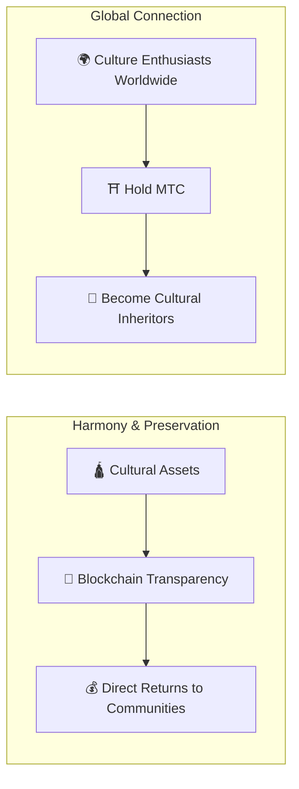

# ⛩️ Welcome to Matsuri Coin

> **Code for Harmony. Value for Peace.**
> A bridge of "Wa" in a fractured world. MTC is the compass that leads from competition to co-creation.

**Matsuri Coin (MTC)** is a decentralized utility token built on the Solana blockchain.
Designed as a **"Culture OS,"** it connects Japan's spiritual heritage — "Deep Japan" — to the global economy.

We're not building just another payment rail.
We're building a **bridge between Japan and the world** — a new co-creation framework where people who love culture join hands across borders.

---

## 🎯 Our Mission

:::info Channelling ¥10 Trillion of Market Energy into the Future of Culture
Japan's inbound tourism market is surging toward **¥10 trillion** per year.
But beneath that headline lies an **inconvenient truth.**
:::

### The Problems No One Talks About

| Problem | What's Really Happening |
| :--- | :--- |
| 💸 **Revenue Drain** | The lion's share of inbound revenue leaks overseas as commissions to foreign OTAs and intermediaries |
| 😤 **Community Burnout** | Over-tourism floods local areas with crowds, yet none of the profits flow back to the communities bearing the burden |
| 🚧 **The Experience Wall** | Package tours only scratch the surface — travellers never connect with the *real* Japan |

> **"Locals struggle, travellers see a facade, and the wealth vanishes into platform fees."**

We're using Web3 to dismantle this broken system.
Your payment reaches local communities and heritage preservation **directly** — fully transparent, zero middlemen.

---

## 🏗️ The Hybrid Model: Culture × Technology

Most crypto projects chase profit and treat culture as disposable.
MTC flips the script: we build an **"economy that protects culture"** — the hybrid structure that should have existed from day one.

| Pillar | What It Means |
| :--- | :--- |
| **🛕 Harmony & Preservation** | Tourist payments flow through blockchain rails directly to cultural preservation and artisan support. Communities (GCF) retain sovereignty over their own heritage — no extractive middlemen |
| **🌍 Global Connection** | Infrastructure that lets anyone, anywhere, support the Japanese spirit of "Wa." Holding MTC means sharing in Japan's living history — you become part of its story |

---

## 💎 Why Use MTC?

The MTC ecosystem delivers both **spiritual fulfilment** and **tangible financial upside.**

### ✨ Experience Value

| Benefit | Details |
| :--- | :--- |
| **🎌 Meaningful Experiences** | Unlock "Deep Japan" — sacred grounds closed to the public, private shrine ceremonies, invitation-only cultural events |
| **🌐 A Lifelong Bond** | Stay connected to Japan through MTC long after you fly home. A place you can always "come back to" |
| **⚖️ Fair Exchange** | Smart contracts eliminate intermediaries. Your gratitude (and money) goes straight to the people who earned it |

### 💰 Financial Upside

| Benefit | Details |
| :--- | :--- |
| **🏷️ Preferential Rates** | Pay with MTC and save **5%–10%** vs. yen pricing. E.g. ¥30,000 tour → ~¥27,000 equivalent |
| **🔑 Exclusive Access** | Ticket NFTs for invitation-only venues and limited events — MTC holders only |
| **🛡️ Currency Hedge** | Lock in experience value before your trip — no worrying about exchange-rate swings |

---

## ⚡ Why Solana?

Serving both "real tourism demand" and "high-frequency financial trading" left us with exactly **one viable blockchain.**

| Metric | Ethereum | Solana |
| :--- | :---: | :---: |
| **Transaction Fee** | ¥100s–¥1,000s | **~¥0.04** |
| **Finality** | 12 s – minutes | **0.4 seconds** |
| **Throughput** | ~15 TPS | **Thousands of TPS** |

:::tip The Temple-Offering Test
A micro-payment as small as "tossing ¥100 into an offering box" demands fees **under ¥1.** Only Solana passes that test.
:::

---

:::note Ready to Begin
MTC ends the era of tourism that merely *consumes* culture. Welcome to the journey of **co-creation** — let's build the future together.
:::

**[▶ Vision: Why Now?](/docs/vision)** ｜ **[▶ Join GCF (VIP Membership)](/docs/economy)**
