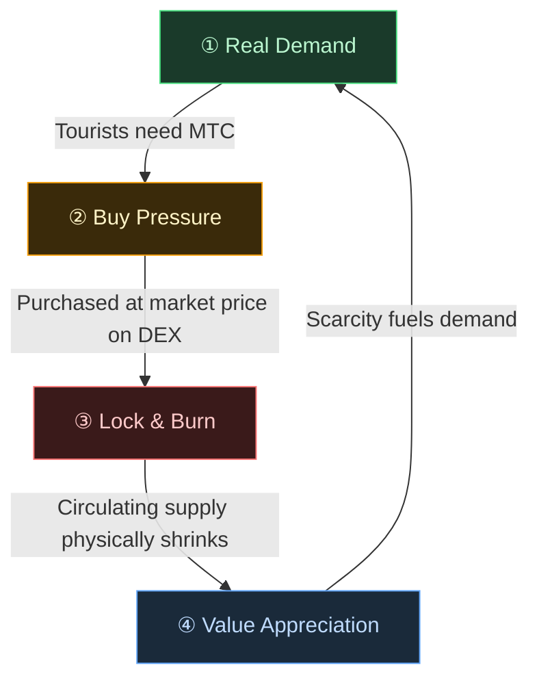
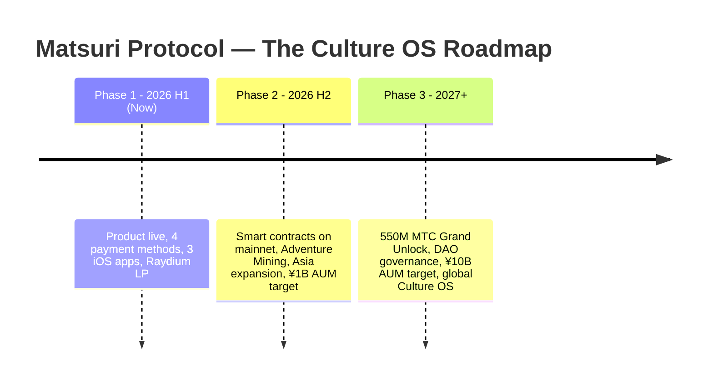

# 🎯 Vision: The "Inbound-First" Strategy

> **From subsidy-dependence to sovereignty.**
> The era of propping up rural economies with tax money is over. We channel foreign capital straight into culture.

Most regional-revitalisation projects fail — because all they do is shuffle shrinking domestic budgets around.

**Matsuri Protocol takes the exact opposite approach.**

---

## 1. Strategy: The Culture Export Machine

We redefine Japan's tourism assets — not as "consumables," but as **exportable financial instruments.**

| Problem | Reality | Impact |
| :--- | :--- | :--- |
| 💸 **Revenue Drain** | Commissions to foreign OTAs (Booking.com, Expedia, etc.) | **15 %–20 % of revenue** leaks overseas — a national-scale loss |
| 🚧 **The Invisible Wall** | Language and payment barriers | High-net-worth travellers can't access "Deep Japan" experiences |

:::tip MTC's Role
MTC is the **sole Master Key** that stops the drain and tears down the wall.
:::

---

## 2. The Economic Flywheel

The defining feature of Matsuri Protocol: **tourist enthusiasm mathematically drives MTC price appreciation.**
Not hope — **supply-and-demand mechanics.**

### Why Does MTC Go Up?

A **4-step automatic cycle** underpins the price:

```mermaid
graph TD
    A["① Real Demand"]:::step1 -->|Tourists need MTC| B["② Buy Pressure"]:::step2
    B -->|Purchased at market price on DEX| C["③ Lock & Burn"]:::step3
    C -->|Circulating supply physically shrinks| D["④ Value Appreciation"]:::step4
    D -->|Scarcity fuels demand| A

    classDef step1 fill:#1a3a2a,stroke:#4ade80,color:#bbf7d0
    classDef step2 fill:#3a2a0a,stroke:#f59e0b,color:#fef3c7
    classDef step3 fill:#3a1a1a,stroke:#f87171,color:#fecaca
    classDef step4 fill:#1a2a3a,stroke:#60a5fa,color:#bfdbfe
```

| Step | Name | Mechanism |
| :---: | :--- | :--- |
| **①** | **Real Demand** | Tourists need MTC for guide bookings and Ticket-NFT purchases |
| **②** | **Buy Pressure** | MTC is bought at market price on a DEX — consumption-driven, not speculative |
| **③** | **Lock & Burn** | A portion of MTC used in payments is instantly locked or burned by smart contracts — supply physically shrinks |
| **④** | **Value Rise** | Buy demand grows, sell supply shrinks — scarcity value appreciates mathematically |

:::info The Core Truth
**"The more tourists enjoy Japan, the more MTC holders' assets grow."**
This simple equation is the heartbeat of the project.
:::

### What Creates Downward Pressure?

Honest projects address both sides. MTC can lose value if:

| Risk | Impact | Mitigation |
| :--- | :--- | :--- |
| **Tourism decline** | Less real demand for MTC | Diversified revenue: MEV bot operates independent of tourism |
| **Sell pressure from miners** | Earned MTC dumped on market | Toku staking (lock MTC for up to 10× mining boost) incentivises holding |
| **Regulatory change** | Jurisdictional restrictions | SPL token standard, no securities classification, legal opinion planned |
| **Solana network issue** | Temporary transaction delays | Retry logic with exponential backoff; off-chain system operates independently |

> **We don't promise "number go up." We build mechanisms that create structural buy pressure and reduce sell incentives.** The rest is market dynamics.

---

## 3. The Endgame: Culture OS

Our ultimate goal isn't a payment app.
It's to **turn culture itself into an operating system.**

```mermaid
timeline
    title Matsuri Protocol — The Culture OS Roadmap
    Phase 1 - 2026 H1 (Now) : Product live, 4 payment methods, 3 iOS apps, Raydium LP
    Phase 2 - 2026 H2 : Smart contracts on mainnet, Adventure Mining, Asia expansion, ¥1B AUM target
    Phase 3 - 2027+ : 550M MTC Grand Unlock, DAO governance, ¥10B AUM target, global Culture OS
```

> We protect **culture that has endured 1,000 years** with **cutting-edge blockchain technology.**
> That is the future Matsuri Protocol is building.

  

*Matsuri Tour at Hanazono Shrine — where culture meets the world.*

---

**[▶ Next: How Do We Actually Earn? (The Economy)](/docs/economy)**
