# 🎯 Vision: The "Inbound-First" Strategy

> **From subsidy-dependence to sovereignty.**
> The era of propping up rural economies with tax money is over. We channel foreign capital straight into culture.

Most regional-revitalisation projects fail — because all they do is shuffle shrinking domestic budgets around.

**Matsuri Protocol takes the exact opposite approach.**

---

## 1. Strategy: The Culture Export Machine

We redefine Japan's tourism assets — not as "consumables," but as **exportable financial instruments.**

| Problem | Reality | Impact |
| :--- | :--- | :--- |
| 💸 **Revenue Drain** | Commissions to foreign OTAs (Booking.com, Expedia, etc.) | **15 %–20 % of revenue** leaks overseas — a national-scale loss |
| 🚧 **The Invisible Wall** | Language and payment barriers | High-net-worth travellers can't access "Deep Japan" experiences |

:::tip MTC's Role
MTC is the **sole Master Key** that stops the drain and tears down the wall.
:::

---

## 2. The Economic Flywheel

The defining feature of Matsuri Protocol: **tourist enthusiasm mathematically drives MTC price appreciation.**
Not hope — **supply-and-demand mechanics.**

### Why Does MTC Go Up?

A **4-step automatic cycle** underpins the price:

```mermaid
graph TD
    A["① Real Demand"] -->|Tourists need MTC| B["② Buy Pressure"]
    B -->|Purchased at market price on DEX| C["③ Lock & Burn"]
    C -->|Circulating supply physically shrinks| D["④ Value Appreciation"]
    D -->|Scarcity fuels demand| A

    style A fill:#e8f5e9,stroke:#2e7d32
    style B fill:#fff3e0,stroke:#ef6c00
    style C fill:#fce4ec,stroke:#c62828
    style D fill:#e3f2fd,stroke:#1565c0
```

| Step | Name | Mechanism |
| :---: | :--- | :--- |
| **①** | **Real Demand** | Tourists need MTC for guide bookings and Ticket-NFT purchases |
| **②** | **Buy Pressure** | MTC is bought at market price on a DEX — consumption-driven, not speculative |
| **③** | **Lock & Burn** | A portion of MTC used in payments is instantly locked or burned by smart contracts — supply physically shrinks |
| **④** | **Value Rise** | Buy demand grows, sell supply shrinks — scarcity value appreciates mathematically |

:::info The Core Truth
**"The more tourists enjoy Japan, the more MTC holders' assets grow."**
This simple equation is the heartbeat of the project.
:::

---

## 3. The Endgame: Culture OS

Our ultimate goal isn't a payment app.
It's to **turn culture itself into an operating system.**

```mermaid
timeline
    title Matsuri Protocol Roadmap
    Phase 1 (Now) : Dominate inbound payments
    Phase 2 : Bring real estate and traditional properties into MTC economy (Real World Assets)
    Phase 3 : Inscribe cultural trust onto the blockchain — build a permanent preservation layer
```

> We protect **culture that has endured 1,000 years** with **cutting-edge blockchain technology.**
> That is the future Matsuri Protocol is building.

---

**[▶ Next: How Do We Actually Earn? (The Economy)](/docs/economy)**
