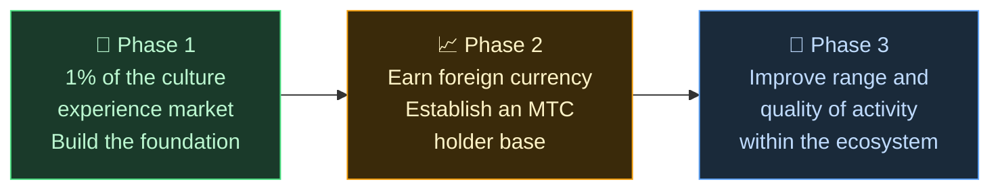

# 🌏 Challenges & Solutions — inconvenient truths, and hope

> **The mission is beautiful. Reality is standing in its way.**

---

## But there are inconvenient truths standing in the way of this mission

:::info A ¥10 trillion (~$66B) market, and the energy isn't reaching the people who carry the culture
Japan's inbound market is growing toward **¥10 trillion (~$66 billion) per year**.
Yet little of that benefit is reaching the ground.
:::

### The market MTC is aiming at

We are not trying to take all ¥10 trillion at once.

Our first target inside that market is the **culture experience, guide, and local tour segment.** We treat **1% of that segment (around ¥100 billion / ~$660M)** as our initial goal: start small, grow strong.

| Phase | Strategy | Goal |
| :--- | :--- | :--- |
| **Start small** | Focus on culture experiences and guided tours. Build track record and grow by word of mouth | Establish a revenue base |
| **Grow strong** | Bring in foreign currency (inbound revenue) and prove out the mechanism for sharing revenue with MTC holders | Build trust in the MTC economy |
| **Raise quality** | Once we reach a certain scale, stop chasing growth for its own sake; deepen experience quality, activity range, and community within the ecosystem | A sustainable cultural economy |

> **Grow through the quality of the people involved and the depth of the experience, not through volume.** That is MTC's expansion strategy.

Web2 platforms have brought the joy of travel to people all over the world, and we are genuinely grateful for what they built. But a centralized structure comes with unavoidable side effects.

Algorithms decide what gets seen. Operators are forced to compete for placement. A single review can make sales swing wildly. Commission rates change at the platform's whim — and the people on the ground live in constant fear of being picked, or disappearing.

What this structure produces is division between operators, and dread of invisible rules.
The shop next door becomes a rival; fencing off customers makes more sense than cooperating. Travelers, too, only see options flattened into "star counts" and "rankings," and truly valuable experiences get buried.

:::danger Three problems the field is living with
💸 **Revenue outflow** — most of the revenue flows out of the country as commissions to overseas OTAs and intermediaries

😤 **Local exhaustion** — only the burden of overtourism stays behind; the revenue that matters never comes back to the community

🚧 **Wall of experience** — only homogenized tours chosen by algorithms show up, and visitors never meet the "real Japan"
:::

> **Japanese people struggle, travelers never meet the real thing, and the wealth vanishes into the platforms.**

---

## So how do we change it?

Today, the technology to change this structure at its root has finally arrived.

:::tip Smart contracts — shared rules that can't be rewritten
Commission rates and conditions are carved into code. Nobody can change them on a whim. Everyone operates under the same rule, automatically.
:::

:::tip Blockchain — transparency you can actually see
Every transaction is recorded on a public ledger anyone can verify. The era of data locked inside a corporation is over.
:::

:::tip Solana — 0.4-second settlement, ~$0.0003 fees
No stacks of middlemen fees, no multi-day settlement. People connect directly with people.
:::

:::tip AI — the cost of management itself dissolves
An explosive leap in productivity is making the cost structure required to run giant platforms a thing of the past.
:::

We are no longer in an era where people need intermediaries to connect.

With this technology we free the inbound economy from monopoly and return revenue to the people on the ground in Japan and abroad.
And not only in Japan — we build **a structure to protect and connect world cultures.**

---

**[◀ Previous: Vision & Mission](/docs/vision)** | **[▶ Next: The future MTC envisions](/docs/future)**
