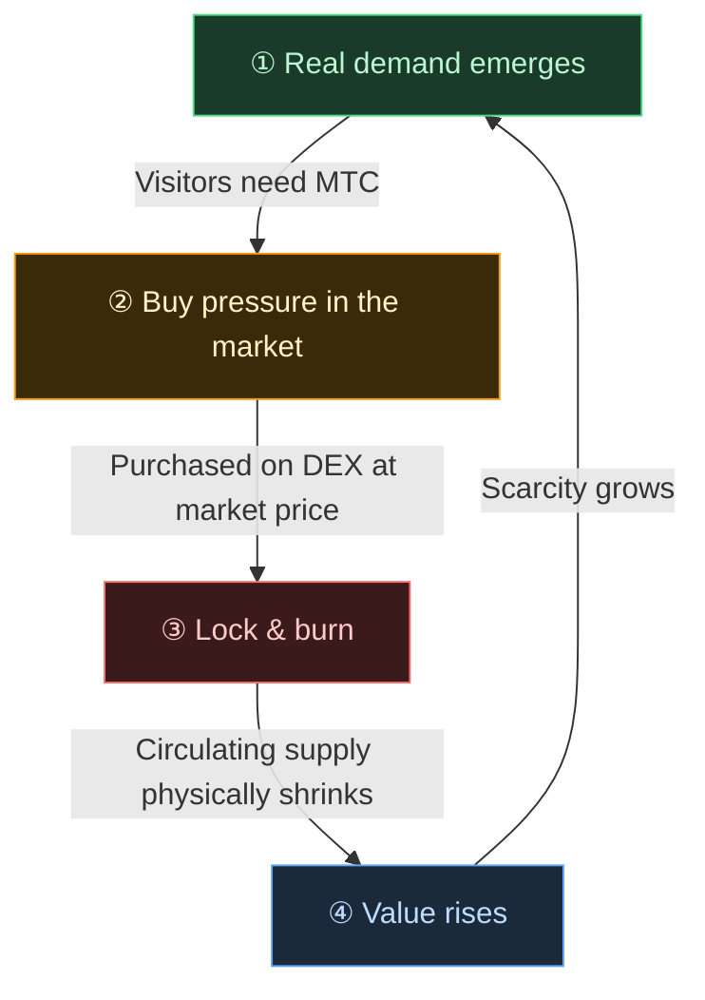

# 🔄 The economic flywheel — a growth loop and cultural OS

> **The more visitors enjoy Japan, the more demand the ecosystem generates.**
> This supply-and-demand mechanism is the project's beating heart.

---

## The supply-and-demand mechanism of MTC

By the design of Matsuri Protocol, **rising real demand creates buy pressure and, combined with a shrinking supply, sets the conditions for value to rise.**
This is not sentiment — it is a **mechanism of supply and demand.**

That mechanism runs on the **four-step loop** below.

| Step | Name | Mechanism |
| :---: | :--- | :--- |
| **①** | **Real demand emerges** | Visitors need MTC to book a guide or to purchase a ticket NFT |
| **②** | **Buy pressure in the market** | MTC is bought at market price on a DEX (decentralized exchange). Strong buy pressure based on consumption, not speculation |
| **③** | **Lock & burn** | A portion of the MTC used in settlement is instantly locked or burned by smart contract. Circulating supply physically falls |
| **④** | **Scarcity rises** | Buy demand grows, sell supply shrinks. The shift in supply-demand balance makes each token more scarce |

---

---

:::note The vision behind this equation
The bigger picture — the "cultural OS" that lies beyond the flywheel — is explored in detail on the next page, [The future MTC envisions](/docs/future).
:::

---

**[◀ Previous: Challenges & Solutions](/docs/challenges)** | **[▶ Next: The future MTC envisions](/docs/future)**
