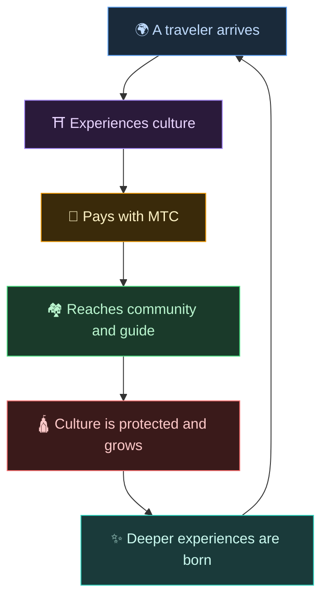
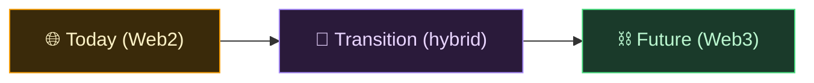
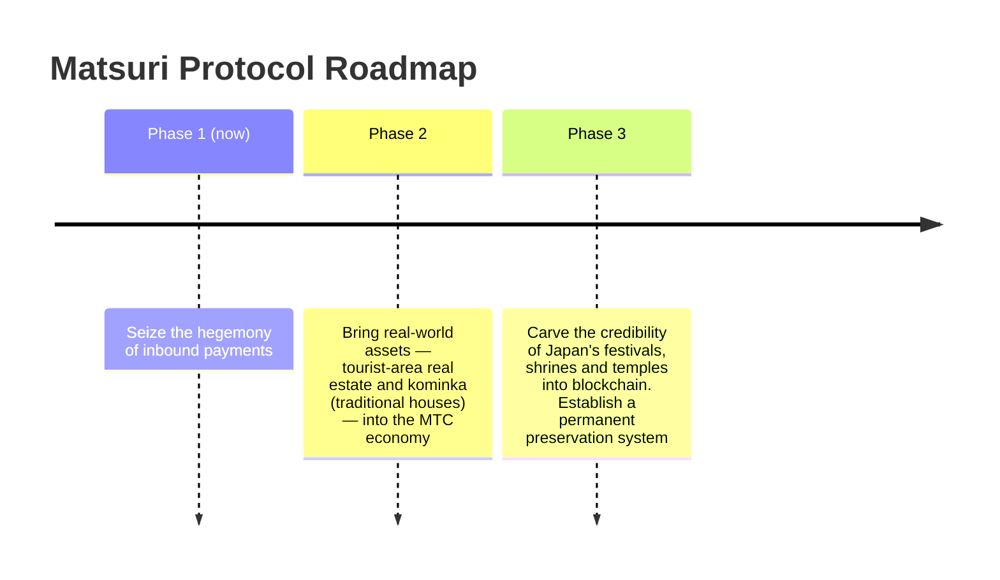

# 🌀 The future MTC envisions — an economy where every form of involvement circulates

> **The people who experience it, the people who deliver it, the people who protect it — every feeling circulates as economy and carries culture to the next generation.**

---

## The circulation we want to bring about

MTC is not a token for speculation.

Travelers encounter Japanese culture and are moved.
Guides deliver that feeling and are rewarded.
Communities thrive and keep protecting their culture.
And that culture draws in the next traveler.

This circulation is the very reason MTC exists.

---

## An economy where all three sides are rewarded

In the old model of tourism, the traveler pays, the platform takes profit, and nothing is left on the ground.
In MTC's economy, everyone involved is rewarded.

| Who is involved | What happens | How they are rewarded |
| :--- | :--- | :--- |
| **🌍 Those who experience** | Encounter Japanese culture, pay in MTC | Cheaper than yen and real access to authentic experiences. Stay connected through MTC even after returning home |
| **⛩️ Those who deliver** | Host events as guides, publish on J-Times | Direct rewards, with no middlemen skimming off the top. The more you act, the more MTC you earn |
| **🏘️ Those who protect** | As a local community, maintain and pass on culture | Revenue arrives directly. Communities thrive sustainably instead of suffering overtourism |

---

## The wider the economy, the stronger culture becomes

MTC's economy starts with booking experiences, and extends into every part of life.

- **Experience** — authentic culture experiences, shrine-visit mining
- **Clothing, food, shelter** — guesthouses, shops, cuisine, fashion
- **Co-creation projects** — crowdfunding to invest in protecting culture
- **Cross-cultural international understanding** — spaces for exchange and mutual understanding across borders

The wider the economy grows, the thicker the flow of MTC through it, and the greater its power to sustain culture.
This is not just a business model. It is a **life-support system for culture.**

---

## From Web2 to Web3 — in stages, without forcing it

We are not saying "put everything on blockchain" from day one.

Most people today are still unfamiliar with Web3. That is exactly why we have designed it to **start with shapes people already know, and let them feel the benefits of Web3 gradually.**

| Phase | User experience | What's happening underneath |
| :--- | :--- | :--- |
| **Today** | Book and pay as in any ordinary web app. Credit card is fine | Django + Stripe. No wallet required to start |
| **Transition** | Earn and use MTC inside the app. Wallet connection is one tap | Off-chain scores gradually migrate on-chain |
| **Future** | Every transaction and right is transparently recorded on-chain. Your contribution is proven forever | A fully automated, tamper-proof economy powered by smart contracts |

:::tip Web3 doesn't have to be hard
No wallet setup, no seed phrase management required at the start. As you use the app, you naturally step into Web3. **Before you know it, you are already a citizen of Web3.** That is the experience we are designing.
:::

---

## An economy that moves on empathy, not force

And this economy runs on smart contracts.
Rules cannot be rewritten unilaterally at someone's whim — **an economy in which the status quo cannot be changed by force.**

On that foundation, we learn from ancient wisdom and keep creating new value. 温故知新, and then creation.

> **A world where life can hold together around culture, even without yen or dollars.**
>
> Not outsourcing the meaning of currency to someone else, but generating and spending value through your own "involvement."
> That is the freedom MTC wants to deliver.

---

## 🏁 The final destination: "cultural OS"

Our ultimate goal is not just a payment app.
It is to turn **culture itself into an OS (foundational layer).**

> We protect ancient wisdom with the latest blockchain.
> That is the future Matsuri Protocol is drawing.

---

:::note End of the Story section
If you've read this far, you should now understand why MTC exists.
Next is **[Practice]** — let's look at what you can actually do with MTC.
:::

**[◀ Previous: Economic flywheel](/docs/flywheel)** | **[▶ Next: Ecosystem](/docs/ecosystem)**
