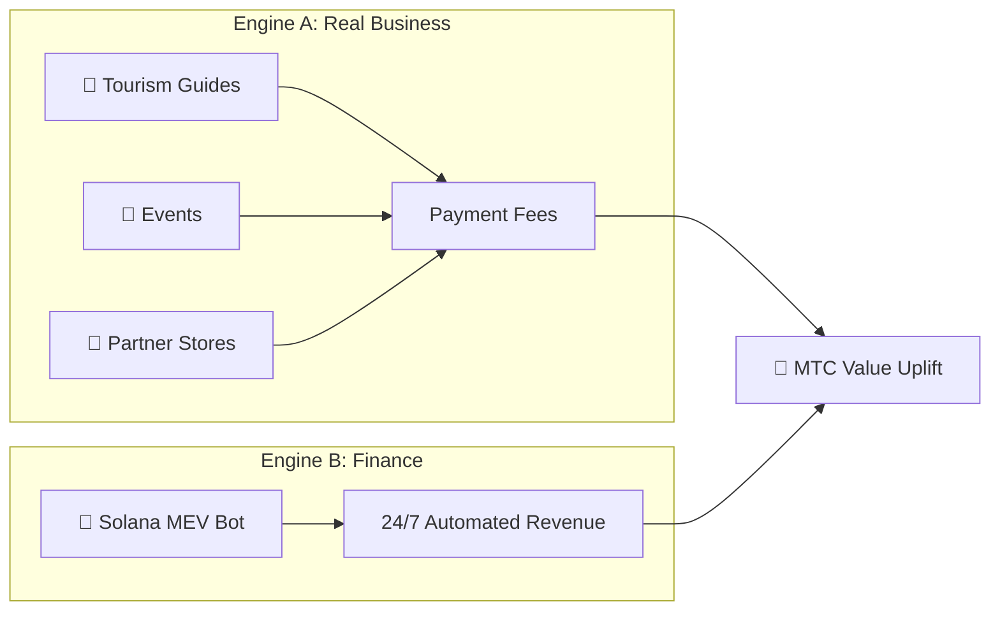

# 💰 The Economy

> The Matsuri Coin (MTC) economy is simple yet battle-tested.
> **Two revenue engines — real business and financial algorithms — generate profit and programmatically redistribute it to holders.**


---

## 1. Dual Revenue Engines



| Engine | Revenue Source | How It Works |
| :--- | :--- | :--- |
| **🏯 Engine A (Real Business)** | Payment fees from tourism guides, events and partner stores | More inbound tourists → more foreign capital flows in → ecosystem expands |
| **🤖 Engine B (Finance)** | Solana MEV Bot automated trading | CEO-led high-frequency program extracts profit from on-chain inefficiencies 24/7/365 |

---

## 2. Buyback Protocol (Value Uplift Mechanism)

We don't pocket the profits.
Smart-contract rules channel revenue directly into **MTC value uplift.**

| Revenue Source | Allocation | Action |
| :--- | :---: | :--- |
| **Matsuri HQ Sales** (Guides & Events) | **20 %** | Market **buyback** + liquidity-pool injection |
| **GCF Membership** (Membership fees) | **25 %** | Market **buyback** |

:::info Core Logic
**"Business growth = MTC is constantly being bought on the open market."**
That equation underpins your asset value.
:::

---

## 3. Price-Determination Logic

Our price mechanism runs on the **AMM (Automated Market Maker) formula** — not hopium.

```
Price = Liquidity (SOL) ÷ Supply (MTC)
```

| Step | What Happens | Result |
| :---: | :--- | :--- |
| **①** | Business revenue (SOL) is injected into the pool | **Numerator ↑** |
| **②** | MTC is bought back from the market and burned | **Denominator ↓** |
| **③** | Numerator ↑ × Denominator ↓ | **Price mathematically trends up** |

---

## 4. GCF (Global Community Friends)

GCF is the **invitation-only** partner organisation (DAO) that scales the Matsuri ecosystem.
Not a membership club — a **business collective** that shares in the upside.


### Membership Tiers

| Tier | Role | Privileges |
| :---: | :--- | :--- |
| **👑 Platinum** | Owner / VIP | Top-tier entitlements. First **50 seats** only. Decision-making power + substantial dividend income |
| **🥇 Gold** | Ambassador | The operators. The right to earn **without a ceiling** through activity. Maximised mining and referral rates |

### Perk ①: Real-Work Mining (Mining Rights)

The **550 million MTC (~61 % of total supply)** unlocking on 1 June 2027 is reserved as a **Contributor Reward Pool** — not dumped on the market.

:::tip Fully Performance-Based
MTC is automatically distributed from the pool based on your output (sales, visitor count, guide sessions).
:::

**Halving Schedule (2-Year Cycle):**

| Period | Release | Volume |
| :--- | :---: | :--- |
| **Epoch 1** 2027 – 2029 | **50 %** | ~275 M tokens |
| **Epoch 2** 2029 – 2031 | **25 %** | ~137 M tokens |
| **Epoch 3** 2031 – 2033 | **12.5 %** | ~68 M tokens |

:::caution First-Mover Window
Faster than Bitcoin's 4-year halving — we use a **2-year cycle.**
Those who go all-in during the **first two years from 2027** lock in an overwhelming first-mover advantage.
:::

### Perk ②: Premium Referral Commissions

Refer high-ticket products (memberships, VIP tours, partner real estate) to earn **premium commissions (USDC + MTC)** — orders of magnitude above standard affiliate payouts. Paid **instantly** via smart contract.

---

## 5. Token Specifications

We have permanently **REVOKED** Mint and Freeze authorities on Solana.
No additional issuance — ever. No fund freezing — ever. **Fully trustless by design.**

| Item | Details |
| :--- | :--- |
| **Token Name** | Matsuri Coin |
| **Ticker** | MTC |
| **Chain** | Solana |
| **Total Supply** | **900,000,000 MTC** (Fixed) |
| **Mint Authority** | 🚫 Revoked |
| **Freeze Authority** | 🚫 Revoked |
| **Lock Contract** | Streamflow Finance (Verified) |

:::warning Invitation Only — Seats Are Limited
GCF closes recruitment the moment limited slots fill up (Platinum: 50 / Gold: adjusting).
Holding this right means entering the **inner circle** of the Matsuri economy.
:::

---

**[▶ Next: Ecosystem & Mining](/docs/ecosystem)** ｜ **[Join Discord](#)**
