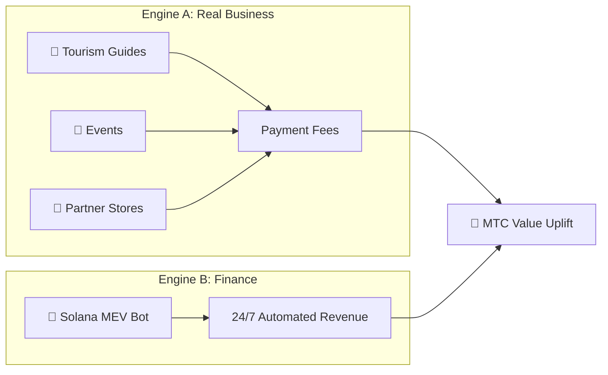
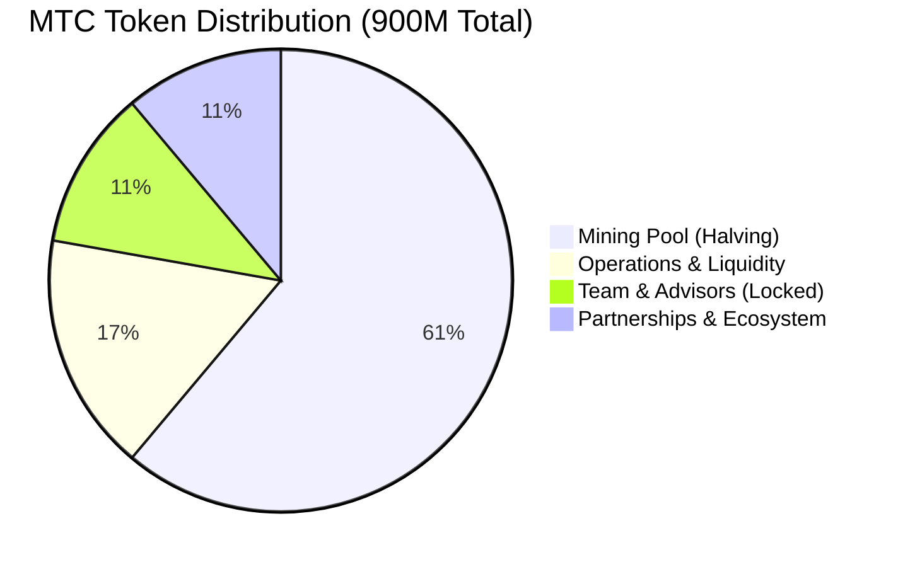

# 💰 The Economy

> The Matsuri Coin (MTC) economy is simple yet battle-tested.
> **Two revenue engines — real business and financial algorithms — generate profit and programmatically redistribute it to holders.**


---

## 1. Dual Revenue Engines


```mermaid
graph LR
    subgraph "Engine A: Real Business"
    A1["🏯 Tourism Guides"] --> R1["Payment Fees"]
    A2["🎪 Events"] --> R1
    A3["🏪 Partner Stores"] --> R1
    end

    subgraph "Engine B: Finance"
    B1["🤖 Solana MEV Bot"] --> R2["24/7 Automated Revenue"]
    end

    R1 --> V["💎 MTC Value Uplift"]
    R2 --> V
```

| Engine | Revenue Source | How It Works |
| :--- | :--- | :--- |
| **🏯 Engine A (Real Business)** | Payment fees from tourism guides, events and partner stores | More inbound tourists → more foreign capital flows in → ecosystem expands |
| **🤖 Engine B (Finance)** | Solana MEV Bot automated trading | CEO-designed algorithm captures on-chain arbitrage and liquidation opportunities 24/7/365. Revenue is independent of tourism seasonality — it runs regardless of market conditions |

### Revenue Streams (Live & Tracked)

The platform tracks **6 distinct revenue categories** — all with production payment infrastructure:

| # | Revenue Stream | Payment Method | Status |
| :---: | :--- | :--- | :---: |
| 1 | **Event Ticket Sales** | Stripe / PayPal / Solana Pay / MTC | ✅ Live |
| 2 | **GCF Membership Subscriptions** | Stripe Recurring Billing | ✅ Live |
| 3 | **Referral Commissions** | Auto-calculated, bank / crypto payout | ✅ Live |
| 4 | **Guide Tips** | Stripe (Uber-style post-event tipping) | ✅ Live |
| 5 | **Course Enrollment Fees** | Stripe | ✅ Live |
| 6 | **Crowdfunding Campaigns** | Solana on-chain | ✅ Live |

---

## 2. Buyback Protocol (Value Uplift Mechanism)

We don't pocket the profits.
Smart-contract rules channel revenue directly into **MTC value uplift.**

| Revenue Source | Allocation | Action |
| :--- | :---: | :--- |
| **Matsuri HQ Sales** (Guides & Events) | **20 %** | Market **buyback** + liquidity-pool injection |
| **GCF Membership** (Membership fees) | **25 %** | Market **buyback** |

:::info Core Logic
**"Business growth = MTC is constantly being bought on the open market."**
That equation underpins your asset value.
:::

---

## 3. Price-Determination Logic

Our price mechanism runs on the **AMM (Automated Market Maker) formula** — not hopium.

```
Price = Liquidity (SOL) ÷ Supply (MTC)
```

| Step | What Happens | Result |
| :---: | :--- | :--- |
| **①** | Business revenue (SOL) is injected into the pool | **Numerator ↑** |
| **②** | MTC is bought back from the market and burned | **Denominator ↓** |
| **③** | Numerator ↑ × Denominator ↓ | **Price mathematically trends up** |

> **Example:** If the Raydium pool holds 1,000 SOL and 10,000,000 MTC, the price is 0.0001 SOL/MTC. A ¥300,000 tour generates a ¥60,000 buyback (20%), which adds ~0.4 SOL to the pool and removes MTC from circulation. Multiply this across hundreds of monthly transactions.

---

## 4. GCF (Global Community Friends)

GCF is the **invitation-only** partner organisation (DAO) that scales the Matsuri ecosystem.
Not a membership club — a **business collective** that shares in the upside.


<div style={{display: 'flex', gap: '2rem', justifyContent: 'center', alignItems: 'center', flexWrap: 'wrap', margin: '2rem 0'}}>
  
  
</div>

### Membership Tiers

| Tier | Role | Privileges |
| :---: | :--- | :--- |
| **👑 Platinum** | Owner / VIP | Top-tier entitlements. First **50 seats** only. Decision-making power + substantial dividend income |
| **🥇 Gold** | Ambassador | The operators. The right to earn **without a ceiling** through activity. Maximised mining and referral rates |

### Perk ①: Real-Work Mining (Mining Rights)

The **550 million MTC (~61 % of total supply)** unlocking on 1 June 2027 is reserved as a **Contributor Reward Pool** — not dumped on the market.

:::tip Fully Performance-Based
MTC is automatically distributed from the pool based on your output (sales, visitor count, guide sessions).
:::

**Halving Schedule (2-Year Cycle):**

| Period | Release | Volume |
| :--- | :---: | :--- |
| **Epoch 1** 2027 – 2029 | **50 %** | ~275 M tokens |
| **Epoch 2** 2029 – 2031 | **25 %** | ~137 M tokens |
| **Epoch 3** 2031 – 2033 | **12.5 %** | ~68 M tokens |

:::caution First-Mover Window
Faster than Bitcoin's 4-year halving — we use a **2-year cycle.**
Those who go all-in during the **first two years from 2027** lock in an overwhelming first-mover advantage.
:::

### Perk ②: Premium Referral Commissions

Refer high-ticket products (memberships, VIP tours, partner real estate) to earn **premium commissions (USDC + MTC)** — orders of magnitude above standard affiliate payouts. Paid **instantly** via smart contract.

#### Implemented Commission Structure (On-Chain Ready)

The referral engine supports up to **4-layer deep commissions** — all auto-calculated on every purchase:

| Layer | Relationship | Commission Rate |
| :---: | :--- | :---: |
| **L1** | Direct referral | **20%** |
| **L2** | Referral's referral | **5%** |
| **L3** | 3rd degree | **5%** |
| **L4** | 4th degree | **5%** |

> Every `EventPurchase` triggers automatic `GCFReferralCommission` records for all eligible upstream referrers. Commissions are tracked with status flow: `pending → approved → paid`.

#### Payout Options

| Method | Details |
| :--- | :--- |
| **🏦 Bank Transfer** | Japanese bank accounts (encrypted with Fernet cipher) |
| **⚡ Solana** | Direct wallet transfer with on-chain TX hash proof |
| **💳 Revolut** | International payout support |

---

## 5. Payment Infrastructure

Four payment methods are **deployed and processing transactions** — designed to serve both traditional customers and Web3-native users.

| Method | Provider | Fee | Use Case |
| :--- | :--- | :---: | :--- |
| **💳 Credit Card** | Stripe | 3.6% | Standard purchases, subscriptions |
| **🅿️ PayPal** | PayPal | 3.9% + ¥40 | International guests |
| **⚡ Solana Pay** | Phantom Wallet | ~¥0.04 | Crypto-native users, MTC purchases |
| **🪙 MTC Balance** | Internal (CoinService) | 0% | Earned MTC spent on experiences |

:::info Smart Routing
The system automatically recommends the optimal payment method based on amount, user location, and past behaviour — transparent to the user.
:::

### Automated Business Operations

The platform runs **15+ automated background tasks** via Celery workers:

| Task | Frequency | Business Impact |
| :--- | :--- | :--- |
| **Cart Recovery** | Hourly | A/B tested emails recover abandoned purchases |
| **Pre-Event Reminders** | Daily 9am JST | 7-day and 24-hour reminder emails |
| **Post-Event Surveys** | After event | Feedback collection for ratings |
| **Magic Moment Offers** | Hourly | Post-event engagement with personalised offers |
| **MTC Balance Sync** | Every 5 min | Sync on-chain token balances |
| **Campaign Deadlines** | Every 30 min | Crowdfunding deadline enforcement |
| **Translation Batch** | On demand | GPT-4 Turbo auto-translates events to 5 languages |

---

## 6. Token Specifications

We have permanently **REVOKED** Mint and Freeze authorities on Solana.
No additional issuance — ever. No fund freezing — ever. **Fully trustless by design.**

| Item | Details |
| :--- | :--- |
| **Token Name** | Matsuri Coin |
| **Ticker** | MTC |
| **Chain** | Solana |
| **Total Supply** | **900,000,000 MTC** (Fixed) |
| **Mint Authority** | 🚫 Revoked |
| **Freeze Authority** | 🚫 Revoked |
| **Lock Contract** | Streamflow Finance (Verified) |

:::warning Invitation Only — Seats Are Limited
GCF Platinum is capped at **50 seats worldwide** — once filled, no new Platinum members. Gold membership adjusts based on ecosystem capacity. This scarcity is by design: fewer partners means higher per-member value.
:::

### Token Distribution Overview


```mermaid
pie title MTC Token Distribution (900M Total)
    "Mining Pool (Halving)" : 550
    "Operations & Liquidity" : 150
    "Team & Advisors (Locked)" : 100
    "Partnerships & Ecosystem" : 100
```

| Allocation | Amount | Lock Status |
| :--- | :--- | :--- |
| **Mining Pool** | 550M MTC (61.1%) | Locked until June 2027, distributed via 2-year halving |
| **Operations & Liquidity** | 150M MTC (16.7%) | Used for Raydium LP, market making, operational costs |
| **Team & Advisors** | 100M MTC (11.1%) | Locked via Streamflow Finance with vesting schedule |
| **Partnerships & Ecosystem** | 100M MTC (11.1%) | Reserved for strategic partners, exchange listings, grants |

---

## 7. Analytics & Business Intelligence

The platform tracks **every user interaction** with a production-grade analytics system — enabling data-driven decisions, not guesswork.

| Metric | How It's Tracked |
| :--- | :--- |
| **Session Analytics** | Device, browser, geo, UTM source, scroll depth, time on page |
| **Conversion Funnels** | Step-by-step tracking: view → click → cart → purchase |
| **A/B Testing** | Experiment groups assigned per session with variant tracking |
| **Revenue per Source** | Total spent per session, attributed to campaign source |
| **Cohort Analysis** | Retention by signup date, membership tier, referral source |
| **Guide Performance** | Earnings, tips, leaderboard rankings |

> This infrastructure enables calculation of **ARPU, LTV, CAC, churn rate, and conversion rates** — the metrics investors need to evaluate unit economics.

---

**[▶ Next: Ecosystem & Mining](/docs/ecosystem)** ｜ **[Follow on X](https://x.com/matsuri_dao_jp)**
