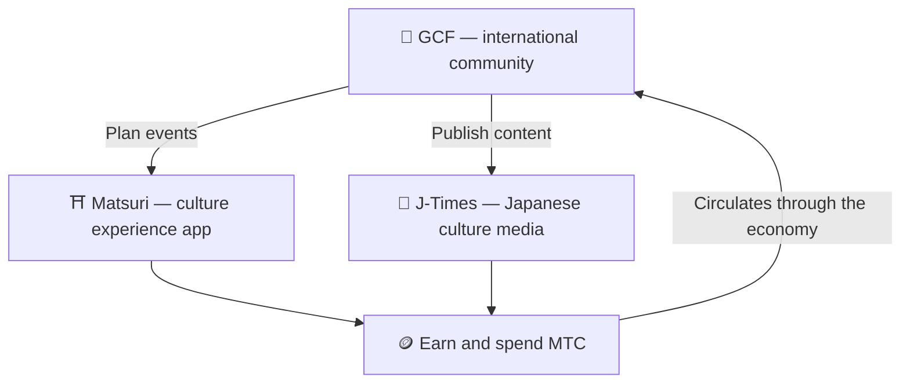

# 🏗️ The MTC ecosystem — an economy where experience, media, and community circulate

> **Three "places" for making the mission real.**
> A place to experience, a place to learn, a place to connect — each stands on its own, and MTC links them into a single circulating economy.

MTC is not just a token. Three products and an international community work together to build an economy that protects culture.

:::tip 🤝 GCF — the international community that drives the ecosystem
A gathering place for people who love Japanese culture, across borders. GCF recruits guides, and those GCF guides run experiences on Matsuri. They also publish compelling content on J-Times — the community's activity is the engine that moves the whole ecosystem.
:::

:::tip ⛩️ Matsuri — culture experience app
Starts with culture-experience bookings and expands in stages into **guesthouses**, **shops**, and **crowdfunding**. The economy grows from experiences into clothing, food, shelter, and co-creation investment.

**Shrine-visit mining (seichi junrei — sacred pilgrimage)** — earn MTC by physically visiting shrines, temples, and cultural landmarks. Travelers flow naturally from famous hotspots to hidden local gems, solving overtourism and revitalizing regional areas at the same time.
:::

:::tip 📰 J-Times — Japanese culture media
A media platform that delivers the charm of Japanese culture to the world. You earn MTC through engagement like reading and sharing articles.
:::

---

## 🤝 Social mining (connect and earn)

**Tied to the GCF admin dashboard — web version live (iOS app scheduled for April 2026).**

GCF members receive access to a dedicated **GCF admin web** interface.

| Feature | What you can do |
| :--- | :--- |
| **🎪 Create events** | Plan and list your own events and tours |
| **📢 Distribute content** | Publish and spread J-Times articles and content |
| **📊 Referral tracking** | Track the activity and revenue of referred users in real time |

:::info Automatic rewards
Every time a friend you referred makes a payment, the system **automatically** deposits a reward (revenue share) to your wallet.
:::

---

## 🎓 Creator economy (create and earn)

You don't just consume content — on Matsuri, **anyone** can create and monetize it.

| Platform | What creators can do | Revenue model |
| :--- | :--- | :--- |
| **📚 Course marketplace** | Publish video / text courses on Japanese culture, language, or crafts | Per-enrollment fee (creator revenue share) |
| **🎙️ Podcast studio** | Produce audio series distributed via Spotify, Apple Podcasts, and RSS | Subscription-only episodes |
| **🤝 Crowdfunding** | Launch Solana-based fundraising campaigns for cultural projects | On-chain contribution tracking |
| **🛍️ User shops** | Open a personal shop inside the platform (crafts, goods) | Direct sales with a product / review system |

:::tip AI-powered production assistance
Event hosts can use the **built-in AI assistant (GPT-4 Turbo)** inside the admin dashboard to write event descriptions, auto-translate into 5 languages, and generate SEO-optimized metadata.
:::

---

  

*Community meetup in Golden Gai — connection becomes mining power.*

---

:::note Next page
To see how mining actually works and how to earn, head to **[Mining & earning →](/docs/mining)**.
:::
