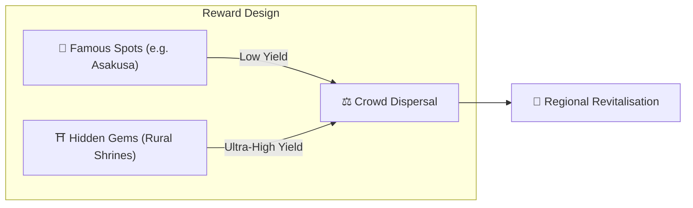

# ⛏️ The Five Pillars of Mining

> **Proof of Action (PoA)**
> Matsuri Coin is mined not by GPUs, but by **human action.**

The web app and admin dashboard are **already live** — start earning **right now** through the activities below.

---

## 1. 📖 Media Mining (Read, Listen & Quiz to Earn)

**Powered by "J-Times" Official Media**

Knowledge transforms the quality of travel.
We reward learning — reading, listening, **and** proving comprehension through quizzes.

| Action | What You Do | Reward |
| :--- | :--- | :--- |
| **📰 Read to Earn** | Read J-Times articles on history, Shinto, Zen | MTC granted |
| **🎧 Listen to Earn** | Stream exclusive podcasts on deep Japanese culture | MTC granted |
| **✅ Quiz to Earn** | Ace quizzes to prove knowledge retention | MTC granted (instant) |

:::tip Dead Time → Mining Time
Your commute, your lunch break, your flight — every spare moment becomes a reward-generating opportunity.
:::

---

## 2. 🤝 Social Mining (Connect to Earn)

**Powered by GCF Admin Dashboard — Already Live**

GCF members get access to the dedicated **"GCF Admin Web."**

| Feature | What You Can Do |
| :--- | :--- |
| **🎪 Event Creation** | Plan and publish your own events and tours |
| **📢 Content Distribution** | Amplify J-Times articles and content across your network |
| **📊 Referral Tracking** | Track referred users' activity and revenue in real time |

:::info Automatic Payouts
Every time a referred friend transacts, the system **automatically** deposits your revenue share straight into your wallet.
:::

  

*Community Meetup at Golden Gai, Shinjuku — where connections become mining power.*

---

## 3. 🗺️ Adventure Mining (Move to Earn)

**Project "PILGRIMAGE" — Smart contracts complete, mainnet deploy August 2026**

A next-gen feature using GPS and token incentives to redirect the physical flow of tourists. The Sacred Site Map is **already live** in the Matsuri app — on-chain reward distribution launches with the smart contract deployment.

```mermaid
graph LR
    subgraph "Reward Design"
    A["🏯 Famous Spots (e.g. Asakusa)"] -->|Low Yield| C["⚖️ Crowd Dispersal"]
    B["⛩️ Hidden Gems (Rural Shrines)"] -->|Ultra-High Yield| C
    end
    C --> D["🌱 Regional Revitalisation"]
```

> **"People go rural because it's more profitable."**
> That economic logic solves over-tourism and accelerates regional revival.

### 🎲 The "Omikuji" Protocol

A fortune-slip-style smart contract triggered **for free (gas only)** upon check-in.

| Result | What You Get |
| :--- | :--- |
| **🎊 Grand Fortune** | Bonus MTC airdrop |
| **📜 NFT Drop** | Location-exclusive **"Goshuin NFT"** |
| **🏆 Collection Complete** | Completing a set unlocks special event access |

:::note Not Gambling
Zero monetary stake required. Just a random bonus for **showing up.**
:::

  

*Zen Mindfulness at Shinjuku Gyoen — "Deep Japan" experiences that generate mining rewards.*

---

## 4. 🎓 Creator Economy (Create to Earn)

Beyond consuming content, the Matsuri platform enables **anyone** to create and monetise.

| Platform | What Creators Do | Revenue Model |
| :--- | :--- | :--- |
| **📚 Course Marketplace** | Publish video/text courses on Japanese culture, language, crafts | Per-enrollment fee (creator revenue share) |
| **🎙️ Podcast Studio** | Host audio series distributed to Spotify, Apple Podcasts, RSS | Subscription-gated episodes |
| **🤝 Crowdfunding** | Launch Solana-based fundraising campaigns for cultural projects | Contribution tracking on-chain |
| **🛍️ User Shops** | Open a personal shop within the platform (crafts, merchandise) | Direct sales with product/review system |

:::tip AI-Powered Creation
Event hosts can use the **built-in AI assistant (GPT-4 Turbo)** to draft event descriptions, auto-translate to 5 languages, and generate SEO-optimised metadata — all within the admin dashboard.
:::

---

## 5. 🏦 Liquidity Mining (Provide to Earn)

> **Be the Bank.**

We run a special reward programme for users who provide MTC/SOL liquidity on Raydium.

| Item | Details |
| :--- | :--- |
| **Who** | Early liquidity providers ("founding partners") |
| **Target APY** | **50 %** (set as a risk premium) |
| **Why** | Bootstrap initial liquidity for a stable trading environment |

---

**[▶ Next: How to Earn & Use MTC](/docs/how-to-earn)** ｜ **[◀ Prev: The Economy](/docs/economy)**
