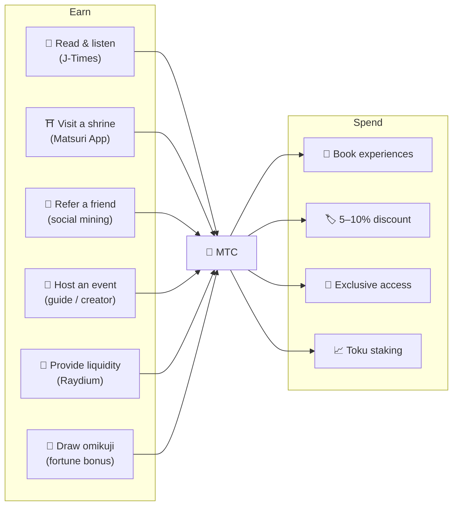
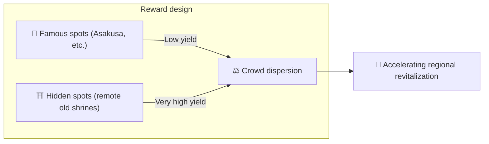
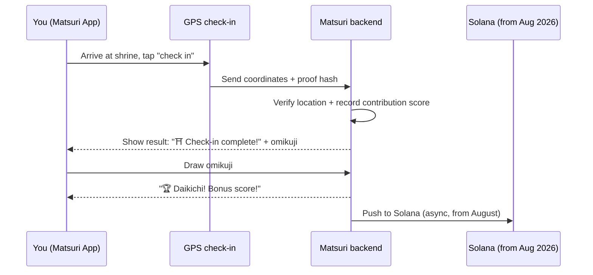
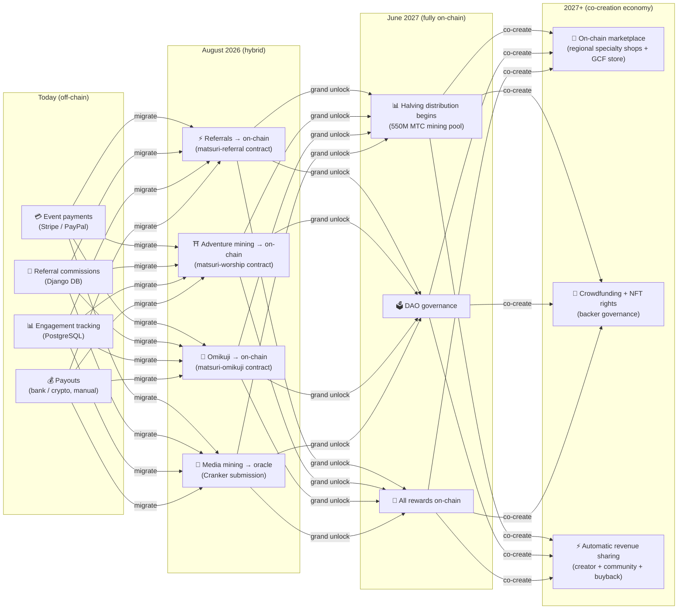

import useBaseUrl from '@docusaurus/useBaseUrl';

# ⛏️ The five pillars of mining and how to earn

> **Every form of "involvement" in culture becomes value.**
> Reading, walking, connecting, creating, supporting — each of your actions produces MTC.

<small>*What is "mining"? — In Bitcoin and similar networks, computers do massive calculations and receive new coins as a reward; this is called "mining." With MTC, what does the mining isn't computing power, but **your own actions** — reading an article, visiting a shrine, hosting an event. Instead of digging for gold, involvement with culture produces MTC. That is what "mining" means here.*</small>

> Earn through action. Spend it on experience. Hold it and watch it grow.

MTC is not a speculative token. It circulates through a real economy where every action produces value and captures it. The web application and admin dashboard are **already live**. Contribution scores are currently recorded off-chain (in Django) and will migrate on-chain in stages starting August 2026.

:::tip The big picture
MTC has a **fully closed-loop economy**: you earn through real activity, you spend on real experiences, and value grows as the ecosystem grows. This page explains the mechanics in detail.
:::

---

## The MTC lifecycle

---

## The five mining pillars

### 1. 📖 Media mining (read, listen, answer — and earn)

**Tied to the official "J-Times" media platform**

Knowledge dramatically raises the quality of a trip. Open the **J-Times app** and enjoy content about Japanese culture. On top of text and audio, we reward **comprehension checks (quizzes)**. Each completed action automatically credits MTC to you.

| Action | Completion condition | Typical reward |
| :--- | :--- | :---: |
| **📰 Read an article** | Scroll to 75% | 2–30 MTC |
| **🎧 Listen to a podcast** | Play to the end | 2–30 MTC |
| **🎬 Watch a video** | Close the detail screen after viewing | 2–30 MTC |
| **📤 Share content** | Open the share sheet | 2–30 MTC |
| **✅ Answer a quiz** | Pass the comprehension test | 2–30 MTC |

<small>*The reward amount varies with content type, length, and the overall supply balance of the ecosystem.*</small>

:::tip Spare moments become mining
Commuting and breaks turn into time that generates rewards.
:::

:::info Offline support
No internet at a remote shrine? No problem. J-Times logs activity locally and **auto-syncs once you're online again** (7-day offline queue retention). You will not lose MTC you've earned.
:::

**What happens under the hood:**
1. J-Times app detects your action (read, watch complete, share, etc.)
2. Records it locally even offline (retained for 7 days)
3. Sends it to the server for verification when the network returns
4. Reflects it in your balance as contribution score
5. From August 2026: verified scores are recorded on-chain via an oracle and become verifiable on the blockchain

---

### 2. ⛩️ Adventure mining (walk and earn)

**Project "Junrei" — smart contract complete, mainnet deployment August 2026**

A next-generation feature that uses GPS and token incentives to shape the physical "flow of people." The sacred-site map is **already live** in the Matsuri web app. Contribution scores are currently recorded off-chain; on-chain reward distribution begins after the August 2026 smart-contract deployment.

>**Because you earn more, you go rural.**
> This simple economic logic dissolves overtourism and accelerates regional revitalization.

**How check-in works:**

  
  

    
<strong>Worship Mining</strong> — check in near a shrine, detect energy with the AR camera, draw an omikuji for bonus MTC. Tier multipliers range from 1.0× (Major) to 10.0× (Hidden Gem).

  

**Core principle — the fewer the visitors, the more you earn:**

| Site type | Examples | Typical reward (per check-in) |
| :--- | :--- | :---: |
| 🏙️ **Major** | Sensōji, Kiyomizudera, Fushimi Inari | 30–50 MTC |
| 🌆 **Regional hub** | Each prefecture's Ichinomiya, regional grand shrines | 50–100 MTC |
| 🏞️ **Regional** | Historic regional shrines | 100–150 MTC |
| ⛰️ **Frontier** | Mountain temples, island sacred sites | 150–200 MTC |

<small>*The values above are base reward estimates. Omikuji multipliers can increase them several-fold.*</small>

**Additional scoring factors:**
- **Omikuji multiplier** — a random bonus on every check-in. Daikichi multiplies the reward several times
- **Visit frequency** — regular visitors accumulate more over time
- **Sponsored sites** — municipalities can boost specific sites

:::info Contribution score → MTC
Your activity accumulates as a **contribution score**. At each halving epoch (starting June 2027), scores are converted into MTC from the 550M mining pool. The greater your contribution to the community, the more MTC you receive. Exact boost coefficients are finalized in stages and implemented in smart contracts — this guarantees fair distribution aligned with the real pool size.
:::

---

### 3. 🤝 Social mining (connect and earn)

You earn MTC just by introducing friends.

#### Referral rewards for regular users

It's simple. When a friend signs up via your referral link, you receive **300 MTC per direct referral.**

| Condition | Reward |
| :--- | :--- |
| A friend you referred signs up | **300 MTC** |

That's it. There is no multi-tier reward.

#### GCF agent referral rewards

[GCF members](/docs/gcf) are **official agents** responsible for ecosystem expansion and have a deeper reward structure.

| Layer | Relationship | Commission |
| :---: | :--- | :---: |
| **L1** | Direct referral | **20%** |
| **L2** | Their referrals | **5%** |
| **L3** | Third tier | **5%** |
| **L4** | Fourth tier | **5%** |

:::note About the GCF agent program
This multi-tier reward applies only to official agents holding GCF membership (invitation only). Regular users receive only the direct referral (300 MTC).
GCF agent commissions are calculated based on the **actual economic activity** (experience purchases, event participation, etc.) of their referrals. Simply gathering people does not generate rewards.
:::

**How the En-Mining score works (for GCF agents):**

The contribution score is calculated from two components:
- **Network breadth** (30%) — how many people you brought in
- **Economic activity** (70%) — real purchases from your referral network

Scores accumulate over time and are converted to MTC at each halving epoch.

#### GCF admin dashboard — web version live

GCF members receive access to the dedicated admin dashboard.

| Feature | What you can do |
| :--- | :--- |
| **🎪 Create events** | Plan and list your own events and tours |
| **📢 Distribute content** | Publish and spread J-Times articles and content |
| **📊 Referral tracking** | Track the activity and revenue of referred users in real time |

:::warning Currently off-chain → migrating on-chain in August 2026
Referral commissions are currently tracked in Django (PostgreSQL) and paid out by bank transfer or crypto. From **August 2026**, they move to the **Matsuri Referral smart contract** on Solana, bringing on-chain, auditable payouts.
:::

  

*Community meetup in Golden Gai — connection becomes mining power.*

---

### 4. 🎓 Creator & guide mining (create and earn)

You don't just consume content — on Matsuri, **anyone** can create and monetize it. If you are a GCF member, a guide, or a content creator, here is how you earn.

| Activity | How you earn |
| :--- | :--- |
| **🗺️ Host a tour** | Guide commission (set per event) + tips |
| **🎫 Sell event tickets** | Revenue share via EventPurchase |
| **📚 Publish a course** | Per-enrollment fee (creator revenue share) |
| **🎙️ Produce podcast episodes** | Subscription revenue |
| **🤝 Launch a crowdfunding campaign** | Solana-based on-chain contribution tracking |
| **🛍️ Open a user shop** | Direct sales of crafts and goods |

**Tipping system:** after an event, guests can tip the guide (Uber-style). Tips are processed via Stripe and tracked on a public leaderboard.

:::tip AI-powered production assistance
Event hosts can use the **built-in AI assistant (GPT-4 Turbo)** inside the admin dashboard to write event descriptions, auto-translate into 5 languages, and generate SEO-optimized metadata.
:::

---

### 5. 🏦 Liquidity mining (deposit and earn)

>**Become the bank.**

Provide MTC/SOL liquidity on Raydium DEX and support the ecosystem's early trading infrastructure. Early liquidity providers are treated as "founding partners" in a special reward program.

| Item | Detail |
| :--- | :--- |
| **Eligible** | Anyone holding MTC and SOL |
| **Target APY** | **20%** (initial liquidity incentive, set as a risk premium) |
| **DEX** | Raydium (Solana) |
| **Purpose** | Secure early-stage liquidity and build a stable trading environment |

---

## 🎲 Omikuji bonus

Every adventure-mining check-in comes with a free Omikuji (fortune slip) draw. It's an omikuji-style smart contract run **for free (gas only)** at check-in completion.

| Fortune | Reward multiplier | Extra bonus |
| :--- | :---: | :--- |
| 🏆 **Daikichi (great blessing)** | Base × top multiplier | Goshuin NFT |
| ✨ **Kichi (blessing)** | Base × high multiplier | — |
| 🌸 **Shōkichi (small blessing)** | Base × small multiplier | — |
| 🍃 **Suekichi (future blessing)** | Base × 1.0 | — |
| 💀 **Kyō (curse)** | Base × 1.0 | — |

Probabilities and multipliers can be adjusted from the GCF admin dashboard and are managed by the operator according to ecosystem-wide MTC supply balance. Results are determined by a **tamper-proof commit-reveal protocol** on Solana — no one can change the outcome after the commit phase.

<small>*Even on a kyō result you still receive the base reward. The design rewards the act of checking in itself.*</small>

:::note It's not gambling
No money is wagered. It is simply a random bonus on top of **the action of "having visited."** Collecting certain NFT sets can unlock the right to join special events.
:::

---

## What MTC is for

| Use case | Benefit | Availability |
| :--- | :--- | :---: |
| **🎫 Book experiences** | Pay for tours, events, and cultural activities in MTC | ✅ Available |
| **🏷️ Discount** | 5–10% off the yen-denominated price when paying in MTC | ✅ Available |
| **🔑 Exclusive access** | NFT-gated events, VIP-only rituals, private tours | ✅ Available |
| **📈 Toku staking** | Lock MTC to boost your contribution score (up to ~50% boost) | 🔜 August 2026 |
| **🗳️ DAO governance** | Vote on treasury, protocol upgrades, and site accreditation | 🔜 2027 |
| **🛍️ Partner shops** | Pay at partner shops and restaurants | 🔜 Expanding |

:::info MTC as a payment method
Inside Matsuri App, MTC is a first-class payment method alongside credit cards and Solana Pay. No conversion step — choose "Pay with MTC" at checkout and your balance is debited instantly.
:::

### About converting MTC

:::warning Important: we do not provide MTC conversion / exchange services
Matsuri is not registered as a crypto asset exchange business, so **we do not exchange MTC for fiat currency (yen, dollars, etc.) directly, under any circumstances.**

If you want to convert MTC into other crypto assets or fiat, you can do so yourself:
1. Hold MTC in a Solana-compatible wallet such as **Phantom Wallet**
2. Swap MTC → SOL on **Raydium (DEX)**
3. Convert SOL to fiat on a centralized exchange (CEX)

We are also considering CEX listings in the future, at which point easier conversion paths will become available.
:::

---

## Example: a day in the MTC economy

> **Morning:** you read three J-Times articles on the train → earn MTC.
> **Afternoon:** you visit a regional shrine through the Matsuri App → check in, draw kichi (×1.5) → earn more MTC.
> **Evening:** with your MTC you book a ¥9,000 (~$63) Shinjuku Golden Gai culture tour at 10% off (pay the equivalent of ¥8,100 / ~$57).
> **Result:** your curiosity turned into a real experience, and the guide, the shrine, and the community received payment directly. No OTA took a 20% cut.

---

## Economic sustainability

:::warning What happens when the mining pool runs out?
The 550M MTC halving pool is designed to last **for decades**. Because the release rate halves every two years, it mathematically never reaches 100%, and rewards continue across a very long horizon (see [Tokenomics](/docs/tokenomics)). Even once releases become extremely small:

- **Transaction fees** continue to reward network participants from on-chain activity
- **The buyback protocol** (20–25% of business revenue) produces steady buy pressure
- **Toku staking** locks circulating supply and eases sell pressure
- **Real business revenue** (events, memberships, courses) sustains the ecosystem independently of token distribution

MTC is backed by a **real economy** — not just token emissions.
:::

---

## On-chain migration roadmap

The Matsuri economy is migrating in stages from off-chain (Django/PostgreSQL) to on-chain (Solana smart contracts). Through this migration, all operations become **trustless, auditable, and permissionless**.

| Phase | Timeline | What goes on-chain |
| :--- | :--- | :--- |
| **Phase 1 (now)** | Live | MTC token (SPL), Raydium LP, Solana Pay verification |
| **Phase 2 (August 2026)** | Smart contract mainnet deployment | Referral commissions, adventure-mining rewards, Omikuji draws, oracle-based media mining |
| **Phase 3 (June 2027)** | Grand unlock | 550M MTC halving distribution, DAO governance, full decentralization |
| **Phase 4 (2027+)** | Co-creation economy | On-chain marketplace (regional specialty shops + GCF store), crowdfunding with NFT rights, automatic revenue sharing to creator + community + buyback |

:::warning Why don't we put everything on-chain right now?
**We do not enable any on-chain feature that moves user funds until the security audit is complete.** That is our principle.

Current status:
- **Risk to user funds: none** — all rewards and scores are managed off-chain (Django) today. No smart-contract feature that moves user funds is live
- **Audit schedule: Q2–Q3 2026** — contracts will be deployed to mainnet one by one, only after passing professional security audits
- **Audit completion is a prerequisite for deployment** — we will never activate an unaudited smart contract on mainnet

Rewards earned in the off-chain period are still verifiable — every transaction includes a `solana_signature` as proof of settlement.
:::

---

**[▶ Next: Tokenomics](/docs/tokenomics)** | **[◀ Previous: Ecosystem](/docs/ecosystem)**
