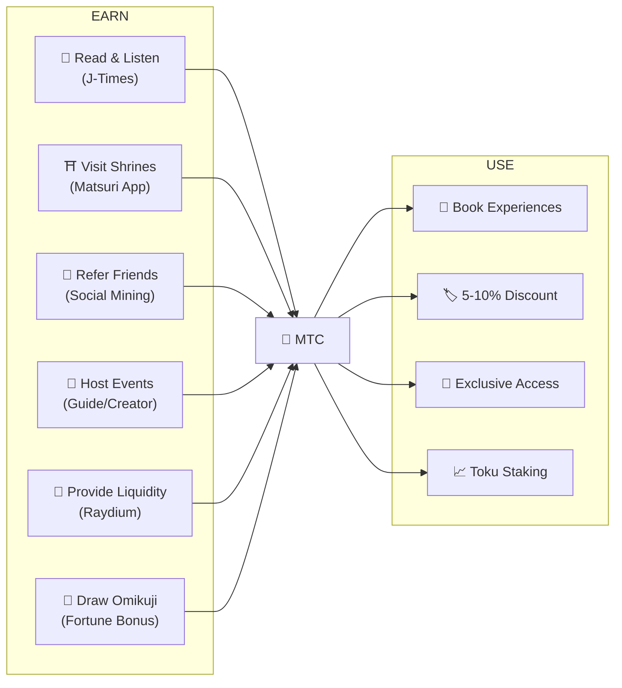
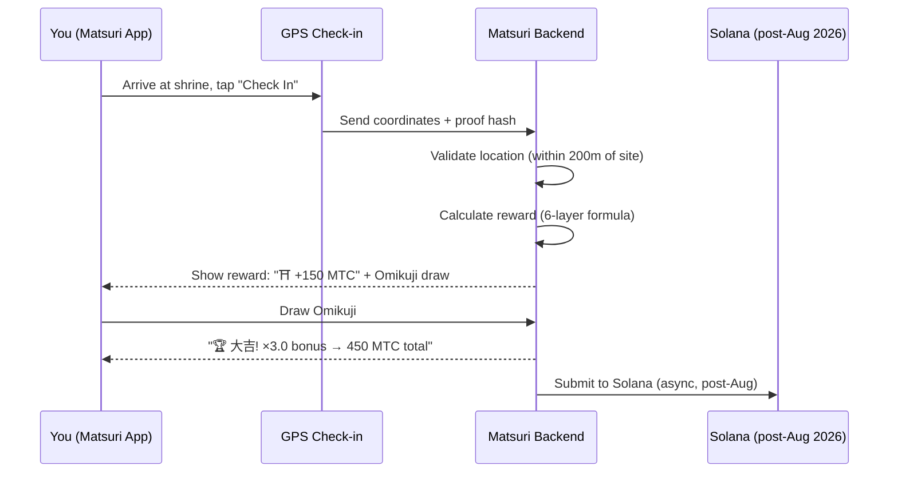
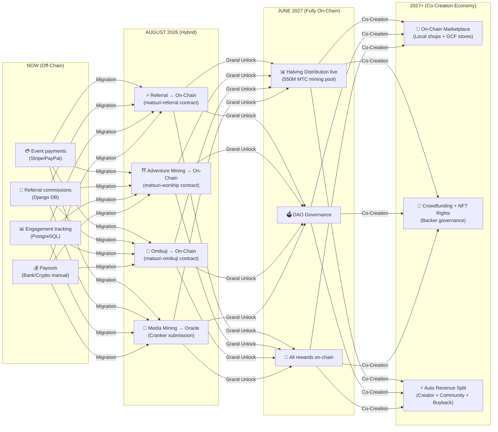

# 💎 How to Earn & Use MTC

> **Earn by action. Spend on experience. Hold for growth.**
> MTC is not just a speculative token — it flows through a real economy where every action creates and captures value.

:::tip The Big Picture
MTC has a **complete circular economy**: you earn it through real activities, spend it on real experiences, and its value grows as the ecosystem expands. This page shows you exactly how.
:::

---

## The MTC Lifecycle



---

## How to Earn MTC

### 1. 📖 Media Mining — Read, Listen & Watch on J-Times

Open the **J-Times app** and consume content about Japanese culture. Every completed action earns MTC automatically.

| Action | Completion Criteria | Reward |
| :--- | :--- | :---: |
| **Read an article** | Scroll to 75% depth | MTC |
| **Listen to a podcast** | Track plays to end | MTC |
| **Watch a video** | Exit detail screen after viewing | MTC |
| **Share content** | Share sheet presented | MTC |
| **Complete a quiz** | Pass comprehension test | MTC (instant) |

:::info Offline Support
No internet at a rural shrine? No problem. J-Times records your activity locally and **automatically syncs when you're back online** (offline queue with 7-day retention). You never lose earned MTC.
:::

**How it works under the hood:**
1. `EngagementTracker` in the app detects completion events
2. Actions queue locally (even offline)
3. On network restore, actions are batched and sent to Django API
4. API validates and credits MTC to your balance
5. Post-August 2026: actions will be submitted on-chain via Cranker oracle

---

### 2. ⛩️ Adventure Mining — Visit Sacred Sites with Matsuri App

Open the **Matsuri app**, find a shrine or temple on the Sacred Site Map, go there, and check in. The less-visited the site, the more you earn.

**Step-by-step flow:**



**Reward multipliers — why rural pays more:**

| Site Type | Examples | Multiplier |
| :--- | :--- | :---: |
| 🏙️ **Major** | Sensoji, Kiyomizu-dera, Fushimi Inari | ×1 |
| 🌆 **Regional** | Prefectural ichinomiya, regional grand shrines | ×2 |
| 🏞️ **Rural** | Historic country shrines | ×5 |
| ⛰️ **Frontier** | Mountain temples, remote island sacred sites | ×10 |

**Plus additional bonuses:**
- **Pioneer Bonus** — first visitor of the day earns the most (harmonic decay)
- **Streak Bonus** — visit consecutive days for up to +50%
- **Omikuji** — random fortune draw: 大吉 = ×3.0, 吉 = ×1.5, 小吉 = ×1.2
- **Sponsored Beacons** — municipalities deposit MTC to boost specific sites

> **Example:** Visit a remote mountain shrine (×10) as the 2nd visitor of the day, with a 5-day streak (+10%), and draw 吉 (×1.5) = base reward amplified **16.5×**.

---

### 3. 🤝 Social Mining — Refer Friends & Build Your Network

Share your referral code. When your network transacts, you earn automatically.

| Layer | Relationship | Commission |
| :---: | :--- | :---: |
| **L1** | You → Friend (direct) | **20%** |
| **L2** | Friend → Their friend | **5%** |
| **L3** | 3rd degree | **5%** |
| **L4** | 4th degree | **5%** |

**How the En-Mining score works:**

```
Your Score = (Direct Referrals × 30%) + (Network Transaction Volume × 70%)
           × Toku Staking Multiplier (1.0× – 10.0×)
           × Title Boost (+5% per ranked season, max +50%)
```

> **Key insight:** 70% of your score comes from **real economic activity** in your network, not just signups. Inviting 1,000 people who never spend earns less than inviting 10 active spenders.

:::warning Currently Off-Chain → Moving On-Chain August 2026
Referral commissions are currently tracked in Django (PostgreSQL) and paid via bank transfer or crypto. Starting **August 2026**, the entire referral commission system will migrate to the **Matsuri Referral smart contract** on Solana — making payouts trustless, instant, and auditable on-chain.
:::

---

### 4. 🎪 Creator & Guide Mining — Host Events, Create Content

If you're a GCF member, guide, or content creator:

| Activity | How You Earn |
| :--- | :--- |
| **Host a tour** | Guide commission (set per event) + tips |
| **Sell event tickets** | Revenue share via EventPurchase |
| **Publish a course** | Per-enrollment fee |
| **Create podcast episodes** | Subscription revenue |
| **Launch a crowdfunding campaign** | Solana-based contributions |

**Tipping system:** After every event, guests can tip guides (Uber-style). Tips are processed via Stripe and tracked on a public leaderboard.

---

### 5. 🏦 Liquidity Mining — Provide Liquidity on Raydium

Provide MTC/SOL liquidity on Raydium DEX and earn rewards.

| Item | Details |
| :--- | :--- |
| **Target APY** | 50% (early liquidity incentive) |
| **DEX** | Raydium (Solana) |
| **Who** | Anyone holding MTC and SOL |

---

### 6. 🎲 Omikuji Bonus — Fortune Multiplier

Every Adventure Mining check-in includes a free Omikuji (fortune) draw. This multiplier is applied on top of all other bonuses.

| Fortune | Probability | Multiplier |
| :--- | :---: | :---: |
| 🏆 **大吉** (Great Blessing) | 5% | ×3.0 |
| ✨ **吉** (Blessing) | 15% | ×1.5 |
| 🌸 **小吉** (Small Blessing) | 30% | ×1.2 |
| 🍃 **末吉** (Future Blessing) | 35% | ×1.0 |
| 💀 **凶** (Misfortune) | 15% | ×1.0 |

The result is determined by a **tamper-proof commit-reveal protocol** on Solana. Not even the server can change your result after the commit phase.

---

## Where to Spend MTC

| Use Case | Benefit | Available |
| :--- | :--- | :---: |
| **🎫 Book experiences** | Pay for tours, events, and cultural activities with MTC | ✅ Now |
| **🏷️ Discount** | 5–10% off vs. yen pricing when paying with MTC | ✅ Now |
| **🔑 Exclusive access** | NFT-gated events, VIP-only ceremonies, private tours | ✅ Now |
| **📈 Toku Staking** | Lock MTC to boost your mining multiplier (1.0× → 10.0×) | 🔜 Aug 2026 |
| **🗳️ DAO Governance** | Vote on treasury, protocol upgrades, and site certification | 🔜 2027 |
| **🛍️ Partner stores** | Pay at participating shops and restaurants | 🔜 Expanding |

:::info MTC as Payment
In the Matsuri app, MTC is a first-class payment method alongside credit cards and Solana Pay. No conversion needed — select "Pay with MTC" at checkout and the balance is deducted instantly.
:::

### Example: A Day in the MTC Economy

> **Morning:** Read 3 J-Times articles on the train → earn MTC.
> **Afternoon:** Visit a rural shrine with the Matsuri app → check in, draw 吉 (×1.5) → earn more MTC.
> **Evening:** Use earned MTC to book a ¥9,000 Golden Gai cultural tour at 10% discount (pay ¥8,100 equivalent).
> **Result:** Your cultural curiosity funded a real experience — and the guide, the shrine, and the community all received direct payment. No OTA took a 20% cut.

### Economic Sustainability

:::warning What Happens When the Mining Pool Runs Out?
The 550M MTC halving pool is designed to last **decades** (20 epochs × 2 years = 40 years theoretical). But even after the pool is exhausted:

- **Transaction fees** from on-chain activity continue to reward network participants
- **Buyback protocol** (20-25% of business revenue) creates perpetual buy pressure
- **Toku staking** locks circulating supply, reducing sell pressure
- **Real business revenue** (events, memberships, courses) sustains the ecosystem independently of token distribution

MTC is backed by a **real economy** — not just token emissions.
:::

---

## On-Chain Migration Roadmap

The Matsuri economy is progressively moving from off-chain (Django/PostgreSQL) to on-chain (Solana smart contracts). This transition makes all operations **trustless, auditable, and permissionless**.



| Phase | Timeline | What Moves On-Chain |
| :--- | :--- | :--- |
| **Phase 1 (Now)** | Live | MTC token (SPL), Raydium LP, Solana Pay verification |
| **Phase 2 (Aug 2026)** | Smart contract mainnet deploy | Referral commissions, Adventure Mining rewards, Omikuji draws, Media Mining via oracle |
| **Phase 3 (Jun 2027)** | Grand Unlock | 550M MTC halving distribution, DAO governance, full decentralization |
| **Phase 4 (2027+)** | Co-Creation Economy | On-chain marketplace (local shops + GCF stores), crowdfunding with NFT rights, automatic revenue split to creators + community + buyback |

:::warning Why Not All On-Chain Today?
Moving everything on-chain before a **professional security audit** (planned Q2 2026) would be irresponsible. The current hybrid approach lets us iterate safely while preparing for trustless on-chain operations. Off-chain rewards are still verifiable — every transaction has a `solana_signature` for settlement proof.
:::

---

**[▶ Next: Mobile Apps](/docs/mobile-apps)** ｜ **[◀ Prev: Ecosystem & Mining](/docs/ecosystem)**
