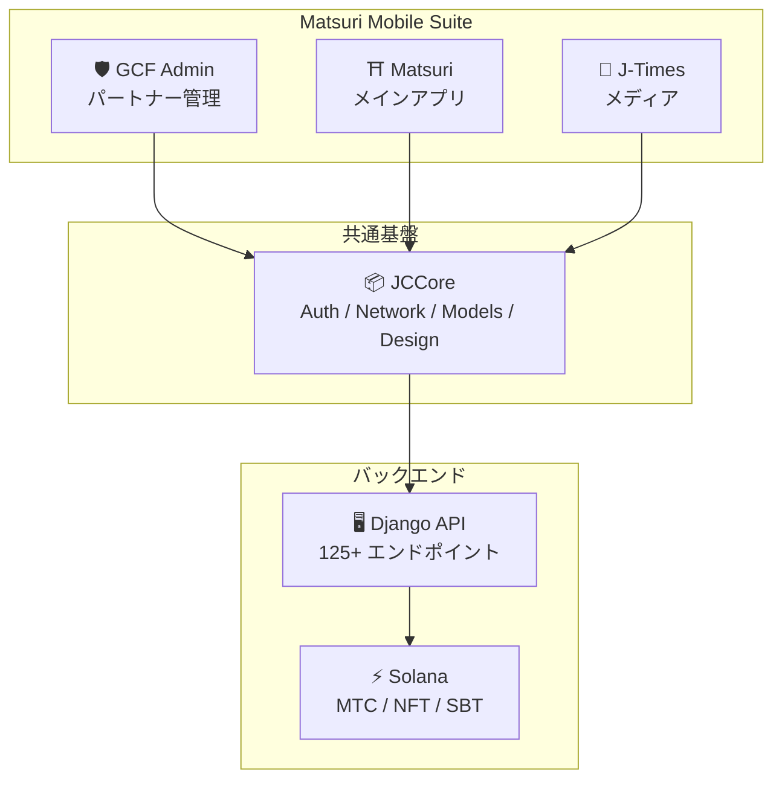
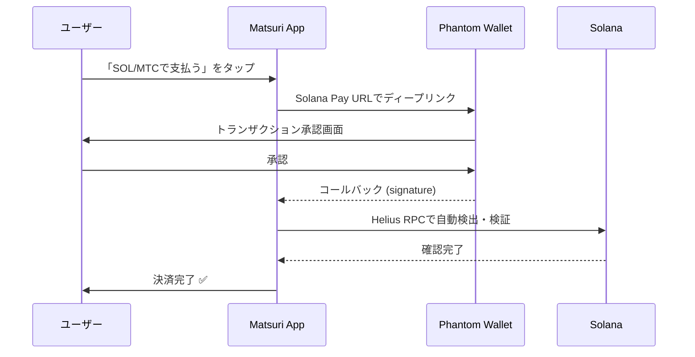
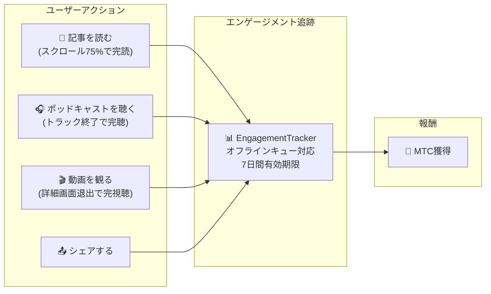
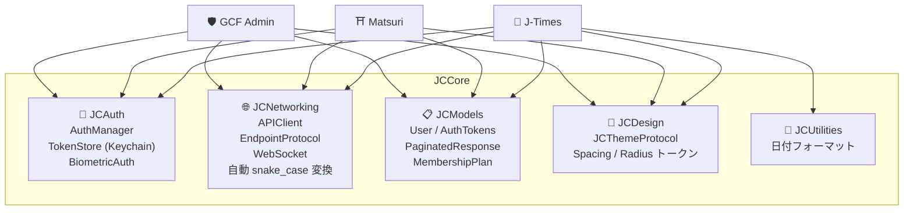

# 📱 Mobile App Suite

> **Three native iOS apps covering every layer of the Matsuri ecosystem.**
> Built entirely with Swift 6 / iOS 17+. Unified authentication, networking, and design via the shared **JCCore** library.

:::tip Why This Matters for Investors
Most Web3 projects have a website and a whitepaper. Matsuri has **3 production iOS apps with 827+ automated tests**, shared infrastructure, and native Solana integration. This is rare execution depth in the token space.
:::

---

## App Overview

| App | Purpose | Status | Languages |
| :--- | :--- | :---: | :--- |
| **GCF Admin** | Partner management & operations | ✅ Released | 🇯🇵🇬🇧🇨🇳🇹🇭🇳🇴 |
| **Matsuri** | Consumer-facing main app | 🔜 Late April 2026 | 🇯🇵🇬🇧🇨🇳🇹🇭🇳🇴 |
| **J-Times** | Culture media & learning | 🔜 Late April 2026 | 🇯🇵🇬🇧 |

---

## 1. 🛡️ GCF Admin — パートナー管理アプリ

:::info ステータス: App Store リリース済み (v1.0)
GCF (Global Community Friends) メンバー向けの業務管理アプリ。ウェブ管理画面の全機能をモバイルに集約。
:::

  
  
  

### このアプリでできること

| カテゴリ | 機能 |
| :--- | :--- |
| **📊 ダッシュボード** | KPIカード、売上チャート、クイックアクション |
| **👥 メンバー管理** | 一覧・詳細・編集・ティア管理 |
| **💰 収益管理** | コミッション追跡、MTC出金管理、ペイアウト管理 |
| **📝 コンテンツ管理** | イベント・記事・ポッドキャスト・動画の作成・編集・公開 |
| **🎫 ガイドスロット** | ガイド枠の管理、収益トラッキング |
| **🖼️ NFTダッシュボード** | Founder's Collection、オンチェーン確認、NFT転送 |
| **⛩️ 聖地管理** | サイトのCRUD、ビーコン設定 |
| **🎲 ARマイニング設定** | おみくじ確率テーブル、報酬パラメータ管理 |
| **📊 アナリティクス** | エラーレポート、利用状況分析 |
| **🔗 リファラル** | カスタムQRコード生成、紹介プログラム管理 |

### 技術仕様

| 項目 | 詳細 |
| :--- | :--- |
| **アーキテクチャ** | Clean Architecture + MVVM + `@Observable` (iOS 17) |
| **言語 / SDK** | Swift 6.0 / Xcode 16+ / iOS 17.0+ |
| **API連携** | 125以上のエンドポイント |
| **テスト** | 226テスト / 45テストクラス |
| **ローカライズ** | 5言語 (日英中泰諾) / 957以上の翻訳キー |
| **Swift Concurrency** | Strict Concurrency準拠 / ビルド警告ゼロ |

### QRコード統合

GCF Adminでは、Matsuriロゴ付きのカスタムQRコードを生成可能。イベント招待、リファラルリンク、決済リクエストなど多用途に対応。

---

## 2. ⛩️ Matsuri — メインアプリ

:::info ステータス: 2026年4月後半リリース予定 (v3.0)
一般ユーザー向けのメインアプリ。イベント予約、決済、Web3ウォレット、ARマイニングまで、すべてを一つのアプリで完結。
:::

  
  
  

### このアプリでできること

| カテゴリ | 機能 |
| :--- | :--- |
| **🎪 イベント予約** | 検索・予約・Stripe決済・チケットQR管理 |
| **💳 4つの決済手段** | クレジットカード / 保存済みカード / MTCバランス / 暗号資産 (SOL/MTC) |
| **👛 Web3ウォレット** | MTCバランス表示、送受信、トランザクション履歴 |
| **🖼️ NFTギャラリー** | 保有NFT/SBT一覧、オンチェーン確認 |
| **🗺️ 聖地マップ** | 神社仏閣の地図表示、チェックイン |
| **🎲 ARマイニング** | WebARおみくじ体験、MTC獲得 |
| **💬 チャット** | コンテキストメニュー付きメッセージング |
| **⭐ ウィッシュリスト** | お気に入りイベント・体験の保存 |
| **🔍 高度な検索** | 音声検索対応 |
| **🤝 リファラル** | 紹介プログラム参加、報酬追跡 |
| **📊 GCFダッシュボード** | GCFメンバー向け簡易管理画面 |

### Phantom Wallet連携 — ゼロ入力の暗号資産決済

> **Zero address copy-paste.** Phantom Wallet opens automatically, the user approves, and payment is complete. Transaction signatures are auto-detected via Helius RPC — the smoothest crypto payment UX in the market.

:::tip Why This Matters
Most Web3 apps force users to copy wallet addresses, manually enter amounts, and wait for confirmations. Matsuri's Solana Pay integration reduces this to **a single tap** — matching the UX of Apple Pay while settling on-chain.
:::

### 技術仕様

| 項目 | 詳細 |
| :--- | :--- |
| **アーキテクチャ** | Clean Architecture + MVVM + Swift Concurrency |
| **言語 / SDK** | Swift 6.0 / Xcode 16+ / iOS 17.0+ |
| **決済** | Stripe PaymentSheet + MTC Balance + Phantom (Solana Pay) |
| **API連携** | 72エンドポイント / 16カテゴリ |
| **テスト** | 230以上 (Model, ViewModel, Network, Security, DeepLink, E2E) |
| **ローカライズ** | 5言語 (日英中泰諾) / 406翻訳キー |
| **ViewModel数** | 25 (完全MVVM — Viewからの直接API呼び出しゼロ) |
| **認証** | Apple Sign In / Google Sign In (PKCE) |

---

## 3. 📰 J-Times — カルチャーメディアアプリ

:::info ステータス: 2026年4月後半リリース予定
日本文化の深層を伝えるメディアプラットフォーム。記事を読み、ポッドキャストを聴き、動画を観る — すべてのアクションでMTCを獲得。
:::

  

### このアプリでできること

| カテゴリ | 機能 |
| :--- | :--- |
| **📖 記事** | パララックスヒーロー、ドロップキャップ、読書進捗バー、リッチコンテンツ (Markdown, テーブル, 引用) |
| **🎧 ポッドキャスト** | シリーズブラウジング、波形表示プレイヤー、スリープタイマー、AirPlay、ロック画面コントロール |
| **🎬 動画** | アダプティブグリッド/リスト表示、ショート動画 (TikTokスタイル、ダブルタップ) |
| **🔍 検索** | マルチフィルター、トレンドタグ、音声検索 |
| **🧭 ディスカバリー** | フィーチャーカルーセル、スタッフピック、今週の人気 |
| **📚 ライブラリ** | お気に入り、履歴 (日付別)、ダウンロード、プレイリスト |
| **🎵 オーディオプレイヤー** | ミニプレイヤー (スワイプ操作)、フルプレイヤー (波形、歌詞、リピート) |
| **👤 メンバーシップ** | 3ティア (Free / Premium / Pro) の機能比較、購入復元 |

### Media Mining — 読む・聴く・観るがマイニングになる

> **オフラインでも記録される。** 電波の届かない山奥の神社で記事を読んでも、ネット復帰時に自動でエンゲージメントが送信され、MTCが付与される。

### デザインシステム — 日本の美意識「四柱」

J-Timesは日本の伝統的な美意識を現代UIに落とし込んだ独自のデザインシステムを採用。

| 柱 | 概念 | UIへの適用 |
| :--- | :--- | :--- |
| **墨 (Sumi)** | 温かみのあるニュートラルグレー | 背景色、テキスト階層 |
| **朱 (Shu)** | 日本の赤 (#C53030) | アクセントカラー、重要アクション |
| **間 (Ma)** | 4ptグリッドの余白 | スペーシング、呼吸感 |
| **紙 (Kami)** | 微細なテクスチャ、グラスモーフィズム | カード表面、奥行き表現 |

### 技術仕様

| 項目 | 詳細 |
| :--- | :--- |
| **アーキテクチャ** | Clean Architecture + MVVM + Swift Concurrency |
| **言語 / SDK** | Swift 6.0 / Xcode 16+ / iOS 17.0+ |
| **外部依存** | **ゼロ** — Apple純正フレームワークのみ |
| **API連携** | 40以上のエンドポイント |
| **テスト** | 371テスト / 20ファイル |
| **ローカライズ** | 2言語 (日英) / 310以上の翻訳キー |
| **オフライン対応** | ContentCache (50MB) + ImageDiskCache (200MB) + ダウンロードマネージャー |
| **認証** | Apple Sign In / Google Sign In (PKCE) |

---

## 共通基盤: JCCore ライブラリ

3つのアプリすべてが共有するSwift Packageライブラリ。

| モジュール | 役割 |
| :--- | :--- |
| **JCAuth** | Keychain ベースのトークン管理、生体認証 (Face ID / Touch ID) |
| **JCNetworking** | 型安全なAPIクライアント、WebSocket、自動JSON snake_case変換 |
| **JCModels** | アプリ横断の共通データモデル (User, AuthTokens, etc.) |
| **JCDesign** | テーマプロトコル、デザイントークン (スペーシング、角丸) |
| **JCUtilities** | 日付・文字列のユーティリティ |

---

## セキュリティとプライバシー

| 項目 | 実装 |
| :--- | :--- |
| **認証トークン** | iOS Keychainに暗号化保存 (TokenStore) |
| **生体認証** | Face ID / Touch ID による二要素認証 |
| **API通信** | HTTPS + Certificate Pinning |
| **ウォレット秘密鍵** | アプリ内に秘密鍵を保存しない — Phantom Walletに委譲 |
| **ARマイニング** | カメラ画像をサーバーに送信しない (VisionProof) |
| **オフラインデータ** | SwiftData暗号化 + 自動有効期限 |
| **Swift Concurrency** | Actor隔離による競合状態防止 |

---

## 開発品質

3アプリ合計で **827以上の自動テスト** を実装。

| アプリ | テスト数 | カバレッジ領域 |
| :--- | :---: | :--- |
| **GCF Admin** | 226 | Model, ViewModel, Repository, API, Localization, Navigation |
| **Matsuri** | 230+ | Model, ViewModel, Network, Security, DeepLink, Regression, Performance, E2E |
| **J-Times** | 371 | Model, ViewModel, API, Repository, Navigation, Localization, Security, Performance |

---

**[▶ Next: Roadmap & Team](/docs/roadmap)** ｜ **[◀ Prev: Ecosystem & Mining](/docs/ecosystem)**
