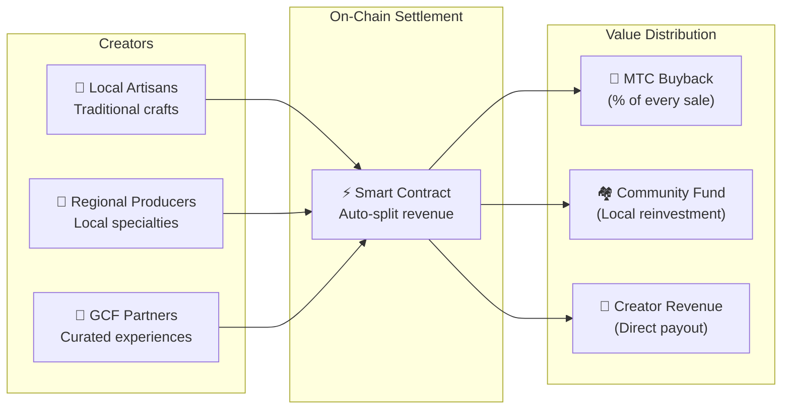

# 🗓️ Roadmap & Governance

> **The Path to Certainty.**
> This is not a short-term speculative play.
> **Core platform development is already complete** — we're in the scaling phase.

---

## Strategic Milestones

### 🔥 Phase 1: Awakening (2026 H1 — Now)

**Theme: Foundation & Cash-Flow Generation**

The product is built. Focus now is monetisation via the CEO-led financial system and securing initial liquidity.

| Status | Milestone | Details |
| :---: | :--- | :--- |
| ✅ | **Product Launch** | Matsuri Webapp & GCF Admin Dashboard live |
| ✅ | **Payments & Growth** | 4 payment methods (Stripe, PayPal, Solana Pay, MTC) + referral engine |
| ✅ | **Media Launch** | J-Times (Web & Podcast) + Course marketplace live |
| ✅ | **Genesis** | MTC Token Generation Event on Solana (900M supply, authorities revoked) |
| ✅ | **Liquidity** | Initial LP pool created on Raydium |
| ✅ | **Mobile Apps** | GCF Admin iOS app released on App Store |
| ✅ | **Backend Infrastructure** | 80+ models, 100+ APIs, 15+ automated tasks, 841 tests |
| ✅ | **Analytics** | Full session tracking, conversion funnels, A/B testing |
| 🔜 | **Mobile Launch** | Matsuri & J-Times iOS apps (April 2026) |
| ⬜ | **Incentive Programme** | 50 % target-APY liquidity mining launch |
| ⬜ | **System Go-Live** | Solana MEV / arbitrage bot in production |
| ⬜ | **VIP Recruitment** | First 20 GCF VIP members selected |

### 🚀 Phase 2: Expansion (2026 H2)

**Theme: Real-World Assets & Adventure Mining**

Leverage the completed Webapp to expand physical bases and the "Pilgrimage" feature.

| Status | Milestone | Details |
| :---: | :--- | :--- |
| ⬜ | **Feature Release** | Adventure Mining (Pilgrimage) goes live |
| ⬜ | **Global Expansion** | Partner bases & VIP events across Asia (Thailand, Taiwan, etc.) |
| ⬜ | **Asset Management** | Real estate, equity & crypto portfolio from business revenue |
| ⬜ | **Target** | Ecosystem-wide AUM of **¥1 billion (~$6.5 M)** |

### 🌊 Phase 3: Circulation (2027+)

**Theme: Mass Adoption, Co-Creation Economy & Decentralisation**

Public launch, on-chain marketplace, and full ecosystem operation.

| Status | Milestone | Details |
| :---: | :--- | :--- |
| ⬜ | **Grand Opening** | Matsuri App worldwide release |
| ⬜ | **Grand Unlock (1 Jun 2027)** | Founder lockup release + Mining Pool (550 M MTC) live + Halving cycle starts |
| ⬜ | **Co-Creation Marketplace** | Local specialty shops + GCF partner stores — on-chain settlement with automatic MTC buyback |
| ⬜ | **Crowdfunding with NFT Rights** | Users fund cultural projects on Solana. Backers receive NFTs representing ownership, revenue share, or governance rights over the funded project |
| ⬜ | **On-Chain Shop Settlement** | All marketplace transactions settled via smart contracts — a percentage of every sale flows into the MTC buyback pool automatically |
| ⬜ | **Target** | Ecosystem-wide AUM of **¥10 billion (~$65 M)** |
| ⬜ | **DAO Transition** | Partial transfer of decision-making to GCF community |

#### 🏪 Co-Creation Marketplace Vision

The ultimate expression of "Culture OS" — a decentralised marketplace where **culture creators and culture enthusiasts transact directly**, with no extractive middlemen.

| Feature | Description | Status |
| :--- | :--- | :---: |
| **🏺 Local Specialty Shops** | Artisans and regional producers sell directly to a global audience. MTC payment = 5–10% discount | ⬜ Vision |
| **🎫 Crowdfunding + NFT Rights** | Fund a cultural project (shrine restoration, festival revival, artisan workshop). Receive an NFT representing your contribution — with potential revenue share or governance rights | ⬜ Vision |
| **⚡ On-Chain Settlement** | Every marketplace transaction is settled via Solana smart contracts. Revenue is automatically split: creator payout + community fund + MTC buyback — no manual accounting | ⬜ Vision |
| **🗳️ Backer Governance** | NFT holders vote on how funded projects allocate resources — true co-creation, not just donation | ⬜ Vision |

:::info Why This Matters
Today, tourists buy souvenirs from shops that pay rent to platform landlords. Tomorrow, **an artisan in rural Kyoto sells directly to a fan in Copenhagen** — and a percentage of that sale automatically strengthens the MTC economy. This is the "flywheel" at its fullest expression.
:::

---

## 👤 Team

### Ko Takahashi — Founder / CEO & Lead Architect

  

| Item | Details |
| :--- | :--- |
| **Role** | Overall project lead. Designs and builds the core financial algorithm (Solana MEV Bot) |
| **Vision** | Creator of the "Export Culture, Import Wealth" Culture OS |
| **Ethos** | Writes code by day, runs the bar in Golden Gai by night — the definition of "skin in the game" |

### Jon Anders Jensen — Co-Founder

| Item | Details |
| :--- | :--- |
| **Role** | Co-Founder and strategic operations |
| **Base** | Norway / Japan |

### Ryunosuke Honda

| Item | Details |
| :--- | :--- |
| **Role** | Core team member |

### 🌏 GCF Community — Global Development Contributors

Matsuri Protocol isn't built by the founding team alone.
**GCF members worldwide** contribute through testing, feedback, translation, and regional expansion.

| Domain | Team |
| :--- | :--- |
| **💼 Global Finance** | Private-investor networks across Asia |
| **⚙️ Engineering** | Distributed engineering guild for blockchain & mobile dev |
| **🏮 Operations** | Deep pipeline with local communities in Shinjuku Golden Gai & major tourist hubs |
| **🌐 Community** | Multinational GCF members across Japan, Norway, Thailand, Taiwan, and beyond |

:::tip Build the Infrastructure of Culture Together
Join GCF and become a co-developer of Matsuri Protocol.
Contributing isn't just about writing code — introducing local sacred sites, translating docs, organizing events — everything helps spread this protocol to the world.
:::

---

## 🏛️ Governance (DAO)

Matsuri Protocol will progressively transition to a **Decentralised Autonomous Organisation (DAO).**
GCF members (Platinum / Gold) will hold **voting rights** on key decisions:

| Vote | Scope |
| :--- | :--- |
| **💰 Treasury Allocation** | Which new ventures or marketing initiatives to fund |
| **⚙️ Protocol Upgrades** | Fine-tuning fee rates and mining reward curves |
| **⛩️ Cultural Certification** | Which festivals and shrines to certify as "official pilgrimage sites" and fund |

:::info Join the Revolution
We're not just building an app.
We're building a **borderless cultural economy.**
:::

---

**[◀ Back to Whitepaper Top](/docs/intro)** ｜ **[Follow on X](https://x.com/matsuri_dao_jp)**
