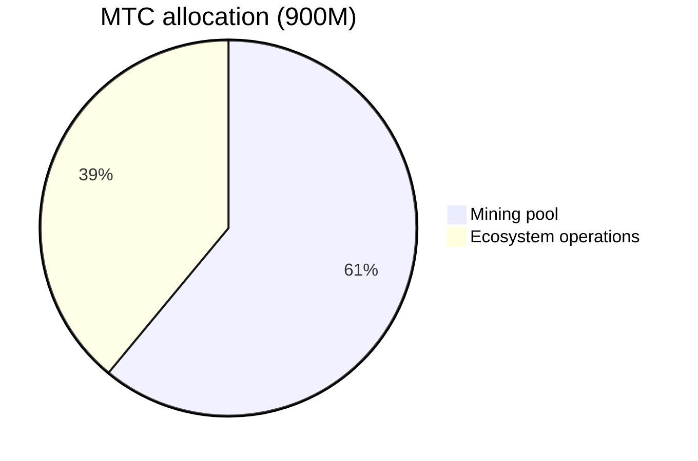
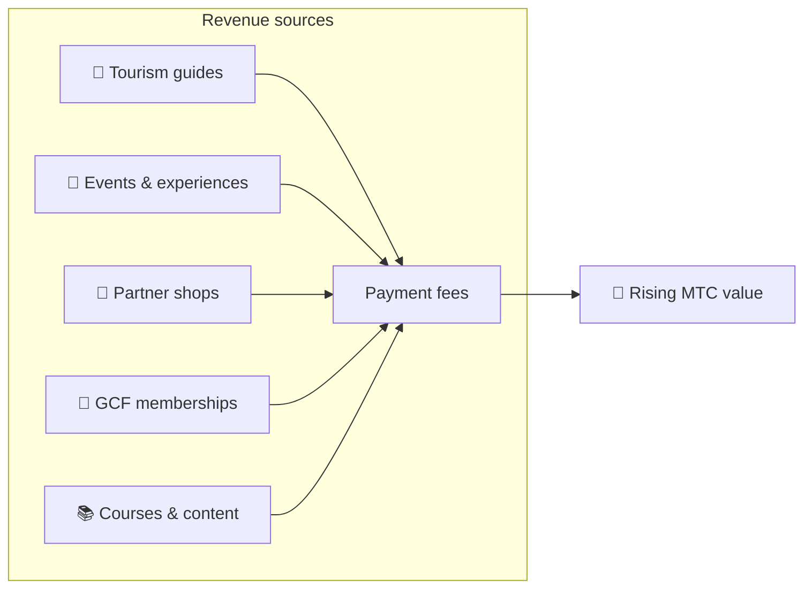

# 💰 Tokenomics — the economic design of MTC

> **Trust is carved into the code.**
> MTC's economic design is guaranteed not by someone's promise, but by mathematics and blockchain.


> **"An economy where the status quo cannot be changed by force" — that is MTC's tokenomics.**

The economic design of Matsuri Coin (MTC) rests on a single conviction:
**a rule that even the operator cannot tamper with is the strongest possible reassurance for investors.**

Supply is permanently fixed. Additional issuance and fund freezes are impossible. Business growth is reflected in price at the level of an equation —
not a "promise," but a **fact** carved into the blockchain.

This page openly discloses all of MTC's economic mechanics.

---

## Token specification

To guarantee investor safety, we have permanently **renounced** both the "mint authority" and "freeze authority" on Solana.
Additional issuance is permanently impossible. Funds cannot be frozen. It is a **fully trustless design.**

| Item | Detail |
| :--- | :--- |
| **Token name** | Matsuri Coin |
| **Ticker** | MTC |
| **Chain** | Solana |
| **Mint address** | `DRENpzmRWM4TwECrCPCfS1k5VBPmanhQg9bcCWP8EZXF` [Solscan →](https://solscan.io/token/DRENpzmRWM4TwECrCPCfS1k5VBPmanhQg9bcCWP8EZXF) |
| **Total supply** | **900 million** (900,000,000 MTC), fixed |
| **Mint authority** | 🚫 Renounced ([verifiable on-chain](https://solscan.io/token/DRENpzmRWM4TwECrCPCfS1k5VBPmanhQg9bcCWP8EZXF)) |
| **Freeze authority** | 🚫 Renounced ([verifiable on-chain](https://solscan.io/token/DRENpzmRWM4TwECrCPCfS1k5VBPmanhQg9bcCWP8EZXF)) |
| **Lock management** | Streamflow Finance (verified) |

:::info Why this matters
Renouncing mint authority means "the operator cannot mint more tokens and dilute your share." Renouncing freeze authority means "no one can freeze your wallet." This is the foundation of trustlessness.
:::

---

## Token allocation

900M MTC is allocated as follows.



| Category | Share | Amount | Purpose |
| :--- | :---: | :--- | :--- |
| **⛏️ Mining pool** | **61%** | 550 million | Reward pool for contributors. Unlocked June 2027, released on a two-year halving cycle. Distributed according to contribution score |
| **🌐 Ecosystem operations** | **39%** | 350 million | Marketing, GCF distribution, operational expenses, liquidity pool (LP) funding, development cost, advertising, event hosting, and more |

:::note How the mining pool is released
The 550M MTC is not released all at once. It follows a two-year halving schedule and is **distributed in stages according to contribution score.** The release and distribution rules will be implemented as smart contracts in stages from late 2026 onward, and become verifiable on-chain.
:::

:::note About the ecosystem operations allocation
The 39% operations allocation is a multi-purpose fund needed to grow the ecosystem. Concrete uses include marketing activity, initial distribution to GCF members, providing liquidity to the Raydium pool, compensation for the development team, advertising, and funding culture-experience events. Transparency of use will be subject to community governance after the move to DAO.
:::

---

## Revenue structure

What supports MTC's value is **revenue from real business activity.** Not speculation — real economic activity backs the token's value.



| Revenue source | Detail |
| :--- | :--- |
| **🏯 Experiences & guides** | Payment fees from tour guides and cultural-experience events |
| **🤝 GCF membership** | Membership fees |
| **📚 Content** | Course enrollment fees, media subscriptions |
| **🏪 Marketplace** | Transaction fees from partner shops (expanding in stages) |

:::tip Growth backed by real demand
The more inbound visitors arrive, the more foreign currency flows in and the larger the ecosystem grows. MTC's value is set not by speculation but by **the number of people who experience the culture.**
:::

---

## Current business traction

The MTC economy is still early, but real activity has already begun.

| Metric | Status |
| :--- | :--- |
| **Events hosted** | 50+ (test operation) |
| **GCF Platinum members** | 20 of 50 seats filled |
| **GCF Gold members** | Recruitment to open soon |
| **Web platform** | Live, currently gathering and serving test users |
| **iOS apps** | Development complete, scheduled release April 2026 |

:::note Honest statement
We do not yet have a "huge success" track record. 50 events and test operation — that is the reality today. But the product is running, the community exists, and we are in the phase of scaling up from here in earnest.
:::

---

## Buyback protocol

We do not simply pocket the profit.
A fixed percentage of business revenue is earmarked for **buying MTC back from the market.**

| Revenue source | Allocation | Action |
| :--- | :---: | :--- |
| **Matsuri HQ revenue** (guides, events) | **20%** | **Buyback** from market + liquidity pool additions |
| **GCF membership** (membership fees) | **25%** | **Buyback** from market |

:::info Buyback status today
The buyback protocol will **begin operation** as business revenue ramps up. Initially it runs off-chain (manually); it migrates in stages to automatic execution by smart contract from late 2026 onward. Once on-chain, the full execution history of buybacks will be verifiable on the blockchain by anyone.
:::

Buybacks are not an "eventually" promise. They are a rule programmed as protocol. Every time business revenue rises, MTC is automatically absorbed from the market — **structural reassurance** for the investor.

---

## Price-formation logic

MTC's upward-price mechanism is based not on hope, but on the **equation of an AMM (automated market maker).**

```
Price = Liquidity (SOL) ÷ Supply (MTC)
```

| Step | What happens | Result |
| :---: | :--- | :--- |
| **①** | Business revenue (SOL) is injected into the pool | **Numerator rises** |
| **②** | Those funds buy MTC back from market and burn it | **Denominator falls** |
| **③** | Numerator ↑ × denominator ↓ | **Conditions for rising scarcity are met** |

:::info Description of a mechanism, not a price guarantee
This equation describes a structural design: if business revenue continues and buybacks are executed, the supply-demand balance moves in the direction of scarcity. Actual price depends on market demand, external conditions, liquidity, and many other factors.
:::

---

## Halving schedule

The **550 million MTC (about 61% of total supply)** that unlock on June 1, 2027 will not be dumped on the market. They are reserved as the **reward pool for contributors.**

We have adopted a **two-year halving cycle**, faster than Bitcoin's four-year cycle.
The release rate halves every two years, keeping rewards flowing in theory for decades.

| Period | Release share | Amount released | Cumulative |
| :--- | :---: | :--- | :---: |
| **Period 1** 2027–2029 | **50%** | ~275M | 50% |
| **Period 2** 2029–2031 | **25%** | ~137M | 75% |
| **Period 3** 2031–2033 | **12.5%** | ~68M | 87.5% |
| **Period 4** 2033–2035 | **6.25%** | ~34M | 93.75% |
| **Period 5 onward** | Continues halving | Diminishing | → asymptote to 100% |

<small>*Mathematically it never reaches 100%, and releases asymptotically approach zero. Same principle as Bitcoin.*</small>

:::tip The earlier you contribute, the more MTC you receive
Because of halving, period 1 (2027–2029) has the largest release amount, and each subsequent epoch releases less per event. In other words, **those who build contribution score early receive more MTC.**

Examples of activity that count toward contribution score:
- Event creation and attendance track record
- Running popular guided courses
- Referring and developing excellent guides
- J-Times content views and shares
- Sacred-site pilgrimage check-ins

Rewards are determined not by "order of joining" but by **"quantity and quality of contribution."**
:::

---

:::note Next page
Now that you understand MTC's economic design, let's look at **how to join as a partner.**
**[GCF membership →](/docs/gcf)**
:::
