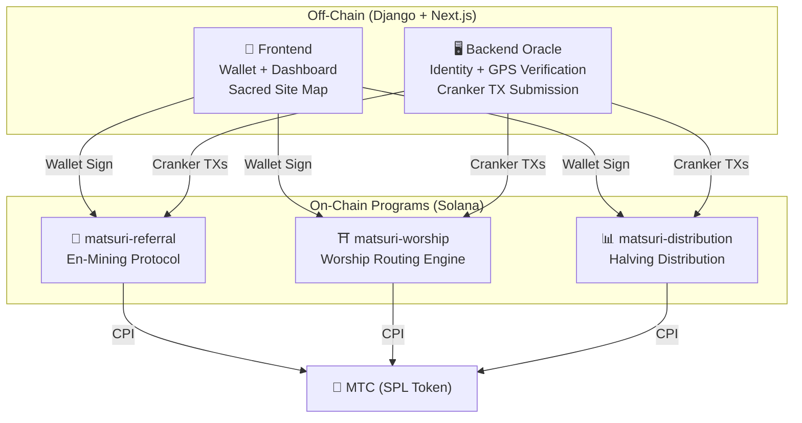
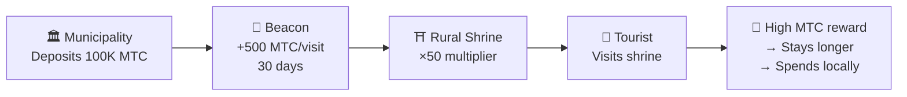
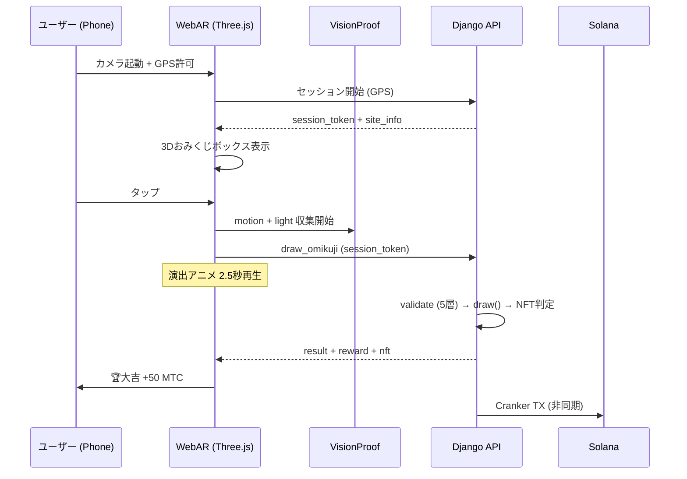
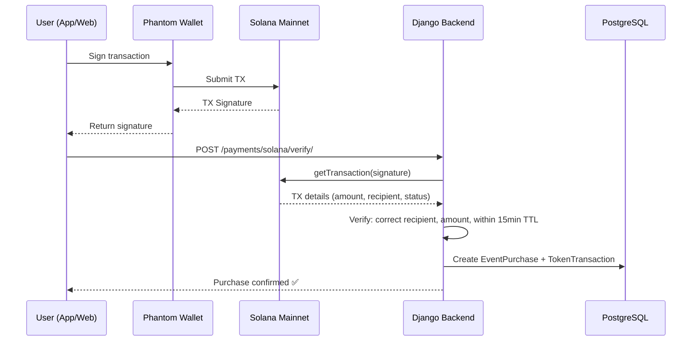

# ⚡ Smart Contracts — Open Source Architecture

> **Trustless by Design.**
> All reward logic, referral trees, and halving schedules are enforced **on-chain** via auditable Rust programs.
> Source code: [GitHub](https://github.com/Cootakahashi/matsuri-contracts)

| Spec | Details |
| :--- | :--- |
| **Framework** | Anchor 0.32.1 (Rust) |
| **Chain** | Solana Mainnet-beta |
| **Programs** | 4 (Distribution, Referral, Worship, Omikuji) |
| **Build** | Optimised release with LTO, overflow checks enabled |
| **Math** | Pure `math.rs` modules — zero side effects, 128-bit intermediates |

---

## Overview

Matsuri deploys **three Anchor (Rust) programs** on Solana, each handling a distinct pillar of the ecosystem:



---

## 1. 📣 En-Mining (縁マイニング) Protocol

**Purpose:** A hybrid growth engine that rewards both *breadth* (referral reach) and *depth* (economic impact). Not just affiliates — a full mining protocol where real-world economic activity generates on-chain value.

### Scoring Design

The contribution score is based on two weighted components:

| Component | Weight | Purpose |
| :--- | :---: | :--- |
| **Breadth** (referral count) | 30% | Network reach — how many people you bring |
| **Depth** (settlement volume) | 70% | Economic impact — real purchases, not just signups |

Scores accumulate over time and convert to MTC at each halving epoch. Additional boost mechanisms are planned:

| Boost | Description | Status |
| :--- | :--- | :---: |
| **Toku (徳) Staking** | Lock MTC to boost your contribution score (up to ~50% boost). Tiers and exact multipliers will be calibrated based on the halving pool release schedule | ⬜ Coefficients TBD |
| **Seasonal Rankings** | Top performers each epoch earn **Evangelist** title (permanent SBT) and a score boost. Exact percentages will be determined via governance | ⬜ Coefficients TBD |

:::info Progressive Parameter Design
Boost coefficients (staking tiers, ranking bonuses) are intentionally left adjustable. They will be finalised based on real ecosystem data — total active users, halving pool release rate, and price stability targets — then locked into smart contracts. This approach ensures **fair distribution** without over-promising fixed returns.
:::

### Anti-Sybil Defence (3 Layers)

| Layer | Mechanism | Where |
| :--- | :--- | :--- |
| **Identity Gate** | X/Twitter OAuth + SMS | Off-chain (Django) |
| **On-chain Gate** | Only `is_verified = true` profiles earn | Smart Contract |
| **Depth Weighting** | 70% of score = real payments → bots earn nothing | Scoring Engine |

---

## 2. ⛩️ Worship Routing Engine (巡礼分散エンジン)

**Purpose:** The world's first **ReFi protocol that solves over-tourism using token economics.** Visit sacred sites → earn MTC. But here's the twist: *less-visited sites pay exponentially more.*

:::tip The Insight
This is "reverse Uber surge pricing" — crowded sites get penalized, frontier sites get boosted. Tourists route themselves to less-visited locations because **it's more profitable.**
:::

### Reward Design Principles

The contribution score for each visit is determined by multiple factors:

| Factor | Principle | Effect |
| :--- | :--- | :--- |
| **Site popularity** | Less-visited sites earn higher scores | Routes tourists away from overcrowded areas |
| **Visit timing** | Earlier visitors of the day score higher | Encourages off-peak visits |
| **Regional tier** | Rural and frontier sites rank highest | Drives regional revitalisation |
| **Visit frequency** | Regular visitors accumulate bonus scores | Rewards consistent engagement |
| **Omikuji fortune** | Random bonus draw on each check-in | Fun gamification layer |
| **Sponsored boosts** | Municipalities can boost specific sites | B2B/B2G revenue model |

:::info Coefficients Are Adjustable
The exact multipliers for each factor (e.g. how much more a rural site earns vs. a major site) will be **calibrated based on the halving pool schedule** and real usage data, then progressively locked into smart contracts. The design principle is fixed — the coefficients evolve with the ecosystem.
:::

### Sponsored Beacons (B2B/B2G)

Municipalities, railway companies, and tourism boards can **deposit MTC** to create time-limited high-reward zones at specific sites.



> **B2B Revenue Model:** Sponsors pay MTC to route tourists. MTC buying pressure → token value. Win-win-win.

---

## 3. 📊 Halving Distribution

**Purpose:** The 550M MTC mining pool distributed over decades via a **2-year halving cycle** — faster than Bitcoin's 4-year cycle.

### Halving Schedule

```
Total Pool: 550,000,000 MTC

Epoch 0 (2027–2029):  275,000,000 MTC  (50%)
Epoch 1 (2029–2031):  137,500,000 MTC  (25%)
Epoch 2 (2031–2033):   68,750,000 MTC  (12.5%)
Epoch 3 (2033–2035):   34,375,000 MTC  (6.25%)
        ...              ...
∑ → 550,000,000 MTC (asymptotic total)
```

### Individual Reward Formula

```
your_reward = epoch_budget × (your_score / total_score)
```

All arithmetic uses **128-bit intermediate computation** — mathematically impossible to overflow.

### Performance Score Sources

| Activity | Score Weight |
| :--- | :--- |
| **Guide sessions conducted** | High |
| **Event ticket sales** | High |
| **Referral network activity** | Medium |
| **Worship mining visits** | Medium |
| **Media engagement** | Low |

:::info Permissionless Epoch Advancement
The `advance_epoch` instruction can be called by **anyone** — no admin needed. The system clock determines when epochs transition, ensuring trustless operation even if the team disappears.
:::

---

## Math Modules (Open Source Core)

All programs separate scoring/reward math into **pure, auditable `math.rs` modules** with:

- **Zero side effects** — no I/O, no allocations, no external calls
- **Documented formulas** — LaTeX-style notation in rustdoc
- **Overflow analysis** — u128 intermediate values with proven bounds
- **Comprehensive tests** — edge cases, boundary conditions, ratio verification
- **Adjustable coefficients** — reward parameters are designed to be updatable via governance, allowing progressive calibration as the ecosystem grows

---

## 4. 🎴 AR Mining — WebAR おみくじマイニング

**Purpose:** A browser-based AR experience that spawns a virtual Omikuji box in real space — mine MTC without downloading an app. The world's first WebAR × blockchain infrastructure fusing Shinto spirituality with cutting-edge technology.

:::info How This Connects to the Mobile Apps
The Matsuri iOS app uses the Sacred Site Map for GPS check-in. Once checked in, the **WebAR Omikuji** opens in a browser overlay (Three.js) — no separate app needed. The result feeds back into the Matsuri app's reward system. Both native and web experiences work together seamlessly.
:::

### アーキテクチャ



### Optimistic UI（待ち時間ゼロ）

| ステップ | 時間 | 処理 |
|---------|------|------|
| タップ → 演出開始 | 0ms | フロントで即座にアニメ再生 |
| API draw_omikuji | ~50ms | Django で抽選 + NFT判定 |
| 演出完了 | 2500ms | 結果確定済み → 表示 |
| Solana TX | ~400ms | バックグラウンドで送信 |

### おみくじ確率設定 (GCF Admin)

Basis Points (10000 = 100%) で0.01%刻みの精密制御。GCF Admin画面から調整可能。

| 等級 | レアリティ | ボーナス | NFT |
|------|-----------|---------|-----|
| 🏆 大吉 | レア | 最大ボーナス | ✅ |
| ✨ 吉 | アンコモン | 高ボーナス | 任意 |
| 🌸 小吉 | コモン | 小ボーナス | — |
| 🍃 末吉 | コモン | 参加記録 | — |
| 💀 凶 | アンコモン | 参加記録 | — |

確率と報酬係数はエコシステムの規模と半減期の放出量に基づいて段階的に確定し、スマートコントラクトに実装されます。

### ZK-Proof of Vision（5層検証）

GPS偽装・リプレイ攻撃を多層で排除。プライバシー保護のため画像データは送信しない。

| Layer | 検証内容 | 配点 |
|-------|---------|------|
| Temporal | セッション時間 5-120秒 | /20 |
| Motion | ジャイロ分散 0.005-0.5 (手持ち自然度) | /20 |
| Light | 環境光×時間帯整合性 | /20 |
| HMAC | proof_hash 署名検証 | /20 |
| Fingerprint | デバイス一意性 | /20 |
| **合計** | **PASS 閾値** | **60/100** |

### 報酬設計

報酬はサイトの種類、おみくじ結果、地域ティアなどの複数要因に基づく**貢献スコア**として記録されます。具体的な係数は半減期の放出スケジュールとエコシステムの成長に合わせて段階的に確定し、スマートコントラクトに実装されます。

---

## NFT / SBT Collection

Matsuri Protocol issues non-transferable **Soulbound Tokens (SBTs)** and limited-edition **NFTs** via Metaplex Core on Solana.

<div style={{display: 'flex', gap: '1.5rem', justifyContent: 'center', alignItems: 'center', flexWrap: 'wrap', margin: '2rem 0'}}>
  
  
</div>

| Type | Transferable | Purpose |
| :--- | :---: | :--- |
| **Founder NFT** | No (SBT) | Founding member proof — permanent score boost |
| **Evangelist NFT** | No (SBT) | Season ranking achievement — score boost |
| **Goshuin NFT** | No (SBT) | Pilgrimage check-in proof — location-exclusive |
| **Omikuji NFT** | No (SBT) | 大吉 fortune proof — rare collectible |

---

## Payment Verification (On-Chain ↔ Off-Chain)

The platform verifies Solana transactions on-chain before crediting purchases — not trust-based, but **cryptographically verified.**



| Verification Check | Details |
| :--- | :--- |
| **Recipient** | Must match `SOLANA_ADMIN_WALLET` |
| **Amount** | Must match expected price (SOL or MTC) |
| **TTL** | Transaction must be within 15 minutes |
| **Uniqueness** | `solana_signature` is unique-indexed — no double-spend |
| **Status** | On-chain confirmation required |

---

## Security Model (Open Source)

These contracts are **fully open source.** Security relies on mathematical guarantees, not obscurity.

| Principle | Implementation |
| :--- | :--- |
| **PDA-Only Vaults** | Token vaults are controlled by Program Derived Addresses — no human key can drain them |
| **Checked Arithmetic** | Every computation uses `checked_*` operations — overflow is impossible |
| **Authority Separation** | Admin (multisig) ≠ Cranker (limited ops) ≠ User (self-custody) |
| **Emergency Pause** | Admin can pause all programs instantly; cannot steal funds |
| **Immutable Tokenomics** | Halving factor, total pool, and epoch duration are set once and cannot be changed |
| **Pure Math Modules** | Scoring/reward logic separated into auditable, testable math libraries |
| **Vision Proof** | 5-layer anti-spoofing without transmitting camera data (privacy-preserving) |

### Off-Chain Security (Django Backend)

| Layer | Implementation |
| :--- | :--- |
| **Authentication** | Cookie-based JWT (HttpOnly + Secure + SameSite=Lax), 1h access / 30d refresh |
| **Encryption** | Bank info encrypted with Fernet cipher, failed decryption returns empty dict |
| **Rate Limiting** | Anon: 30/min, Auth: 100/min, Login: 10/min, Registration: 5/hour |
| **Payment Security** | PCI-compliant (no card data stored), Stripe/PayPal webhook signature verification |
| **Data Privacy** | GDPR data export, auto-delete unverified accounts after 7 days |
| **CORS** | Explicit origin whitelist (no wildcards in production) |

---

## Audit & Verification Status

Transparency is non-negotiable. Here is the current state of third-party verification:

| Item | Status | Details |
| :--- | :---: | :--- |
| **Source Code** | ✅ Open Source | [GitHub: matsuri-contracts](https://github.com/Cootakahashi/matsuri-contracts) |
| **MTC Token** | ✅ Verified | SPL Token on Solana Mainnet — Mint & Freeze authorities permanently revoked |
| **Smart Contract Audit** | 🔜 Planned Q2 2026 | Professional security audit by independent firm |
| **Backend Security** | ✅ Production | Rate limiting, encrypted storage, PCI-compliant payments, 841+ tests |
| **Mobile Apps** | ✅ Tested | 827+ automated tests across 3 iOS apps |

:::warning Transparency Note
Smart contracts have not yet undergone a formal third-party audit. The code is open source for community review, and a professional audit is scheduled for Q2 2026 before mainnet deployment of mining programs. Until then, all reward distribution is handled off-chain with on-chain settlement verification.
:::

---

**[◀ Back to Roadmap](/docs/roadmap)** ｜ **[View Source Code](https://github.com/Cootakahashi/matsuri-contracts)**

