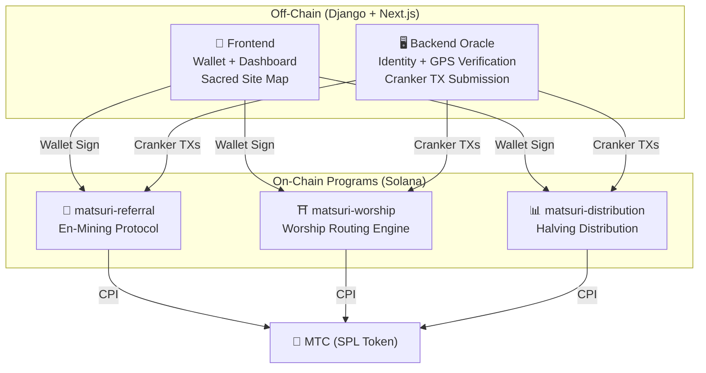
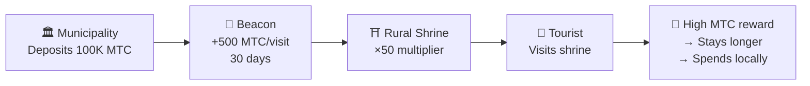
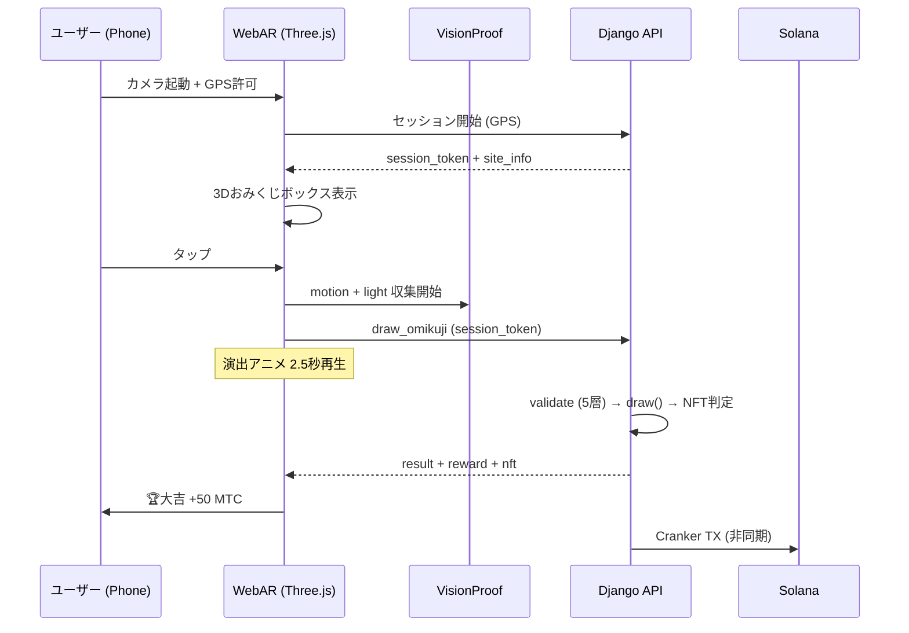

# ⚡ Smart Contracts — Open Source Architecture

> **Trustless by Design.**
> All reward logic, referral trees, and halving schedules are enforced **on-chain** via auditable Rust programs.
> Source code: [GitHub](https://github.com/matsuri-protocol/contracts)

---

## Overview

Matsuri deploys **three Anchor (Rust) programs** on Solana, each handling a distinct pillar of the ecosystem:



---

## 1. 📣 En-Mining (縁マイニング) Protocol

**Purpose:** A hybrid growth engine that rewards both *breadth* (referral reach) and *depth* (economic impact). Not just affiliates — a full mining protocol where real-world economic activity generates on-chain value.

### Scoring Formula

```
S_final = S_raw × M_toku × B_title

where:
  S_raw   = 0.30 × referrals + 0.70 × (volume / 10^9)
  M_toku  = f(staked_mtc) ∈ [1.0×, 10.0×]
  B_title = 1.0 + min(seasons_ranked × 0.05, 0.50)
```

| Component | Weight | Purpose |
| :--- | :---: | :--- |
| **Breadth** (referral count) | 30% | Network reach — how many people you bring |
| **Depth** (settlement volume) | 70% | Economic impact — real purchases, not just signups |
| **Toku Multiplier** | ×1–10 | Lock MTC to boost mining power |
| **Title Boost** | +5%/season | Permanent reward for consistent top performers |

### Toku (徳) Staking Tiers

| Staked MTC | Multiplier | Tier |
| :--- | :---: | :--- |
| 0 | 1.0× | — |
| 1,000+ | 1.5× | Bronze |
| 10,000+ | 3.0× | Silver |
| 100,000+ | 5.0× | Gold |
| 1,000,000+ | 10.0× | Diamond |

### En no Banzuke (季節ランキング)

Each season (epoch), top performers are ranked. Benefits:
- Top 10% earn **Evangelist** title (permanent SBT flag)
- Each season ranked grants **+5% mining boost** (cumulative, cap: 50%)

### Anti-Sybil Defence (3 Layers)

| Layer | Mechanism | Where |
| :--- | :--- | :--- |
| **Identity Gate** | X/Twitter OAuth + SMS | Off-chain (Django) |
| **On-chain Gate** | Only `is_verified = true` profiles earn | Smart Contract |
| **Depth Weighting** | 70% of score = real payments → bots earn nothing | Scoring Engine |

---

## 2. ⛩️ Worship Routing Engine (巡礼分散エンジン)

**Purpose:** The world's first **ReFi protocol that solves over-tourism using token economics.** Visit sacred sites → earn MTC. But here's the twist: *less-visited sites pay exponentially more.*

:::tip The Insight
This is "reverse Uber surge pricing" — crowded sites get penalized, frontier sites get boosted. Tourists route themselves to less-visited locations because **it's more profitable.**
:::

### 6-Layer Reward Formula

```
R_final = R_pioneer × M_dynamic × M_regional × M_streak × M_omikuji

where:
  R_pioneer  = daily_pool / visit_order     (harmonic 1/n decay)
  M_dynamic  = admin-controlled ∈ [0.1×, 50×]
  M_regional = tier_table[tier] ∈ {1×, 2×, 5×, 10×}
  M_streak   = 1.0 + min(days × 0.02, 0.50)
  M_omikuji  = fortune_lottery ∈ {1.0, 1.2, 1.5, 3.0}
```

### Layer 1: Pioneer Bonus (先行者利益)

Harmonic decay — the math that routes tourists:

| Visit Order | Reward vs 1st | Real Example (1000 MTC pool) |
| :---: | :---: | :--- |
| 1st | 100% | 1,000 MTC |
| 5th | 20% | 200 MTC |
| 10th | 10% | 100 MTC |
| 100th | 1% | 10 MTC |

> **First visitor = 100× more reward than 100th visitor.** This creates a powerful incentive to visit at off-peak times.

### Layer 2: Dynamic Multiplier (混雑分散)

Controlled in real-time by admins via the GCF Admin panel:

| Scenario | Multiplier | Effect |
| :--- | :---: | :--- |
| **Over-touristed** (Asakusa peak) | 0.1× | 90% reward penalty |
| **Normal** | 1.0× | Standard |
| **Under-visited** | 10× | 10× reward boost |
| **Frontier campaign** | 50× | Maximum incentive |

### Layer 3: Regional Tier

| Tier | Label | Multiplier | Examples |
| :---: | :--- | :---: | :--- |
| 0 | 🏙️ Major | 1× | 浅草寺, 清水寺, 伏見稲荷 |
| 1 | 🌆 Medium | 2× | 地方一宮, 県庁所在地の大社 |
| 2 | 🏞️ Rural | 5× | 田舎の歴史ある古社 |
| 3 | ⛰️ Hidden | 10× | 山奥の霊場, 離島の御嶽 |

### Layer 4: Streak Bonus

+2% per consecutive day, capped at +50%. Rewards regular visitors.

### Layer 5: 🎲 Omikuji Protocol

| Result | Probability | Multiplier |
| :--- | :---: | :---: |
| 🏆 **大吉** | 5% | 3.0× |
| ✨ **吉** | 15% | 1.5× |
| 🌸 **小吉** | 30% | 1.2× |
| 🍃 **末吉** | 35% | 1.0× |
| 💀 **凶** | 15% | 1.0× |

### Layer 6: Sponsored Beacons (B2B/B2G)

Municipalities, railway companies, and tourism boards can **deposit MTC** to create time-limited high-reward zones at specific sites.



> **B2B Revenue Model:** Sponsors pay MTC to route tourists. MTC buying pressure → token value. Win-win-win.

---

## 3. 📊 Halving Distribution

**Purpose:** The 550M MTC mining pool distributed over decades via a **2-year halving cycle** — faster than Bitcoin's 4-year cycle.

### Halving Schedule

```
Total Pool: 550,000,000 MTC

Epoch 0 (2027–2029):  275,000,000 MTC  (50%)
Epoch 1 (2029–2031):  137,500,000 MTC  (25%)
Epoch 2 (2031–2033):   68,750,000 MTC  (12.5%)
Epoch 3 (2033–2035):   34,375,000 MTC  (6.25%)
        ...              ...
∑ → 550,000,000 MTC (asymptotic total)
```

### Individual Reward Formula

```
your_reward = epoch_budget × (your_score / total_score)
```

All arithmetic uses **128-bit intermediate computation** — mathematically impossible to overflow.

### Performance Score Sources

| Activity | Score Weight |
| :--- | :--- |
| **Guide sessions conducted** | High |
| **Event ticket sales** | High |
| **Referral network activity** | Medium |
| **Worship mining visits** | Medium |
| **Media engagement** | Low |

:::info Permissionless Epoch Advancement
The `advance_epoch` instruction can be called by **anyone** — no admin needed. The system clock determines when epochs transition, ensuring trustless operation even if the team disappears.
:::

---

## Math Modules (Open Source Core)

Both programs separate all scoring/reward math into **pure, auditable `math.rs` modules** with:

- **Zero side effects** — no I/O, no allocations, no external calls
- **Documented formulas** — LaTeX-style notation in rustdoc
- **Overflow analysis** — u128 intermediate values with proven bounds
- **Comprehensive tests** — edge cases, boundary conditions, ratio verification

```rust
// Example: Pioneer Bonus (from worship/math.rs)
#[inline]
pub fn pioneer_reward(daily_pool: u64, visit_order: u32) -> u64 {
    if visit_order == 0 { return 0; }
    (daily_pool as u128 / visit_order as u128) as u64
}
```

---

## 4. 🎴 AR Mining — WebAR おみくじマイニング

**Purpose:** スマホのブラウザだけで現実空間にARおみくじを出現させ、MTCをマイニングする体験。アプリDL不要。神道の精神性と最先端技術が融合した世界初のWebAR×ブロックチェーンインフラ。

### アーキテクチャ



### Optimistic UI（待ち時間ゼロ）

| ステップ | 時間 | 処理 |
|---------|------|------|
| タップ → 演出開始 | 0ms | フロントで即座にアニメ再生 |
| API draw_omikuji | ~50ms | Django で抽選 + NFT判定 |
| 演出完了 | 2500ms | 結果確定済み → 表示 |
| Solana TX | ~400ms | バックグラウンドで送信 |

### おみくじ確率設定 (GCF Admin)

Basis Points (10000 = 100%) で0.01%刻みの精密制御。

| 等級 | デフォルト | 報酬倍率 | NFT |
|------|-----------|---------|-----|
| 🏆 大吉 | 5.00% (500bp) | ×3.0 | ✅ |
| ✨ 吉 | 15.00% (1500bp) | ×1.5 | 任意 |
| 🌸 小吉 | 30.00% (3000bp) | ×1.2 | — |
| 🍃 末吉 | 35.00% (3500bp) | ×1.0 | — |
| 💀 凶 | 15.00% (1500bp) | ×1.0 | — |

### ZK-Proof of Vision（5層検証）

GPS偽装・リプレイ攻撃を多層で排除。プライバシー保護のため画像データは送信しない。

| Layer | 検証内容 | 配点 |
|-------|---------|------|
| Temporal | セッション時間 5-120秒 | /20 |
| Motion | ジャイロ分散 0.005-0.5 (手持ち自然度) | /20 |
| Light | 環境光×時間帯整合性 | /20 |
| HMAC | proof_hash 署名検証 | /20 |
| Fingerprint | デバイス一意性 | /20 |
| **合計** | **PASS 閾値** | **60/100** |

### 報酬計算式

```
Reward = Base(10 MTC) × SiteMultiplier × OmikujiMult × TierMult

TierMult = { メジャー: 1.0, 中規模: 2.0, 地方: 5.0, 秘境: 10.0 }
```

---

## Security Model (Open Source)

These contracts are **fully open source.** Security relies on mathematical guarantees, not obscurity.

| Principle | Implementation |
| :--- | :--- |
| **PDA-Only Vaults** | Token vaults are controlled by Program Derived Addresses — no human key can drain them |
| **Checked Arithmetic** | Every computation uses `checked_*` operations — overflow is impossible |
| **Authority Separation** | Admin (multisig) ≠ Cranker (limited ops) ≠ User (self-custody) |
| **Emergency Pause** | Admin can pause all programs instantly; cannot steal funds |
| **Immutable Tokenomics** | Halving factor, total pool, and epoch duration are set once and cannot be changed |
| **Pure Math Modules** | Scoring/reward logic separated into auditable, testable math libraries |
| **Vision Proof** | 5-layer anti-spoofing without transmitting camera data (privacy-preserving) |

---

**[◀ Back to Roadmap](/docs/roadmap)** ｜ **[View Source Code](https://github.com/matsuri-protocol/contracts)**

