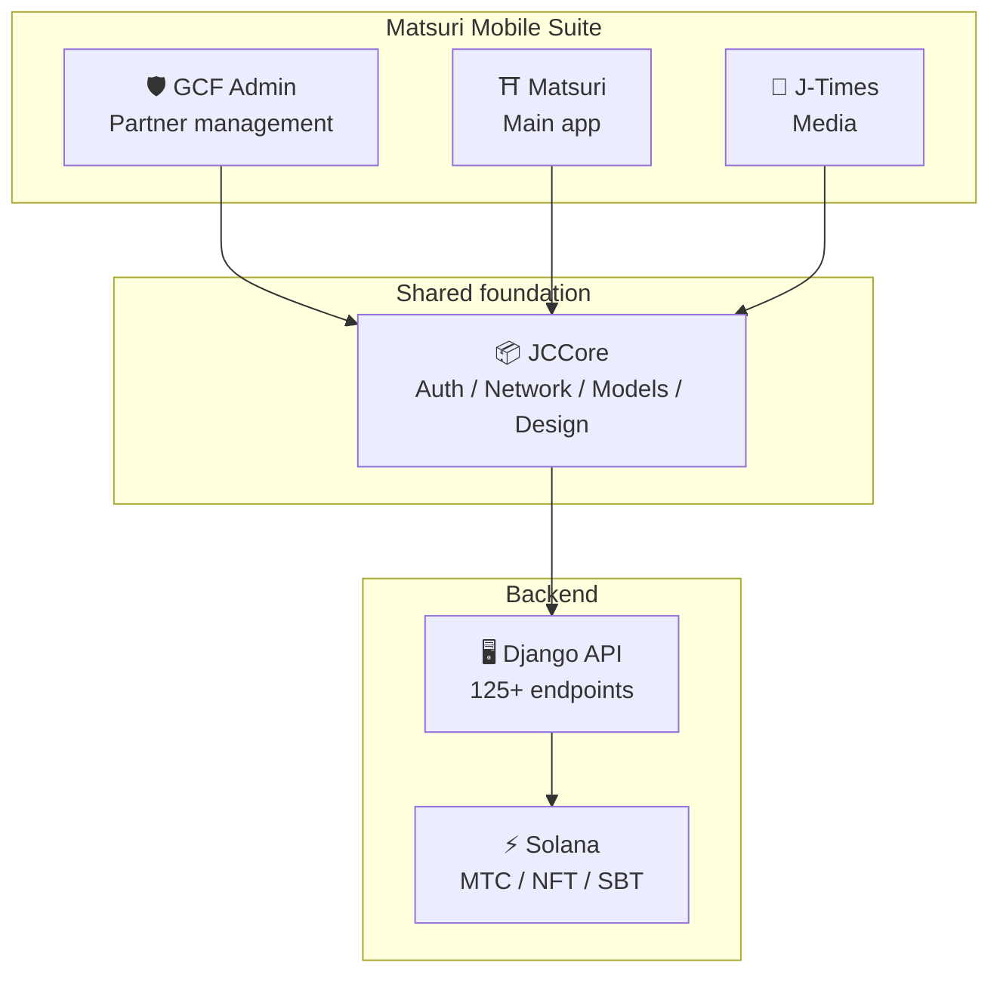
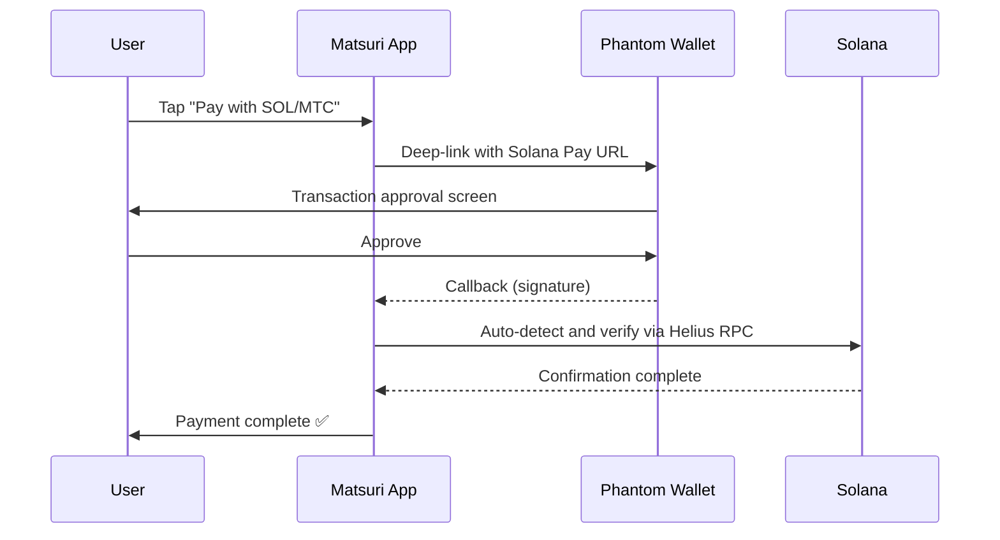
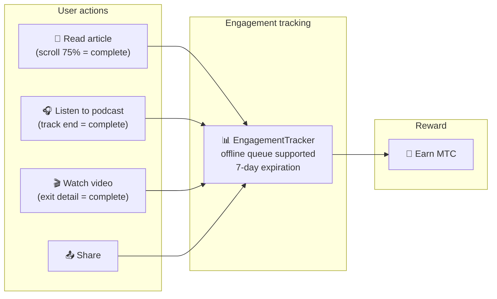
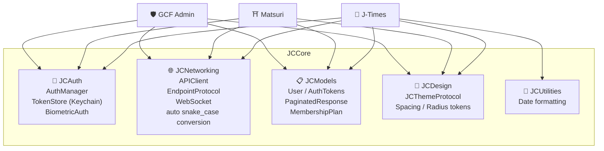
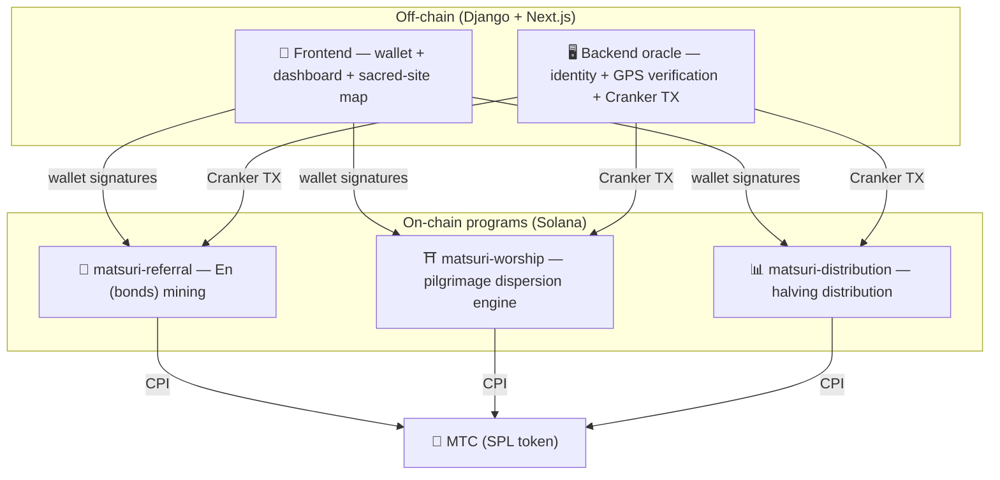
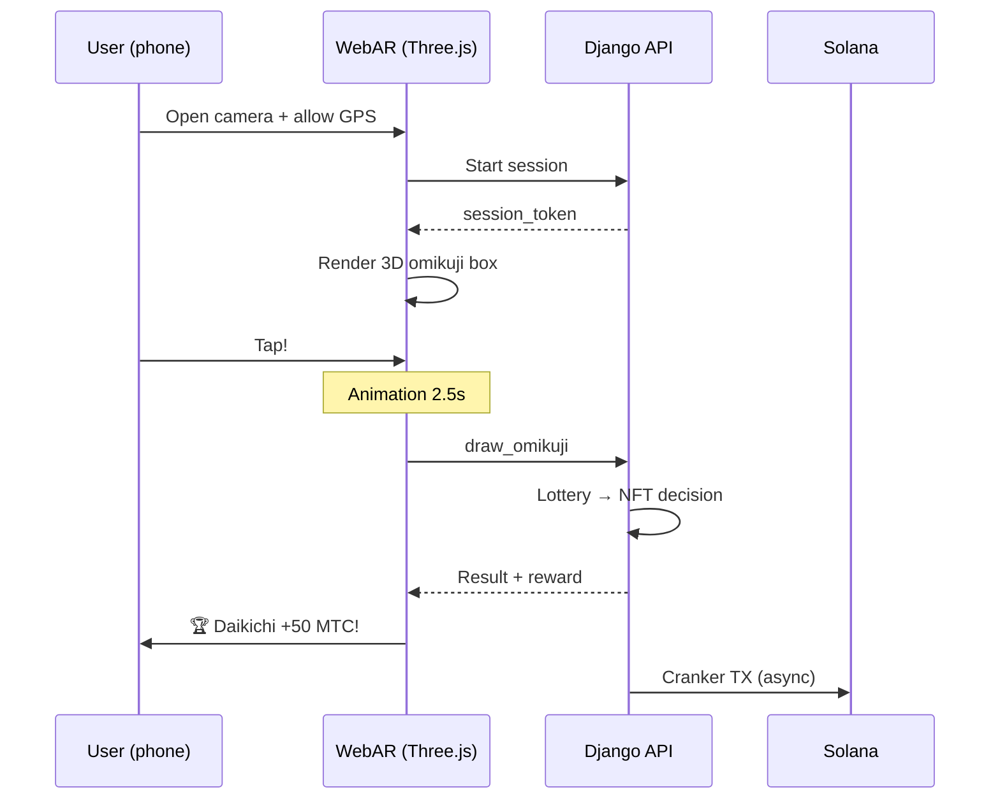

# 🔧 Product & technology — what's running proves everything

> **What's running proves everything.**
> Our mission is not words alone. The web platform is already live, and the iOS apps are in the final stage.

The web app and admin dashboard are **in production**. Three native iOS apps have been completed and are scheduled for release in April 2026. The smart contracts on Solana are open source — we speak not in concepts, but in **running code and a product about to land.**

---

## App overview

| App | Purpose | Status | Supported languages |
| :--- | :--- | :---: | :--- |
| **GCF Admin** | Partner management and operational tooling | ✅ Released | 🇯🇵🇬🇧🇨🇳🇹🇭🇳🇴 |
| **Matsuri** | Main consumer app | 🔜 April 2026 | 🇯🇵🇬🇧🇨🇳🇹🇭🇳🇴 |
| **J-Times** | Culture media and learning | 🔜 April 2026 | 🇯🇵🇬🇧 |

---

## 1. 🛡️ GCF Admin — partner management app

:::info Status: released on the App Store (v1.0)
An operational management app for GCF (Global Community Friends) members. All the functionality of the web admin screen, consolidated on mobile.
:::

  
  
  

### What the app can do

| Category | Features |
| :--- | :--- |
| **📊 Dashboard** | KPI cards, revenue charts, quick actions |
| **👥 Member management** | List, details, editing, tier management |
| **💰 Revenue management** | Commission tracking, MTC withdrawal management, payout management |
| **📝 Content management** | Create, edit, and publish events, articles, podcasts, and videos |
| **🎫 Guide slots** | Manage guide slots and track revenue |
| **🖼️ NFT dashboard** | Founder's Collection, on-chain verification, NFT transfers |
| **⛩️ Sacred-site management** | Site CRUD, beacon configuration |
| **🎲 AR mining configuration** | Omikuji probability tables, reward parameter management |
| **📊 Analytics** | Error reports, usage analytics |
| **🔗 Referrals** | Custom QR code generation, referral program management |

### Technical spec

| Item | Detail |
| :--- | :--- |
| **Architecture** | Clean Architecture + MVVM + `@Observable` (iOS 17) |
| **Language / SDK** | Swift 6.0 / Xcode 16+ / iOS 17.0+ |
| **API integration** | 125+ endpoints |
| **Tests** | 226 tests / 45 test classes |
| **Localization** | 5 languages (JP/EN/CN/TH/NO) / 957+ translation keys |
| **Swift Concurrency** | Strict Concurrency compliant / zero build warnings |

### QR code integration

GCF Admin can generate Matsuri-branded custom QR codes. Versatile use cases — event invitations, referral links, payment requests, and more.

---

## 2. ⛩️ Matsuri — main app

:::info Status: scheduled for release in late April 2026 (v3.0)
The main app for regular users. Event booking, payment, Web3 wallet, AR mining — everything completes in a single app.
:::

  
  
  

### What the app can do

| Category | Features |
| :--- | :--- |
| **🎪 Event booking** | Search, booking, Stripe payment, ticket QR management |
| **💳 Four payment methods** | Credit card / saved card / MTC balance / crypto (SOL/MTC) |
| **👛 Web3 wallet** | MTC balance view, send/receive, transaction history |
| **🖼️ NFT gallery** | List of held NFTs/SBTs, on-chain verification |
| **🗺️ Sacred-site map** | Map view of shrines and temples, check-ins |
| **🎲 AR mining** | WebAR omikuji experience, earn MTC |
| **💬 Chat** | Messaging with context menus |
| **⭐ Wishlist** | Save favorite events and experiences |
| **🔍 Advanced search** | Voice search supported |
| **🤝 Referrals** | Join the referral program, track rewards |
| **📊 GCF dashboard** | Lightweight admin view for GCF members |

### Phantom Wallet integration — zero-input crypto payments

>**No copy-paste of addresses required.** Phantom Wallet launches automatically and the payment completes with a single approval. The transaction signature is auto-detected through Helius RPC.

### Technical spec

| Item | Detail |
| :--- | :--- |
| **Architecture** | Clean Architecture + MVVM + Swift Concurrency |
| **Language / SDK** | Swift 6.0 / Xcode 16+ / iOS 17.0+ |
| **Payments** | Stripe PaymentSheet + MTC Balance + Phantom (Solana Pay) |
| **API integration** | 72 endpoints / 16 categories |
| **Tests** | 230+ (Model, ViewModel, Network, Security, DeepLink, E2E) |
| **Localization** | 5 languages (JP/EN/CN/TH/NO) / 406 translation keys |
| **ViewModels** | 25 (fully MVVM — zero direct API calls from Views) |
| **Authentication** | Apple Sign In / Google Sign In (PKCE) |

---

## 3. 📰 J-Times — culture media app

:::info Status: scheduled for release in late April 2026
A media platform that conveys the depths of Japanese culture. Read articles, listen to podcasts, watch videos — every action earns MTC.
:::

  

### What the app can do

| Category | Features |
| :--- | :--- |
| **📖 Articles** | Parallax hero, drop caps, reading progress bar, rich content (Markdown, tables, quotes) |
| **🎧 Podcasts** | Series browsing, waveform player, sleep timer, AirPlay, lock-screen controls |
| **🎬 Video** | Adaptive grid/list view, short-form video (TikTok-style, double-tap) |
| **🔍 Search** | Multi-filter, trending tags, voice search |
| **🧭 Discovery** | Feature carousel, staff picks, weekly top |
| **📚 Library** | Favorites, history (by date), downloads, playlists |
| **🎵 Audio player** | Mini player (swipe-controlled), full player (waveform, lyrics, repeat) |
| **👤 Membership** | Feature comparison across 3 tiers (Free / Premium / Pro), purchase restoration |

### Media Mining — reading, listening, and watching as mining

>**Recorded even offline.** Read an article at a mountain shrine where no signal reaches — when the network comes back, engagement is auto-submitted and MTC is credited.

### Design system — the "four pillars" of Japanese aesthetics

J-Times uses an original design system that brings traditional Japanese aesthetics into a modern UI.

| Pillar | Concept | UI application |
| :--- | :--- | :--- |
| **墨 (sumi — ink)** | Warm neutral grey | Background, text hierarchy |
| **朱 (shu — vermilion)** | Japanese red (#C53030) | Accent color, important actions |
| **間 (ma — space)** | Negative space on a 4pt grid | Spacing, breathing room |
| **紙 (kami — paper)** | Subtle texture, glassmorphism | Card surfaces, depth |

### Technical spec

| Item | Detail |
| :--- | :--- |
| **Architecture** | Clean Architecture + MVVM + Swift Concurrency |
| **Language / SDK** | Swift 6.0 / Xcode 16+ / iOS 17.0+ |
| **External dependencies** | **Zero** — Apple first-party frameworks only |
| **API integration** | 40+ endpoints |
| **Tests** | 371 tests / 20 files |
| **Localization** | 2 languages (JP/EN) / 310+ translation keys |
| **Offline support** | ContentCache (50MB) + ImageDiskCache (200MB) + download manager |
| **Authentication** | Apple Sign In / Google Sign In (PKCE) |

---

## Shared foundation: the JCCore library

A Swift Package library shared across all three apps.

| Module | Role |
| :--- | :--- |
| **JCAuth** | Keychain-based token management, biometric auth (Face ID / Touch ID) |
| **JCNetworking** | Type-safe API client, WebSocket, automatic JSON snake_case conversion |
| **JCModels** | Common data models across apps (User, AuthTokens, etc.) |
| **JCDesign** | Theme protocol, design tokens (spacing, corner radius) |
| **JCUtilities** | Date and string utilities |

---

## Security and privacy

| Item | Implementation |
| :--- | :--- |
| **Auth tokens** | Encrypted and stored in iOS Keychain (TokenStore) |
| **Biometric auth** | Two-factor via Face ID / Touch ID |
| **API communication** | HTTPS + certificate pinning |
| **Wallet private key** | Never stored in-app — delegated to Phantom Wallet |
| **AR mining** | Camera images are not sent to the server (VisionProof) |
| **Offline data** | SwiftData encryption + automatic expiration |
| **Swift Concurrency** | Actor isolation prevents race conditions |

---

## Development quality

### Mobile apps: **827+ automated tests** across the three apps.

| App | Tests | Coverage area |
| :--- | :---: | :--- |
| **GCF Admin** | 226 | Model, ViewModel, Repository, API, Localization, Navigation |
| **Matsuri** | 230+ | Model, ViewModel, Network, Security, DeepLink, Regression, Performance, E2E |
| **J-Times** | 371 | Model, ViewModel, API, Repository, Navigation, Localization, Security, Performance |

### Smart contracts: tests expanding in stages

For the Rust programs on Solana, we have started with unit tests for the core logic (the math modules), and are expanding test coverage in stages in preparation for the security audit (Q2–Q3 2026).

---

## Smart contracts — open-source design

>**A trustless design philosophy.**
> Reward calculation, referral trees, halving schedule — every piece of logic runs **on-chain** and is auditable by anyone.
> Source: [GitHub](https://github.com/Cootakahashi/matsuri-contracts)

---

### Contributors

| Member | Role |
| :--- | :--- |
| **Ko Takahashi** | Founder / Lead Developer — architecture, smart contracts, full-stack development |

> 🌏**Going forward, GCF members and a worldwide developer community will also join the co-development effort.**
> As "culture infrastructure" built to last, Matsuri Protocol is built on transparency and co-ownership.

---

### Overall structure

Matsuri deploys **three Anchor (Rust) programs** on Solana, each carrying one of the ecosystem's pillars.

---

### 1. 📣 En-Mining (縁 — bonds / connection)

**Purpose:** A hybrid growth engine that rewards both "breadth" (referral network) and "depth" (economic impact). Not simple affiliate marketing, but a complete mining protocol where real-world economic activity generates on-chain value.

#### Scoring design

The contribution score is based on two weighted components:

| Component | Weight | Purpose |
| :--- | :---: | :--- |
| **Breadth** (number of referrals) | 30% | Network reach — how many people you brought |
| **Depth** (payment volume) | 70% | Economic impact — real purchases, not just sign-ups |

Scores accumulate over time and are converted to MTC at each halving epoch. Additional boost mechanisms are planned:

| Boost | Description | Status |
| :--- | :--- | :---: |
| **Toku (徳 — virtue) staking** | Lock MTC to boost contribution score (up to ~50% boost). Tiers and exact multipliers are calibrated against the halving pool release schedule | ⬜ Coefficients TBD |
| **Season ranking** | Top performers of each epoch earn the **Evangelist** title (permanent SBT) and a score boost. Exact rates determined by governance | ⬜ Coefficients TBD |

:::info Progressive parameter design
Boost coefficients (staking tiers, ranking bonuses) are intentionally adjustable. They will be finalized and locked into smart contracts based on actual ecosystem data — total active users, halving pool release rate, price stability goals. This approach guarantees **fair distribution** without over-promising fixed returns.
:::

#### Anti-sybil defense (three layers)

| Layer | Mechanism | Location |
| :--- | :--- | :--- |
| **Identity gate** | X/Twitter OAuth + SMS | Off-chain (Django) |
| **On-chain gate** | Only profiles with `is_verified = true` earn rewards | Smart contract |
| **Depth weighting** | 70% of score = real payments → bots earn nothing | Scoring engine |

---

### 2. ⛩️ Pilgrimage dispersion engine (Worship Routing Engine)

**Purpose:** The world's first **ReFi protocol** that solves overtourism using token economics. Visit sacred sites to earn MTC. The critical twist: *the fewer the visitors at a site, the exponentially more reward you get.*

:::tip Core insight
"Inverse Uber surge pricing" — crowded sites are penalized, frontier sites are boosted. Tourists voluntarily move toward less-visited places **because they are more profitable.**
:::

#### Reward design principles

The contribution score for each visit is determined by multiple factors:

| Factor | Principle | Effect |
| :--- | :--- | :--- |
| **Site popularity** | Fewer visitors = higher score | Disperse tourists away from crowded areas |
| **Visit timing** | Earlier visitors on a given day earn more | Encourage off-peak visits |
| **Regional tier** | Regional and frontier sites rank highest | Drive regional revitalization |
| **Visit frequency** | Regular visitors accumulate bonus score | Reward ongoing engagement |
| **Omikuji fortune** | Random bonus draw per check-in | Fun gamification element |
| **Sponsored boost** | Municipalities can boost specific sites | B2B/B2G revenue model |

:::info Coefficients are adjustable
The exact multipliers for each factor (for example, how much more a regional site earns than a major site) are tuned based on the **halving pool schedule** and real usage data, and locked into smart contracts in stages. The design principles are fixed — the coefficients evolve with the ecosystem.
:::

---

### 3. 📊 Halving distribution

**Purpose:** Inspired by Bitcoin's halving schedule, MTC distribution automatically halves per epoch. Mathematically guaranteed scarcity.

| Instruction | Description |
| :--- | :--- |
| `initialize` | Initialize the distribution pool |
| `register_miner` | Register a miner |
| `update_score` | Update a score |
| `advance_epoch` | Advance the epoch (execute halving) |
| `claim_distribution` | Claim distribution reward |

---

### 4. 🎴 AR mining — WebAR omikuji experience

**Purpose:** Make an AR omikuji appear in real space, using only a phone browser, and mine MTC through it. **No app download required.** The world's first WebAR × blockchain infrastructure, fusing Shinto spirituality with cutting-edge technology.

#### Architecture

#### Omikuji probability configuration (GCF admin)

Basis Points (10000 = 100%) with 0.01% precision. Adjustable from the GCF admin screen.

| Grade | Rarity | Bonus | NFT |
|------|-----------|---------|-----|
| 🏆 Daikichi | Rare | Max bonus | ✅ |
| ✨ Kichi | Uncommon | High bonus | Optional |
| 🌸 Shōkichi | Common | Small bonus | — |
| 🍃 Suekichi | Common | Participation record | — |
| 💀 Kyō | Uncommon | Participation record | — |

Probabilities and reward coefficients will be finalized in stages based on ecosystem size and halving release amounts, and implemented in smart contracts.

#### ZK-Proof of Vision (5-layer security)

Eliminates GPS spoofing and replay attacks in multiple layers. **To protect privacy, camera images are never sent to the server.**

| Layer | What is verified | Weight |
| :--- | :--- | :--- |
| Temporal | Session time 5–120s | /20 |
| Motion | Gyro naturalness (hand-held vibration detection) | /20 |
| Light | Ambient light × time-of-day consistency | /20 |
| HMAC | proof_hash signature verification | /20 |
| Fingerprint | Device uniqueness | /20 |
| **Total** | **60/100 or above = PASS** | |

#### Reward design

Rewards are recorded as a **contribution score** based on multiple factors including site type, omikuji outcome, and regional tier. Specific coefficients are finalized in stages aligned with the halving release schedule and ecosystem growth, and implemented in smart contracts.

---

### Pure math modules (auditable core logic)

Every program isolates scoring and reward calculation into a **pure, auditable `math.rs` module:**

- **Zero side effects** — no I/O, no memory allocation, no external calls
- **Documented formulas** — LaTeX-style notation inside rustdoc
- **Overflow analysis** — u128 intermediates with proven ranges
- **Comprehensive tests** — edge cases, boundary conditions, ratio verification
- **Adjustable coefficients** — reward parameters are designed to be updatable through governance, allowing staged calibration as the ecosystem grows

---

### Security model

These contracts are **fully open source.** Security is based on mathematical guarantees, not opacity.

| Principle | Implementation |
| :--- | :--- |
| **PDA-only vaults** | Token vaults are controlled by PDAs (program-derived addresses) — no human key can withdraw |
| **Checked arithmetic** | All calculations use `checked_*` arithmetic — overflow is impossible |
| **Separation of authority** | Admin (multisig) ≠ Cranker (limited actions) ≠ User (self-custody) |
| **Emergency pause** | Admin can pause the program only in response to a security threat. But **no movement or seizure of funds is possible** — pause is a "shield to protect," not a way to change the rules |
| **Immutable tokenomics** | Halving rate, total pool, and epoch length cannot be changed after initial configuration |
| **Pure math modules** | Reward/scoring logic lives in a separate, testable math library |
| **Vision Proof** | 5-layer spoof detection that never transmits camera data (privacy-preserving) |

---

**[▶ Next: Roadmap & team](/docs/roadmap)** | **[◀ Previous: Tokenomics](/docs/tokenomics)**
