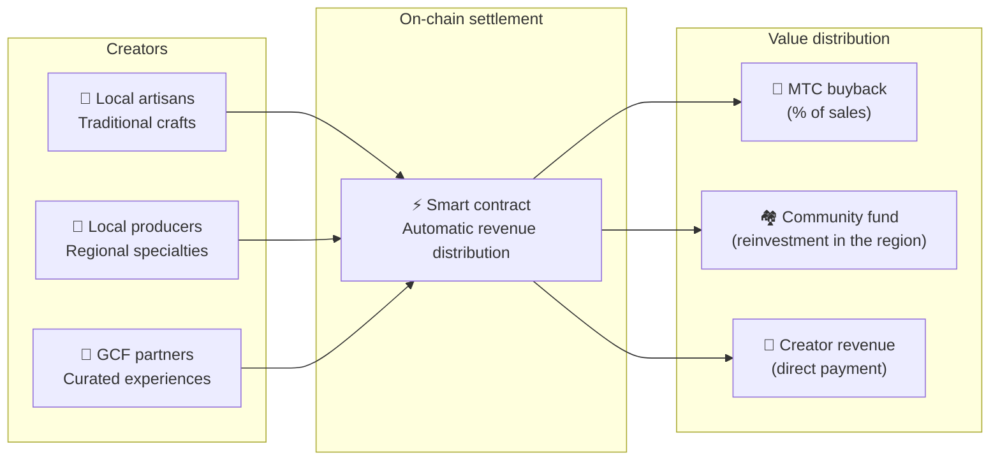

# 🗓️ Roadmap & team

>**To those who have read this far — the vision, the economic design, and the technical foundation are all in place.**
> We are not a short-term speculative project.
>**The main platform development is already complete,** and we are entering the phase of scaling it up.

---

## Strategic milestones

### 🔥 Phase 1: Awakening (first half of 2026 — now)

**Theme: foundation and cash flow**

The web platform is live. The iOS apps (Matsuri, J-Times) are scheduled for release in April 2026. We focus on monetization through a CEO-led financial system and on securing early liquidity.

| Status | Milestone | Detail |
| :---: | :--- | :--- |
| ✅ | **Web platform live** | Matsuri web app and GCF admin dashboard (web) are up and running |
| ✅ | **Payments and growth** | MTC payment function and referral airdrop function implemented |
| ✅ | **Media launch** | J-Times (web & podcast) distribution base built |
| ✅ | **Genesis** | MTC token issued on the Solana chain |
| ✅ | **Liquidity secured** | Initial liquidity pool on Raydium created |
| ⬜ | **Incentives begin** | Launch of liquidity mining with target 20% APY |
| ⬜ | **On-chain payments** | Solana Pay verification goes to production |
| ⬜ | **VIP recruitment** | Selection of the initial 20 GCF VIP members complete |

### 🚀 Phase 2: Expansion (second half of 2026)

**Theme: real assets and adventure mining**

We fully leverage the completed webapp, expanding physical bases and the "pilgrimage" feature.

| Status | Milestone | Detail |
| :---: | :--- | :--- |
| ⬜ | **New feature release** | Adventure mining (pilgrimage) implementation and release |
| ⬜ | **Overseas expansion** | Partner base development in Asia (Thailand, Taiwan, etc.) & VIP events |
| ⬜ | **Asset management** | Build a portfolio of real estate, equities, and crypto |
| ⬜ | **Target** | Ecosystem-wide asset scale of **¥1 billion (~$6.5M)** |

### 🌊 Phase 3: Circulation (2027 onward)

**Theme: mass adoption, co-creation economy, decentralization**

Open to the public, on-chain marketplace, and full ecosystem operation.

| Status | Milestone | Detail |
| :---: | :--- | :--- |
| ⬜ | **Grand opening** | Matsuri App worldwide official release |
| ⬜ | **Great unlock (2027/6/1)** | Founder lockup unlock + mining pool (550M) activates + halving cycle begins |
| ⬜ | **Co-creation marketplace** | Regional specialty shops + GCF partner stores — on-chain payments with automatic MTC buyback |
| ⬜ | **Crowdfunding (NFT rights)** | Users fund cultural projects on Solana. Backers receive NFTs representing ownership, revenue share, and governance rights |
| ⬜ | **On-chain payments** | All marketplace transactions settled by smart contract — a fixed percentage of sales is automatically routed to the MTC buyback pool |
| ⬜ | **Target** | Ecosystem-wide asset scale of **¥10 billion (~$65M)** |
| ⬜ | **DAO transition** | Gradually transfer decision-making authority to the GCF community |

#### 🏪 The co-creation marketplace concept

The ultimate expression of the "cultural OS" — a decentralized marketplace where **culture creators and culture lovers transact directly**, without extractive intermediaries.

| Feature | Description | Status |
| :--- | :--- | :---: |
| **🏺 Regional specialty shop** | Artisans and local producers sell directly to customers worldwide. 5–10% discount when paying in MTC | ⬜ Concept |
| **🎫 Crowdfunding + NFT rights** | Fund cultural projects (shrine restoration, festival revival, artisan workshops). Receive NFTs that prove your contribution and may confer revenue share or governance rights | ⬜ Concept |
| **⚡ On-chain settlement** | Every marketplace transaction settles via a Solana smart contract. Revenue auto-splits: creator payment + community fund + MTC buyback — no manual bookkeeping required | ⬜ Concept |
| **🗳️ Backer governance** | NFT holders vote on how their funded projects allocate resources — not mere donation, but real co-creation | ⬜ Concept |

:::info Why this matters
Today, tourists buy souvenirs from shops that pay "rent" to their landlord — the platform. Tomorrow, **a rural artisan in Kyoto will sell directly to a fan in Copenhagen**, and a portion of that sale will automatically strengthen the MTC economy. This is the flywheel in its most complete form.
:::

---

## 👤 Team

### Ko Takahashi — founder / CEO & lead architect

| Item | Detail |
| :--- | :--- |
| **Role** | Overall project leadership. Platform design, smart contracts, full-stack development |
| **Vision** | Advocate of the "cultural OS" that "exports culture and imports wealth" |
| **Stance** | Writes the code himself and stands on the ground himself (Golden Gai) — a practitioner of "skin in the game" |

### Jon Anders Jensen — director / GCF & event operations

| Item | Detail |
| :--- | :--- |
| **Role** | Oversees GCF community operations. Designs the operations of events and tours and leads them on the ground |
| **Strengths** | Supports the "human" flow of the ecosystem through an international perspective and trusted relationships with GCF members |

### Ryunosuke Honda — director / regional culture ambassador

| Item | Detail |
| :--- | :--- |
| **Role** | The bridge between regional cultures and communities across Japan and the Matsuri ecosystem |
| **Strengths** | Discovers regional cultural assets and brings them onto the Matsuri platform to deliver "Deep Japan" experiences |

### 🌏 GCF community — development members spread around the world

Matsuri Protocol is not built by the founding team alone.
**GCF members around the world** contribute to the protocol's evolution through testing, feedback, translation, and regional deployment.

| Area | Structure |
| :--- | :--- |
| **💼 Global finance** | Partnerships with private investor networks across Asia |
| **⚙️ Engineering** | A distributed engineering team across blockchain and mobile app development |
| **🏮 Operations** | Strong pipelines with local communities in Shinjuku Golden Gai and major tourist destinations |
| **🌐 Community** | A multinational GCF member base including Japan, Norway, Thailand, and Taiwan |

:::tip Cultural infrastructure we build together
If you join GCF, you too become a co-developer of Matsuri Protocol.
Writing code isn't the only form of contribution. Introducing sacred sites in your area, translating documentation, planning events —
all of it is power that carries this protocol to the world.
:::

---

## 🏛️ Governance (DAO)

Matsuri Protocol migrates gradually from centralization to a **DAO (decentralized autonomous organization)**.
GCF members (Platinum / Gold) will eventually hold **voting rights** over the following key matters.

| Vote item | Content |
| :--- | :--- |
| **💰 Fund allocation** | Which new businesses and marketing to invest business revenue in |
| **⚙️ Protocol updates** | Fine-tuning app fee rates and mining reward rates |
| **⛩️ Cultural accreditation** | Which festivals and shrines to accredit as "official pilgrimage sites" and financially support |

:::info Join the revolution
We are not just building an app.
We are building a **borderless cultural economy.**
:::

---

**[◀ Previous: Product & technology](/docs/product-tech)** | **[⛩️ Back to whitepaper top](/docs/intro)**
