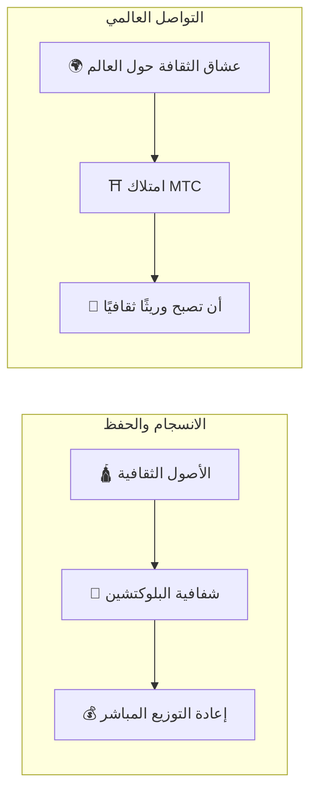

# ⛩️ مرحبًا بكم في Matsuri Coin

> **شفرة من أجل الانسجام. قيمة من أجل السلام.**
> جسر «Wa» في عالم منقسم. MTC هو البوصلة التي تقود من التنافس إلى الإبداع المشترك.

**Matsuri Coin (MTC)** هو رمز خدمي لامركزي مبني على بلوكتشين Solana.
صُمِم كـ **«نظام تشغيل ثقافي»** يربط الإرث الروحي لليابان — «اليابان العميقة» — بالاقتصاد العالمي.

نحن لا نبني مجرد نظام دفع.
نحن نبني **جسرًا بين اليابان والعالم** — إطار عمل جديد للإبداع المشترك يجمع عشاق الثقافة عبر الحدود.

---

## 🎯 مهمتنا

:::info توجيه ¥10 تريليون من طاقة السوق نحو مستقبل الثقافة
سوق السياحة الوافدة في اليابان ينمو نحو **¥10 تريليون** سنويًا.
لكن وراء هذه الأرقام تختبئ **حقيقة مزعجة**.
:::

### المشاكل التي لا يتحدث عنها أحد

| المشكلة | الواقع |
| :--- | :--- |
| 💸 **تسرب الإيرادات** | معظم الإيرادات تتسرب إلى الخارج كعمولات لوكالات السفر الإلكترونية والوسطاء الأجانب |
| 😤 **إرهاق المجتمعات** | السياحة المفرطة تملأ المجتمعات بالحشود دون أن تعود الإيرادات إلى السكان المحليين |
| 🚧 **جدار التجربة** | الجولات السياحية المُعلبة لا تلامس سوى السطح — المسافرون لا يصلون أبدًا إلى *اليابان الحقيقية* |

> **«اليابانيون يعانون، والمسافرون لا يرون إلا واجهة، والثروة تتبخر في رسوم المنصات.»**

نستخدم Web3 لتفكيك هذا النظام المعطوب.
مدفوعاتك تصل إلى المجتمعات المحلية وحفظ التراث **مباشرةً** — بشفافية كاملة ودون وسيط.

---

## 🏗️ النموذج الهجين: ثقافة × تكنولوجيا

معظم مشاريع الكريبتو تلاحق الربح فقط وتعامل الثقافة كسلعة استهلاكية.
MTC يقلب المعادلة: نبني **«اقتصادًا يحمي الثقافة»** — الهيكل الهجين الذي كان ينبغي أن يوجد منذ البداية.

| الركيزة | المعنى |
| :--- | :--- |
| **🛕 الانسجام والحفظ** | مدفوعات السياح تتدفق عبر البلوكتشين مباشرةً إلى حفظ التراث ودعم الحرفيين. المجتمعات (GCF) تحتفظ بالسيادة على إرثها |
| **🌍 التواصل العالمي** | بنية تحتية تتيح لأي شخص في أي مكان دعم روح «Wa» اليابانية. امتلاك MTC يعني المشاركة في تاريخ اليابان الحي |

---

## 💎 لماذا تستخدم MTC؟

نظام MTC البيئي يوفر للمشاركين **إثراءً روحيًا** و**عوائد اقتصادية ملموسة** في آنٍ واحد.

### ✨ القيمة التجريبية

| الفائدة | التفاصيل |
| :--- | :--- |
| **🎌 تجارب ذات معنى** | افتح أبواب «اليابان العميقة» — مناطق مقدسة مغلقة أمام العامة، طقوس خاصة في المعابد، فعاليات ثقافية بدعوة فقط |
| **🌐 رابطة مدى الحياة** | ابقَ على اتصال باليابان عبر MTC حتى بعد عودتك إلى بلدك |
| **⚖️ تجارة عادلة** | العقود الذكية تزيل الوسطاء. مدفوعاتك تصل مباشرةً إلى من يستحقها |

### 💰 المزايا الاقتصادية

| الفائدة | التفاصيل |
| :--- | :--- |
| **🏷️ أسعار تفضيلية** | ادفع بـ MTC ووفّر **5-10%** مقارنة بسعر الين. مثال: جولة بـ ¥30,000 ← ~¥27,000 |
| **🔑 وصول حصري** | تذاكر NFT لأماكن «بدعوة فقط» وفعاليات محدودة — لحاملي MTC فقط |
| **🛡️ تحوّط من العملة** | ثبّت قيمة تجربتك قبل السفر — بلا قلق من تقلبات أسعار الصرف |

---

## ⚡ لماذا Solana؟

لخدمة كل من «الطلب السياحي الحقيقي» و«التداول عالي التردد»، لم يكن هناك سوى **بلوكتشين واحد قابل للتطبيق**.

| المقارنة | Ethereum | Solana |
| :--- | :---: | :---: |
| **رسوم المعاملة** | ¥100-¥1,000+ | **~¥0.04** |
| **سرعة الإنهاء** | 12 ثانية – دقائق | **0.4 ثانية** |
| **الإنتاجية** | ~15 معاملة/ثانية | **آلاف المعاملات/ثانية** |

:::tip اختبار صندوق التبرعات
دفعة صغيرة بحجم «إلقاء ¥100 في صندوق التبرعات بالمعبد» تتطلب رسومًا **أقل من ¥1**. Solana وحدها تجتاز هذا الاختبار.
:::

---

:::note جاهزون للانطلاق
MTC تنهي عصر السياحة التي تكتفي بـ *استهلاك* الثقافة. مرحبًا برحلة **الإبداع المشترك** — لنبنِ المستقبل معًا.
:::

**[▶ الرؤية: لماذا الآن؟](/docs/vision)** ｜ **[▶ انضم إلى GCF (عضوية VIP)](/docs/economy)**
