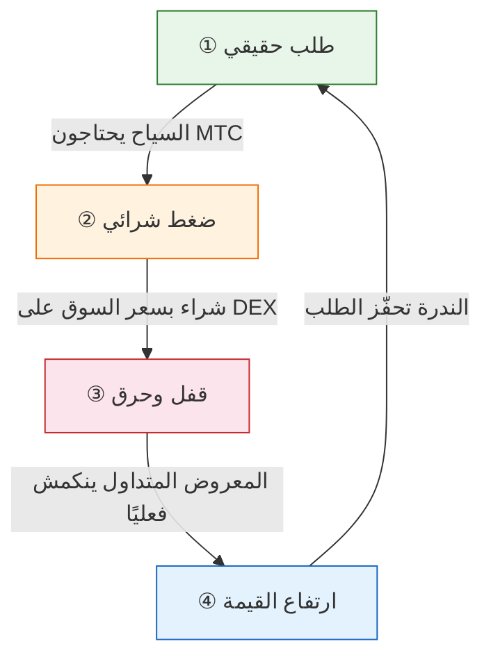
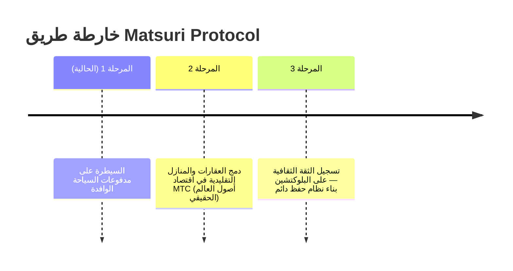

# 🎯 الرؤية: استراتيجية «الوافد أولاً»

> **من الاعتماد على الدعم الحكومي إلى الاستقلالية.**
> انتهى عصر إبقاء الاقتصادات المحلية على قيد الحياة بالتمويل الحكومي. نوجّه رأس المال الأجنبي مباشرةً إلى الثقافة.

الغالبية العظمى من مشاريع التنمية المحلية تفشل — لأنها تكتفي بإعادة توزيع ميزانيات حكومية متقلصة.

**Matsuri Protocol يتّخذ النهج المعاكس تمامًا.**

---

## 1. الاستراتيجية: محرك تصدير الثقافة

نعيد تعريف الموارد السياحية اليابانية — ليس كـ «سلع استهلاكية» بل كـ **«أدوات مالية قابلة للتصدير»**.

| المشكلة | الواقع | الأثر |
| :--- | :--- | :--- |
| 💸 **تسرب الإيرادات** | عمولات لوكالات السفر الأجنبية (Booking.com, Expedia إلخ) | **15-20% من الإيرادات** تتسرب — خسارة على المستوى الوطني |
| 🚧 **الجدار غير المرئي** | حواجز اللغة والدفع | المسافرون الأثرياء لا يستطيعون الوصول إلى تجارب «اليابان العميقة» |

:::tip دور MTC
MTC هو **المفتاح الرئيسي الوحيد** الذي يوقف التسرب ويهدم الجدران.
:::

---

## 2. دولاب الاقتصاد الدوّار

السمة المميزة لـ Matsuri Protocol: **حماس السياح يدفع سعر MTC للارتفاع رياضيًا.**
ليس أمنيات — بل **ديناميكيات العرض والطلب**.

### لماذا يرتفع سعر MTC؟

**دورة تلقائية من 4 مراحل** تقود السعر:

| المرحلة | الاسم | الآلية |
| :---: | :--- | :--- |
| **①** | **طلب حقيقي** | السياح يحتاجون MTC لحجز المرشدين وشراء تذاكر NFT |
| **②** | **ضغط شرائي** | يُشترى MTC بسعر السوق على DEX — مدفوعًا بالاستهلاك وليس المضاربة |
| **③** | **قفل وحرق** | جزء من MTC المستخدم في المدفوعات يُقفل أو يُحرق فورًا — المعروض ينكمش فعليًا |
| **④** | **ارتفاع القيمة** | الطلب على الشراء يتصاعد والمعروض للبيع يتراجع — قيمة الندرة ترتفع رياضيًا |

:::info الحقيقة الجوهرية
**«كلما استمتع السياح باليابان أكثر، زادت ثروة حاملي MTC.»**
هذه المعادلة البسيطة هي نبض المشروع.
:::

---

## 3. الوجهة النهائية: نظام التشغيل الثقافي

هدفنا النهائي ليس تطبيق دفع.
بل **تحويل الثقافة نفسها إلى نظام تشغيل**.

> نحمي **ثقافة عمرها 1000 عام** بـ **تكنولوجيا بلوكتشين متطورة**.
> هذا هو المستقبل الذي يبنيه Matsuri Protocol.

---

**[▶ التالي: كيف نحقق الأرباح فعلاً؟ (النظام الاقتصادي)](/docs/economy)**
