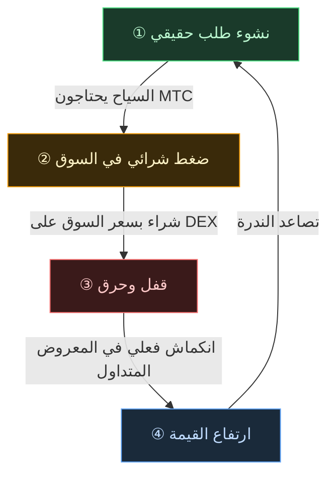

# 🔄 دولاب الاقتصاد — دورة النمو ونظام التشغيل الثقافي

> **كلما استمتع السياح باليابان أكثر، زاد الطلب في النظام البيئي.**
> هذه الآلية التي تربط العرض بالطلب هي قلب المشروع.

---

## آلية العرض والطلب في MTC

تصميم Matsuri Protocol يضمن أن **ارتفاع الطلب الحقيقي يولّد ضغط شراء، وحين يقترن بانخفاض المعروض تتهيأ الظروف لارتفاع القيمة**.
هذه ليست عاطفة، بل **ديناميكيات العرض والطلب**.

تدعم هذه الآلية **دورة من أربع خطوات**:

| الخطوة | الاسم | الآلية |
| :---: | :--- | :--- |
| **①** | **نشوء طلب حقيقي** | السياح يحتاجون MTC لحجز المرشدين وشراء تذاكر NFT |
| **②** | **ضغط شرائي في السوق** | يُشترى MTC بسعر السوق على DEX (البورصة اللامركزية). شراء قوي قائم على الاستهلاك لا المضاربة |
| **③** | **قفل وحرق** | جزء من MTC المستخدم في المدفوعات يُقفل أو يُحرق فورًا عبر العقد الذكي. المعروض ينكمش فعليًا |
| **④** | **تصاعد الندرة** | يرتفع الطلب على الشراء وينخفض المعروض للبيع. التغيّر في توازن العرض والطلب يجعل كل رمز أكثر ندرة |

---

---

:::note الرؤية التي تسندها هذه المعادلة
الصورة الكاملة لـ«نظام التشغيل الثقافي» الذي ينطلق من هذا الدولاب نعرضها بالتفصيل في الصفحة التالية [المستقبل الذي يرسمه MTC](/docs/future).
:::

---

**[◀ السابق: التحديات والحلول](/docs/challenges)** ｜ **[▶ التالي: المستقبل الذي يرسمه MTC](/docs/future)**
