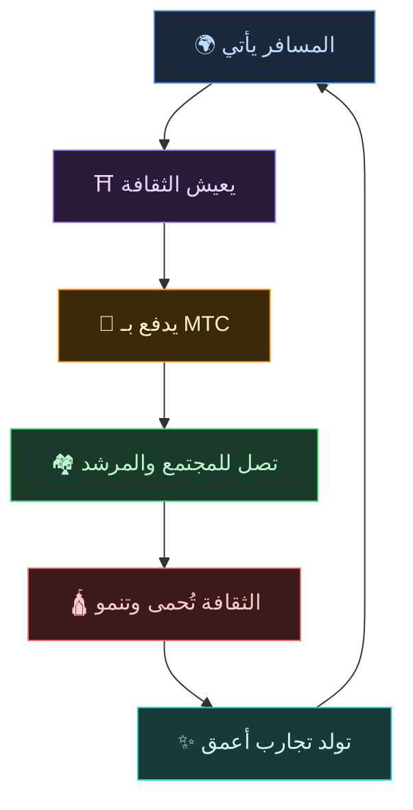
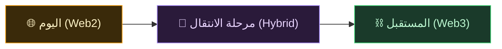
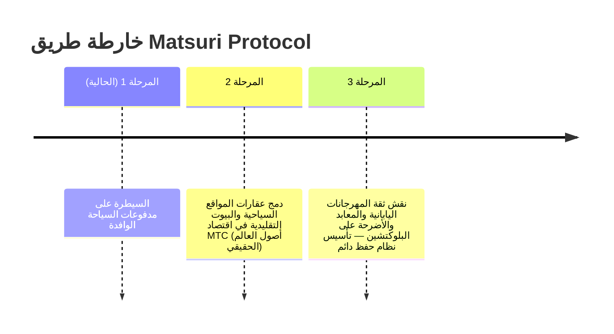

# 🌀 المستقبل الذي يرسمه MTC — اقتصاد تدور فيه كل «مشاركة»

> **من يعيش التجربة، ومن يوصلها، ومن يحميها. كل المشاعر تدور كاقتصاد، لتسلّم الثقافة إلى الجيل القادم.**

---

## الدورة التي نريد تحقيقها

MTC ليس رمزًا للمضاربة.

المسافر يلمس الثقافة اليابانية ويتأثر.
المرشد يوصل هذا التأثر ويُكافأ عليه.
المجتمع المحلي يزدهر ويواصل حماية ثقافته.
وتلك الثقافة بدورها تجذب مسافرين جددًا.

هذه الدورة بالضبط هي سبب وجود MTC.

---

## اقتصاد يكافئ الأطراف الثلاثة

في السياحة التقليدية: المسافر يدفع، المنصة تأخذ الربح، والميدان لا يبقى له شيء.
أما في اقتصاد MTC، فكل مشارك يُكافأ.

| المشارك | ماذا يحدث له | كيف يُكافأ |
| :--- | :--- | :--- |
| **🌍 من يعيش التجربة** | يلمس الثقافة اليابانية ويدفع بـ MTC | وصول إلى تجارب أصيلة بأسعار أقل من الين، واستمرار التواصل بعد العودة عبر MTC |
| **⛩️ من يوصل التجربة** | يقيم فعاليات كمرشد وينشر محتوى على J-Times | مكافأة مباشرة بلا اقتطاع وسطاء. كلما نَشِط، كُوفئ بـ MTC |
| **🏘️ من يحمي الثقافة** | يصون ويورّث الثقافة كمجتمع محلي | إيرادات تصل مباشرة. ازدهار مستدام لا يرهقه السياحة المفرطة |

---

## كلما اتسع الاقتصاد، قويت الثقافة

اقتصاد MTC يبدأ من حجز التجارب، ثم يمتد تدريجيًا إلى كل أوجه الحياة.

- **التجارب** — تجارب ثقافية أصيلة، تعدين الزيارات
- **المأكل والملبس والمسكن** — بيوت ضيافة، متاجر، طعام، أزياء
- **مشاريع الإبداع المشترك** — تمويل جماعي للاستثمار في حماية الثقافة
- **التفاهم الدولي بين الثقافات** — فضاء للتبادل والتفاهم عبر الحدود

كلما اتسع الاقتصاد، تدفّقت القيمة أكثر عبر MTC، وقويت قدرته على حمل الثقافة.
هذا ليس مجرد نموذج أعمال، بل **جهاز إنعاش للثقافة**.

---

## من Web2 إلى Web3 — بسلاسة وتدرّج

لا نقول «انقلوا كل شيء إلى البلوكتشين فورًا».

ما زال معظم الناس غير متآلفين مع Web3. لهذا صممنا النظام بحيث **تبدأ بالطرق المعتادة، ثم تكتشف تدريجيًا فوائد Web3**.

| المرحلة | تجربة المستخدم | الآلية خلف الكواليس |
| :--- | :--- | :--- |
| **اليوم** | حجز التجارب والدفع كتطبيق ويب عادي. بطاقة ائتمان تكفي | Django + Stripe. لا حاجة لمحفظة |
| **مرحلة الانتقال** | كسب واستخدام MTC في التطبيق. ربط المحفظة بنقرة واحدة | تُرحّل النقاط من off-chain إلى on-chain تدريجيًا |
| **المستقبل** | كل المعاملات والحقوق مسجلة بشفافية على البلوكتشين. مساهمتك مُثبتة إلى الأبد | اقتصاد آلي تمامًا لا يقبل التغيير عبر العقود الذكية |

:::tip Web3 ليس صعبًا
لا تحتاج في البداية لإعداد محفظة أو إدارة عبارة استرداد. أثناء الاستخدام، تلامس عالم Web3 طبيعيًا — **وقبل أن تدري، تكون قد أصبحت من سكان Web3.** هكذا صممنا التجربة.
:::

---

## اقتصاد يحركه التعاطف، لا القوة

هذا الاقتصاد يعمل بالعقود الذكية.
لا يستطيع أحد تغيير القواعد وفق سلطته أو مصلحته — **نظام اقتصادي لا يمكن فيه فرض تغيير الوضع الراهن بالقوة**.

وفوق ذلك، نتعلم من حكمة الأقدمين ونواصل خلق قيم جديدة. 温故知新 (أونكو تشيشين)، ومنه إلى الابتكار.

> **عالم تقوم فيه الحياة على محور الثقافة حتى بلا ¥ أو $.**
>
> بدلًا من تسليم قيمة عملتك لأحدهم، تصنع القيمة وتستخدمها عبر «مشاركتك».
> هذه هي الحرية التي يريد MTC إيصالها.

---

## 🏁 الوجهة النهائية: «نظام التشغيل الثقافي» (Cultural OS)

هدفنا النهائي ليس مجرد تطبيق دفع.
بل **تحويل الثقافة نفسها إلى نظام تشغيل (قاعدة)**.

> نحمي حكمة الأقدمين بأحدث بلوكتشين.
> هذه هي خارطة المستقبل التي يرسمها Matsuri Protocol.

---

:::note هنا ينتهي الجزء القصصي
من وصل إلى هنا، قد فهم لماذا وُجد MTC.
الآن **【الجزء العملي】** — لنرَ ماذا يمكن فعله فعلًا بـ MTC.
:::

**[◀ السابق: دولاب الاقتصاد](/docs/flywheel)** ｜ **[▶ التالي: النظام البيئي](/docs/ecosystem)**
