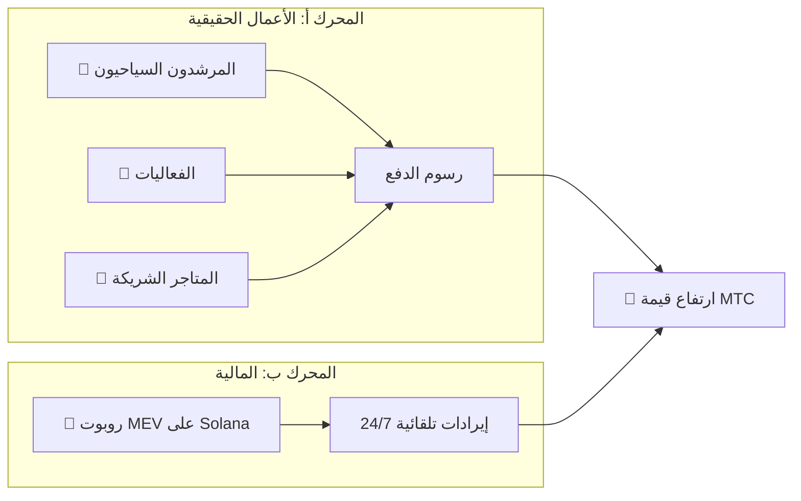

# 💰 النظام الاقتصادي

> اقتصاد Matsuri Coin (MTC) بسيط ولكنه محصّن.
> **محركا إيرادات — أعمال حقيقية وخوارزميات مالية — يولّدان الأرباح ويعيدان توزيعها برمجيًا على الحاملين.**


---

## 1. محرك الإيرادات المزدوج



| المحرك | مصدر الإيرادات | آلية العمل |
| :--- | :--- | :--- |
| **🏯 المحرك أ (الأعمال)** | رسوم الدفع من المرشدين والفعاليات والمتاجر الشريكة | المزيد من السياح ← المزيد من رأس المال الأجنبي ← توسع النظام البيئي |
| **🤖 المحرك ب (المالية)** | تداول آلي عبر روبوت MEV على Solana | برنامج تداول عالي التردد بإشراف المدير التنفيذي يستخلص الأرباح من أوجه القصور في السوق على السلسلة 24/7/365 |

---

## 2. بروتوكول إعادة الشراء (آلية رفع القيمة)

نحن لا نضع الأرباح في جيوبنا.
قواعد العقود الذكية توجّه الإيرادات مباشرةً نحو **رفع قيمة MTC**.

| مصدر الإيرادات | نسبة التخصيص | الإجراء |
| :--- | :---: | :--- |
| **مبيعات Matsuri HQ** (المرشدون والفعاليات) | **20%** | **إعادة شراء** من السوق + حقن في مجمع السيولة |
| **عضوية GCF** (رسوم العضوية) | **25%** | **إعادة شراء** من السوق |

:::info المنطق الأساسي
**«نمو الأعمال = MTC يُشترى باستمرار من السوق المفتوح.»**
هذه المعادلة هي ما يدعم قيمة أصولك.
:::

---

## 3. منطق تحديد السعر

آلية التسعير لدينا تعمل بـ **صيغة AMM (صانع السوق الآلي)** — وليس أحلام يقظة.

```
السعر = السيولة (SOL) ÷ المعروض (MTC)
```

| الخطوة | ماذا يحدث | النتيجة |
| :---: | :--- | :--- |
| **①** | إيرادات الأعمال (SOL) تُحقن في المجمع | **البسط ↑** |
| **②** | يُعاد شراء MTC من السوق ويُحرق | **المقام ↓** |
| **③** | البسط ↑ × المقام ↓ | **السعر يرتفع رياضيًا** |

---

## 4. GCF (أصدقاء المجتمع العالمي)

GCF هي المنظمة الشريكة **بالدعوة فقط** (DAO) المكلفة بتوسيع نظام Matsuri البيئي.
ليست ناديًا — بل **تحالف أعمال** يتقاسم الأرباح.


### مستويات العضوية

| المستوى | الدور | الامتيازات |
| :---: | :--- | :--- |
| **👑 بلاتينيوم** | مالك / VIP | أعلى الحقوق. أول **50 مقعدًا** فقط. صلاحية اتخاذ القرار + أرباح كبيرة |
| **🥇 ذهبي** | سفير | فريق العمل الميداني. حق الكسب **بلا سقف** من خلال النشاط. أعلى معدلات التعدين والإحالة |

### الميزة ①: التعدين بالعمل الحقيقي (حقوق التعدين)

**550 مليون MTC (~61% من إجمالي المعروض)** التي يُفتح قفلها في 1 يونيو 2027 محجوزة كـ **مجمع مكافآت المساهمين** — لا تُلقى في السوق.

:::tip قائم كليًا على الأداء
يُوزَّع MTC آليًا من المجمع بناءً على مساهمتك (المبيعات، عدد الزوار، جلسات الإرشاد).
:::

**جدول التنصيف (دورة سنتين):**

| الفترة | نسبة الإصدار | الحجم |
| :--- | :---: | :--- |
| **الحقبة 1** 2027 – 2029 | **50%** | ~275 مليون رمز |
| **الحقبة 2** 2029 – 2031 | **25%** | ~137 مليون رمز |
| **الحقبة 3** 2031 – 2033 | **12.5%** | ~68 مليون رمز |

:::caution نافذة السبّاقين
أسرع من تنصيف بيتكوين (4 سنوات) — نستخدم **دورة سنتين**.
من يلتزم بالكامل خلال **أول سنتين من 2027** يضمن أفضلية ساحقة.
:::

### الميزة ②: عمولة إحالة مميزة

أحِل منتجات عالية القيمة (العضويات، الجولات VIP، العقارات الشريكة) واكسب **عمولات مميزة (USDC + MTC)** — أضعاف برامج التسويق بالعمولة العادية. تُدفع **فورًا** عبر العقد الذكي.

---

## 5. مواصفات الرمز

لقد **ألغينا** بشكل دائم صلاحيات السك والتجميد على Solana.
لن يكون هناك إصدار إضافي — أبدًا. لن يكون هناك تجميد أموال — أبدًا. **تصميم بلا ثقة بالكامل.**

| العنصر | التفاصيل |
| :--- | :--- |
| **اسم الرمز** | Matsuri Coin |
| **الرمز** | MTC |
| **السلسلة** | Solana |
| **إجمالي المعروض** | **900,000,000 MTC** (ثابت) |
| **صلاحية السك** | 🚫 ملغاة |
| **صلاحية التجميد** | 🚫 ملغاة |
| **عقد القفل** | Streamflow Finance (موثّق) |

:::warning بالدعوة فقط — مقاعد محدودة
سيتوقف GCF عن التجنيد فور امتلاء المقاعد المحدودة (بلاتينيوم: 50 / ذهبي: قيد التعديل).
امتلاك هذا الحق يعني الدخول إلى **الدائرة الداخلية** لاقتصاد Matsuri.
:::

---

**[▶ التالي: النظام البيئي والتعدين](/docs/ecosystem)** ｜ **[انضم إلى Discord](#)**
