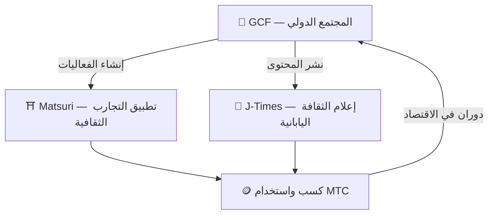

# 🏗️ النظام البيئي لـ MTC — اقتصاد تدور فيه التجربة والإعلام والمجتمع

> **ثلاثة «فضاءات» لتحقيق الرسالة.**
> فضاء للعيش، فضاء للمعرفة، فضاء للتواصل — كلٌّ مستقل، لكنها تدور معًا كاقتصاد واحد عبر MTC.

MTC ليس مجرد رمز. ثلاثة منتجات ومجتمع دولي يعملون متضافرين لتحقيق **اقتصاد يحمي الثقافة**.

:::tip 🤝 GCF — المجتمع الدولي الذي يحرّك النظام البيئي
فضاء يتواصل فيه عشاق الثقافة اليابانية عبر الحدود. يستقطب GCF المرشدين، ويتولى مرشدو GCF تشغيل التجارب على Matsuri. ثم يُنشر محتوى جذاب على J-Times — نشاط المجتمع هو المحرك الذي يدفع النظام البيئي بأكمله.
:::

:::tip ⛩️ Matsuri — تطبيق التجارب الثقافية
ينطلق من حجز التجارب الثقافية، ثم يتوسّع تدريجيًا إلى **بيوت الضيافة** و**المتاجر** و**التمويل الجماعي**. يمتد الاقتصاد من التجربة إلى الملبس والمأكل والمسكن والاستثمار المشترك.

**تعدين الزيارات (الحج الثقافي)** — اكسب MTC بزيارة الأضرحة والمعابد والمعالم الثقافية فعليًا. يوزّع النظام السياح من المواقع الشهيرة إلى الجواهر المخفية في الأقاليم، ليعالج السياحة المفرطة وينشّط المناطق في آنٍ واحد.
:::

:::tip 📰 J-Times — إعلام الثقافة اليابانية
منصة إعلامية تنقل سحر الثقافة اليابانية إلى العالم. تكسب MTC من خلال التفاعل كالقراءة والمشاركة.
:::

---

## 🤝 التعدين الاجتماعي (اربح بالتواصل)

**متصل بلوحة إدارة GCF — نسخة الويب تعمل الآن (تطبيق iOS مقرر في أبريل 2026)**

يحصل أعضاء GCF على صلاحية الوصول إلى **لوحة إدارة GCF** المخصصة.

| الميزة | ماذا تستطيع |
| :--- | :--- |
| **🎪 إنشاء الفعاليات** | إنشاء ونشر فعالياتك وجولاتك الخاصة |
| **📢 نشر المحتوى** | نشر وتوزيع مقالات ومحتوى J-Times |
| **📊 تتبع الإحالات** | تتبع سلوك وأرباح المستخدمين الذين دعوتهم فوريًا |

:::info مكافآت تلقائية
في كل مرة يتم فيها دفع من أحد أصدقائك المُحالين، يحوّل النظام **تلقائيًا** المكافأة (حصة المبيعات) إلى محفظتك.
:::

---

## 🎓 اقتصاد المبدعين (اربح بالإبداع)

لا تقتصر المنصة على استهلاك المحتوى — بل **كل من أراد** يستطيع إنتاج المحتوى وتحقيق الدخل على Matsuri.

| المنصة | ماذا يستطيع المبدع | نموذج الدخل |
| :--- | :--- | :--- |
| **📚 سوق الدورات** | نشر دورات فيديو/نصية عن الثقافة واللغة والحرف اليابانية | عمولة لكل تسجيل (حصة المبدع) |
| **🎙️ استوديو البودكاست** | إنتاج سلسلة صوتية للنشر على Spotify وApple Podcasts وRSS | حلقات اشتراك حصرية |
| **🤝 التمويل الجماعي** | إطلاق حملات تمويل على Solana للمشاريع الثقافية | تتبع المساهمات on-chain |
| **🛍️ متجر المستخدم** | فتح متجر شخصي داخل المنصة (حرف يدوية، بضائع) | بيع مباشر مع نظام منتجات/مراجعات |

:::tip دعم إنتاج يعمل بالذكاء الاصطناعي
يستطيع منظمو الفعاليات استخدام **مساعد الذكاء الاصطناعي المدمج (GPT-4 Turbo)** لإنشاء وصف الفعالية، والترجمة التلقائية إلى 5 لغات، وتوليد بيانات وصفية محسّنة لـSEO من داخل لوحة الإدارة.
:::

---

  

*لقاء مجتمعي في Golden Gai — روابط تتحوّل إلى قوة تعدين.*

---

:::note إلى الصفحة التالية
إن أردت معرفة آلية التعدين وطرق الكسب بالتفصيل، توجّه إلى **[التعدين وطرق الكسب →](/docs/mining)**.
:::
