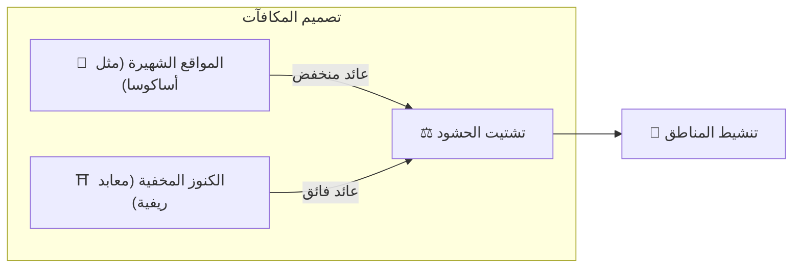

# ⛏️ الركائز الثلاث للتعدين

> **إثبات الفعل (Proof of Action)**
> Matsuri Coin لا يُعدَّن بوحدات المعالجة الرسومية (GPU)، بل بـ **«الفعل البشري»**.

التطبيق ولوحة الإدارة **متاحان بالفعل** — ابدأ بجني الأرباح **الآن** من خلال الأنشطة أدناه.

---

## 1. 📖 تعدين الميديا (اقرأ واستمع وأجِب واكسب)

**مدعوم من «J-Times» — الوسيلة الإعلامية الرسمية**

المعرفة تحوّل جودة الرحلة جذريًا.
نكافئ التعلم — القراءة والاستماع **وإثبات الفهم** عبر الاختبارات.

| الإجراء | ماذا تفعل | المكافأة |
| :--- | :--- | :--- |
| **📰 اقرأ واكسب** | اقرأ مقالات J-Times عن التاريخ والشنتو والزِن | MTC يُكافأ |
| **🎧 استمع واكسب** | استمع لبودكاست حصري عن الثقافة اليابانية العميقة | MTC يُكافأ |
| **✅ أجِب واكسب** | اجتَز الاختبارات لإثبات استيعاب المعرفة | MTC يُكافأ (فوري) |

:::tip وقت الفراغ → وقت التعدين
التنقل، استراحة الغداء، أو الرحلة الجوية — كل لحظة فراغ تتحول إلى فرصة لتحقيق الدخل.
:::

---

## 2. 🤝 التعدين الاجتماعي (تواصَل واكسب)

**عبر لوحة إدارة GCF — تعمل بالفعل**

يحصل أعضاء GCF على صلاحية الوصول إلى **«GCF Admin Web»** المخصصة.

| الميزة | ماذا يمكنك فعله |
| :--- | :--- |
| **🎪 إنشاء الفعاليات** | خطّط وانشر فعالياتك وجولاتك الخاصة |
| **📢 توزيع المحتوى** | وسّع نطاق مقالات J-Times والمحتوى عبر شبكتك |
| **📊 تتبع الإحالات** | تابع نشاط ودخل المستخدمين المُحالين في الوقت الفعلي |

:::info دفعات تلقائية
في كل مرة يُتمم صديق مُحال صفقة، يُودِع النظام **تلقائيًا** حصتك من الإيرادات في محفظتك.
:::

---

## 3. 🗺️ تعدين المغامرة (امشِ واكسب)

**مشروع «الحج» — المرحلة التالية (قيد التطوير)**

ميزة من الجيل التالي تستخدم GPS وحوافز الرموز لإعادة توجيه تدفق السياح الفعلي.

> **«الناس يذهبون إلى الريف لأنه أكثر ربحية.»**
> هذا المنطق الاقتصادي يحل مشكلة السياحة المفرطة ويسرّع تنشيط الأقاليم.

### 🎲 بروتوكول «أوميكوجي»

عقد ذكي على شكل قرعة يُفعَّل **مجانًا (رسوم الغاز فقط)** عند تسجيل الوصول.

| النتيجة | ماذا تحصل عليه |
| :--- | :--- |
| **🎊 حظ عظيم** | إيردروب مكافأة MTC |
| **📜 NFT Drop** | **«Goshuin NFT»** (NFT الختم المقدس) حصري للموقع |
| **🏆 مجموعة كاملة** | إكمال مجموعة يفتح الوصول إلى فعاليات خاصة |

:::note ليست قمارًا
لا حاجة لأي رهان مالي. مجرد مكافأة عشوائية لـ **«حضورك»**.
:::

---

## 4. 🏦 تعدين السيولة (وفِّر واكسب)

> **كُن البنك.**

نقدم برنامج مكافآت خاص للمستخدمين الذين يوفرون سيولة MTC/SOL على Raydium.

| العنصر | التفاصيل |
| :--- | :--- |
| **مَن** | مزودو السيولة الأوائل («الشركاء المؤسسون») |
| **APY المستهدف** | **50%** (محدد كعلاوة مخاطر) |
| **لماذا** | ضمان السيولة الأولية لبيئة تداول مستقرة |

---

**[▶ التالي: خارطة الطريق والفريق](/docs/roadmap)** ｜ **[◀ السابق: النظام الاقتصادي](/docs/economy)**
