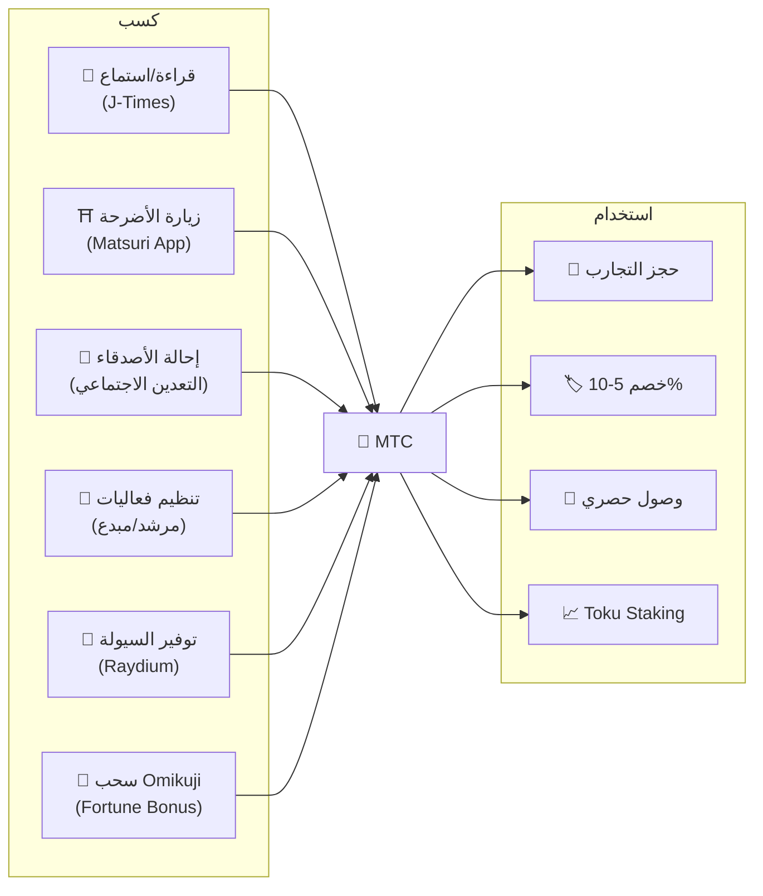
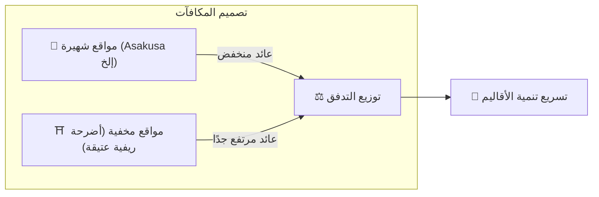
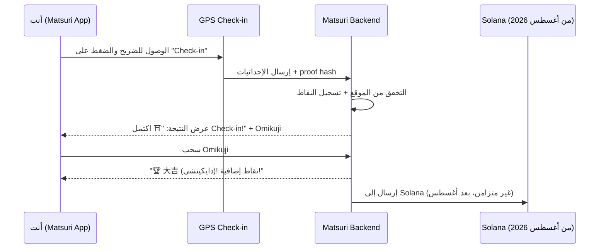
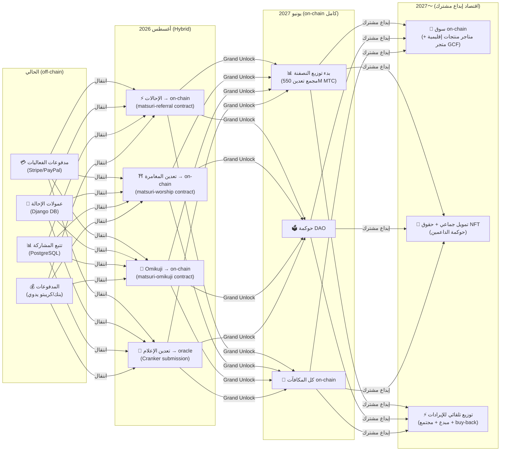

# ⛏️ الأعمدة الخمسة للتعدين وطرق الكسب

> **«المشاركة» في الثقافة تتحول مباشرة إلى قيمة.**
> اقرأ، امشِ، تواصل، أنشئ، ادعم — كل فعل منك يولّد MTC.

<small>*※ ما هو «التعدين»؟ — في Bitcoin وغيرها، يسمّى حصول الحاسوب على عملات جديدة كمكافأة على عمليات حسابية هائلة «تعدينًا». في MTC، ليست قوة الحاسوب، بل **فعلك أنت** — قراءة مقال، زيارة ضريح، تنظيم فعالية — هو «التعدين». بدلًا من حفر الذهب، المشاركة في الثقافة تولّد MTC. هذا هو «التعدين» عندنا.*</small>

> اكسب بالفعل. استخدم في التجربة. احتفظ وانمُ.

MTC ليس رمزًا للمضاربة. كل فعل يولّد قيمة ويمنحها، في اقتصاد حقيقي متدفّق. تطبيق الويب ولوحة الإدارة **يعملان الآن**. يُحفظ حاليًا نقاط المساهمة off-chain (Django)، ويُنقل تدريجيًا إلى on-chain بدءًا من أغسطس 2026.

:::tip الصورة الكاملة
يمتلك MTC **اقتصادًا دوريًا كاملاً**: تكسب من خلال أنشطة حقيقية، تستخدم في تجارب حقيقية، وتنمو القيمة مع توسّع النظام البيئي. في هذه الصفحة، نشرح الآلية بالتفصيل.
:::

---

## دورة حياة MTC

---

## الأعمدة الخمسة للتعدين

### 1. 📖 تعدين الإعلام (اكسب بالقراءة والاستماع والإجابة)

**متصل بالإعلام الرسمي «J-Times»**

المعرفة ترفع جودة الرحلة بشكل جوهري. افتح **تطبيق J-Times** واستمتع بالمحتوى حول الثقافة اليابانية. إلى جانب التعلّم بالنص والصوت، نكافئ أيضًا **اختبارات الفهم (Quiz)**. تُمنح MTC تلقائيًا لكل فعل مكتمل.

| الفعل | شرط الإكمال | المكافأة التقريبية |
| :--- | :--- | :---: |
| **📰 قراءة مقال** | تمرير حتى 75% | 2〜30 MTC |
| **🎧 استماع لبودكاست** | تشغيل حتى النهاية | 2〜30 MTC |
| **🎬 مشاهدة فيديو** | إغلاق شاشة التفاصيل بعد المشاهدة | 2〜30 MTC |
| **📤 مشاركة المحتوى** | عرض ورقة المشاركة | 2〜30 MTC |
| **✅ الإجابة على Quiz** | اجتياز اختبار الفهم | 2〜30 MTC |

<small>*※ قدر المكافأة يتغيّر حسب نوع المحتوى وطوله وتوازن الإمدادات في النظام البيئي*</small>

:::tip الأوقات الفارغة تصبح تعدينًا
وقت التنقل أو الاستراحة يتحوّل مباشرة إلى وقت يُولّد المكافآت.
:::

:::info دعم الوضع بلا اتصال
لا إنترنت في ضريح ريفي؟ لا مشكلة. يسجّل J-Times النشاط محليًا، و**يتزامن تلقائيًا عند العودة للاتصال** (قائمة انتظار غير متصلة محتفظ بها 7 أيام). لن تفقد MTC المكتسبة.
:::

**سير العمل خلف الكواليس:**
1. يكتشف تطبيق J-Times فعلك (إتمام القراءة، إنهاء المشاهدة، المشاركة إلخ)
2. يسجّله محليًا حتى لو كنت بلا اتصال (7 أيام)
3. يرسله للتحقق على الخادم عند العودة للشبكة
4. ينعكس كنقاط مساهمة في رصيدك
5. بدءًا من أغسطس 2026: تُسجَّل النقاط المُتحقق منها عبر أوراكل على البلوكتشين، قابلة للتحقق على السلسلة

---

### 2. ⛩️ تعدين المغامرة (اكسب بالمشي)

**مشروع «الحج» — العقد الذكي مكتمل، النشر على الشبكة الرئيسية في أغسطس 2026**

ميزة الجيل القادم التي توظّف GPS وحوافز التوكن لتوجيه «تدفّق الناس» فعليًا. خريطة الأماكن المقدسة **تعمل الآن** في Matsuri Web. نسجّل النقاط off-chain حاليًا، ويبدأ توزيع المكافآت on-chain بعد نشر العقد الذكي في أغسطس 2026.

>**تكسب أكثر → تذهب للأقاليم**
> هذا المنطق الاقتصادي يعالج السياحة المفرطة ويسرّع تنمية الأقاليم.

**آلية Check-in:**

**المبدأ الأساسي — المواقع الأقل زيارة تكسب أكثر:**

| نوع الموقع | أمثلة | المكافأة التقريبية (Check-in واحد) |
| :--- | :--- | :---: |
| 🏙️ **رئيسي** | Sensō-ji، Kiyomizu-dera، Fushimi Inari | 30〜50 MTC |
| 🌆 **محور إقليمي** | Ichinomiya كل محافظة، الأضرحة الكبرى الإقليمية | 50〜100 MTC |
| 🏞️ **إقليمي** | أضرحة إقليمية تاريخية | 100〜150 MTC |
| ⛰️ **حدودي** | معابد جبلية، أماكن مقدسة في الجزر النائية | 150〜200 MTC |

<small>*※ المذكور أعلاه مكافأة أساسية تقريبية. قد يتضاعف المبلغ عدة مرات حسب مضاعف Omikuji*</small>

**عوامل إضافية للنقاط:**
- **مضاعف Omikuji** — مكافأة عشوائية لكل Check-in. 大吉 (دايكيتشي) يضاعف المكافأة
- **تكرار الزيارة** — الزوار المنتظمون يكسبون أكثر مع الوقت
- **المواقع المموّلة** — يمكن للبلديات تعزيز مواقع محددة

:::info نقاط المساهمة → MTC
يتراكم نشاطك كـ**نقاط مساهمة**. في كل حقبة نصفنة (تبدأ يونيو 2027)، تُحوّل النقاط إلى MTC من مجمع التعدين البالغ 550M. كلما زادت مساهمتك للمجتمع، زاد ما تتلقاه من MTC. تتحدد معاملات التعزيز تدريجيًا وتُكتب في العقد الذكي — يضمن توزيعًا عادلًا يتناسب مع الحجم الفعلي للمجمع.
:::

---

### 3. 🤝 التعدين الاجتماعي (اربح بالتواصل)

مجرد الإحالة لصديق يمنحك MTC.

#### مكافآت الإحالة للمستخدم العادي

الآلية بسيطة. حين يسجّل صديق عبر رابط الإحالة الخاص بك، تحصل على **300 MTC لكل إحالة مباشرة**.

| الشرط | المكافأة |
| :--- | :--- |
| تسجيل الصديق الذي أحلته | **300 MTC** |

فقط. لا توجد مكافآت متعددة المستويات.

#### مكافآت إحالة لوكلاء GCF

[أعضاء GCF](/docs/gcf) بصفتهم **وكلاء رسميين** يحملون مسؤولية توسيع النظام البيئي، يمتلكون هيكل مكافآت أعمق.

| الطبقة | العلاقة | العمولة |
| :---: | :--- | :---: |
| **L1** | إحالة مباشرة | **20%** |
| **L2** | إحالة المُحال | **5%** |
| **L3** | الثالثة | **5%** |
| **L4** | الرابعة | **5%** |

:::note حول نظام وكلاء GCF
تنطبق هذه المكافآت متعددة المستويات فقط على الوكلاء الرسميين الحاملين لعضوية GCF (بالدعوة فقط). يحصل المستخدم العادي على إحالة مباشرة فقط (300 MTC).
عمولة وكيل GCF تُحسب على أساس **النشاط الاقتصادي الحقيقي (شراء تجارب، حضور فعاليات إلخ)** للمُحالين. مجرد جمع الأشخاص لا يولّد مكافآت.
:::

**آلية نقاط En-Mining (لوكلاء GCF):**

تُحسب نقاط المساهمة بناءً على عاملين:
- **اتساع الشبكة** (30%) — كم شخصًا جلبت
- **النشاط الاقتصادي** (70%) — المشتريات الفعلية من شبكة الإحالة

تتراكم النقاط عبر الوقت وتُحوَّل إلى MTC في كل حقبة نصفنة.

#### لوحة إدارة GCF — نسخة الويب تعمل

يحصل أعضاء GCF على صلاحية الوصول إلى لوحة الإدارة المخصصة.

| الميزة | ماذا تستطيع |
| :--- | :--- |
| **🎪 إنشاء فعاليات** | إنشاء ونشر فعالياتك وجولاتك |
| **📢 نشر المحتوى** | نشر وتوزيع محتوى J-Times |
| **📊 تتبع الإحالات** | متابعة فورية لسلوك وأرباح المُحالين |

:::warning حاليًا off-chain → الانتقال إلى on-chain في أغسطس 2026
تُتبع عمولات الإحالة حاليًا على Django (PostgreSQL) وتُدفع عبر التحويل البنكي أو العملات المشفرة. بدءًا من **أغسطس 2026**، ستنتقل إلى **عقد Matsuri Referral الذكي** على Solana، ما يحقق مدفوعات قابلة للتدقيق on-chain.
:::

  

*لقاء مجتمعي في Golden Gai — الروابط قوة تعدين.*

---

### 4. 🎓 تعدين المبدعين والمرشدين (اربح بالإبداع)

لا تقتصر المنصة على استهلاك المحتوى — **كل من أراد** يستطيع الإبداع والتحقيق على Matsuri. إذا كنت عضو GCF أو مرشدًا أو مبدعًا، يمكنك الكسب بهذه الطرق.

| النشاط | طريقة الكسب |
| :--- | :--- |
| **🗺️ تنظيم الجولات** | عمولة المرشد (محددة لكل فعالية) + إكراميات |
| **🎫 بيع تذاكر الفعاليات** | حصة من المبيعات عبر EventPurchase |
| **📚 نشر الدورات** | عمولة لكل تسجيل (حصة المبدع) |
| **🎙️ إنتاج حلقات بودكاست** | إيرادات الاشتراكات |
| **🤝 إطلاق حملات تمويل جماعي** | تتبع مساهمات on-chain على Solana |
| **🛍️ فتح متجر مستخدم** | بيع مباشر للحرف والبضائع |

**نظام الإكراميات:** بعد انتهاء الفعالية، يستطيع الضيوف إرسال إكرامية للمرشد (بأسلوب Uber). تُعالَج الإكراميات عبر Stripe وتُتتبع على لوحة ترتيب عامة.

:::tip دعم إنتاج يعمل بالذكاء الاصطناعي
يستطيع منظمو الفعاليات استخدام **مساعد AI المدمج (GPT-4 Turbo)** لإنشاء الوصف، والترجمة إلى 5 لغات، وتوليد metadata مُحسَّنة لـSEO من داخل لوحة الإدارة.
:::

---

### 5. 🏦 تعدين السيولة (اربح بالإيداع)

>**كن بنكًا.**

قدّم سيولة MTC/SOL على Raydium DEX وادعم أساس التداول في المرحلة المبكرة من النظام البيئي. لمقدّمي السيولة الأوائل، أعددنا برنامج مكافآت خاصًا بصفتهم «شركاء مؤسسين».

| البند | التفاصيل |
| :--- | :--- |
| **الفئة المستهدفة** | كل من يملك MTC وSOL |
| **العائد السنوي المستهدف** | **20%** (حافز سيولة مبكر، يُضبط كعلاوة مخاطرة) |
| **DEX** | Raydium (Solana) |
| **المغزى** | ضمان السيولة في المرحلة المبكرة وبناء بيئة تداول مستقرة |

---

## 🎲 مكافأة Omikuji

كل Check-in في تعدين المغامرة يشمل Omikuji (سحب حظ) مجانية. عقد ذكي بأسلوب الـomikuji يُنفَّذ **مجانًا (برسوم الغاز فقط)** عند إكمال Check-in.

| الحظ | مضاعف المكافأة | مكافأة إضافية |
| :--- | :---: | :--- |
| 🏆 **大吉 (دايكيتشي — الحظ الكبير)** | المكافأة الأساسية × أعلى مضاعف | Goshuin NFT |
| ✨ **吉 (كيتشي — حظ)** | المكافأة الأساسية × مضاعف عالٍ | — |
| 🌸 **小吉 (شوكيتشي — حظ صغير)** | المكافأة الأساسية × مضاعف صغير | — |
| 🍃 **末吉 (سويكيتشي — حظ لاحق)** | المكافأة الأساسية × 1.0 | — |
| 💀 **凶 (كيو — نحس)** | المكافأة الأساسية × 1.0 | — |

الاحتمالات والمضاعفات قابلة للتعديل من لوحة إدارة GCF، ويديرها فريق التشغيل بناءً على توازن عرض MTC في النظام البيئي. تُحدَّد النتيجة بـ**بروتوكول commit-reveal مقاوم للتلاعب** على Solana، ولا يستطيع أحد تغيير النتيجة بعد مرحلة الـcommit.

<small>*※ حتى لو خرج 凶 (كيو)، تحصل على المكافأة الأساسية. تصميم يكافئ فعل Check-in بحد ذاته*</small>

:::note ليست مقامرة
لا يوجد أي رهان مالي. **مكافأة عشوائية لفعل «الزيارة»**. جمع NFTs معيّنة يفتح حق المشاركة في فعاليات خاصة.
:::

---

## استخدامات MTC

| حالة الاستخدام | الميزة | متاح؟ |
| :--- | :--- | :---: |
| **🎫 حجز التجارب** | ادفع للجولات والفعاليات والأنشطة الثقافية بـ MTC | ✅ متاح |
| **🏷️ خصم** | خصم 5-10% على السعر بالين عند الدفع بـ MTC | ✅ متاح |
| **🔑 وصول حصري** | فعاليات مقفلة بـNFT، طقوس VIP حصرية، جولات خاصة | ✅ متاح |
| **📈 Toku Staking** | اقفل MTC لتعزيز نقاط المساهمة (حتى حوالي 50% تعزيز) | 🔜 أغسطس 2026 |
| **🗳️ حوكمة DAO** | تصويت على الخزنة وتحديثات البروتوكول واعتماد المواقع | 🔜 2027 |
| **🛍️ متاجر الشركاء** | ادفع في المتاجر والمطاعم الشريكة | 🔜 يتوسع |

:::info MTC كوسيلة دفع
في Matsuri App، MTC وسيلة دفع من الدرجة الأولى إلى جانب بطاقة الائتمان وSolana Pay. لا حاجة لتحويل — اختر «ادفع بـ MTC» عند الدفع ويُخصم فورًا من رصيدك.
:::

### بشأن تحويل MTC

:::warning هام: لا نقدم خدمات تحويل أو تبادل MTC
لأن إدارة Matsuri غير مسجّلة كمنشأة لتبادل العملات المشفرة، **لا نقوم أبدًا بالتبادل المباشر بين MTC والعملات القانونية (الين، الدولار إلخ).**

إن أردت استبدال MTC بعملات مشفرة أخرى أو قانونية، يمكنك فعل ذلك بنفسك بالخطوات التالية:
1. إدارة MTC في محفظة تدعم Solana مثل **Phantom Wallet**
2. استبدال MTC → SOL على **Raydium (DEX)**
3. استبدال SOL بعملة قانونية على منصة تداول عملات مشفرة (CEX)

ندرس مستقبلًا الإدراج في منصات CEX (التداول المركزية)، وحينها ستتوفر وسائل تحويل أسهل.
:::

---

## مثال: يوم في اقتصاد MTC

> **الصباح:** اقرأ 3 مقالات على J-Times في القطار → اكسب MTC.
> **الظهيرة:** زر ضريحًا إقليميًا عبر Matsuri App → Check-in، واسحب 吉 (×1.5) → اكسب المزيد من MTC.
> **المساء:** احجز جولة ثقافية في Golden Gai بقيمة ¥9,000 بخصم 10% باستخدام MTC المكتسبة (ادفع ما يعادل ¥8,100).
> **النتيجة:** فضولك الثقافي تحوّل إلى تجربة حقيقية، والمرشد والضريح والمجتمع حصلوا على الدفع مباشرة. لا تأخذ OTA عمولة 20%.

---

## استدامة الاقتصاد

:::warning ماذا يحدث لو نَضَب مجمع التعدين؟
مجمع النصفنة 550M MTC مصمم ليستمر **عقودًا**. يتضاعف الإطلاق نصفًا كل سنتين، فرياضيًا لا يصل إلى 100% أبدًا، وتستمر المكافآت لفترة طويلة (التفاصيل في [التوكنوميكس](/docs/tokenomics)). وحتى بعد أن يصبح الإطلاق شحيحًا جدًا:

- **رسوم المعاملات** تواصل مكافأة المشاركين في الشبكة من النشاط on-chain
- **بروتوكول Buy-back** (20-25% من إيرادات الأعمال) يولّد ضغط شراء دائمًا
- **Toku Staking** يقفل المعروض المتداول ويقلّل ضغط البيع
- **إيرادات الأعمال الحقيقية** (فعاليات، عضويات، دورات) تدعم النظام البيئي مستقلة عن توزيع التوكن

يدعم MTC **اقتصاد حقيقي** — ليس مجرد إطلاق توكن.
:::

---

## خارطة طريق الانتقال إلى On-chain

ينتقل اقتصاد Matsuri تدريجيًا من off-chain (Django/PostgreSQL) إلى on-chain (عقود Solana الذكية). مع هذا الانتقال، تصبح كل العمليات **بلا حاجة ثقة، قابلة للتدقيق، بلا أذونات**.

| المرحلة | الجدول | ما يصبح on-chain |
| :--- | :--- | :--- |
| **المرحلة 1 (الحالية)** | تعمل | توكن MTC (SPL)، Raydium LP، تحقق Solana Pay |
| **المرحلة 2 (أغسطس 2026)** | نشر العقود الذكية على الشبكة الرئيسية | عمولات الإحالة، مكافآت تعدين المغامرة، سحب Omikuji، تعدين الإعلام عبر oracle |
| **المرحلة 3 (يونيو 2027)** | Grand Unlock | توزيع نصفنة 550M MTC، حوكمة DAO، لامركزية كاملة |
| **المرحلة 4 (2027〜)** | اقتصاد إبداع مشترك | سوق on-chain (متاجر منتجات إقليمية + متجر GCF)، تمويل جماعي بحقوق NFT، توزيع تلقائي للإيرادات على المبدع + المجتمع + buy-back |

:::warning لماذا لا ننقل كل شيء on-chain الآن؟
**لا نفعّل أي وظيفة on-chain يتحرك فيها مال المستخدم قبل اكتمال تدقيق الأمان.** هذا مبدأ ثابت عندنا.

الوضع الحالي:
- **لا مخاطرة على أموال المستخدم** — كل المكافآت والنقاط حاليًا تُدار off-chain (Django)، ولا توجد وظيفة تحرّك أموال المستخدم عبر عقد ذكي
- **جدول التدقيق: Q2〜Q3 2026** — عبر تدقيق أمني احترافي، نشر على الشبكة الرئيسية تدريجيًا حسب العقود التي ثبتت سلامتها
- **اكتمال التدقيق شرط مسبق للنشر** — لن نفعّل أبدًا عقدًا ذكيًا لم يكتمل تدقيقه على الشبكة الرئيسية

حتى مكافآت فترة off-chain قابلة للتحقق — كل معاملة تتضمن `solana_signature` كإثبات للدفع.
:::

---

**[▶ التالي: التوكنوميكس](/docs/tokenomics)** ｜ **[◀ السابق: النظام البيئي](/docs/ecosystem)**
