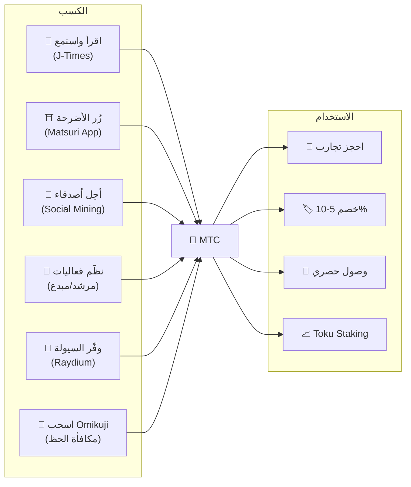
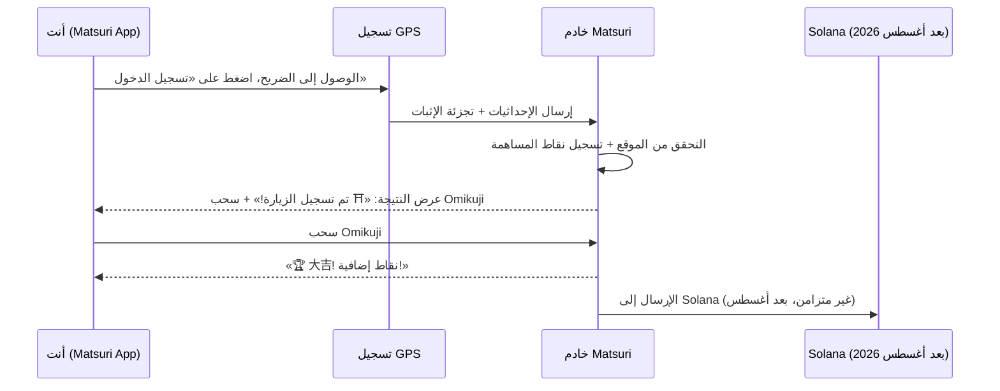
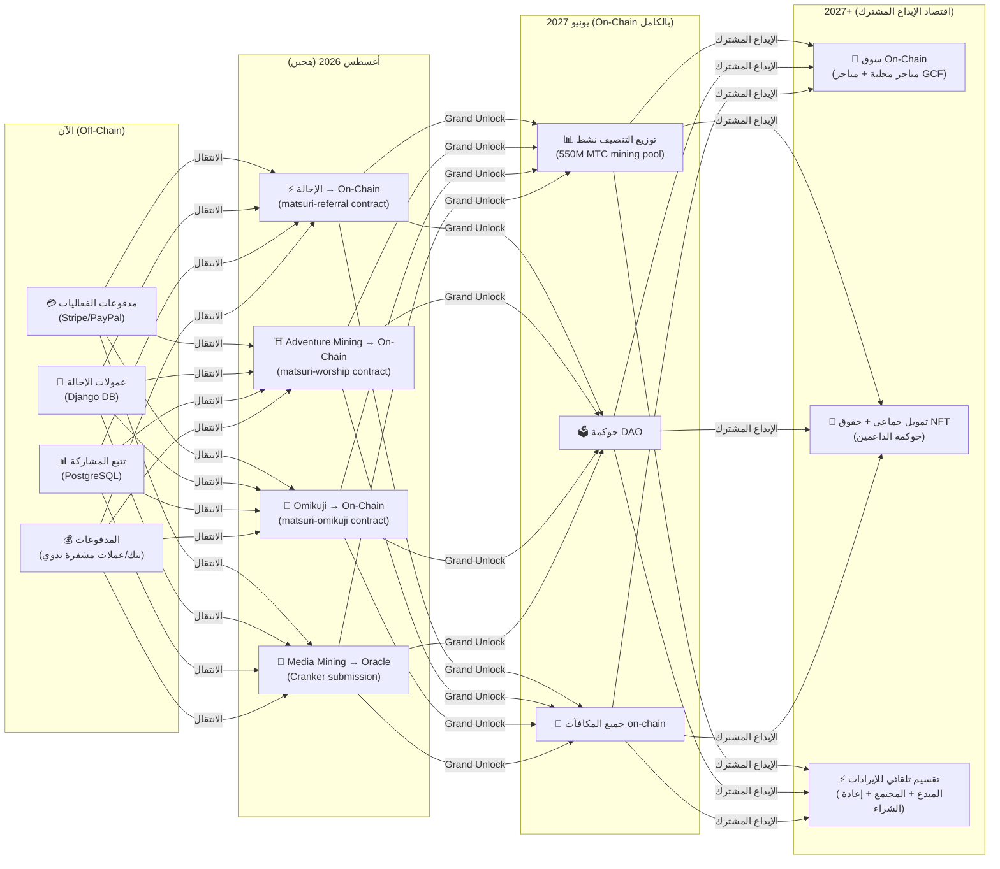

# 💎 كيفية كسب واستخدام MTC

> **اكسب من خلال العمل. أنفق على التجارب. احتفظ من أجل النمو.**
> MTC ليس مجرد رمز مضاربة — بل يتدفق عبر اقتصاد حقيقي حيث كل عمل يخلق قيمة ويحتفظ بها.

:::tip الصورة الكبرى
يتمتع MTC بـ **اقتصاد دائري متكامل**: تكسبه من خلال أنشطة حقيقية، وتنفقه على تجارب حقيقية، وتنمو قيمته مع توسع النظام البيئي. تُظهر لك هذه الصفحة بالضبط كيف يعمل ذلك.
:::

---

## دورة حياة MTC

---

## كيفية كسب MTC

### 1. 📖 Media Mining — اقرأ واستمع وشاهد على J-Times

افتح تطبيق **J-Times** واستهلك محتوى عن الثقافة اليابانية. كل إجراء مكتمل يكسبك MTC تلقائيًا.

| الإجراء | معيار الإتمام | المكافأة |
| :--- | :--- | :---: |
| **قراءة مقال** | التمرير حتى 75% من المحتوى | MTC |
| **الاستماع إلى بودكاست** | تشغيل المسار حتى النهاية | MTC |
| **مشاهدة فيديو** | مغادرة شاشة التفاصيل بعد المشاهدة | MTC |
| **مشاركة المحتوى** | عرض ورقة المشاركة | MTC |
| **إكمال اختبار** | اجتياز اختبار الفهم | MTC (فوري) |

:::info الدعم دون اتصال
لا يوجد إنترنت في ضريح ريفي؟ لا مشكلة. يسجل J-Times نشاطك محليًا و**يقوم بالمزامنة تلقائيًا عند عودتك للاتصال** (قائمة انتظار غير متصلة مع احتفاظ لمدة 7 أيام). لن تفقد أبدًا MTC المكتسبة.
:::

**كيف يعمل تقنيًا:**
1. يكتشف `EngagementTracker` في التطبيق أحداث الإتمام
2. تُضاف الإجراءات إلى قائمة الانتظار محليًا (حتى بدون اتصال)
3. عند استعادة الشبكة، تُجمَّع الإجراءات وتُرسَل إلى واجهة Django API
4. تتحقق الواجهة البرمجية وتُضيف MTC إلى رصيدك
5. بعد أغسطس 2026: ستُقدَّم الإجراءات on-chain عبر أوراكل Cranker

---

### 2. ⛩️ Adventure Mining — زيارة المواقع المقدسة مع Matsuri App

افتح تطبيق **Matsuri**، وابحث عن ضريح أو معبد على خريطة المواقع المقدسة، واذهب إليه وسجّل زيارتك. يُسجَّل نشاطك كـ **نقاط مساهمة**.

**كيف يعمل:**

**المبدأ الأساسي — المواقع الأقل زيارة تكسب أكثر:**

| نوع الموقع | أمثلة | النقاط |
| :--- | :--- | :---: |
| 🏙️ **رئيسي** | Sensoji، Kiyomizu-dera، Fushimi Inari | قياسي |
| 🌆 **إقليمي** | إيتشينوميا المحافظات، الأضرحة الكبرى الإقليمية | أعلى |
| 🏞️ **ريفي** | الأضرحة التاريخية في الريف | أعلى بكثير |
| ⛰️ **حدودي** | معابد جبلية، مواقع مقدسة في جزر نائية | الأعلى |

**عوامل النقاط الإضافية:**
- **تكرار الزيارة** — الزوار المنتظمون يكسبون أكثر بمرور الوقت
- **Omikuji** — سحب حظ عشوائي يضيف نقاط إضافية (大吉 هو الأفضل!)
- **المواقع المُموَّلة** — يمكن للبلديات تعزيز مواقع محددة

:::info نقاط المساهمة → MTC
يتراكم نشاطك كـ **نقاط مساهمة**. في كل حقبة تنصيف (بدءًا من يونيو 2027)، تُحوَّل النقاط إلى MTC من مجمع التعدين البالغ 550 مليون. كلما ساهمت أكثر مقارنة بالمجتمع، كلما حصلت على المزيد من MTC. سيتم تحديد معاملات التعزيز الدقيقة تدريجيًا وتنفيذها في العقود الذكية — لضمان توزيع عادل يتماشى مع حجم المجمع الفعلي.
:::

---

### 3. 🤝 Social Mining — أحِل أصدقاءك وابنِ شبكتك

شارك رمز الإحالة الخاص بك. عندما تتعامل شبكتك، تكسب تلقائيًا.

| المستوى | العلاقة | العمولة |
| :---: | :--- | :---: |
| **L1** | أنت → صديق (مباشر) | **20%** |
| **L2** | صديق → صديقه | **5%** |
| **L3** | الدرجة الثالثة | **5%** |
| **L4** | الدرجة الرابعة | **5%** |

**كيف تعمل نقاط En-Mining:**

تُحسب نقاط مساهمتك بناءً على عاملين:
- **مدى الشبكة** (30%) — كم شخصًا تجلب
- **النشاط الاقتصادي** (70%) — المشتريات الحقيقية من شبكة الإحالة الخاصة بك

> **ملاحظة رئيسية:** الجزء الأكبر من نقاطك يأتي من **النشاط الاقتصادي الحقيقي** في شبكتك، وليس مجرد التسجيلات. دعوة 1,000 شخص لا ينفقون أبدًا تكسب أقل من دعوة 10 مُنفقين نشطين.

تتراكم النقاط بمرور الوقت وتُحوَّل إلى MTC عند كل حقبة تنصيف. سيتم تقديم مُضاعفات التعزيز (مثل رهن MTC، التصنيفات الموسمية) تدريجيًا عبر العقود الذكية.

:::warning حاليًا Off-Chain → الانتقال إلى On-Chain في أغسطس 2026
يتم حاليًا تتبع عمولات الإحالة في Django (PostgreSQL) ودفعها عبر التحويل المصرفي أو العملات المشفرة. اعتبارًا من **أغسطس 2026**، سينتقل نظام عمولات الإحالة بالكامل إلى **العقد الذكي Matsuri Referral** على Solana — مما يجعل المدفوعات غير قابلة للتلاعب وفورية وقابلة للتدقيق on-chain.
:::

---

### 4. 🎪 Creator & Guide Mining — نظّم فعاليات واصنع محتوى

إذا كنت عضوًا في GCF أو مرشدًا أو صانع محتوى:

| النشاط | كيف تكسب |
| :--- | :--- |
| **تنظيم جولة** | عمولة المرشد (محددة لكل فعالية) + إكراميات |
| **بيع تذاكر الفعاليات** | مشاركة الإيرادات عبر EventPurchase |
| **نشر دورة تعليمية** | رسوم لكل تسجيل |
| **إنشاء حلقات بودكاست** | إيرادات الاشتراك |
| **إطلاق حملة تمويل جماعي** | مساهمات قائمة على Solana |

**نظام الإكراميات:** بعد كل فعالية، يمكن للضيوف منح إكراميات للمرشدين (بأسلوب Uber). تتم معالجة الإكراميات عبر Stripe وتتبعها على لوحة تصنيف عامة.

---

### 5. 🏦 Liquidity Mining — توفير السيولة على Raydium

وفّر سيولة MTC/SOL على منصة Raydium DEX واكسب مكافآت.

| العنصر | التفاصيل |
| :--- | :--- |
| **العائد السنوي المستهدف** | 20% (حافز سيولة مبكر) |
| **المنصة** | Raydium (Solana) |
| **من يمكنه المشاركة** | أي شخص يحمل MTC و SOL |

---

### 6. 🎲 مكافأة Omikuji — سحب الحظ

يتضمن كل تسجيل في Adventure Mining سحب Omikuji (حظ) مجاني — مكافأة إضافية فوق نقاطك المعتادة.

| الحظ | الندرة | المكافأة |
| :--- | :---: | :--- |
| 🏆 **大吉** (بركة عظيمة) | نادر | أعلى نقاط إضافية + NFT |
| ✨ **吉** (بركة) | غير شائع | نقاط إضافية جيدة |
| 🌸 **小吉** (بركة صغيرة) | شائع | مكافأة صغيرة |
| 🍃 **末吉** (بركة مستقبلية) | شائع | تسجيل المشاركة |
| 💀 **凶** (نحس) | غير شائع | تسجيل المشاركة |

تُحدَّد النتيجة بواسطة **بروتوكول commit-reveal مقاوم للتلاعب** على Solana. حتى الخادم لا يمكنه تغيير نتيجتك بعد مرحلة الالتزام. سيتم تحديد الاحتمالات الدقيقة ومبالغ المكافآت في تنفيذ العقد الذكي.

---

## أين تنفق MTC

| حالة الاستخدام | الفائدة | متاح |
| :--- | :--- | :---: |
| **🎫 حجز التجارب** | ادفع مقابل الجولات والفعاليات والأنشطة الثقافية بـ MTC | ✅ الآن |
| **🏷️ الخصم** | خصم 5–10% مقارنة بالتسعير بالين عند الدفع بـ MTC | ✅ الآن |
| **🔑 وصول حصري** | فعاليات بوابة NFT، حفلات VIP فقط، جولات خاصة | ✅ الآن |
| **📈 Toku Staking** | قفل MTC لتعزيز نقاط مساهمتك (حتى ~50% تعزيز) | 🔜 أغسطس 2026 |
| **🗳️ حوكمة DAO** | التصويت على الخزينة وترقيات البروتوكول واعتماد المواقع | 🔜 2027 |
| **🛍️ المتاجر الشريكة** | الدفع في المحلات والمطاعم المشاركة | 🔜 قيد التوسع |

:::info MTC كوسيلة دفع
في تطبيق Matsuri، يُعتبر MTC وسيلة دفع من الدرجة الأولى إلى جانب بطاقات الائتمان و Solana Pay. لا حاجة للتحويل — اختر «الدفع بـ MTC» عند الدفع ويُخصم الرصيد فورًا.
:::

### مثال: يوم في اقتصاد MTC

> **الصباح:** اقرأ 3 مقالات على J-Times في القطار ← اكسب MTC.
> **بعد الظهر:** زُر ضريحًا ريفيًا باستخدام تطبيق Matsuri ← سجّل زيارتك، اسحب 吉 (×1.5) ← اكسب المزيد من MTC.
> **المساء:** استخدم MTC المكتسبة لحجز جولة ثقافية في Golden Gai بقيمة ¥9,000 بخصم 10% (ادفع ما يعادل ¥8,100).
> **النتيجة:** فضولك الثقافي موَّل تجربة حقيقية — والمرشد والضريح والمجتمع حصلوا جميعًا على دفع مباشر. لم تأخذ أي وكالة سفر عبر الإنترنت عمولة 20%.

### الاستدامة الاقتصادية

:::warning ماذا يحدث عندما ينفد مجمع التعدين؟
صُمِّم مجمع تنصيف 550M MTC ليدوم **عقودًا** (20 حقبة × 2 سنة = 40 سنة نظريًا). لكن حتى بعد استنفاد المجمع:

- تستمر **رسوم المعاملات** من النشاط on-chain في مكافأة المشاركين في الشبكة
- يُنشئ **بروتوكول إعادة الشراء** (20-25% من إيرادات الأعمال) ضغط شراء دائم
- يقفل **Toku Staking** المعروض المتداول، مما يقلل ضغط البيع
- تحافظ **إيرادات الأعمال الحقيقية** (الفعاليات، العضويات، الدورات) على النظام البيئي بشكل مستقل عن توزيع الرموز

MTC مدعوم بـ **اقتصاد حقيقي** — وليس مجرد انبعاثات رموز.
:::

---

## خارطة طريق الانتقال إلى On-Chain

ينتقل اقتصاد Matsuri تدريجيًا من off-chain (Django/PostgreSQL) إلى on-chain (عقود Solana الذكية). يجعل هذا الانتقال جميع العمليات **غير قابلة للتلاعب وقابلة للتدقيق ومفتوحة للجميع**.

| المرحلة | الجدول الزمني | ما ينتقل إلى On-Chain |
| :--- | :--- | :--- |
| **المرحلة 1 (الآن)** | في الإنتاج | رمز MTC (SPL)، Raydium LP، التحقق عبر Solana Pay |
| **المرحلة 2 (أغسطس 2026)** | نشر العقود الذكية على الشبكة الرئيسية | عمولات الإحالة، مكافآت Adventure Mining، سحوبات Omikuji، Media Mining عبر أوراكل |
| **المرحلة 3 (يونيو 2027)** | Grand Unlock | توزيع تنصيف 550M MTC، حوكمة DAO، لامركزية كاملة |
| **المرحلة 4 (2027+)** | اقتصاد الإبداع المشترك | سوق on-chain (متاجر محلية + متاجر GCF)، تمويل جماعي مع حقوق NFT، تقسيم تلقائي للإيرادات إلى المبدعين + المجتمع + إعادة الشراء |

:::warning لماذا لا يتم نقل كل شيء on-chain اليوم؟
نقل كل شيء on-chain قبل **تدقيق أمني احترافي** (مُخطط له في الربع الثاني 2026) سيكون غير مسؤول. يتيح لنا النهج الهجين الحالي التكرار بأمان أثناء الاستعداد لعمليات on-chain غير قابلة للتلاعب. المكافآت off-chain لا تزال قابلة للتحقق — كل معاملة تحتوي على `solana_signature` كإثبات تسوية.
:::

---

**[▶ التالي: التطبيقات المحمولة](/docs/mobile-apps)** ｜ **[◀ السابق: النظام البيئي والتعدين](/docs/ecosystem)**
