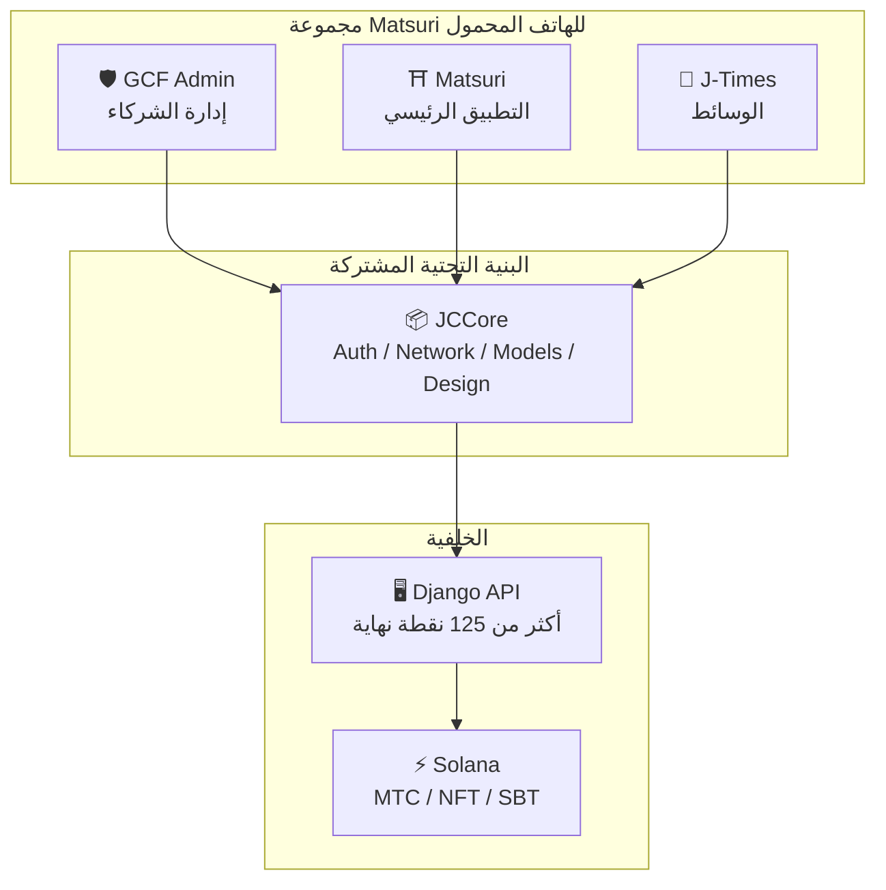
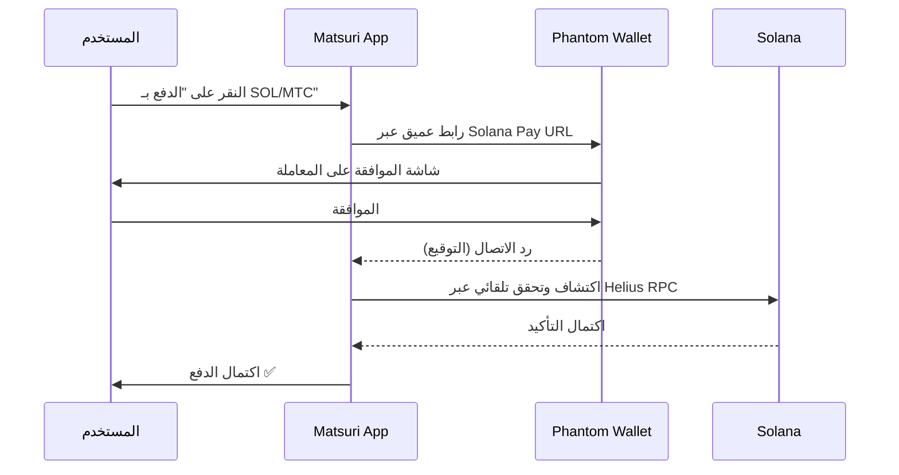
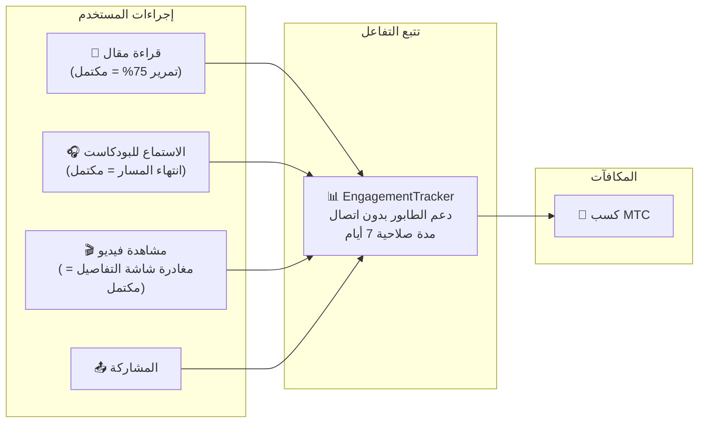
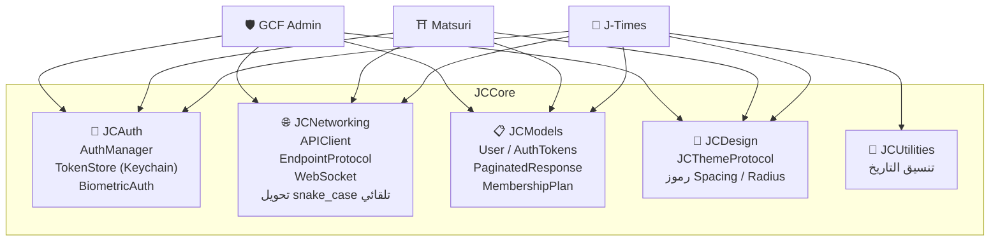

# 📱 مجموعة تطبيقات الهاتف المحمول

> **ثلاثة تطبيقات iOS أصلية تغطي جميع طبقات نظام Matsuri البيئي.**
> مبنية بالكامل بـ Swift 6 / iOS 17+. مصادقة موحدة وشبكات وتصميم عبر مكتبة **JCCore** المشتركة.

:::tip لماذا هذا مهم للمستثمرين
معظم مشاريع Web3 لديها موقع إلكتروني وورقة بيضاء. Matsuri لديها **3 تطبيقات iOS إنتاجية مع أكثر من 827 اختبار آلي**، وبنية تحتية مشتركة، وتكامل أصلي مع Solana. هذا عمق تنفيذ نادر في سوق التوكنات.
:::

---

## نظرة عامة على التطبيقات

| التطبيق | الغرض | الحالة | اللغات |
| :--- | :--- | :---: | :--- |
| **GCF Admin** | إدارة الشركاء والعمليات | ✅ صدر | 🇯🇵🇬🇧🇨🇳🇹🇭🇳🇴 |
| **Matsuri** | التطبيق الرئيسي للمستهلكين | 🔜 أواخر أبريل 2026 | 🇯🇵🇬🇧🇨🇳🇹🇭🇳🇴 |
| **J-Times** | وسائط ثقافية وتعلم | 🔜 أواخر أبريل 2026 | 🇯🇵🇬🇧 |

---

## 1. 🛡️ GCF Admin — تطبيق إدارة الشركاء

:::info الحالة: صدر على App Store (الإصدار 1.0)
تطبيق إدارة أعمال لأعضاء GCF (Global Community Friends). يجمع جميع وظائف لوحة التحكم على الويب في تطبيق محمول واحد.
:::

  
  
  

### ما يمكنك فعله بهذا التطبيق

| الفئة | الوظيفة |
| :--- | :--- |
| **📊 لوحة التحكم** | بطاقات مؤشرات الأداء الرئيسية، مخططات المبيعات، إجراءات سريعة |
| **👥 إدارة الأعضاء** | القائمة، التفاصيل، التحرير، إدارة المستويات |
| **💰 إدارة الإيرادات** | تتبع العمولات، إدارة سحب MTC، إدارة المدفوعات |
| **📝 إدارة المحتوى** | إنشاء وتحرير ونشر الفعاليات والمقالات والبودكاست والفيديوهات |
| **🎫 فتحات الأدلاء** | إدارة فتحات الأدلاء، تتبع الإيرادات |
| **🖼️ لوحة تحكم NFT** | Founder's Collection، التحقق على السلسلة، نقل NFT |
| **⛩️ إدارة المواقع المقدسة** | CRUD للمواقع، إعداد البيكون |
| **🎲 إعداد تعدين AR** | جداول احتمالات أوميكوجي، إدارة معاملات المكافآت |
| **📊 التحليلات** | تقارير الأخطاء، تحليل الاستخدام |
| **🔗 الإحالات** | إنشاء رموز QR مخصصة، إدارة برنامج الإحالة |

### المواصفات التقنية

| العنصر | التفاصيل |
| :--- | :--- |
| **البنية** | Clean Architecture + MVVM + `@Observable` (iOS 17) |
| **اللغة / SDK** | Swift 6.0 / Xcode 16+ / iOS 17.0+ |
| **تكامل API** | أكثر من 125 نقطة نهاية |
| **الاختبارات** | 226 اختبار / 45 فئة اختبار |
| **الترجمة** | 5 لغات (JA/EN/ZH/TH/NB) / أكثر من 957 مفتاح ترجمة |
| **Swift Concurrency** | متوافق مع Strict Concurrency / صفر تحذيرات بناء |

### تكامل رمز QR

يمكن لـ GCF Admin إنشاء رموز QR مخصصة تحمل شعار Matsuri. يدعم استخدامات متعددة مثل دعوات الفعاليات وروابط الإحالة وطلبات الدفع.

---

## 2. ⛩️ Matsuri — التطبيق الرئيسي

:::info الحالة: مخطط للإصدار في أواخر أبريل 2026 (الإصدار 3.0)
التطبيق الرئيسي للمستخدمين العاديين. كل شيء في تطبيق واحد — حجز الفعاليات، الدفع، محفظة Web3، وتعدين AR.
:::

  
  
  

### ما يمكنك فعله بهذا التطبيق

| الفئة | الوظيفة |
| :--- | :--- |
| **🎪 حجز الفعاليات** | البحث، الحجز، الدفع عبر Stripe، إدارة QR التذاكر |
| **💳 4 طرق دفع** | بطاقة ائتمان / بطاقة محفوظة / رصيد MTC / عملات مشفرة (SOL/MTC) |
| **👛 محفظة Web3** | عرض رصيد MTC، الإرسال/الاستقبال، سجل المعاملات |
| **🖼️ معرض NFT** | قائمة NFT/SBT المملوكة، التحقق على السلسلة |
| **🗺️ خريطة المواقع المقدسة** | عرض خريطة المعابد والأضرحة، تسجيل الدخول |
| **🎲 تعدين AR** | تجربة أوميكوجي WebAR، كسب MTC |
| **💬 الدردشة** | مراسلة مع قائمة سياقية |
| **⭐ قائمة الرغبات** | حفظ الفعاليات والتجارب المفضلة |
| **🔍 بحث متقدم** | دعم البحث الصوتي |
| **🤝 الإحالات** | المشاركة في برنامج الإحالة، تتبع المكافآت |
| **📊 لوحة تحكم GCF** | لوحة إدارة مبسطة لأعضاء GCF |

### تكامل Phantom Wallet — دفع بالعملات المشفرة بدون إدخال يدوي

> **لا حاجة لنسخ العناوين.** يُفتح Phantom Wallet تلقائياً، يوافق المستخدم، ويكتمل الدفع. يتم اكتشاف توقيعات المعاملات تلقائياً عبر Helius RPC — أسلس تجربة دفع بالعملات المشفرة في السوق.

:::tip لماذا هذا مهم
معظم تطبيقات Web3 تجبر المستخدمين على نسخ عناوين المحافظ وإدخال المبالغ يدوياً والانتظار للتأكيدات. تكامل Matsuri مع Solana Pay يختصر هذا إلى **نقرة واحدة** — مما يطابق تجربة مستخدم Apple Pay مع التسوية على السلسلة.
:::

### المواصفات التقنية

| العنصر | التفاصيل |
| :--- | :--- |
| **البنية** | Clean Architecture + MVVM + Swift Concurrency |
| **اللغة / SDK** | Swift 6.0 / Xcode 16+ / iOS 17.0+ |
| **الدفع** | Stripe PaymentSheet + MTC Balance + Phantom (Solana Pay) |
| **تكامل API** | 72 نقطة نهاية / 16 فئة |
| **الاختبارات** | أكثر من 230 (Model, ViewModel, Network, Security, DeepLink, E2E) |
| **الترجمة** | 5 لغات (JA/EN/ZH/TH/NB) / 406 مفتاح ترجمة |
| **عدد ViewModels** | 25 (MVVM كامل — صفر استدعاءات API مباشرة من Views) |
| **المصادقة** | Apple Sign In / Google Sign In (PKCE) |

---

## 3. 📰 J-Times — تطبيق الوسائط الثقافية

:::info الحالة: مخطط للإصدار في أواخر أبريل 2026
منصة وسائط تنقل عمق الثقافة اليابانية. اقرأ المقالات، استمع للبودكاست، شاهد الفيديوهات — اكسب MTC من كل إجراء.
:::

  

### ما يمكنك فعله بهذا التطبيق

| الفئة | الوظيفة |
| :--- | :--- |
| **📖 المقالات** | صورة بارالاكس رئيسية، حرف استهلالي كبير، شريط تقدم القراءة، محتوى غني (Markdown، جداول، اقتباسات) |
| **🎧 البودكاست** | تصفح السلاسل، مشغل بشكل موجي، مؤقت النوم، AirPlay، التحكم من شاشة القفل |
| **🎬 الفيديوهات** | عرض شبكة/قائمة تكيفي، فيديوهات قصيرة (نمط TikTok، نقر مزدوج) |
| **🔍 البحث** | فلاتر متعددة، وسوم رائجة، بحث صوتي |
| **🧭 الاستكشاف** | كاروسيل مميز، اختيارات المحررين، الأكثر شعبية هذا الأسبوع |
| **📚 المكتبة** | المفضلة، السجل (حسب التاريخ)، التنزيلات، قوائم التشغيل |
| **🎵 مشغل الصوت** | مشغل مصغر (التحكم بالسحب)، مشغل كامل (شكل موجي، كلمات، تكرار) |
| **👤 العضوية** | مقارنة الميزات لـ 3 مستويات (Free / Premium / Pro)، استعادة المشتريات |

### Media Mining — القراءة والاستماع والمشاهدة تصبح تعديناً

> **يتم التسجيل حتى بدون إنترنت.** حتى لو قرأت مقالاً في معبد عميق في الجبال بدون تغطية، يتم إرسال بيانات التفاعل تلقائياً عند استعادة الاتصال، ويتم منح MTC.

### نظام التصميم — الجماليات اليابانية في "أربعة أعمدة"

يستخدم J-Times نظام تصميم فريد يترجم الجماليات اليابانية التقليدية إلى واجهة مستخدم حديثة.

| العمود | المفهوم | التطبيق في واجهة المستخدم |
| :--- | :--- | :--- |
| **墨 (Sumi)** | درجات رمادية محايدة دافئة | لون الخلفية، تسلسل النص |
| **朱 (Shu)** | الأحمر الياباني (#C53030) | لون التمييز، الإجراءات المهمة |
| **間 (Ma)** | مسافات بشبكة 4pt | التباعد، مساحة التنفس |
| **紙 (Kami)** | نسيج دقيق، تأثير الزجاج | أسطح البطاقات، تعبير العمق |

### المواصفات التقنية

| العنصر | التفاصيل |
| :--- | :--- |
| **البنية** | Clean Architecture + MVVM + Swift Concurrency |
| **اللغة / SDK** | Swift 6.0 / Xcode 16+ / iOS 17.0+ |
| **التبعيات الخارجية** | **صفر** — أطر عمل Apple الأصلية فقط |
| **تكامل API** | أكثر من 40 نقطة نهاية |
| **الاختبارات** | 371 اختبار / 20 ملف |
| **الترجمة** | لغتان (JA/EN) / أكثر من 310 مفتاح ترجمة |
| **دعم عدم الاتصال** | ContentCache (50MB) + ImageDiskCache (200MB) + مدير التنزيلات |
| **المصادقة** | Apple Sign In / Google Sign In (PKCE) |

---

## البنية التحتية المشتركة: مكتبة JCCore

مكتبة Swift Package مشتركة تستخدمها جميع التطبيقات الثلاثة.

| الوحدة | الدور |
| :--- | :--- |
| **JCAuth** | إدارة الرموز المميزة المبنية على Keychain، المصادقة البيومترية (Face ID / Touch ID) |
| **JCNetworking** | عميل API آمن النوع، WebSocket، تحويل JSON snake_case تلقائي |
| **JCModels** | نماذج بيانات مشتركة عبر التطبيقات (User, AuthTokens, إلخ.) |
| **JCDesign** | بروتوكول السمات، رموز التصميم (التباعد، الزوايا المستديرة) |
| **JCUtilities** | أدوات التاريخ والسلاسل النصية |

---

## الأمان والخصوصية

| العنصر | التنفيذ |
| :--- | :--- |
| **رموز المصادقة** | تخزين مشفر في iOS Keychain (TokenStore) |
| **المصادقة البيومترية** | مصادقة ثنائية العامل عبر Face ID / Touch ID |
| **اتصال API** | HTTPS + Certificate Pinning |
| **المفاتيح الخاصة للمحفظة** | لا يتم تخزين المفاتيح الخاصة في التطبيق — مفوضة إلى Phantom Wallet |
| **تعدين AR** | لا يتم إرسال صور الكاميرا إلى الخادم (VisionProof) |
| **البيانات بدون اتصال** | تشفير SwiftData + انتهاء صلاحية تلقائي |
| **Swift Concurrency** | منع حالات السباق من خلال عزل actor |

---

## جودة التطوير

إجمالي **أكثر من 827 اختبار آلي** عبر جميع التطبيقات الثلاثة.

| التطبيق | عدد الاختبارات | مجالات التغطية |
| :--- | :---: | :--- |
| **GCF Admin** | 226 | Model, ViewModel, Repository, API, Localization, Navigation |
| **Matsuri** | 230+ | Model, ViewModel, Network, Security, DeepLink, Regression, Performance, E2E |
| **J-Times** | 371 | Model, ViewModel, API, Repository, Navigation, Localization, Security, Performance |

---

**[▶ التالي: خارطة الطريق والفريق](/docs/roadmap)** | **[◀ السابق: النظام البيئي والتعدين](/docs/ecosystem)**
