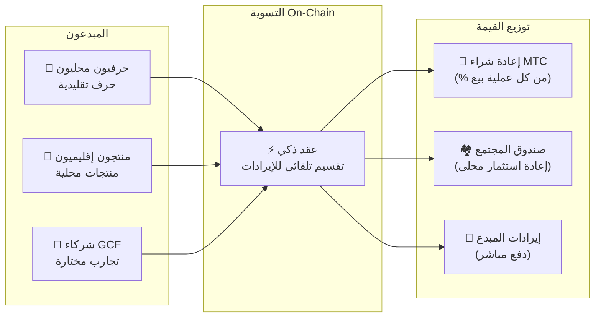

# 🗓️ خارطة الطريق والحوكمة

> **الطريق نحو اليقين.**
> هذا ليس مشروعًا مضاربيًا قصير الأجل.
> **تطوير المنصة الأساسية اكتمل بالفعل** — نحن في مرحلة التوسع.

---

## المعالم الاستراتيجية

### 🔥 المرحلة 1: الصحوة (النصف الأول 2026 — الحالية)

**المحور: بناء الأساس وتوليد التدفقات النقدية**

المنتج جاهز. التركيز الحالي على تحقيق الإيرادات عبر النظام المالي بإشراف المدير التنفيذي وتأمين السيولة الأولية.

| الحالة | المعلم | التفاصيل |
| :---: | :--- | :--- |
| ✅ | **إطلاق المنتج** | تطبيق Matsuri ولوحة إدارة GCF يعملان |
| ✅ | **المدفوعات والنمو** | مدفوعات MTC + وظائف إيردروب الإحالة مكتملة |
| ✅ | **إطلاق الإعلام** | بنية توزيع J-Times (ويب + بودكاست) جاهزة |
| ✅ | **التكوين** | حدث إصدار رمز MTC على Solana |
| ✅ | **السيولة** | إنشاء مجمع LP الأولي على Raydium |
| ⬜ | **برنامج الحوافز** | إطلاق تعدين السيولة بهدف APY 50% |
| ⬜ | **تشغيل النظام** | روبوت MEV/المراجحة على Solana في الإنتاج |
| ⬜ | **تجنيد VIP** | اختيار أول 20 عضو VIP في GCF |

### 🚀 المرحلة 2: التوسع (النصف الثاني 2026)

**المحور: أصول العالم الحقيقي وتعدين المغامرة**

استثمار التطبيق المكتمل لتوسيع القواعد الفعلية وميزة «الحج».

| الحالة | المعلم | التفاصيل |
| :---: | :--- | :--- |
| ⬜ | **إطلاق الميزة** | تعدين المغامرة (الحج) ينطلق |
| ⬜ | **التوسع العالمي** | قواعد شريكة وفعاليات VIP في آسيا (تايلاند، تايوان، إلخ) |
| ⬜ | **إدارة الأصول** | بناء محفظة عقارات وأسهم وأصول رقمية من الإيرادات |
| ⬜ | **الهدف** | إجمالي AUM للنظام البيئي: **¥1 مليار (~$6.5 مليون)** |

### 🌊 المرحلة 3: الدوران (2027+)

**المحور: التبني واسع النطاق، اقتصاد الإبداع المشترك واللامركزية**

الإطلاق العام، السوق اللامركزي on-chain والتشغيل الكامل للنظام البيئي.

| الحالة | المعلم | التفاصيل |
| :---: | :--- | :--- |
| ⬜ | **الافتتاح الكبير** | إطلاق تطبيق Matsuri عالميًا |
| ⬜ | **الفتح الكبير (1 يونيو 2027)** | رفع قفل المؤسس + مجمع التعدين (550 مليون MTC) ينشط + بدء دورة التنصيف |
| ⬜ | **سوق الإبداع المشترك** | متاجر المنتجات المحلية + متاجر شركاء GCF — تسوية on-chain مع إعادة شراء MTC تلقائيًا |
| ⬜ | **التمويل الجماعي مع حقوق NFT** | يموّل المستخدمون مشاريع ثقافية على Solana. يحصل الداعمون على NFT تمثل الملكية أو مشاركة الإيرادات أو حقوق الحوكمة على المشروع المموَّل |
| ⬜ | **تسوية المتاجر On-Chain** | جميع معاملات السوق تُسوَّى عبر العقود الذكية — نسبة من كل عملية بيع تتدفق تلقائيًا إلى مجمع إعادة شراء MTC |
| ⬜ | **الهدف** | إجمالي AUM للنظام البيئي: **¥10 مليار (~$65 مليون)** |
| ⬜ | **التحول إلى DAO** | نقل جزئي لصلاحية اتخاذ القرار إلى مجتمع GCF |

#### 🏪 رؤية سوق الإبداع المشترك

التعبير الأسمى عن «Culture OS» — سوق لامركزي حيث **يتعامل صانعو الثقافة وعشاق الثقافة مباشرة**، بدون وسطاء استغلاليين.

| الميزة | الوصف | الحالة |
| :--- | :--- | :---: |
| **🏺 متاجر المنتجات المحلية** | يبيع الحرفيون والمنتجون الإقليميون مباشرة لجمهور عالمي. الدفع بـ MTC = خصم 5–10% | ⬜ رؤية |
| **🎫 تمويل جماعي + حقوق NFT** | موّل مشروعًا ثقافيًا (ترميم ضريح، إحياء مهرجان، ورشة حرفيين). احصل على NFT يمثل مساهمتك — مع إمكانية مشاركة الإيرادات أو حقوق الحوكمة | ⬜ رؤية |
| **⚡ التسوية On-Chain** | كل معاملة في السوق تُسوَّى عبر عقود Solana الذكية. تُوزَّع الإيرادات تلقائيًا: دفع المبدع + صندوق المجتمع + إعادة شراء MTC — بدون محاسبة يدوية | ⬜ رؤية |
| **🗳️ حوكمة الداعمين** | يصوّت حاملو NFT على كيفية تخصيص الموارد في المشاريع المموَّلة — إبداع مشترك حقيقي، وليس مجرد تبرع | ⬜ رؤية |

:::info لماذا هذا مهم
اليوم، يشتري السياح الهدايا التذكارية من متاجر تدفع إيجارًا لأصحاب المنصات. غدًا، **سيبيع حرفي في ريف كيوتو مباشرة لمعجب في كوبنهاغن** — ونسبة من تلك العملية ستُقوّي اقتصاد MTC تلقائيًا. هذه هي «دولاب الموازنة» في أكمل تعبيراته.
:::

---

## 👤 الفريق

### Ko Takahashi — المؤسس / المدير التنفيذي وكبير المعماريين

| العنصر | التفاصيل |
| :--- | :--- |
| **الدور** | القيادة الشاملة للمشروع. تصميم وتطوير الخوارزمية المالية الأساسية (روبوت MEV على Solana) |
| **الرؤية** | مبتكر مفهوم «تصدير الثقافة، استيراد الثروة» |
| **الموقف** | يكتب الكود نهارًا ويدير باره في Golden Gai ليلاً — التجسيد الحقيقي لـ «المشاركة الفعلية» |

### Jon Anders Jensen

### Ryunosuke Honda

### 🌏 مجتمع GCF — مساهمون في التطوير حول العالم

لم يُبنَ Matsuri Protocol من قِبل الفريق المؤسس وحده.
**أعضاء GCF حول العالم** يساهمون من خلال الاختبار والملاحظات والترجمة والتوسع الإقليمي.

| المجال | الفريق |
| :--- | :--- |
| **💼 المالية العالمية** | شبكة مستثمرين خاصين عبر آسيا |
| **⚙️ الهندسة** | فريق هندسة موزَّع لتطوير البلوكتشين والتطبيقات المحمولة |
| **🏮 العمليات** | خط أنابيب قوي مع المجتمعات المحلية في شينجوكو Golden Gai والوجهات السياحية الكبرى |
| **🌐 المجتمع** | أعضاء GCF متعددو الجنسيات من اليابان والنرويج وتايلاند وتايوان وغيرها |

:::tip ابنِ معنا بنية الثقافة التحتية
انضم إلى GCF وكن مطورًا مشاركًا في Matsuri Protocol.
المساهمة ليست فقط كتابة الكود — تعريف المواقع المقدسة المحلية وترجمة الوثائق وتنظيم الفعاليات — كل شيء يساعد في نشر هذا البروتوكول إلى العالم.
:::

### الشركاء الاستراتيجيون

| المجال | الفريق |
| :--- | :--- |
| **💼 المالية العالمية** | شبكة مستثمرين خاصين عبر آسيا |
| **⚙️ الهندسة** | فريق هندسة موزَّع لتطوير البلوكتشين والتطبيقات المحمولة |
| **🏮 العمليات** | خط أنابيب قوي مع المجتمعات المحلية في شينجوكو Golden Gai والوجهات السياحية الكبرى |

---

## 🏛️ الحوكمة (DAO)

سينتقل Matsuri Protocol تدريجيًا إلى **منظمة مستقلة لامركزية (DAO)**.
أعضاء GCF (بلاتينيوم/ذهبي) سيحصلون على **حق التصويت** في القرارات الرئيسية:

| التصويت | النطاق |
| :--- | :--- |
| **💰 تخصيص الأموال** | أي مبادرات جديدة أو حملات تسويقية سيتم تمويلها |
| **⚙️ تحديثات البروتوكول** | ضبط معدلات الرسوم ومنحنيات مكافآت التعدين |
| **⛩️ الشهادة الثقافية** | أي المهرجانات والمعابد يتم اعتمادها كـ «مواقع حج رسمية» وتمويلها |

:::info انضم إلى الثورة
نحن لا نبني مجرد تطبيق.
نحن نبني **اقتصادًا ثقافيًا بلا حدود**.
:::

---

**[◀ العودة إلى بداية الورقة البيضاء](/docs/intro)** ｜ **[انضم إلى Discord](#)**
