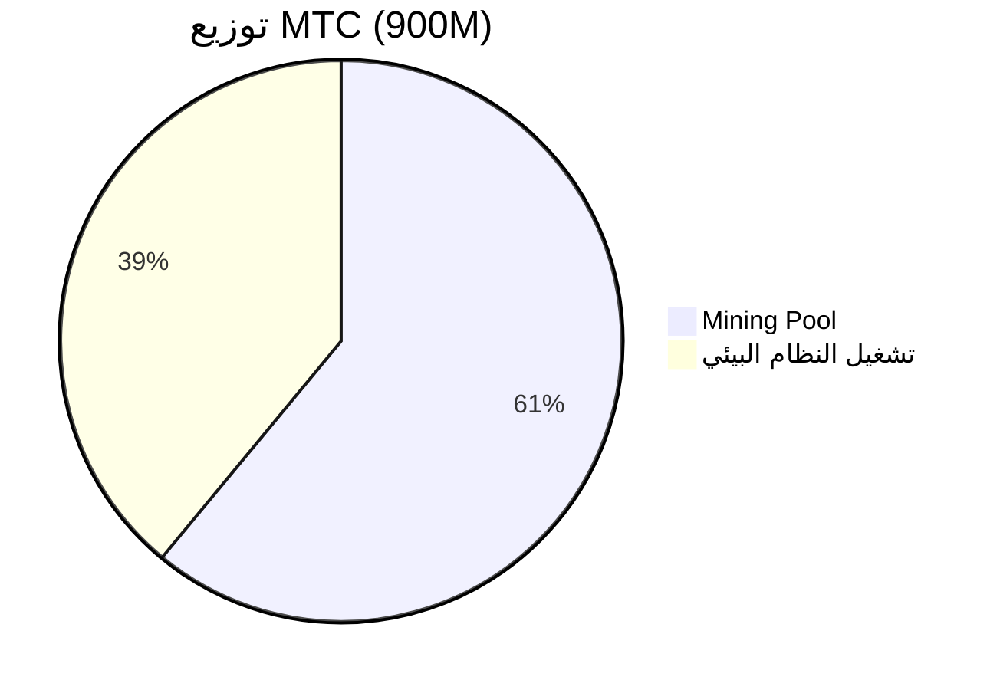
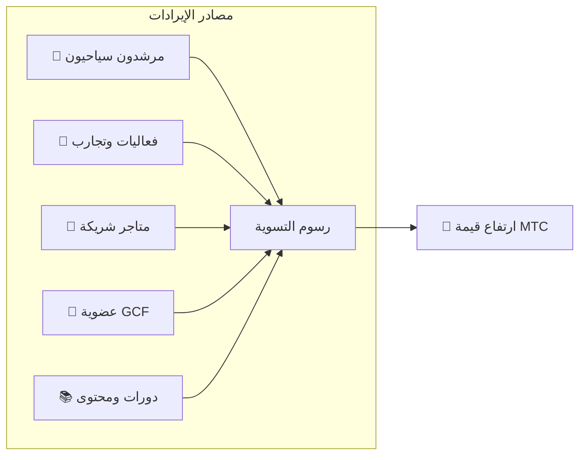

# 💰 التوكنوميكس — التصميم الاقتصادي لـ MTC

> **الثقة محفورة في الكود.**
> التصميم الاقتصادي لـ MTC ليس وعدًا من أحد، بل مضمون بالرياضيات والبلوكتشين.


> **«نظام اقتصادي لا يمكن فيه فرض تغيير الوضع الراهن بالقوة» — هذه هي توكنوميكس MTC.**

يقوم التصميم الاقتصادي لـMatsuri Coin (MTC) على قناعة واحدة:
**قواعد لا يستطيع حتى فريق التشغيل العبث بها، هي أكبر ضمانة للمستثمر.**

حجم المعروض ثابت إلى الأبد. لا مزيد من الإصدار ولا تجميد ممكن. نمو الأعمال ينعكس في السعر بمستوى رياضي —
هذه ليست «وعدًا»، بل **حقيقة** منقوشة على البلوكتشين.

في هذه الصفحة، نكشف كامل الآليات الاقتصادية لـ MTC بشفافية.

---

## مواصفات التوكن

لضمان أمان المستثمرين، **تخلّينا** نهائيًا عن «صلاحية السكّ (Mint Authority)» و«صلاحية التجميد (Freeze Authority)» على Solana.
الإصدار الإضافي مستحيل إلى الأبد، وتجميد الأموال مستحيل أيضًا. **تصميم Trustless كامل**.

| البند | التفاصيل |
| :--- | :--- |
| **اسم التوكن** | Matsuri Coin |
| **الرمز** | MTC |
| **الشبكة** | Solana |
| **عنوان السكّ (Mint Address)** | `DRENpzmRWM4TwECrCPCfS1k5VBPmanhQg9bcCWP8EZXF` [Solscan →](https://solscan.io/token/DRENpzmRWM4TwECrCPCfS1k5VBPmanhQg9bcCWP8EZXF) |
| **إجمالي المعروض** | **900 مليون** (900,000,000 MTC) ثابت |
| **صلاحية السكّ** | 🚫 تمّ التخلي عنها ([قابل للتحقق on-chain](https://solscan.io/token/DRENpzmRWM4TwECrCPCfS1k5VBPmanhQg9bcCWP8EZXF)) |
| **صلاحية التجميد** | 🚫 تمّ التخلي عنها ([قابل للتحقق on-chain](https://solscan.io/token/DRENpzmRWM4TwECrCPCfS1k5VBPmanhQg9bcCWP8EZXF)) |
| **إدارة القفل** | Streamflow Finance (تم التحقق) |

:::info لماذا هذا مهم
التخلي عن صلاحية السكّ يعني «لا يستطيع فريق التشغيل سكّ توكن لتخفيف حصتك دون إذنك». التخلي عن صلاحية التجميد يعني «لا أحد يستطيع تجميد محفظتك». هذا هو جوهر الـTrustless (عدم الحاجة للثقة).
:::

---

## توزيع التوكن

يوزَّع 900M MTC كما يلي.



| الفئة | النسبة | العدد | الاستخدام |
| :--- | :---: | :--- | :--- |
| **⛏️ Mining Pool** | **61%** | 550 مليون | مجمع مكافآت للمساهمين. يُفتح في يونيو 2027، يُطلق بنصفنة كل سنتين. توزيع بحسب نقاط المساهمة |
| **🌐 تشغيل النظام البيئي** | **39%** | 350 مليون | التسويق، توزيع GCF، نفقات التشغيل، الحصول على LP، التطوير، الإعلان، تنظيم الفعاليات إلخ |

:::note نظام إطلاق Mining Pool
550M MTC لا يُطلق دفعة واحدة. وفق جدول نصفنة كل سنتين، **يُوزَّع تدريجيًا بحسب نقاط المساهمة**. تُنفَّذ قواعد الإطلاق والتوزيع تباعًا كعقد ذكي بدءًا من أواخر 2026، وتصبح قابلة للتحقق on-chain.
:::

:::note حول فئة تشغيل النظام البيئي
فئة التشغيل 39% هي أموال متعددة الأغراض لازمة لنمو النظام البيئي. تشمل الاستخدامات: التسويق، التوزيع الأولي لأعضاء GCF، توفير لـRaydium Liquidity Pool، مكافآت فريق التطوير، الإعلان، نفقات تنظيم الفعاليات الثقافية. تخضع شفافية الاستخدام لحوكمة المجتمع بعد الانتقال إلى DAO.
:::

---

## هيكل الإيرادات

ما يدعم قيمة MTC هو **إيرادات الأعمال الحقيقية**. ليست المضاربة، بل النشاط الاقتصادي الحقيقي ما يسند قيمة التوكن.



| المصدر | المحتوى |
| :--- | :--- |
| **🏯 التجارب والمرشدون** | رسوم التسوية من المرشدين السياحيين والفعاليات الثقافية |
| **🤝 عضوية GCF** | رسوم العضوية |
| **📚 المحتوى** | رسوم الدورات، اشتراكات الإعلام |
| **🏪 السوق** | رسوم التداول من المتاجر الشريكة (توسّع تدريجي) |

:::tip نمو مسنود بالطلب الحقيقي
كلما زاد عدد السياح الوافدين، تدفقت عملة أجنبية ووسّع النظام البيئي. قيمة MTC لا تحددها المضاربة، بل **عدد من يعيشون الثقافة**.
:::

---

## الأداء الحالي للأعمال

اقتصاد MTC لا يزال في مراحله الأولى، لكن النشاط الحقيقي قد بدأ.

| المؤشر | الإنجاز |
| :--- | :--- |
| **عدد الفعاليات المنظّمة** | أكثر من 50 (تشغيل تجريبي) |
| **أعضاء GCF Platinum** | 20 عضوًا منضمًا (من أصل 50) |
| **أعضاء GCF Gold** | التسجيل يبدأ قريبًا |
| **منصة الويب** | تعمل. يُشغَّل بشكل تجريبي لجمع المستخدمين |
| **تطبيق iOS** | مكتمل التطوير، إطلاق مقرر أبريل 2026 |

:::note بصراحة
ليس لدينا بعد «سجل نجاح كبير». 50 فعالية وتشغيل تجريبي — هذا هو الواقع الآن. لكن المنتج يعمل، والمجتمع موجود، ونحن في مرحلة التوسّع الفعلي من هنا.
:::

---

## بروتوكول Buy-back (إعادة الشراء)

لن نضع الأرباح «في جيب فريق التشغيل».
سياستنا توجيه نسبة محددة من إيرادات الأعمال لإعادة شراء MTC من السوق.

| المصدر | معدل الإعادة | الفعل |
| :--- | :---: | :--- |
| **مبيعات Matsuri الرئيسية** (المرشدون، الفعاليات) | **20%** | **إعادة شراء** من السوق + إضافة إلى Liquidity Pool |
| **عضوية GCF** (رسوم العضوية) | **25%** | **إعادة شراء** من السوق |

:::info الحالة الراهنة لإعادة الشراء
سيبدأ بروتوكول Buy-back التشغيل **قريبًا** مع تصاعد إيرادات الأعمال. في البداية يُنفَّذ off-chain (يدويًا)، وينتقل تدريجيًا إلى تنفيذ تلقائي عبر عقد ذكي بعد أواخر 2026. بعد الانتقال on-chain، يصبح سجل تنفيذ إعادة الشراء قابلًا للتحقق من أي شخص على البلوكتشين.
:::

إعادة الشراء ليست وعدًا بـ «سنفعله يومًا ما». بل قاعدة مبرمجة كبروتوكول. في كل مرة ترتفع فيها مبيعات الأعمال، يُمتصّ MTC تلقائيًا من السوق — هذه **طمأنينة هيكلية** للمستثمرين.

---

## منطق تحديد السعر

آلية ارتفاع سعر MTC لا تعتمد على التمنّي بل على **معادلة الـAMM (Automated Market Maker)**.

```
السعر = السيولة (SOL) ÷ المعروض (MTC)
```

| الخطوة | ماذا يحدث | النتيجة |
| :---: | :--- | :--- |
| **①** | تُضخّ إيرادات الأعمال (SOL) في المجمع | **البسط يزيد** |
| **②** | يُعاد شراء MTC من السوق بتلك الأموال ويُحرق | **المقام ينقص** |
| **③** | البسط ↑ × المقام ↓ | **تتهيأ ظروف ارتفاع الندرة** |

:::info شرح آلية، لا ضمان سعر
تُبيّن هذه المعادلة التصميم الهيكلي: «حين تستمر إيرادات الأعمال ويُنفَّذ Buy-back، يتحرك توازن العرض والطلب باتجاه الندرة». يتأثر السعر الفعلي بالعرض والطلب في السوق والبيئة الخارجية والسيولة وعوامل كثيرة.
:::

---

## جدول النصفنة

الـ**550 مليون (حوالي 61% من إجمالي المعروض)** المقفلة حتى 1 يونيو 2027، لن تُباع في السوق، بل تُحفظ كـ**مجمع مكافآت للمساهمين**.

نعتمد **نصفنة كل سنتين** — أسرع من دورة Bitcoin رباعية السنوات.
كل سنتين يُقسَّم إطلاق التوكن نصفًا، ونظريًا تستمر المكافآت لعقود.

| الفترة | نسبة الإطلاق | الكمية | النسبة التراكمية |
| :--- | :---: | :--- | :---: |
| **الدورة 1** 2027 – 2029 | **50%** | حوالي 275 مليون | 50% |
| **الدورة 2** 2029 – 2031 | **25%** | حوالي 137 مليون | 75% |
| **الدورة 3** 2031 – 2033 | **12.5%** | حوالي 68 مليون | 87.5% |
| **الدورة 4** 2033 – 2035 | **6.25%** | حوالي 34 مليون | 93.75% |
| **الدورة 5 وما بعدها** | تواصل النصفنة | تناقص تدريجي | → تقارب 100% |

<small>*※ رياضيًا لا تصل إلى 100% أبدًا، وتقترب كمية الإطلاق من الصفر بلا حدود. المبدأ ذاته في Bitcoin.*</small>

:::tip مبكرًا تبدأ المساهمة، أكثر MTC تتلقّى
بفضل النصفنة، كمية الإطلاق في الدورة 1 (2027〜2029) هي الأكبر، وتتناقص في كل حقبة. أي أن **من يراكم نقاط المساهمة منذ البداية يتلقى أكبر قدر من MTC**.

أمثلة على الأنشطة المنعكسة في نقاط المساهمة:
- إنشاء الفعاليات وإنجازات استقطاب الحضور
- تشغيل دورات مرشدين مشهورة
- اكتشاف وتأهيل مرشدين متميزين
- مشاهدات ومشاركات محتوى J-Times
- عدد Check-in للحج الثقافي

المكافآت لا تُحدد بـ«ترتيب المشاركة»، بل بـ**«حجم وجودة المساهمة»**.
:::

---

:::note إلى الصفحة التالية
بعد فهم التصميم الاقتصادي لـ MTC، تعرّف الآن على **كيفية الانضمام كشريك**.
**[عضوية GCF →](/docs/gcf)**
:::
