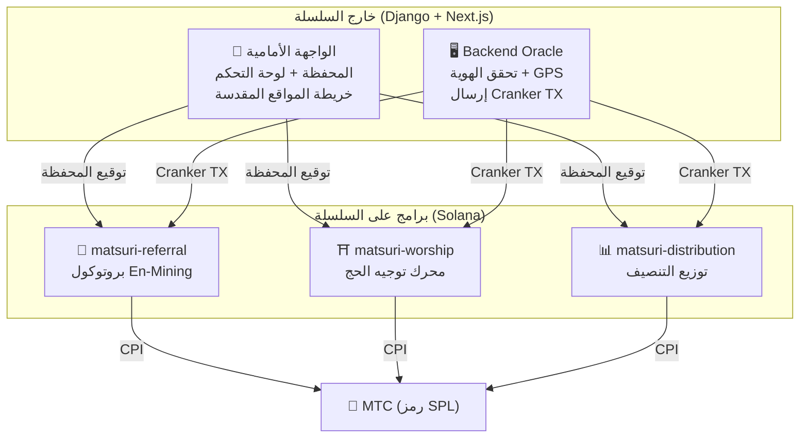
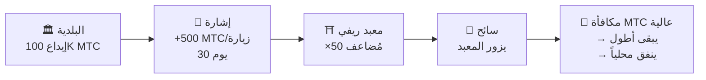
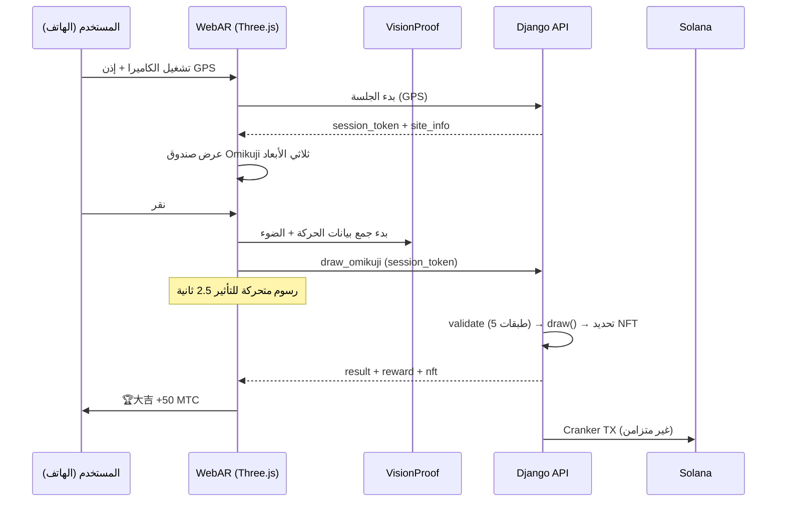

# ⚡ العقود الذكية — بنية مفتوحة المصدر

> **تصميم بلا حاجة للثقة (Trustless).**
> منطق المكافآت وأشجار الإحالة وجداول التنصيف — كل شيء يُنفَّذ **على السلسلة** عبر برامج Rust قابلة للتدقيق.
> الكود المصدري: [GitHub](https://github.com/Cootakahashi/matsuri-contracts)

---

## نظرة عامة

ينشر Matsuri **ثلاثة برامج Anchor (Rust)** على Solana، كل منها يتعامل مع ركيزة مميزة من النظام البيئي:



---

## 1. 📣 بروتوكول En-Mining (縁マイニング)

**الغرض:** محرك نمو هجين يكافئ كلاً من *الاتساع* (مدى الإحالة) و*العمق* (التأثير الاقتصادي). ليس مجرد برنامج انتساب — بل بروتوكول تعدين كامل حيث النشاط الاقتصادي الحقيقي يولّد قيمة على السلسلة.

### تصميم التقييم

تستند نقاط المساهمة إلى مكونين مرجحين:

| المكوّن | الوزن | الغرض |
| :--- | :---: | :--- |
| **الاتساع** (عدد الإحالات) | 30% | مدى الشبكة — كم شخصاً تجلب |
| **العمق** (حجم التسوية) | 70% | التأثير الاقتصادي — مشتريات حقيقية، ليس مجرد تسجيلات |

تتراكم النقاط بمرور الوقت وتُحوَّل إلى MTC عند كل حقبة تنصيف. آليات تعزيز إضافية مخططة:

| التعزيز | الوصف | الحالة |
| :--- | :--- | :---: |
| **رهن Toku (徳)** | أقفل MTC لتعزيز نقاط مساهمتك (حتى ~50% تعزيز). سيتم معايرة المستويات والمُضاعفات الدقيقة بناءً على جدول إصدار مجمع التنصيف | المعاملات قيد التحديد |
| **التصنيفات الموسمية** | أفضل المؤدين في كل حقبة يحصلون على لقب **مبشّر** (SBT دائم) وتعزيز نقاط. سيتم تحديد النسب المئوية الدقيقة عبر الحوكمة | المعاملات قيد التحديد |

:::info تصميم المعاملات التدريجي
معاملات التعزيز (مستويات الرهن، مكافآت التصنيف) تُترك قابلة للتعديل عمدًا. سيتم تحديدها بناءً على بيانات النظام البيئي الحقيقية — إجمالي المستخدمين النشطين، ومعدل إصدار مجمع التنصيف، وأهداف استقرار السعر — ثم تُقفل في العقود الذكية. يضمن هذا النهج **توزيعًا عادلًا** دون المبالغة في وعود العوائد الثابتة.
:::

### دفاع مضاد لـ Sybil (3 طبقات)

| الطبقة | الآلية | الموقع |
| :--- | :--- | :--- |
| **بوابة الهوية** | X/Twitter OAuth + SMS | خارج السلسلة (Django) |
| **بوابة على السلسلة** | فقط الملفات الشخصية `is_verified = true` تكسب | العقد الذكي |
| **ترجيح العمق** | 70% من النقاط = مدفوعات حقيقية → الروبوتات لا تكسب شيئاً | محرك التقييم |

---

## 2. ⛩️ محرك توجيه الحج (Worship Routing Engine)

**الغرض:** أول **بروتوكول ReFi في العالم يحل مشكلة السياحة المفرطة باستخدام اقتصاديات الرمز.** زر المواقع المقدسة → اكسب MTC. لكن الحيلة: *المواقع الأقل زيارة تدفع أكثر بشكل أُسّي.*

:::tip الرؤية
هذا «تسعير Uber العكسي» — المواقع المزدحمة تُعاقب، والمواقع الحدودية تُكافأ. السياح يوجهون أنفسهم إلى مواقع أقل زيارة لأنها **أكثر ربحية.**
:::

### مبادئ تصميم المكافآت

تُحدَّد نقاط المساهمة لكل زيارة بناءً على عدة عوامل:

| العامل | المبدأ | التأثير |
| :--- | :--- | :--- |
| **شعبية الموقع** | المواقع الأقل زيارة تحصل على نقاط أعلى | توجيه السياح بعيدًا عن المناطق المزدحمة |
| **توقيت الزيارة** | الزوار الأوائل في اليوم يحصلون على نقاط أعلى | تشجيع الزيارات خارج أوقات الذروة |
| **المستوى الإقليمي** | المواقع الريفية والحدودية تحتل المرتبة الأعلى | دفع التنشيط الإقليمي |
| **تكرار الزيارة** | الزوار المنتظمون يراكمون نقاط إضافية | مكافأة المشاركة المستمرة |
| **حظ Omikuji** | سحب مكافأة عشوائي عند كل تسجيل | طبقة ألعاب ممتعة |
| **التعزيزات المُموَّلة** | يمكن للبلديات تعزيز مواقع محددة | نموذج إيرادات B2B/B2G |

:::info المعاملات قابلة للتعديل
المُضاعفات الدقيقة لكل عامل (مثلاً كم يكسب موقع ريفي أكثر مقارنة بموقع رئيسي) سيتم **معايرتها بناءً على جدول مجمع التنصيف** وبيانات الاستخدام الحقيقية، ثم تُقفل تدريجيًا في العقود الذكية. مبدأ التصميم ثابت — المعاملات تتطور مع النظام البيئي.
:::

### إشارات مدعومة (B2B/B2G)

البلديات وشركات السكك الحديدية ومجالس السياحة يمكنها **إيداع MTC** لإنشاء مناطق مكافآت عالية مؤقتة في مواقع محددة.



> **نموذج إيرادات B2B:** الرعاة يدفعون MTC لتوجيه السياح. ضغط شراء MTC → قيمة الرمز. ربح للجميع.

---

## 3. 📊 توزيع التنصيف

**الغرض:** 550 مليون MTC من مجمع التعدين يُوزَّع على مدى عقود عبر **دورة تنصيف كل سنتين** — أسرع من دورة Bitcoin ذات الأربع سنوات.

### جدول التنصيف

```
إجمالي المجمع: 550,000,000 MTC

الحقبة 0 (2027–2029):  275,000,000 MTC  (50%)
الحقبة 1 (2029–2031):  137,500,000 MTC  (25%)
الحقبة 2 (2031–2033):   68,750,000 MTC  (12.5%)
الحقبة 3 (2033–2035):   34,375,000 MTC  (6.25%)
        ...              ...
∑ → 550,000,000 MTC (المجموع التقاربي)
```

### صيغة المكافأة الفردية

```
your_reward = epoch_budget × (your_score / total_score)
```

كل العمليات الحسابية تستخدم **حساب وسيط 128-بت** — مستحيل رياضياً أن يحدث طفح.

### مصادر نقاط الأداء

| النشاط | وزن النقاط |
| :--- | :--- |
| **جلسات الإرشاد المُنفَّذة** | عالٍ |
| **مبيعات تذاكر الفعاليات** | عالٍ |
| **نشاط شبكة الإحالات** | متوسط |
| **زيارات تعدين الحج** | متوسط |
| **المشاركة الإعلامية** | منخفض |

:::info تقدم الحقبة بدون إذن
تعليمة `advance_epoch` يمكن أن يستدعيها **أي شخص** — لا حاجة لمشرف. ساعة النظام تحدد موعد انتقال الحقب، مما يضمن التشغيل بلا ثقة حتى لو اختفى الفريق.
:::

---

## 4. 🎴 تعدين AR — WebAR Omikuji Mining

**الغرض:** اجعل AR Omikuji تظهر في الفضاء الحقيقي باستخدام متصفح الهاتف الذكي فقط لتعدين MTC. **لا حاجة لتنزيل تطبيق.** أول بنية تحتية WebAR × بلوكتشين في العالم تجمع بين الروحانية الشنتوية والتكنولوجيا المتطورة.

### البنية المعمارية



### Optimistic UI (انتظار صفري)

| الخطوة | الوقت | المعالجة |
|---------|------|------|
| نقر → بدء التأثير | 0ms | الواجهة تشغل الرسوم فوراً |
| API draw_omikuji | ~50ms | Django يسحب + تحديد NFT |
| اكتمال التأثير | 2500ms | النتيجة مؤكدة → العرض |
| Solana TX | ~400ms | إرسال في الخلفية |

### إعدادات Omikuji (مشرف GCF)

نقاط أساس (10000 = 100%) بدقة تحكم 0.01%. قابلة للتعديل من واجهة مشرف GCF.

| الدرجة | الندرة | المكافأة | NFT |
|------|-----------|---------|-----|
| 🏆 大吉 | نادر | أعلى مكافأة | ✅ |
| ✨ 吉 | غير شائع | مكافأة جيدة | اختياري |
| 🌸 小吉 | شائع | مكافأة صغيرة | — |
| 🍃 末吉 | شائع | تسجيل المشاركة | — |
| 💀 凶 | غير شائع | تسجيل المشاركة | — |

سيتم تحديد الاحتمالات ومعاملات المكافأة تدريجيًا بناءً على حجم النظام البيئي وحجم إصدار التنصيف، ثم تُنفَّذ في العقود الذكية.

### ZK-Proof of Vision (تحقق من 5 طبقات)

يقضي على تزوير GPS وهجمات الإعادة عبر طبقات متعددة. **لا يتم إرسال بيانات الكاميرا** للخادم حفاظاً على الخصوصية.

| الطبقة | محتوى التحقق | النقاط |
|-------|---------|------|
| Temporal | مدة الجلسة 5-120 ثانية | /20 |
| Motion | تباين الجيروسكوب 0.005-0.5 (طبيعية اليد) | /20 |
| Light | ضوء محيط × تناسق الوقت | /20 |
| HMAC | تحقق من توقيع proof_hash | /20 |
| Fingerprint | تفرد الجهاز | /20 |
| **الإجمالي** | **عتبة PASS** | **60/100** |

### تصميم المكافآت

تُسجَّل المكافآت كـ **نقاط مساهمة** بناءً على عدة عوامل: نوع الموقع، نتيجة Omikuji، المستوى الإقليمي، وغيرها. سيتم تحديد المعاملات الدقيقة تدريجيًا بناءً على جدول إصدار التنصيف ونمو النظام البيئي، ثم تُنفَّذ في العقود الذكية.

---

## وحدات الرياضيات (النواة مفتوحة المصدر)

تفصل جميع البرامج رياضيات التقييم/المكافآت إلى **وحدات `math.rs` نقية وقابلة للتدقيق** مع:

- **صفر آثار جانبية** — لا I/O، لا تخصيصات، لا استدعاءات خارجية
- **صيغ موثقة** — ترميز بأسلوب LaTeX في rustdoc
- **تحليل الطفح** — قيم وسيطة u128 بحدود مُثبتة
- **اختبارات شاملة** — حالات حدية، شروط حدودية، تحقق من النسب
- **معاملات قابلة للتعديل** — معاملات المكافأة مصممة لتكون قابلة للتحديث عبر الحوكمة، مما يتيح المعايرة التدريجية مع نمو النظام البيئي

---

## نموذج الأمان (مفتوح المصدر)

هذه العقود **مفتوحة المصدر بالكامل.** الأمان يعتمد على ضمانات رياضية، لا على الغموض.

| المبدأ | التنفيذ |
| :--- | :--- |
| **خزائن PDA فقط** | خزائن الرموز تُتحكم بعناوين مشتقة من البرنامج — لا يمكن لأي مفتاح بشري سحبها |
| **حساب مدقّق** | كل العمليات الحسابية تستخدم عمليات `checked_*` — الطفح مستحيل |
| **فصل الصلاحيات** | المشرف (توقيع متعدد) ≠ Cranker (عمليات محدودة) ≠ المستخدم (حفظ ذاتي) |
| **إيقاف طوارئ** | المشرف يمكنه إيقاف جميع البرامج فوراً؛ لا يمكنه سرقة الأموال |
| **اقتصاد رمزي ثابت** | مُعامل التنصيف والمجمع الكلي ومدة الحقبة تُحدد مرة واحدة ولا يمكن تغييرها |
| **وحدات رياضيات نقية** | منطق التقييم/المكافآت مفصول في مكتبات رياضيات قابلة للتدقيق والاختبار |
| **Vision Proof** | مكافحة تزوير من 5 طبقات بدون نقل بيانات الكاميرا (حفظ الخصوصية) |

---

**[◀ العودة إلى خارطة الطريق](/docs/roadmap)** ｜ **[عرض الكود المصدري](https://github.com/Cootakahashi/matsuri-contracts)**
