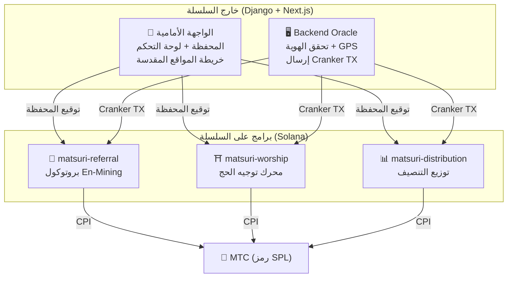
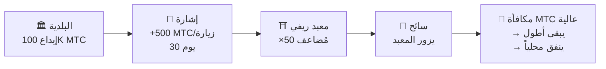
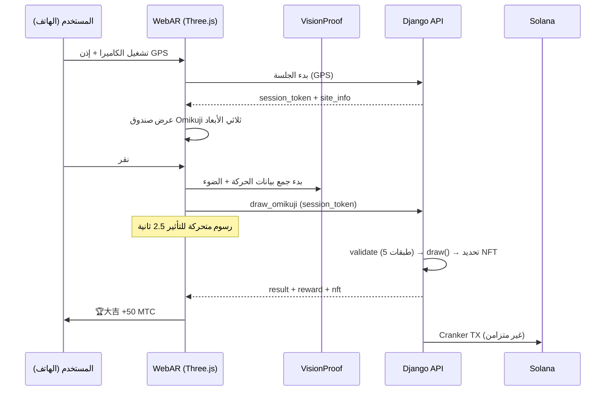

# ⚡ العقود الذكية — بنية مفتوحة المصدر

> **تصميم بلا حاجة للثقة (Trustless).**
> منطق المكافآت وأشجار الإحالة وجداول التنصيف — كل شيء يُنفَّذ **على السلسلة** عبر برامج Rust قابلة للتدقيق.
> الكود المصدري: [GitHub](https://github.com/matsuri-protocol/contracts)

---

## نظرة عامة

ينشر Matsuri **ثلاثة برامج Anchor (Rust)** على Solana، كل منها يتعامل مع ركيزة مميزة من النظام البيئي:



---

## 1. 📣 بروتوكول En-Mining (縁マイニング)

**الغرض:** محرك نمو هجين يكافئ كلاً من *الاتساع* (مدى الإحالة) و*العمق* (التأثير الاقتصادي). ليس مجرد برنامج انتساب — بل بروتوكول تعدين كامل حيث النشاط الاقتصادي الحقيقي يولّد قيمة على السلسلة.

### صيغة التسجيل

```
S_final = S_raw × M_toku × B_title

where:
  S_raw   = 0.30 × عدد_الإحالات + 0.70 × (الحجم / 10^9)
  M_toku  = f(MTC المُراهن) ∈ [1.0×, 10.0×]
  B_title = 1.0 + min(عدد_المواسم_في_التصنيف × 0.05, 0.50)
```

| المكوّن | الوزن | الغرض |
| :--- | :---: | :--- |
| **الاتساع** (عدد الإحالات) | 30% | مدى الشبكة — كم شخصاً تجلب |
| **العمق** (حجم التسوية) | 70% | التأثير الاقتصادي — مشتريات حقيقية، ليس مجرد تسجيلات |
| **مُضاعف Toku** | ×1–10 | أقفل MTC لتعزيز قوة التعدين |
| **تعزيز اللقب** | +5%/موسم | مكافأة دائمة للمتفوقين باستمرار |

### مستويات رهن Toku (徳)

| MTC المُراهن | المُضاعف | المستوى |
| :--- | :---: | :--- |
| 0 | 1.0× | — |
| 1,000+ | 1.5× | برونزي |
| 10,000+ | 3.0× | فضي |
| 100,000+ | 5.0× | ذهبي |
| 1,000,000+ | 10.0× | ماسي |

### En no Banzuke (تصنيف موسمي)

في كل موسم (حقبة)، يتم تصنيف أفضل المؤدين. المزايا:
- أفضل 10% يحصلون على لقب **مبشّر** (علامة SBT دائمة)
- كل موسم في التصنيف يمنح **+5% تعزيز تعدين** (تراكمي، الحد الأقصى: 50%)

### دفاع مضاد لـ Sybil (3 طبقات)

| الطبقة | الآلية | الموقع |
| :--- | :--- | :--- |
| **بوابة الهوية** | X/Twitter OAuth + SMS | خارج السلسلة (Django) |
| **بوابة على السلسلة** | فقط الملفات الشخصية `is_verified = true` تكسب | العقد الذكي |
| **ترجيح العمق** | 70% من النقاط = مدفوعات حقيقية → الروبوتات لا تكسب شيئاً | محرك التقييم |

---

## 2. ⛩️ محرك توجيه الحج (Worship Routing Engine)

**الغرض:** أول **بروتوكول ReFi في العالم يحل مشكلة السياحة المفرطة باستخدام اقتصاديات الرمز.** زر المواقع المقدسة → اكسب MTC. لكن الحيلة: *المواقع الأقل زيارة تدفع أكثر بشكل أُسّي.*

:::tip الرؤية
هذا «تسعير Uber العكسي» — المواقع المزدحمة تُعاقب، والمواقع الحدودية تُكافأ. السياح يوجهون أنفسهم إلى مواقع أقل زيارة لأنها **أكثر ربحية.**
:::

### صيغة المكافآت ذات 6 طبقات

```
R_final = R_pioneer × M_dynamic × M_regional × M_streak × M_omikuji

where:
  R_pioneer  = daily_pool / visit_order     (تناقص توافقي 1/n)
  M_dynamic  = يتحكم المشرف ∈ [0.1×, 50×]
  M_regional = tier_table[tier] ∈ {1×, 2×, 5×, 10×}
  M_streak   = 1.0 + min(days × 0.02, 0.50)
  M_omikuji  = القرعة ∈ {1.0, 1.2, 1.5, 3.0}
```

### الطبقة 1: مكافأة الرائد

التناقص التوافقي — الرياضيات التي توجه السياح:

| ترتيب الزيارة | المكافأة مقارنة بالأول | مثال حقيقي (مجمع 1000 MTC) |
| :---: | :---: | :--- |
| الأول | 100% | 1,000 MTC |
| الخامس | 20% | 200 MTC |
| العاشر | 10% | 100 MTC |
| المئة | 1% | 10 MTC |

> **الزائر الأول = 100 ضعف المكافأة مقارنة بالزائر رقم 100.** هذا يخلق حافزاً قوياً للزيارة في أوقات خارج الذروة.

### الطبقة 2: المُضاعف الديناميكي (تفريق الازدحام)

يتحكم فيه المشرفون في الوقت الحقيقي عبر لوحة GCF Admin:

| السيناريو | المُضاعف | التأثير |
| :--- | :---: | :--- |
| **سياحة مفرطة** (ذروة أساكوسا) | 0.1× | عقوبة 90% على المكافأة |
| **عادي** | 1.0× | قياسي |
| **قليل الزيارة** | 10× | تعزيز 10 أضعاف |
| **حملة حدودية** | 50× | أقصى حافز |

### الطبقة 3: المستوى الإقليمي

| المستوى | التصنيف | المُضاعف | أمثلة |
| :---: | :--- | :---: | :--- |
| 0 | 🏙️ كبير | 1× | 浅草寺, 清水寺, 伏見稲荷 |
| 1 | 🌆 متوسط | 2× | المعابد الرئيسية الإقليمية |
| 2 | 🏞️ ريفي | 5× | معابد تاريخية في الريف |
| 3 | ⛰️ مخفي | 10× | معابد جبلية، مزارات جزرية |

### الطبقة 4: مكافأة التتابع

+2% لكل يوم متتالٍ، الحد الأقصى +50%. يكافئ الزوار المنتظمين.

### الطبقة 5: 🎲 بروتوكول Omikuji

| النتيجة | الاحتمال | المُضاعف |
| :--- | :---: | :---: |
| 🏆 **大吉** | 5% | 3.0× |
| ✨ **吉** | 15% | 1.5× |
| 🌸 **小吉** | 30% | 1.2× |
| 🍃 **末吉** | 35% | 1.0× |
| 💀 **凶** | 15% | 1.0× |

### الطبقة 6: إشارات مدعومة (B2B/B2G)

البلديات وشركات السكك الحديدية ومجالس السياحة يمكنها **إيداع MTC** لإنشاء مناطق مكافآت عالية مؤقتة في مواقع محددة.



> **نموذج إيرادات B2B:** الرعاة يدفعون MTC لتوجيه السياح. ضغط شراء MTC → قيمة الرمز. ربح للجميع.

---

## 3. 📊 توزيع التنصيف

**الغرض:** 550 مليون MTC من مجمع التعدين يُوزَّع على مدى عقود عبر **دورة تنصيف كل سنتين** — أسرع من دورة Bitcoin ذات الأربع سنوات.

### جدول التنصيف

```
إجمالي المجمع: 550,000,000 MTC

الحقبة 0 (2027–2029):  275,000,000 MTC  (50%)
الحقبة 1 (2029–2031):  137,500,000 MTC  (25%)
الحقبة 2 (2031–2033):   68,750,000 MTC  (12.5%)
الحقبة 3 (2033–2035):   34,375,000 MTC  (6.25%)
        ...              ...
∑ → 550,000,000 MTC (المجموع التقاربي)
```

### صيغة المكافأة الفردية

```
your_reward = epoch_budget × (your_score / total_score)
```

كل العمليات الحسابية تستخدم **حساب وسيط 128-بت** — مستحيل رياضياً أن يحدث طفح.

### مصادر نقاط الأداء

| النشاط | وزن النقاط |
| :--- | :--- |
| **جلسات الإرشاد المُنفَّذة** | عالٍ |
| **مبيعات تذاكر الفعاليات** | عالٍ |
| **نشاط شبكة الإحالات** | متوسط |
| **زيارات تعدين الحج** | متوسط |
| **المشاركة الإعلامية** | منخفض |

:::info تقدم الحقبة بدون إذن
تعليمة `advance_epoch` يمكن أن يستدعيها **أي شخص** — لا حاجة لمشرف. ساعة النظام تحدد موعد انتقال الحقب، مما يضمن التشغيل بلا ثقة حتى لو اختفى الفريق.
:::

---

## 4. 🎴 تعدين AR — WebAR Omikuji Mining

**الغرض:** اجعل AR Omikuji تظهر في الفضاء الحقيقي باستخدام متصفح الهاتف الذكي فقط لتعدين MTC. **لا حاجة لتنزيل تطبيق.** أول بنية تحتية WebAR × بلوكتشين في العالم تجمع بين الروحانية الشنتوية والتكنولوجيا المتطورة.

### البنية المعمارية



### Optimistic UI (انتظار صفري)

| الخطوة | الوقت | المعالجة |
|---------|------|------|
| نقر → بدء التأثير | 0ms | الواجهة تشغل الرسوم فوراً |
| API draw_omikuji | ~50ms | Django يسحب + تحديد NFT |
| اكتمال التأثير | 2500ms | النتيجة مؤكدة → العرض |
| Solana TX | ~400ms | إرسال في الخلفية |

### إعدادات احتمالات Omikuji (مشرف GCF)

نقاط أساس (10000 = 100%) بدقة تحكم 0.01%.

| الدرجة | القيمة الافتراضية | مُضاعف المكافأة | NFT |
|------|-----------|---------|-----|
| 🏆 大吉 | 5.00% (500bp) | ×3.0 | ✅ |
| ✨ 吉 | 15.00% (1500bp) | ×1.5 | اختياري |
| 🌸 小吉 | 30.00% (3000bp) | ×1.2 | — |
| 🍃 末吉 | 35.00% (3500bp) | ×1.0 | — |
| 💀 凶 | 15.00% (1500bp) | ×1.0 | — |

### ZK-Proof of Vision (تحقق من 5 طبقات)

يقضي على تزوير GPS وهجمات الإعادة عبر طبقات متعددة. **لا يتم إرسال بيانات الكاميرا** للخادم حفاظاً على الخصوصية.

| الطبقة | محتوى التحقق | النقاط |
|-------|---------|------|
| Temporal | مدة الجلسة 5-120 ثانية | /20 |
| Motion | تباين الجيروسكوب 0.005-0.5 (طبيعية اليد) | /20 |
| Light | ضوء محيط × تناسق الوقت | /20 |
| HMAC | تحقق من توقيع proof_hash | /20 |
| Fingerprint | تفرد الجهاز | /20 |
| **الإجمالي** | **عتبة PASS** | **60/100** |

### صيغة حساب المكافأة

```
Reward = Base(10 MTC) × SiteMultiplier × OmikujiMult × TierMult

TierMult = { كبير: 1.0, متوسط: 2.0, ريفي: 5.0, مخفي: 10.0 }
```

---

## وحدات الرياضيات (النواة مفتوحة المصدر)

يفصل كلا البرنامجين كل رياضيات التقييم/المكافآت إلى **وحدات `math.rs` نقية وقابلة للتدقيق** مع:

- **صفر آثار جانبية** — لا I/O، لا تخصيصات، لا استدعاءات خارجية
- **صيغ موثقة** — ترميز بأسلوب LaTeX في rustdoc
- **تحليل الطفح** — قيم وسيطة u128 بحدود مُثبتة
- **اختبارات شاملة** — حالات حدية، شروط حدودية، تحقق من النسب

```rust
// مثال: مكافأة الرائد (من worship/math.rs)
#[inline]
pub fn pioneer_reward(daily_pool: u64, visit_order: u32) -> u64 {
    if visit_order == 0 { return 0; }
    (daily_pool as u128 / visit_order as u128) as u64
}
```

---

## نموذج الأمان (مفتوح المصدر)

هذه العقود **مفتوحة المصدر بالكامل.** الأمان يعتمد على ضمانات رياضية، لا على الغموض.

| المبدأ | التنفيذ |
| :--- | :--- |
| **خزائن PDA فقط** | خزائن الرموز تُتحكم بعناوين مشتقة من البرنامج — لا يمكن لأي مفتاح بشري سحبها |
| **حساب مدقّق** | كل العمليات الحسابية تستخدم عمليات `checked_*` — الطفح مستحيل |
| **فصل الصلاحيات** | المشرف (توقيع متعدد) ≠ Cranker (عمليات محدودة) ≠ المستخدم (حفظ ذاتي) |
| **إيقاف طوارئ** | المشرف يمكنه إيقاف جميع البرامج فوراً؛ لا يمكنه سرقة الأموال |
| **اقتصاد رمزي ثابت** | مُعامل التنصيف والمجمع الكلي ومدة الحقبة تُحدد مرة واحدة ولا يمكن تغييرها |
| **وحدات رياضيات نقية** | منطق التقييم/المكافآت مفصول في مكتبات رياضيات قابلة للتدقيق والاختبار |
| **Vision Proof** | مكافحة تزوير من 5 طبقات بدون نقل بيانات الكاميرا (حفظ الخصوصية) |

---

**[◀ العودة إلى خارطة الطريق](/docs/roadmap)** ｜ **[عرض الكود المصدري](https://github.com/matsuri-protocol/contracts)**
