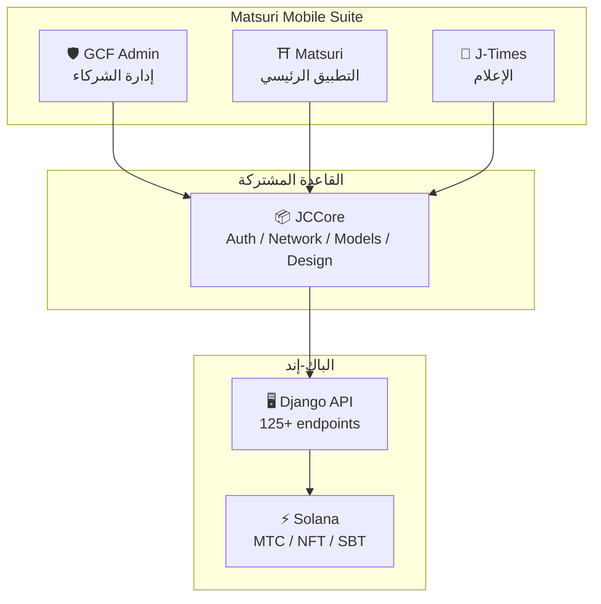
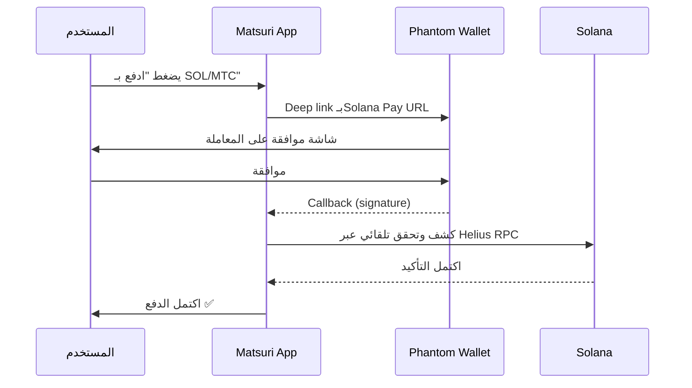
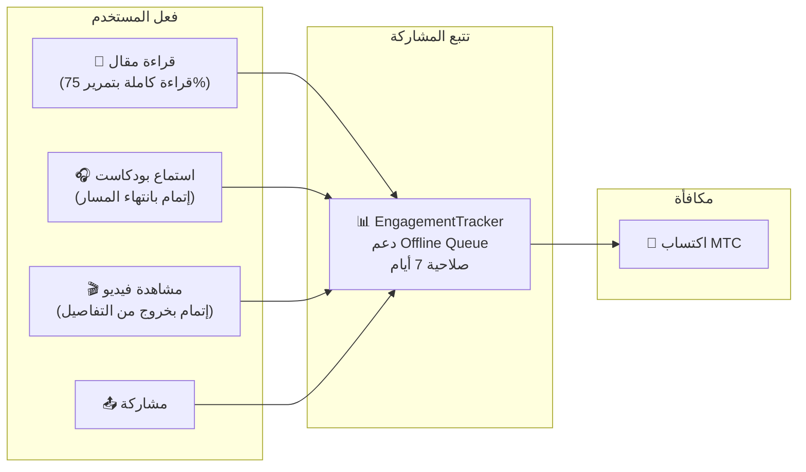
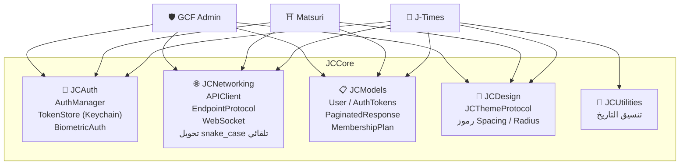
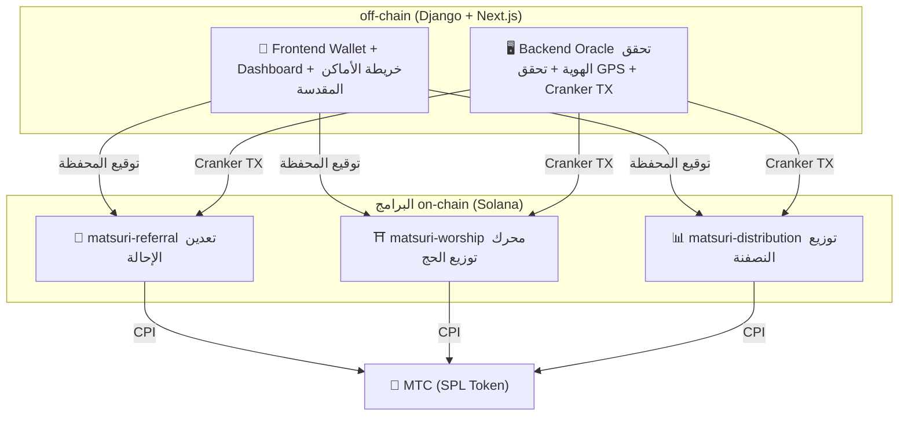
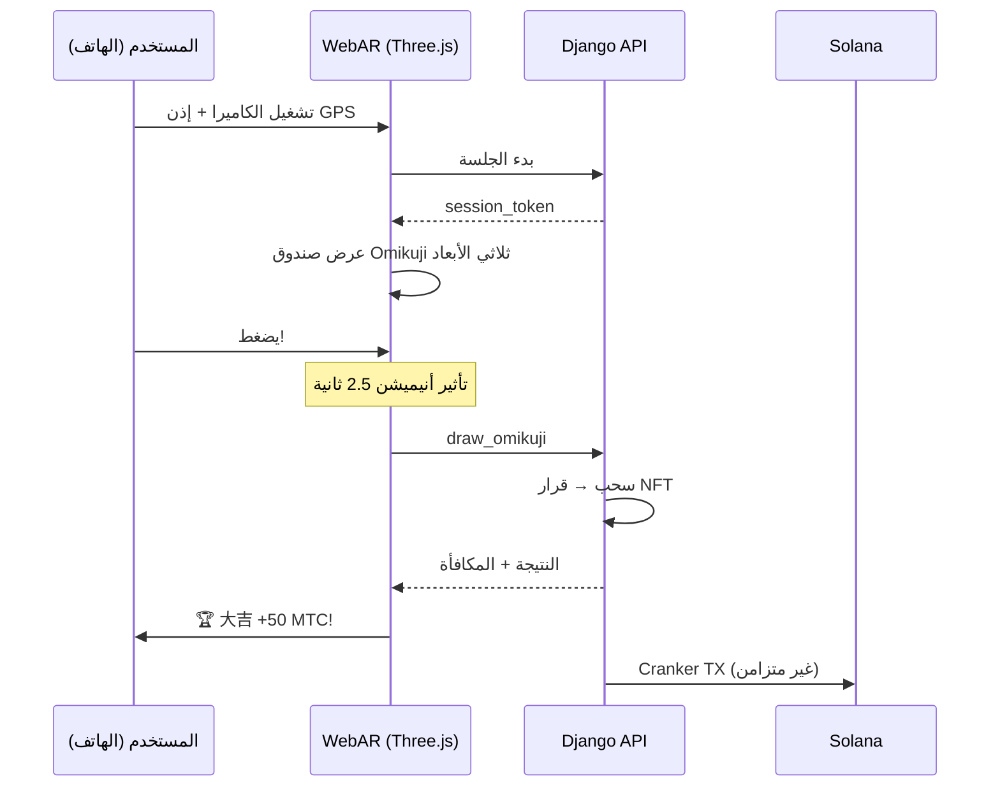

import useBaseUrl from '@docusaurus/useBaseUrl';

# 🔧 المنتج والتقنية — ما يعمل هو الدليل

> **ما يعمل، يثبت كل شيء.**
> رسالتنا ليست كلامًا فقط. منصة الويب تعمل بالفعل، وتطبيقات iOS في مراحلها النهائية.

تطبيق الويب ولوحة الإدارة **قيد التشغيل الفعلي**. ثلاثة تطبيقات iOS أصلية مكتملة التطوير وتُطلق في أبريل 2026. العقود الذكية على Solana مفتوحة المصدر — لا نتحدث عن مفاهيم، بل بـ**كود يعمل ومنتجات على وشك الوصول**.

---

## قائمة التطبيقات

| التطبيق | الاستخدام | الحالة | اللغات |
| :--- | :--- | :---: | :--- |
| **GCF Admin** | أدوات إدارة وتشغيل الشركاء | ✅ مُصدَر | 🇯🇵🇬🇧🇨🇳🇹🇭🇳🇴 |
| **Matsuri** | التطبيق الرئيسي للمستخدم | 🔜 أبريل 2026 | 🇯🇵🇬🇧🇨🇳🇹🇭🇳🇴 |
| **J-Times** | إعلام ثقافي وتعليم | 🔜 أبريل 2026 | 🇯🇵🇬🇧 |

---

## 1. 🛡️ GCF Admin — تطبيق إدارة الشركاء

:::info الحالة: مُصدَر على App Store (v1.0)
تطبيق إدارة الأعمال لأعضاء GCF (Global Community Friends). جميع وظائف لوحة الإدارة الويب مُدمجة في الموبايل.
:::

  

  
  
  

### ما يمكنك فعله في هذا التطبيق

| الفئة | الميزات |
| :--- | :--- |
| **📊 Dashboard** | بطاقات KPI، مخططات المبيعات، إجراءات سريعة |
| **👥 إدارة الأعضاء** | قائمة، تفاصيل، تحرير، إدارة الـTier |
| **💰 إدارة الإيرادات** | تتبع العمولات، إدارة سحب MTC، إدارة المدفوعات |
| **📝 إدارة المحتوى** | إنشاء/تحرير/نشر الفعاليات والمقالات والبودكاست والفيديو |
| **🎫 خانات المرشد** | إدارة خانات المرشد وتتبع الإيرادات |
| **🖼️ لوحة NFT** | Founder's Collection، التحقق on-chain، نقل NFT |
| **⛩️ إدارة الأماكن المقدسة** | CRUD للمواقع، إعدادات الـBeacon |
| **🎲 إعدادات AR Mining** | جدول احتمالات Omikuji، إدارة معاملات المكافآت |
| **📊 التحليلات** | تقارير الأخطاء، تحليل الاستخدام |
| **🔗 الإحالات** | توليد QR مخصص، إدارة برنامج الإحالة |

### المواصفات التقنية

| البند | التفاصيل |
| :--- | :--- |
| **المعمارية** | Clean Architecture + MVVM + `@Observable` (iOS 17) |
| **اللغة / SDK** | Swift 6.0 / Xcode 16+ / iOS 17.0+ |
| **ربط API** | أكثر من 125 endpoint |
| **الاختبارات** | 226 اختبارًا / 45 فئة اختبار |
| **الترجمة** | 5 لغات (JA/EN/ZH/TH/NO) / أكثر من 957 مفتاح ترجمة |
| **Swift Concurrency** | Strict Concurrency / صفر تحذيرات بناء |

### دمج QR Code

يولّد GCF Admin أكواد QR مخصصة مع شعار Matsuri. متعدد الاستخدام: دعوات الفعاليات، روابط الإحالة، طلبات الدفع.

---

## 2. ⛩️ Matsuri — التطبيق الرئيسي

:::info الحالة: إطلاق في أواخر أبريل 2026 (v3.0)
التطبيق الرئيسي للمستخدم العادي. يكتمل كل شيء في تطبيق واحد: حجز الفعاليات، الدفع، محفظة Web3، AR Mining.
:::

  
  
  

### ما يمكنك فعله في هذا التطبيق

| الفئة | الميزات |
| :--- | :--- |
| **🎪 حجز الفعاليات** | بحث/حجز/دفع Stripe/إدارة QR للتذاكر |
| **💳 أربع وسائل دفع** | بطاقة ائتمان / بطاقة محفوظة / رصيد MTC / كريبتو (SOL/MTC) |
| **👛 محفظة Web3** | عرض رصيد MTC، الإرسال والاستقبال، تاريخ المعاملات |
| **🖼️ معرض NFT** | قائمة NFT/SBT المملوكة، التحقق on-chain |
| **🗺️ خريطة الأماكن المقدسة** | عرض الأضرحة والمعابد على الخريطة، Check-in |
| **🎲 AR Mining** | تجربة WebAR Omikuji، اكتساب MTC |
| **💬 الدردشة** | مراسلة مع قائمة سياق |
| **⭐ Wishlist** | حفظ الفعاليات/التجارب المفضلة |
| **🔍 بحث متقدم** | يدعم البحث الصوتي |
| **🤝 الإحالة** | الاشتراك في برنامج الإحالة، تتبع المكافآت |
| **📊 لوحة GCF** | لوحة إدارة مبسطة لأعضاء GCF |

### تكامل Phantom Wallet — دفع كريبتو بدون إدخال

>**لا حاجة للمستخدم لنسخ العنوان.** تُطلَق Phantom Wallet تلقائيًا، وبمجرد الموافقة يكتمل الدفع. توقيع المعاملة يُكتشف تلقائيًا عبر Helius RPC.

### المواصفات التقنية

| البند | التفاصيل |
| :--- | :--- |
| **المعمارية** | Clean Architecture + MVVM + Swift Concurrency |
| **اللغة / SDK** | Swift 6.0 / Xcode 16+ / iOS 17.0+ |
| **الدفع** | Stripe PaymentSheet + MTC Balance + Phantom (Solana Pay) |
| **ربط API** | 72 endpoint / 16 فئة |
| **الاختبارات** | أكثر من 230 (Model, ViewModel, Network, Security, DeepLink, E2E) |
| **الترجمة** | 5 لغات (JA/EN/ZH/TH/NO) / 406 مفاتيح ترجمة |
| **عدد ViewModel** | 25 (MVVM كامل — صفر استدعاءات API مباشرة من View) |
| **التوثق** | Apple Sign In / Google Sign In (PKCE) |

---

## 3. 📰 J-Times — تطبيق الإعلام الثقافي

:::info الحالة: إطلاق في أواخر أبريل 2026
منصة إعلامية تنقل أعماق الثقافة اليابانية. اقرأ المقالات، استمع للبودكاست، شاهد الفيديو — كل فعل يُكسبك MTC.
:::

  

  
  

### ما يمكنك فعله في هذا التطبيق

| الفئة | الميزات |
| :--- | :--- |
| **📖 المقالات** | Parallax Hero، Drop Cap، شريط تقدم القراءة، محتوى غني (Markdown، جداول، اقتباسات) |
| **🎧 البودكاست** | تصفح السلاسل، مشغل بعرض الموجة، مؤقت النوم، AirPlay، تحكم بشاشة القفل |
| **🎬 الفيديو** | عرض شبكي/قائمة متكيف، فيديوهات قصيرة (بأسلوب TikTok، ضغطتان مزدوجتان) |
| **🔍 البحث** | فلاتر متعددة، وسوم شائعة، بحث صوتي |
| **🧭 الاكتشاف** | كاروسيل مميز، اختيارات الطاقم، الشعبية هذا الأسبوع |
| **📚 المكتبة** | المفضلة، السجل (حسب التاريخ)، التنزيلات، قوائم التشغيل |
| **🎵 مشغل الصوت** | مشغل مصغّر (بسحب)، مشغل كامل (موجة، كلمات، تكرار) |
| **👤 العضوية** | مقارنة ميزات 3 فئات (Free / Premium / Pro)، استعادة الشراء |

### Media Mining — القراءة والاستماع والمشاهدة هي التعدين

>**يُسجَّل حتى بلا اتصال.** حتى لو قرأت مقالًا في معبد جبلي بلا شبكة، يُرسل الانخراط تلقائيًا عند العودة للاتصال وتُمنح MTC.

### نظام التصميم — «الأركان الأربعة» لجماليات اليابان

يعتمد J-Times نظام تصميم مخصص ينقل جماليات اليابان التقليدية إلى UI معاصر.

| الركن | المفهوم | التطبيق في UI |
| :--- | :--- | :--- |
| **墨 (Sumi — الحبر)** | رمادي محايد دافئ | لون الخلفية، تدرج النص |
| **朱 (Shu — الأحمر الياباني)** | الأحمر الياباني (#C53030) | لون اللمسة، الإجراءات المهمة |
| **間 (Ma — الفراغ)** | هامش بشبكة 4pt | التباعد، الإحساس بالتنفّس |
| **紙 (Kami — الورق)** | ملمس دقيق، Glassmorphism | سطح البطاقة، الإحساس بالعمق |

### المواصفات التقنية

| البند | التفاصيل |
| :--- | :--- |
| **المعمارية** | Clean Architecture + MVVM + Swift Concurrency |
| **اللغة / SDK** | Swift 6.0 / Xcode 16+ / iOS 17.0+ |
| **التبعيات الخارجية** | **صفر** — أُطر عمل Apple الأصلية فقط |
| **ربط API** | أكثر من 40 endpoint |
| **الاختبارات** | 371 اختبارًا / 20 ملفًا |
| **الترجمة** | لغتان (JA/EN) / أكثر من 310 مفاتيح ترجمة |
| **دعم Offline** | ContentCache (50MB) + ImageDiskCache (200MB) + Download Manager |
| **التوثق** | Apple Sign In / Google Sign In (PKCE) |

---

## القاعدة المشتركة: مكتبة JCCore

مكتبة Swift Package تشترك فيها جميع التطبيقات الثلاثة.

| الوحدة | الدور |
| :--- | :--- |
| **JCAuth** | إدارة التوكن بقاعدة Keychain، التوثق البيومتري (Face ID / Touch ID) |
| **JCNetworking** | API Client آمن من حيث الأنواع، WebSocket، تحويل JSON snake_case تلقائي |
| **JCModels** | نماذج بيانات مشتركة عبر التطبيقات (User، AuthTokens، إلخ) |
| **JCDesign** | بروتوكول السمات، رموز التصميم (Spacing، الزاوية) |
| **JCUtilities** | أدوات مساعدة للتاريخ والنصوص |

---

## الأمان والخصوصية

| البند | التنفيذ |
| :--- | :--- |
| **توكن التوثق** | تخزين مشفّر في iOS Keychain (TokenStore) |
| **التوثق البيومتري** | توثق ثنائي بـ Face ID / Touch ID |
| **اتصال API** | HTTPS + Certificate Pinning |
| **مفتاح المحفظة الخاص** | لا يُخزَّن المفتاح الخاص في التطبيق — مفوَّض إلى Phantom Wallet |
| **AR Mining** | لا تُرسل صور الكاميرا إلى الخادم (VisionProof) |
| **بيانات Offline** | تشفير SwiftData + انتهاء صلاحية تلقائي |
| **Swift Concurrency** | منع حالات التنافس عبر عزل Actor |

---

## جودة التطوير

### تطبيقات الموبايل: **أكثر من 827 اختبار آلي** لثلاثة تطبيقات مجتمعة.

| التطبيق | عدد الاختبارات | مناطق التغطية |
| :--- | :---: | :--- |
| **GCF Admin** | 226 | Model, ViewModel, Repository, API, Localization, Navigation |
| **Matsuri** | 230+ | Model, ViewModel, Network, Security, DeepLink, Regression, Performance, E2E |
| **J-Times** | 371 | Model, ViewModel, API, Repository, Navigation, Localization, Security, Performance |

### العقود الذكية: توسيع الاختبارات تدريجيًا

بالنسبة لبرامج Rust على Solana، بدأنا من اختبارات الوحدة للمنطق الأساسي (وحدات الرياضيات)، ونوسّع التغطية تدريجيًا استعدادًا للتدقيق الأمني (Q2〜Q3 2026).

---

## العقود الذكية — تصميم مفتوح المصدر

>**فلسفة التصميم Trustless (بلا حاجة ثقة).**
> حساب المكافآت، شجرة الإحالات، جدول النصفنة — كل المنطق يُنفَّذ **on-chain** وقابل للتدقيق من أي شخص.
> الكود المصدري: [GitHub](https://github.com/Cootakahashi/matsuri-contracts)

---

### Contributors

| العضو | الدور |
| :--- | :--- |
| **Ko Takahashi** | Founder / Lead Developer — تصميم المعمارية، العقود الذكية، تطوير Full-stack |

> 🌏**مستقبلًا سينضم أعضاء GCF ومجتمع المطورين حول العالم إلى التطوير المشترك.**
> يلتزم Matsuri Protocol بالشفافية والملكية المشتركة ليعمل كـ«بنية تحتية ثقافية» دائمة.

---

### البنية العامة

تنشر Matsuri **ثلاثة برامج Anchor (Rust)** على Solana، كل منها يحمل ركنًا من أركان النظام البيئي.

---

### 1. 📣 تعدين الإحالة (En-Mining)

**الهدف:** محرك نمو هجين يكافئ «الاتساع (شبكة الإحالة)» و«العمق (الأثر الاقتصادي)» معًا. ليس مجرد Affiliate، بل بروتوكول تعدين كامل يحوّل النشاط الاقتصادي الحقيقي إلى قيمة on-chain.

#### تصميم النقاط (Scoring)

تُحسب نقاط المساهمة من عنصرين مرجّحين:

| العنصر | الوزن | الغرض |
| :--- | :---: | :--- |
| **الاتساع** (عدد المُحالين) | 30% | امتداد الشبكة — عدد من جلبتهم |
| **العمق** (حجم المعاملات) | 70% | الأثر الاقتصادي — ليس التسجيل فقط بل الشراء الفعلي |

تتراكم النقاط عبر الوقت وتتحوّل إلى MTC في كل حقبة نصفنة. نخطط لآليات تعزيز إضافية:

| Boost | الوصف | الحالة |
| :--- | :--- | :---: |
| **Toku (徳) Staking** | قفل MTC لتعزيز نقاط المساهمة (حتى حوالي 50% تعزيز). يُضبط الـTier والمضاعف الدقيق بناءً على جدول إطلاق مجمع النصفنة | ⬜ معامل غير محدد |
| **تصنيف الموسم** | في كل Epoch يحصل أعلى المؤدين على لقب **Evangelist** (SBT دائم) وتعزيز نقاط. تُحدَّد النسب الدقيقة بالحوكمة | ⬜ معامل غير محدد |

:::info تصميم معاملات تدريجي
معاملات التعزيز (Tier الـStaking، Bonus التصنيف) قابلة للتعديل عمدًا. تُحدَّد بناءً على بيانات النظام البيئي الفعلية — إجمالي المستخدمين النشطين، معدل إطلاق مجمع النصفنة، أهداف استقرار السعر — ثم تُقفل في العقد الذكي. يضمن هذا النهج **توزيعًا عادلًا** دون وعد بعوائد ثابتة مبالغ فيها.
:::

#### دفاع مضاد لـSybil (3 طبقات)

| الطبقة | الآلية | المكان |
| :--- | :--- | :--- |
| **بوابة تحقق الهوية** | X/Twitter OAuth + SMS | off-chain (Django) |
| **بوابة on-chain** | المكافآت تُكسب فقط بالملفات `is_verified = true` | العقد الذكي |
| **ترجيح العمق** | 70% من النقاط = مدفوعات فعلية → البوتات لا تكسب شيئًا | محرك النقاط |

---

### 2. ⛩️ محرك توزيع الحج (Worship Routing Engine)

**الهدف:** أول **بروتوكول ReFi** في العالم يحل السياحة المفرطة بتوظيف اقتصاد التوكن. زر الأماكن المقدسة لتكسب MTC. لكن المهم: *المواقع الأقل زيارة تكسب أسيًا أكثر.*

:::tip الرؤية الجوهرية
«Reverse Uber Surge Pricing» — المواقع المزدحمة تُعاقب، ومواقع الحدود تُعزَّز. يتوجه السياح طوعًا إلى الأماكن الأقل زيارة **لأنها أربح**.
:::

#### مبادئ تصميم المكافآت

تُحدَّد نقاط المساهمة لكل زيارة بعوامل متعددة:

| العامل | المبدأ | الأثر |
| :--- | :--- | :--- |
| **شعبية الموقع** | المواقع الأقل زيارة تعطي نقاطًا أعلى | توزيع السياح من المناطق المزدحمة |
| **توقيت الزيارة** | من يزور مبكرًا في اليوم يحصل على نقاط أعلى | تشجيع زيارة الساعات غير الذروة |
| **Tier المنطقة** | المواقع الإقليمية/الحدودية في القمة | تعزيز تنمية الأقاليم |
| **تكرار الزيارة** | الزوار المنتظمون يراكمون نقاط بونص | مكافأة الانخراط المستمر |
| **حظ Omikuji** | سحب بونص عشوائي لكل Check-in | عنصر ألعاب مسلٍّ |
| **تعزيز الرعاية** | يمكن للبلديات تعزيز مواقع محددة | نموذج إيرادات B2B/B2G |

:::info المعاملات قابلة للتعديل
المضاعف الدقيق لكل عامل (مثلًا كم يكسب الموقع الإقليمي أكثر من الرئيسي) يُضبط بناءً على **جدول مجمع النصفنة** وبيانات الاستخدام الفعلية، ويُقفل تدريجيًا في العقد الذكي. مبادئ التصميم ثابتة — المعاملات تتطوّر مع النظام البيئي.
:::

---

### 3. 📊 توزيع النصفنة (Halving Distribution)

**الهدف:** جدول نصفنة مستوحى من Bitcoin يقسّم توزيع MTC نصفًا تلقائيًا في كل حقبة. ندرة مضمونة رياضيًا.

| التعليمة | الوصف |
| :--- | :--- |
| `initialize` | تهيئة مجمع التوزيع |
| `register_miner` | تسجيل المعدّن |
| `update_score` | تحديث النقاط |
| `advance_epoch` | تقدم الحقبة (تنفيذ النصفنة) |
| `claim_distribution` | استلام مكافأة التوزيع |

---

### 4. 🎴 AR Mining — تجربة WebAR Omikuji

**الهدف:** تجربة تُظهر Omikuji AR في الفضاء الحقيقي عبر متصفح الهاتف فقط، لتعدين MTC. **بلا حاجة لتنزيل تطبيق.** أول بنية تحتية WebAR × Blockchain في العالم تمزج روح الشنتو بأحدث التقنيات.

#### المعمارية

#### إعداد احتمالات Omikuji (مدير GCF)

تحكم دقيق بـ0.01% بوحدة Basis Points (10000 = 100%). قابل للتعديل من شاشة إدارة GCF.

| الرتبة | الندرة | البونص | NFT |
|------|-----------|---------|-----|
| 🏆 大吉 (Daikichi) | نادر | بونص أقصى | ✅ |
| ✨ 吉 (Kichi) | غير شائع | بونص عالٍ | اختياري |
| 🌸 小吉 (Shōkichi) | شائع | بونص صغير | — |
| 🍃 末吉 (Suekichi) | شائع | سجل المشاركة | — |
| 💀 凶 (Kyō) | غير شائع | سجل المشاركة | — |

الاحتمالات ومعاملات المكافآت تُحدَّد تدريجيًا بناءً على حجم النظام البيئي وإطلاق النصفنة، وتُنفَّذ في العقد الذكي.

#### ZK-Proof of Vision (أمن من 5 طبقات)

إقصاء التزوير بالـGPS وهجمات الإعادة بطبقات متعددة. **حماية للخصوصية، لا تُرسل صور الكاميرا إلى الخادم.**

| Layer | ما يُتحقق منه | التوزيع |
| :--- | :--- | :--- |
| Temporal | مدة الجلسة 5-120 ثانية | /20 |
| Motion | طبيعية الجيروسكوب (كشف اهتزاز اليد) | /20 |
| Light | تناسق الضوء المحيط × الوقت | /20 |
| HMAC | التحقق من توقيع proof_hash | /20 |
| Fingerprint | تفرّد الجهاز | /20 |
| **المجموع** | **PASS ≥ 60/100** | |

#### تصميم المكافآت

تُسجَّل المكافآت كـ**نقاط مساهمة** بناءً على عوامل متعددة: نوع الموقع، نتيجة Omikuji، Tier المنطقة. المعاملات الدقيقة تُحدَّد تدريجيًا مع جدول إطلاق النصفنة ونمو النظام البيئي، وتُنفَّذ في العقد الذكي.

---

### Pure Math Modules (منطق أساسي قابل للتدقيق)

تفصل جميع البرامج حساب النقاط والمكافآت في **وحدة `math.rs` نقية قابلة للتدقيق**:

- **صفر آثار جانبية** — لا I/O، لا تخصيص ذاكرة، لا استدعاءات خارجية
- **معادلات موثّقة** — بتنسيق LaTeX داخل rustdoc
- **تحليل Overflow** — قيم u128 وسيطة بنطاقات مُثبَتة
- **اختبارات شاملة** — حالات الحواف، حدود، تحقق من النسب
- **معاملات قابلة للتعديل** — معاملات المكافآت مصممة لتحديث عبر الحوكمة، تُعدَّل تدريجيًا مع نمو النظام البيئي

---

### نموذج الأمان

العقود **مفتوحة المصدر كاملًا**. الأمان يقوم على الضمانات الرياضية لا على الغموض.

| المبدأ | التنفيذ |
| :--- | :--- |
| **خزنة PDA فقط** | خزنة التوكن محكومة بـPDA (عنوان مشتق من البرنامج) — لا يمكن سحبها بمفتاح بشري |
| **حسابات Checked** | استخدام `checked_*` في كل العمليات — Overflow مستحيل |
| **فصل الصلاحيات** | Admin (Multisig) ≠ Cranker (عمليات محدودة) ≠ User (إدارة ذاتية) |
| **إيقاف طارئ** | يستطيع المدير إيقاف البرنامج مؤقتًا لتهديدات أمنية فقط. لكن **لا يمكن نقل أو الاستيلاء على الأموال** — الإيقاف «درع حماية» لا وسيلة لتغيير القواعد |
| **توكنوميكس ثابتة** | معدل النصفنة، إجمالي المجمع، مدة الحقبة — غير قابلة للتغيير بعد الإعداد الأولي |
| **Pure Math Modules** | منطق المكافآت/النقاط في مكتبة رياضية معزولة قابلة للاختبار |
| **Vision Proof** | كشف تزوير من 5 طبقات لا يُرسل بيانات الكاميرا (حماية الخصوصية) |

---

**[▶ التالي: خارطة الطريق والفريق](/docs/roadmap)** ｜ **[◀ السابق: التوكنوميكس](/docs/tokenomics)**
