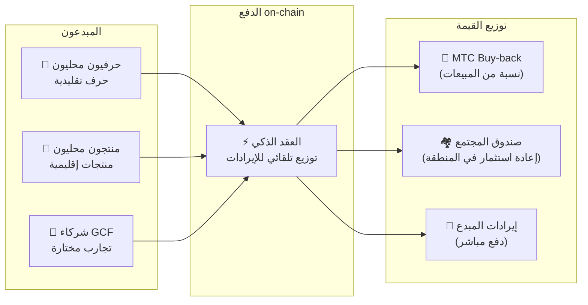

# 🗓️ خارطة الطريق والفريق

>**إلى من وصلوا إلى هذه النقطة — الرؤية والتصميم الاقتصادي والبنية التقنية، كلها جاهزة.**
> لسنا مشروع مضاربة قصير المدى.
>**اكتمل تطوير المنصة الرئيسية بالفعل**، ولم يتبقّ سوى مرحلة التوسّع.

---

## المحطات الاستراتيجية

### 🔥 المرحلة 1: الصحوة (النصف الأول من 2026 ── الحاضر)

**الموضوع: بناء الأساس وتأسيس التدفق النقدي**

منصة الويب تعمل. تطبيقات iOS (Matsuri، J-Times) ستُطلق في أبريل 2026. نركّز على التحقيق من خلال النظام المالي تحت إشراف الرئيس التنفيذي مباشرة، وتأمين السيولة الأولية.

| الحالة | المحطة | التفاصيل |
| :---: | :--- | :--- |
| ✅ | **تشغيل منصة الويب** | بدء تشغيل Matsuri Web App و GCF Admin Dashboard (Web) |
| ✅ | **الدفع والنمو** | اكتمال تنفيذ وظيفة الدفع MTC و Airdrop الإحالات |
| ✅ | **إطلاق الإعلام** | بناء بنية بث J-Times (ويب وبودكاست) |
| ✅ | **Genesis** | إصدار توكن MTC على سلسلة Solana |
| ✅ | **تأمين السيولة** | إنشاء Liquidity Pool الأولي على Raydium |
| ⬜ | **بدء الحوافز** | بدء Liquidity Mining بعائد سنوي مستهدف 20% |
| ⬜ | **الدفع on-chain** | بدء التشغيل الإنتاجي لـ Solana Pay Verification |
| ⬜ | **تجنيد أعضاء VIP** | إتمام اختيار 20 عضو GCF VIP الأوائل |

### 🚀 المرحلة 2: التوسّع (النصف الثاني من 2026)

**الموضوع: أصول العالم الحقيقي وتعدين المغامرة**

استثمار Webapp المكتمل لتوسيع القواعد المادية ووظائف «الحج».

| الحالة | المحطة | التفاصيل |
| :---: | :--- | :--- |
| ⬜ | **إطلاق ميزة جديدة** | تنفيذ وإطلاق تعدين المغامرة (الحج) |
| ⬜ | **التوسع الدولي** | تطوير شراكات في آسيا (تايلاند، تايوان إلخ) وفعاليات VIP |
| ⬜ | **إدارة الأصول** | بناء محفظة من العقارات والأسهم والعملات المشفرة |
| ⬜ | **تحقيق الهدف** | حجم أصول النظام البيئي **1 مليار ¥** |

### 🌊 المرحلة 3: الدوران (2027~)

**الموضوع: الانتشار الواسع، اقتصاد الإبداع المشترك، اللامركزية**

مرحلة الفتح العام وسوق on-chain وتشغيل النظام البيئي الكامل.

| الحالة | المحطة | التفاصيل |
| :---: | :--- | :--- |
| ⬜ | **Grand Open** | إطلاق Matsuri App الرسمي عالميًا |
| ⬜ | **الفتح الكبير (2027/6/1)** | إلغاء قفل المؤسسين + تشغيل Mining Pool (550M) + بدء دورات النصفنة |
| ⬜ | **سوق الإبداع المشترك** | متاجر منتجات إقليمية + متاجر شركاء GCF ── دفع on-chain مع MTC Buy-back تلقائي |
| ⬜ | **التمويل الجماعي (بحقوق NFT)** | يستثمر المستخدمون في مشاريع ثقافية على Solana. يتلقى الداعمون NFT يمثّل الملكية وحصة الأرباح وحقوق الحوكمة |
| ⬜ | **الدفع on-chain** | تسوية كل معاملات السوق عبر العقود الذكية ── نسبة من المبيعات تُحوَّل تلقائيًا إلى مجمع MTC Buy-back |
| ⬜ | **تحقيق الهدف** | حجم أصول النظام البيئي **10 مليار ¥ (~ $65M)** |
| ⬜ | **الانتقال إلى DAO** | نقل جزء من صلاحيات اتخاذ القرار إلى مجتمع GCF |

#### 🏪 رؤية سوق الإبداع المشترك

التعبير الأقصى عن «نظام التشغيل الثقافي» ── **سوق لامركزي يتبادل فيه صُنّاع الثقافة ومحبّوها مباشرة** دون وسطاء استغلاليين.

| الميزة | الوصف | الحالة |
| :--- | :--- | :---: |
| **🏺 متاجر المنتجات الإقليمية** | يبيع الحرفيون والمنتجون المحليون مباشرة لعملاء العالم. خصم 5~10% بالدفع MTC | ⬜ مفهوم |
| **🎫 تمويل جماعي + حقوق NFT** | استثمر في مشاريع ثقافية (ترميم ضريح، إحياء مهرجان، ورشة حرفي). احصل على NFT يثبت مساهمتك وربما يمنحك حصة أرباح وحقوق حوكمة | ⬜ مفهوم |
| **⚡ الدفع on-chain** | كل معاملات السوق تُسوَّى بعقد ذكي على Solana. الإيرادات توزَّع تلقائيًا: دفع للمبدع + صندوق المجتمع + MTC Buy-back ── بلا محاسبة يدوية | ⬜ مفهوم |
| **🗳️ حوكمة الداعمين** | حاملو NFT يصوّتون على توزيع موارد المشروع الذي موّلوه ── ليس مجرد تبرع، بل إبداع مشترك حقيقي | ⬜ مفهوم |

:::info لماذا هذا مهم
اليوم، يشتري السائحون الهدايا في متاجر تدفع «إيجارًا» لمنصة «المالك». غدًا، **يبيع الحرفي في ريف Kyōto مباشرة لمحبّ في Copenhagen**، وجزء من المبيعات يعزّز اقتصاد MTC تلقائيًا. هذا أكمل شكل للفلايويل.
:::

---

## 👤 الفريق

### Ko Takahashi ── المؤسس / CEO والمهندس الرئيسي

| البند | التفاصيل |
| :--- | :--- |
| **الدور** | الإشراف العام على المشروع. تصميم المنصة، العقود الذكية، التطوير Full-stack |
| **الرؤية** | صاحب مفهوم نظام التشغيل الثقافي: «تصدير الثقافة، استيراد الثروة» |
| **الموقف** | يكتب الكود بيديه، ويقف في الميدان (Golden Gai) — ممارس لمبدأ «Skin in the game» |

### Jon Anders Jensen ── مدير / عمليات GCF والفعاليات

| البند | التفاصيل |
| :--- | :--- |
| **الدور** | الإشراف على تشغيل مجتمع GCF. تصميم وعمليات الفعاليات والجولات في الميدان |
| **نقاط القوة** | يدعم دورة «الناس» في النظام البيئي بمنظور دولي وعلاقات ثقة مع أعضاء GCF |

### Ryunosuke Honda ── مدير / سفير الثقافة الإقليمية

| البند | التفاصيل |
| :--- | :--- |
| **الدور** | جسر يربط ثقافات ومجتمعات مختلف أنحاء اليابان بنظام Matsuri البيئي |
| **نقاط القوة** | اكتشاف الموارد الثقافية المحلية وإيصالها إلى منصة Matsuri لتحقيق تجربة «Deep Japan» |

### 🌏 مجتمع GCF ── مطوّرون حول العالم

Matsuri Protocol لا يُبنى بيد الفريق المؤسس وحده.
**أعضاء GCF حول العالم** يُسهمون في تطوّر البروتوكول عبر الاختبار والملاحظات والترجمة والانتشار الإقليمي.

| المجال | الهيكل |
| :--- | :--- |
| **💼 التمويل العالمي** | ربط مع شبكات المستثمرين الخاصين في آسيا |
| **⚙️ الهندسة** | فريق مهندسين لامركزي لتطوير البلوكتشين وتطبيقات الموبايل |
| **🏮 العمليات** | خط إمداد قوي مع مجتمعات Golden Gai والمناطق السياحية الرئيسية |
| **🌐 المجتمع** | أعضاء GCF من جنسيات متعددة في اليابان والنرويج وتايلاند وتايوان وغيرها |

:::tip البنية التحتية الثقافية نبنيها معًا
إن انضممت إلى GCF، أنت أيضًا مطوّر مشارك في Matsuri Protocol.
المساهمة ليست كتابة الكود فقط. تعريف المواقع المقدسة المحلية، ترجمة الوثائق، تنظيم الفعاليات ──
كل ذلك قوة تنشر هذا البروتوكول في العالم.
:::

---

## 🏛️ الحوكمة (DAO)

ينتقل Matsuri Protocol تدريجيًا من المركزية إلى **المنظمة المستقلة اللامركزية (DAO)**.
سيمتلك أعضاء GCF (Platinum/Gold) **حق التصويت** مستقبلًا على قضايا مهمة كالآتي.

| بند التصويت | الوصف |
| :--- | :--- |
| **💰 توزيع الموارد** | في أي أعمال جديدة أو تسويق تُستثمَر إيرادات الأعمال |
| **⚙️ تحديث البروتوكول** | ضبط معدلات الرسوم في التطبيقات ومعدلات مكافآت التعدين |
| **⛩️ اعتماد الثقافة** | تحديد المهرجانات والأضرحة المعتمدة كـ«مواقع حج رسمية» وتمويلها |

:::info انضم إلى الثورة
نحن لا نبني مجرد تطبيق.
بل **اقتصادًا ثقافيًا بلا حدود**.
:::

---

**[◀ السابق: المنتج والتقنية](/docs/product-tech)** ｜ **[⛩️ العودة إلى أعلى الورقة البيضاء](/docs/intro)**
