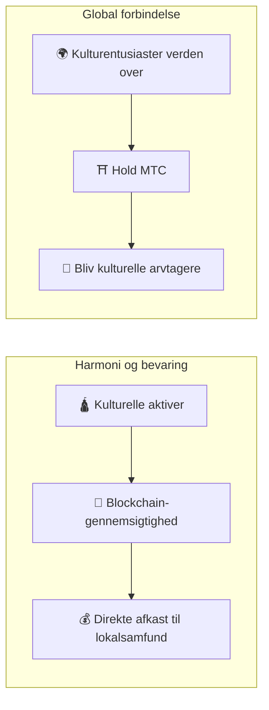

# ⛩️ Velkommen til Matsuri Coin

> **Kode for Harmoni. Værdi for Fred.**
> En bro af "Wa" i en splittet verden. MTC er kompasset, der leder fra konkurrence til sam-skabelse.

**Matsuri Coin (MTC)** er et decentraliseret utility-token bygget på Solana-blockchainen.
Designet som et **"Kultur-OS"** forbinder det Japans spirituelle arv — "Dybt Japan" — med den globale økonomi.

Vi bygger ikke bare endnu en betalingsinfrastruktur.
Vi bygger en **bro mellem Japan og verden** — et nyt sam-skabelses-framework, hvor mennesker, der elsker kultur, rækker hænderne på tværs af grænser.

---

## 📖 Whitepaper-guide

| | Sektion | Hvad du lærer | Bedst for |
| :---: | :--- | :--- | :--- |
| **1** | [**Vision og strategi**](/docs/vision) | Hvorfor Japans turismemarkeds på ¥10 billioner har brug for Web3. Det økonomiske svinghjul, der gør MTC deflationær | Forståelse af muligheden |
| **2** | [**Økonomien og GCF**](/docs/economy) | 6 indtægtsstrømme, provisionssatser, tokenomics, halveringsplan, betalingsinfrastruktur | Evaluering af forretningsmodellen |
| **3** | [**Økosystem og mining**](/docs/ecosystem) | 5 mining-søjler (Medier, Social, Eventyr, Skaber, Likviditet), Proof of Action | Se hvordan brugere tjener MTC |
| **4** | [**Sådan tjener og bruger du MTC**](/docs/how-to-earn) | Trin-for-trin optjeningsguide, forbrugsmuligheder og on-chain-migreringsplan | Forståelse af tokenets nytteværdi |
| **5** | [**Mobilapps**](/docs/mobile-apps) | 3 native iOS-apps, 827+ tests, Phantom Wallet-integration, offline-first-arkitektur | Vurdering af produktmodenhed |
| **6** | [**Køreplan og team**](/docs/roadmap) | Fase 1-3 milepæle, DAO-styringsplan, teambaggrunde | Tidslinje og eksekveringsrisiko |
| **7** | [**Smart contracts**](/docs/smart-contracts) | 4 Anchor/Rust-programmer, sikkerhedsmodel, revisionsstatus, on-chain-betalingsverificering | Teknisk due diligence |

:::tip Hurtig navigation
**Investor?** Start med [Vision](/docs/vision) → [Økonomi](/docs/economy) → [Køreplan](/docs/roadmap).
**Bruger?** Gå til [Sådan tjener og bruger du MTC](/docs/how-to-earn) — den komplette optjenings- og forbrugsguide.
**Udvikler?** Gå til [Smart Contracts](/docs/smart-contracts) → [Mobilapps](/docs/mobile-apps).
**Partner?** Læs [Økosystem](/docs/ecosystem) → [Økonomi (GCF-sektionen)](/docs/economy).
:::

---

## 🎯 Vores mission

:::info Kanalisering af ¥10 billioner i markedsenergi ind i kulturens fremtid
Japans indgående turismemarked er på vej mod **¥10 billioner** om året.
Men under den overskrift gemmer sig en **ubekvem sandhed.**
:::

### Problemerne ingen taler om

| Problem | Hvad der virkelig sker |
| :--- | :--- |
| 💸 **Indtægtsdræn** | Broderparten af den indgående omsætning lækker til udlandet som provision til udenlandske OTA'er og mellemmænd |
| 😤 **Lokalsamfundets udbrændthed** | Overturisme oversvømmer lokalområder med menneskemængder, men ingen af profitten flyder tilbage til de samfund, der bærer byrden |
| 🚧 **Oplevelsesmuren** | Pakkerejser ridser kun overfladen — rejsende får aldrig forbindelse med det *rigtige* Japan |

> **"Lokale kæmper, rejsende ser en facade, og rigdommen forsvinder i platformgebyrer."**

Vi bruger Web3 til at nedbryde dette ødelagte system.
Din betaling når lokalsamfund og kulturbevarelse **direkte** — fuldt gennemsigtigt, ingen mellemmænd.

---

## 📊 Platformen i overblik

Matsuri-platformen er **ikke et whitepaper-løfte — det er et produktionssystem.**

| Metrik | Værdi |
| :--- | :--- |
| **Datamodeller** | 80+ produktionsdatabasemodeller |
| **API-endepunkter** | 100+ REST API'er, der betjener web, iOS og partnerapps |
| **Betalingsmetoder** | 4 (Stripe, PayPal, Solana Pay, MTC Balance) |
| **Autentificering** | 6 udbydere (E-mail, Google, Apple, Facebook, LINE, Twitter) |
| **Mobilapps** | 3 native iOS-apps (GCF Admin udgivet i App Store; Matsuri og J-Times lanceres i slutningen af april 2026) |
| **Sprog** | 5 (Japansk, Engelsk, Kinesisk, Thai, Norsk) |
| **Smart Contracts** | 4 Anchor/Rust-programmer på Solana |
| **Automatiserede opgaver** | 15+ Celery-baggrundsjobs (indkøbskurvgendannelse, påmindelser, analyser) |
| **Testdækning** | 841+ backend-tests + 827+ mobiltests |

---

## 🏗️ Hybridmodellen: Kultur × Teknologi

De fleste kryptoprojekter jagter profit og behandler kultur som noget, der kan smides ud.
MTC vender manuskriptet: vi bygger en **"økonomi, der beskytter kultur"** — den hybridstruktur, der burde have eksisteret fra dag ét.

| Søjle | Hvad det betyder |
| :--- | :--- |
| **🛕 Harmoni og bevaring** | Turistbetalinger flyder via blockchain-infrastruktur direkte til kulturbevarelse og håndværkerstøtte. Lokalsamfund (GCF) bevarer suveræniteten over deres egen kulturarv — ingen udnyttende mellemmænd |
| **🌍 Global forbindelse** | Infrastruktur, der gør det muligt for alle, overalt, at støtte den japanske ånd af "Wa." At holde MTC betyder at dele Japans levende historie — du bliver en del af dens fortælling |

---

## 💎 Hvorfor bruge MTC?

MTC-økosystemet leverer både **åndelig tilfredsstillelse** og **håndgribelige finansielle fordele.**

### ✨ Oplevelsesværdi

| Fordel | Detaljer |
| :--- | :--- |
| **🎌 Meningsfulde oplevelser** | Lås op for "Dybt Japan" — hellige steder lukket for offentligheden, private tempelceremonier, invitationsbaserede kulturarrangementer |
| **🌐 Et livslangt bånd** | Forbliv forbundet med Japan gennem MTC længe efter du er fløjet hjem. Et sted du altid kan "vende tilbage til" |
| **⚖️ Retfærdig udveksling** | Smart contracts eliminerer mellemmænd. Din taknemmelighed (og penge) går direkte til dem, der har fortjent det |

### 💰 Finansiel opside

| Fordel | Detaljer |
| :--- | :--- |
| **🏷️ Fordelagtige priser** | Betal med MTC og spar **5%–10%** i forhold til yen-priser. F.eks. ¥30.000-tur → ~¥27.000 tilsvarende |
| **🔑 Eksklusiv adgang** | Billet-NFT'er til invitationsbaserede steder og begrænsede events — kun for MTC-indehavere |
| **🛡️ Valutaafdækning** | Lås oplevelsesværdien fast før din rejse — ingen bekymring om valutakursudsving |

---

## ⚡ Hvorfor Solana?

At betjene både "reel turismemæssig efterspørgsel" og "højfrekvens finansiel handel" efterlod os med præcis **én levedygtig blockchain.**

| Metrik | Ethereum | Solana |
| :--- | :---: | :---: |
| **Transaktionsgebyr** | ¥100-vis–¥1.000-vis | **~¥0,04** |
| **Finalitet** | 12 s – minutter | **0,4 sekunder** |
| **Gennemstrømning** | ~15 TPS | **Tusindvis af TPS** |

:::tip Tempel-offertesten
En mikrobetaling så lille som "at kaste ¥100 i en offerkasse" kræver gebyrer **under ¥1.** Kun Solana består den test.
:::

---

---

## 🔑 Hvorfor nu?

| Faktor | Kontekst |
| :--- | :--- |
| **¥10 billioner-markedet** | Japans indgående turisme slog rekorder i 2024-2025 uden tegn på opbremsning. Infrastrukturen til at fange denne værdi on-chain eksisterer ikke endnu |
| **Svag yen** | Historisk svag yen gør Japan til verdens bedste værdidestination — det driver hidtil usete besøgstal |
| **Solana-modenhed** | Solanas infrastruktur (sub-sekund-finalitet, $0,001 gebyrer, Metaplex, SPL-tokens) har kun nået produktionsklasse inden for de seneste 18 måneder |
| **First-mover** | Intet andet projekt kombinerer ReFi-turismerouting, kulturbevarelse og relationsbaseret mining på en enkelt blockchain. Matsuri har **nul direkte konkurrenter** |
| **2-årig halvering** | Mining-puljen lanceres i juni 2027 med en 2-årig halveringscyklus — hurtigere end Bitcoin. Tidlige deltagere låser de højeste belønningsrater permanent |

:::note Klar til at begynde
MTC afslutter æraen med turisme, der blot *forbruger* kultur. Velkommen til rejsen med **sam-skabelse** — lad os bygge fremtiden sammen.
:::

**[▶ Vision: Hvorfor nu?](/docs/vision)** ｜ **[▶ Bliv GCF-medlem (VIP-medlemskab)](/docs/economy)**
