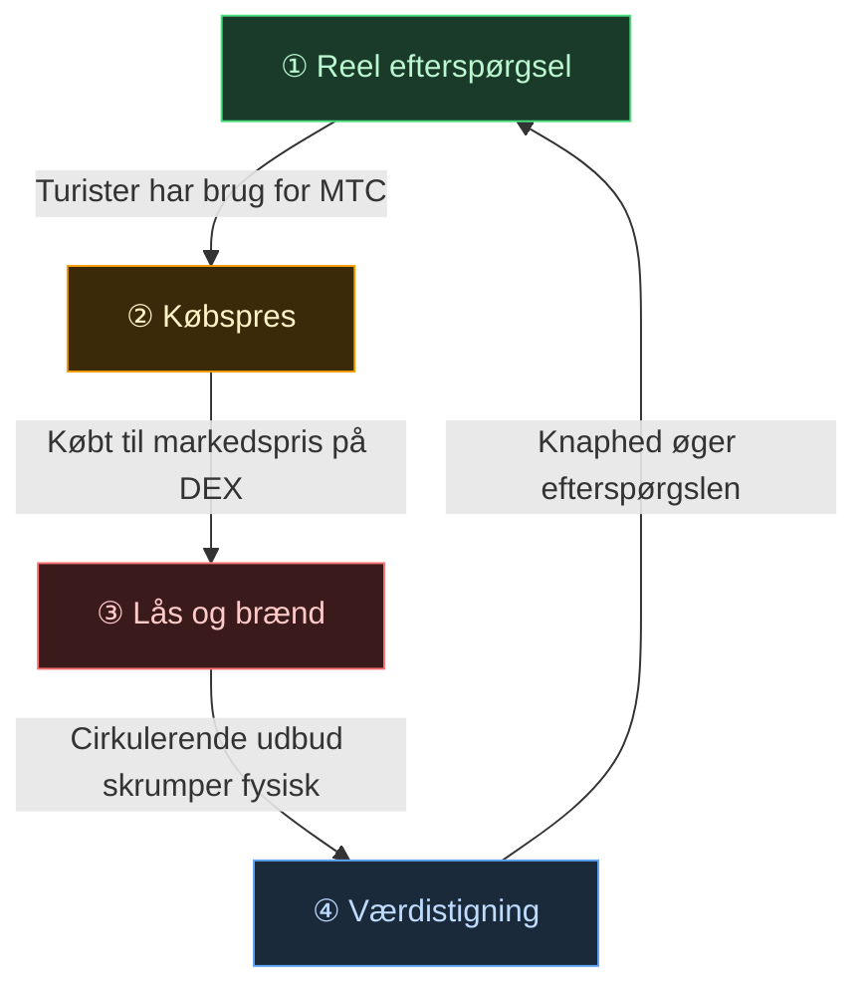
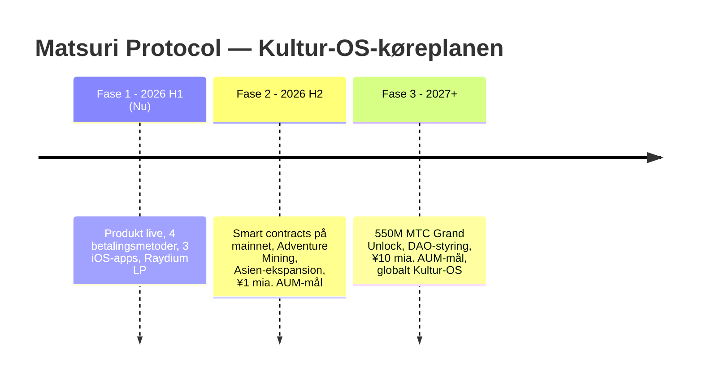

# 🎯 Vision: "Indgående-først"-strategien

> **Fra subsidieafhængighed til suverænitet.**
> Æraen med at holde landområders økonomier oven vande med skatteindtægter er forbi. Vi kanaliserer udenlandsk kapital direkte ind i kulturen.

De fleste regionaludviklingsprojekter fejler — fordi alt, hvad de gør, er at flytte rundt på krympende indenlandske budgetter.

**Matsuri Protocol tager den stik modsatte tilgang.**

---

## 1. Strategi: Kultureksportmaskinen

Vi redefinerer Japans turismeaktiver — ikke som "forbrugsgoder," men som **eksporterbare finansielle instrumenter.**

| Problem | Virkelighed | Konsekvens |
| :--- | :--- | :--- |
| 💸 **Indtægtsdræn** | Provision til udenlandske OTA'er (Booking.com, Expedia osv.) | **15%–20% af omsætningen** lækker til udlandet — et tab i national skala |
| 🚧 **Den usynlige mur** | Sprog- og betalingsbarrierer | Velhavende rejsende kan ikke få adgang til "Dybt Japan"-oplevelser |

:::tip MTC's rolle
MTC er den **eneste hovednøgle**, der stopper drænet og river muren ned.
:::

---

## 2. Det økonomiske svinghjul

Det definerende træk ved Matsuri Protocol: **turisternes begejstring driver matematisk MTC-prisforøgelse.**
Ikke håb — **udbud-og-efterspørgselsmekanik.**

### Hvorfor stiger MTC?

En **4-trins automatisk cyklus** understøtter prisen:

| Trin | Navn | Mekanisme |
| :---: | :--- | :--- |
| **①** | **Reel efterspørgsel** | Turister har brug for MTC til guidebookinger og Ticket-NFT-køb |
| **②** | **Købspres** | MTC købes til markedspris på en DEX — forbrugsdrevet, ikke spekulativt |
| **③** | **Lås og brænd** | En del af MTC brugt i betalinger låses eller brændes øjeblikkeligt af smart contracts — udbuddet skrumper fysisk |
| **④** | **Værdistigning** | Købeefterspørgslen vokser, salgsudbud skrumper — knaphedsværdien stiger matematisk |

:::info Kernesandheden
**"Jo mere turister nyder Japan, jo mere vokser MTC-indehavernes aktiver."**
Denne simple ligning er projektets hjerteslag.
:::

### Hvad skaber nedadgående pres?

Ærlige projekter adresserer begge sider. MTC kan tabe værdi hvis:

| Risiko | Konsekvens | Afbødning |
| :--- | :--- | :--- |
| **Turismenedgang** | Mindre reel efterspørgsel efter MTC | Diversificeret indtægt: MEV-bot opererer uafhængigt af turisme |
| **Salgspres fra minere** | Optjent MTC dumpes på markedet | Toku-staking (lås MTC for op til 10× mining-boost) inciterer til at holde |
| **Reguleringsændring** | Jurisdiktionsmæssige begrænsninger | SPL-tokenstandard, ingen værdipapirklassificering, juridisk udtalelse planlagt |
| **Solana-netværksproblem** | Midlertidige transaktionsforsinkelser | Retry-logik med eksponentiel backoff; off-chain-system opererer uafhængigt |

> **Vi lover ikke "tal stiger." Vi bygger mekanismer, der skaber strukturelt købspres og reducerer salgsincitamenter.** Resten er markedsdynamik.

---

## 3. Slutmålet: Kultur-OS

Vores ultimative mål er ikke en betalingsapp.
Det er at **gøre kultur til et operativsystem.**

> Vi beskytter **kultur, der har bestået i 1.000 år** med **banebrydende blockchain-teknologi.**
> Det er den fremtid, Matsuri Protocol bygger.

  

*Matsuri-tur ved Hanazono-helligdommen — hvor kultur møder verden.*

---

**[▶ Næste: Hvordan tjener vi egentlig? (Økonomien)](/docs/economy)**
