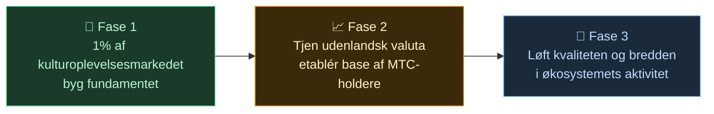

# 🌏 Udfordringer og løsninger – ubekvemme sandheder og håb

> **Missionen er smuk. Men virkeligheden står i vejen.**

---

## De ubekvemme sandheder, der står i vejen

:::info 10 billioner yen i markedsenergi når ikke frem til dem, der bærer kulturen
Japans marked for indgående turisme vokser mod **10 billioner ¥ om året**.
Men størstedelen af frugterne når aldrig frem til dem, der rent faktisk leverer oplevelserne.
:::

### Det marked MTC sigter efter

Vi forsøger ikke at hive hele de 10 billioner ¥ hjem.

Det, vi først går efter, er markedet for **kulturoplevelser, guider og lokale ture**. **1 % af det (omkring 100 milliarder ¥)** er vores første mål – start småt, bliv stærk.

| Fase | Strategi | Mål |
| :--- | :--- | :--- |
| **Start småt** | Fokus på kulturoplevelser og guideture. Opbyg erfaring, vækst via mund-til-mund | Indtægtsgrundlag etableret |
| **Bliv stærk** | Tiltræk udenlandsk valuta (turistindtægt), dokumentér mekanismen for overskudsdeling til MTC-holdere | Tillid til MTC-økonomien |
| **Hæv niveauet** | Når en vis størrelse er nået, prioritér kvalitet, bredde og dybde i fællesskabet frem for yderligere ekspansion | Bæredygtig kulturøkonomi |

> **Vi jagter ikke volumen – vi vokser gennem kvaliteten af deltagerne og dybden af oplevelserne.** Det er MTC’s vækststrategi.

Web2-platformene har bragt rejsens vidundere ud til hele verden. Det er vi taknemmelige for.
Men den centraliserede struktur har nogle uundgåelige bivirkninger.

Algoritmer bestemmer "hvad du ser", og udbyderne tvinges til at konkurrere om placering. En enkelt anmeldelse kan afgøre omsætningen, og gebyrsatser kan ændres efter platformens forgodtbefindende – hele tiden i frygtens skygge: "bliver jeg valgt, eller forsvinder jeg?"

Det skaber splittelse mellem udbyderne og frygt for usynlige regler.
Naboforretningen bliver en rival; det bliver mere rationelt at lukke sig om sig selv end at samarbejde. Rejsende får kun standardiserede valg – stjerner og ranglister – og de oplevelser, der virkelig har værdi, drukner.

:::danger Tre udfordringer på jorden
💸 **Indtjeningen lækker ud** — størstedelen af omsætningen ender som gebyrer hos udenlandske OTA’er og mellemmænd i udlandet

😤 **Områder slides op** — overturismens byrder bliver tilbage, mens den egentlige indtægt ikke vender tilbage til lokalsamfundet

🚧 **Adgangsbarriere til oplevelsen** — algoritmernes ensartede ture dominerer, og man får aldrig "det rigtige Japan" at se
:::

> **Japanerne slider, rejsende møder aldrig det ægte Japan, og rigdommen forsvinder til platformene.**

---

## Så hvordan ændrer vi det?

Men nu ligger teknologien klar til at ændre strukturen fra grunden.

:::tip Smart contracts – fælles regler, der ikke kan omskrives
Gebyrer og betingelser er ristet ind i koden og kan ikke ændres af én enkelt aktør. De samme regler gælder alle og udføres automatisk.
:::

:::tip Blockchain – alt er synligt
Alle transaktioner registreres i en åben hovedbog, og hvem som helst kan efterprøve dem. Tiden, hvor data blev lukket inde i virksomheder, er forbi.
:::

:::tip Solana – 0,4 sek. afvikling, gebyr på ca. 0,04 ¥
Ingen lag på lag af mellemled, ingen ventetid på dage. Mennesker kan møde hinanden direkte.
:::

:::tip AI – udsletter selve administrationsomkostningen
Den eksplosive produktivitetsgevinst gør den omkostningsstruktur, der holder kæmpeplatformene kørende, til fortid.
:::

Vi behøver ikke længere mellemmænd. Vi kan forbinde os direkte.

Med denne teknologi befrier vi turismens økonomi fra monopolet og fører indtjeningen tilbage til udbyderne – i Japan og andre lande.
Og vi bygger ikke bare for Japan, men **en mekanisme til at værne om og forbinde verdens kulturer**.

---

**[◀ Forrige: Vision og mission](/docs/vision)**｜**[▶ Næste: Fremtiden MTC tegner](/docs/future)**
