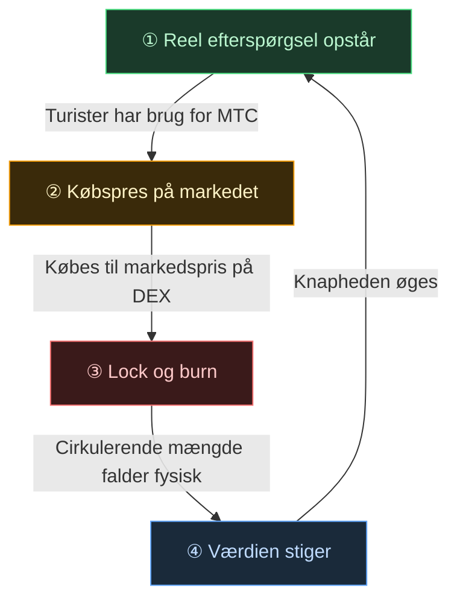

# 🔄 Økonomisk svinghjul – vækstens kredsløb og kultur-OS

> **Jo mere turister nyder Japan, desto mere stiger efterspørgslen i økosystemet.**
> Denne udbuds- og efterspørgselsmekanisme er projektets hjerte.

---

## MTC’s udbud/efterspørgsel

I Matsuri Protocols design er mekanismen bygget, så **stigende reel efterspørgsel skaber købspres, som kombineret med faldende udbud giver betingelserne for værditilvækst**.
Det er ikke forhåbninger, men **udbud og efterspørgsel**.

Følgende **fire-trins kredsløb** bærer hele mekanismen.

| Trin | Navn | Mekanisme |
| :---: | :--- | :--- |
| **①** | **Reel efterspørgsel opstår** | Turister har brug for MTC til at booke guider og købe billet-NFT’er |
| **②** | **Købspres på markedet** | MTC købes til markedspris på DEX (decentral børs). Ikke spekulation, men et stærkt forbrugsdrevet køb |
| **③** | **Lock og burn** | En del af den MTC, der bruges til betaling, låses eller brændes straks af smart contracten. Cirkulerende mængde falder fysisk |
| **④** | **Øget knaphed** | Købsefterspørgslen stiger, salgsudbuddet falder. Skiftet i udbud/efterspørgsel gør hver enkelt token mere sjælden |

---

---

:::note Den vision, formlen bærer
Hele billedet af det "kultur-OS", der ligger ud over svinghjulet, fortælles på næste side [Fremtiden MTC tegner](/docs/future).
:::

---

**[◀ Forrige: Udfordringer og løsninger](/docs/challenges)**｜**[▶ Næste: Fremtiden MTC tegner](/docs/future)**
