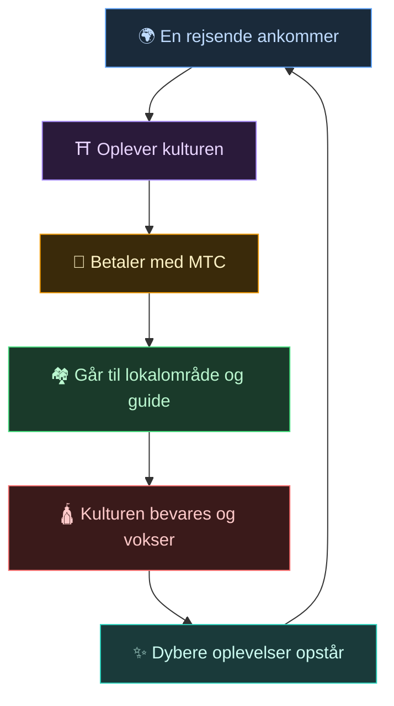
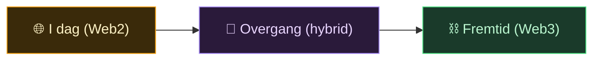
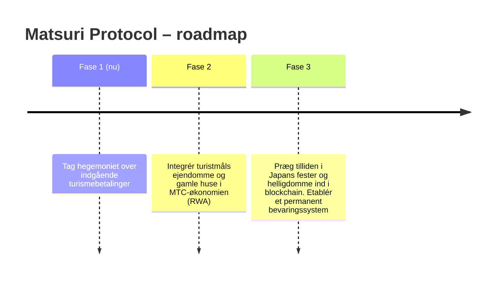

# 🌀 Fremtiden MTC tegner – en økonomi, hvor alle former for engagement cirkulerer

> **Dem der oplever, dem der formidler, dem der værner. Alle disse tanker cirkulerer som økonomi og sender kulturen videre til næste generation.**

---

## Det kredsløb, vi vil realisere

MTC er ikke en spekulationstoken.

En rejsende rører ved japansk kultur og bliver bevæget.
En guide bringer den følelse videre og belønnes for det.
Et lokalsamfund får overskud og kan fortsat værne om sin kultur.
Og den kultur tiltrækker nye rejsende.

Det kredsløb er hele grunden til, at MTC findes.

---

## En økonomi, hvor alle tre parter belønnes

I klassisk turisme betaler den rejsende, platformen tager profitten, og lokalsamfundet får intet.
I MTC’s økonomi belønnes alle involverede.

| Den involverede | Hvad der sker | Hvordan de belønnes |
| :--- | :--- | :--- |
| **🌍 Dem der oplever** | Rører ved japansk kultur og betaler med MTC | Billigere end yen-prisen, adgang til ægte oplevelser, forbliver forbundet via MTC også efter hjemrejsen |
| **⛩️ Dem der formidler** | Afholder events som guide, udgiver indhold på J-Times | Direkte betaling uden mellemmænd – jo mere de arbejder, jo mere belønnes de i MTC |
| **🏘️ Dem der værner** | Lokalsamfund, der vedligeholder og viderefører kulturen | Indtægterne går direkte til dem. Bæredygtig velstand i stedet for overturisme |

---

## Jo bredere økonomien, jo stærkere kulturen

MTC’s økonomi begynder med oplevelsesbookinger og breder sig efterhånden ud over hele livet.

- **Oplevelser** — ægte kulturoplevelser, pilgrimsminedrift
- **Bolig, mad, beklædning** — gæstehuse, butikker, mad, mode
- **Fælles skaberprojekter** — crowdfunding-investeringer, der værner om kulturen
- **International kulturforståelse** — udveksling og gensidig forståelse på tværs af grænser

Jo bredere økonomien, desto tykkere cirkulerer MTC, og desto stærkere er kraften, der bærer kulturen.
Det er ikke bare en forretningsmodel, men et **livsunderstøttende system for kulturen**.

---

## Fra Web2 til Web3 – uden rykvise overgange

Vi siger ikke "alt skal på blockchain nu".

De fleste er endnu ikke fortrolige med Web3. Derfor er designet sådan, at **man først bruger noget velkendt og gradvist mærker Web3’s fordele**.

| Fase | Brugeroplevelse | Under motorhjelmen |
| :--- | :--- | :--- |
| **I dag** | En ganske almindelig web-app til booking og betaling. Kreditkort er fint | Django + Stripe. Ingen wallet krævet |
| **Overgang** | Tjen og brug MTC i appen. Wallet-forbindelse med ét tryk | Off-chain scores migreres gradvist on-chain |
| **Fremtid** | Alle transaktioner og rettigheder registreres transparent på blockchain. Dit bidrag bevises for evigt | Fuldautomatisk, uforanderlig økonomi via smart contracts |

:::tip Web3 er ikke svært
Du behøver ikke sætte wallets op eller passe på seed-fraser fra starten. Mens du bruger systemet, rører du naturligt ved Web3-verdenen — **før du ved af det, er du allerede en beboer i Web3.** Sådan er oplevelsen designet.
:::

---

## En økonomi drevet af empati, ikke magt

Og denne økonomi drives af smart contracts.
Ingens magt eller bekvemmelighed kan ensidigt ændre reglerne — **et økonomisk system, hvor magt ikke kan ændre status quo**.

Oven på det lærer vi af fortidens visdom og bliver ved med at skabe ny værdi. 温故知新 (onko-chishin), og videre til 創新 (sōshin — skabe det nye).

> **En verden, hvor livet kan hvile på kultur – uden yen, uden dollars.**
>
> I stedet for at overlade valutaens værdi til andre, skaber og bruger du værdi gennem dit eget engagement.
> Det er den frihed, MTC vil levere.

---

## 🏁 Slutmålet: "Kultur-OS"

Vores ultimative mål er ikke bare en betalingsapp.
Det er at **gøre selve kulturen til et OS (fundament)**.

> Vi værner om den gamle visdom med den nyeste blockchain.
> Det er Matsuri Protocols fremtidsbillede.

---

:::note Så langt rækker fortællingen
Er du nået hertil, har du nu forstået, hvorfor MTC overhovedet eksisterer.
Nu går vi videre til **[Praksis]** — lad os se, hvad du faktisk kan gøre med MTC.
:::

**[◀ Forrige: Økonomisk svinghjul](/docs/flywheel)**｜**[▶ Næste: Økosystemet](/docs/ecosystem)**
