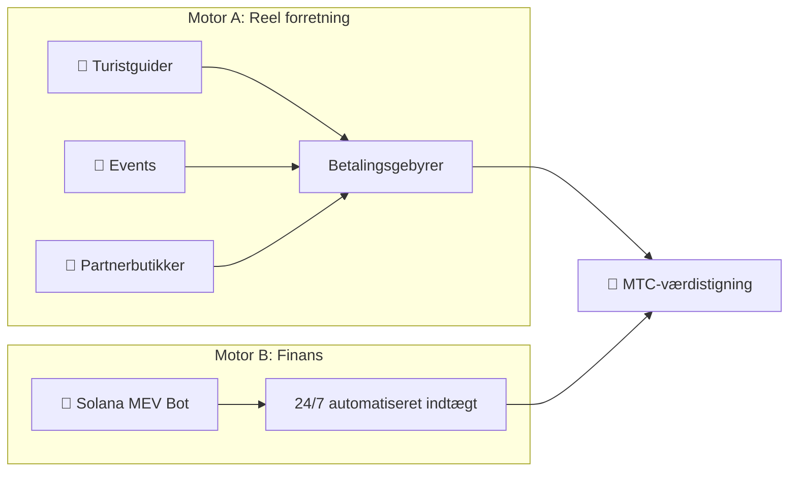
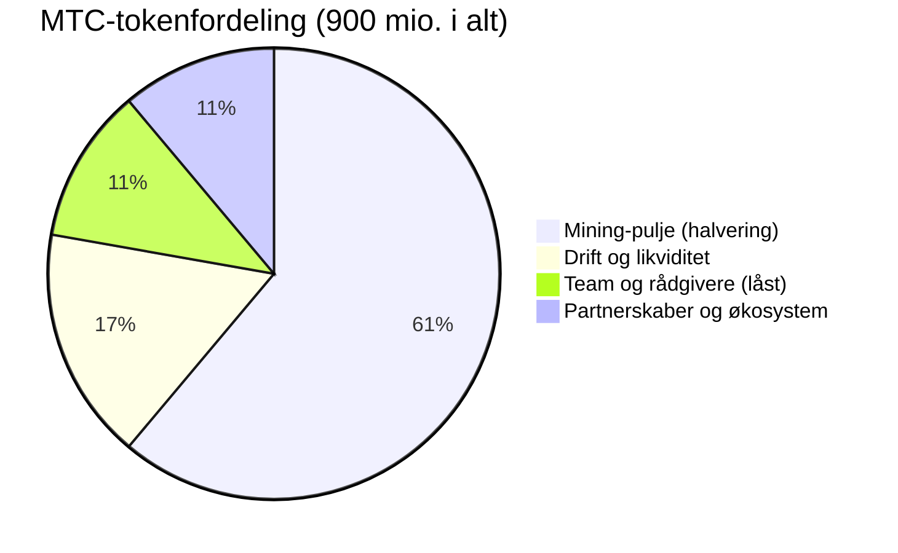

# 💰 Økonomien

> Matsuri Coin (MTC)-økonomien er enkel, men kamptestet.
> **To indtægtsmotorer — reel forretning og finansielle algoritmer — genererer profit og omfordeler den programmatisk til indehavere.**


---

## 1. Dobbelte indtægtsmotorer



| Motor | Indtægtskilde | Hvordan det fungerer |
| :--- | :--- | :--- |
| **🏯 Motor A (Reel forretning)** | Betalingsgebyrer fra turistguider, events og partnerbutikker | Flere indgående turister → mere udenlandsk kapital strømmer ind → økosystemet udvides |
| **🤖 Motor B (Finans)** | Solana MEV Bot automatiseret handel | CEO-designet algoritme fanger on-chain-arbitrage og likvidationsmuligheder 24/7/365. Indtægten er uafhængig af turismes sæsonudsving — den kører uanset markedsforhold |

### Indtægtsstrømme (aktive og sporede)

Platformen sporer **6 distinkte indtægtskategorier** — alle med produktionsbetalingsinfrastruktur:

| # | Indtægtsstrøm | Betalingsmetode | Status |
| :---: | :--- | :--- | :---: |
| 1 | **Salg af eventbilletter** | Stripe / PayPal / Solana Pay / MTC | ✅ Aktiv |
| 2 | **GCF-medlemsabonnementer** | Stripe tilbagevendende fakturering | ✅ Aktiv |
| 3 | **Henvisningsprovisioner** | Auto-beregnet, bank/krypto-udbetaling | ✅ Aktiv |
| 4 | **Guide-drikkepenge** | Stripe (Uber-lignende tipping efter event) | ✅ Aktiv |
| 5 | **Kursustilmeldingsgebyrer** | Stripe | ✅ Aktiv |
| 6 | **Crowdfunding-kampagner** | Solana on-chain | ✅ Aktiv |

---

## 2. Tilbagekøbsprotokol (værdistigningsmekanisme)

Vi beholder ikke profitten.
Smart-contract-regler kanaliserer indtægterne direkte til **MTC-værdistigning.**

| Indtægtskilde | Allokering | Handling |
| :--- | :---: | :--- |
| **Matsuri HQ-salg** (Guider og events) | **20%** | Markeds-**tilbagekøb** + likviditetspoolindskud |
| **GCF-medlemskab** (Medlemsgebyrer) | **25%** | Markeds-**tilbagekøb** |

:::info Kernelogik
**"Forretningsvækst = MTC bliver konstant købt på det åbne marked."**
Den ligning understøtter din aktivværdi.
:::

---

## 3. Prisfastlæggelseslogik

Vores prismekanisme kører på **AMM (Automated Market Maker)-formlen** — ikke ønsketænkning.

```
Price = Liquidity (SOL) ÷ Supply (MTC)
```

| Trin | Hvad der sker | Resultat |
| :---: | :--- | :--- |
| **①** | Forretningsindtægt (SOL) injiceres i puljen | **Tæller ↑** |
| **②** | MTC købes tilbage fra markedet og brændes | **Nævner ↓** |
| **③** | Tæller ↑ × Nævner ↓ | **Prisen tenderer matematisk opad** |

> **Eksempel:** Hvis Raydium-puljen indeholder 1.000 SOL og 10.000.000 MTC, er prisen 0,0001 SOL/MTC. En ¥300.000-tur genererer et ¥60.000-tilbagekøb (20%), som tilføjer ~0,4 SOL til puljen og fjerner MTC fra cirkulation. Gang dette med hundredvis af månedlige transaktioner.

---

## 4. GCF (Global Community Friends)

GCF er den **invitationsbaserede** partnerorganisation (DAO), der skalerer Matsuri-økosystemet.
Ikke en medlemsklub — et **forretningskollektiv**, der deler i opsiden.


<div style={{display: 'flex', gap: '2rem', justifyContent: 'center', alignItems: 'center', flexWrap: 'wrap', margin: '2rem 0'}}>
  
  
</div>

### Medlemsniveauer

| Niveau | Rolle | Privilegier |
| :---: | :--- | :--- |
| **👑 Platinum** | Ejer / VIP | Topniveau-rettigheder. Kun de første **50 pladser**. Beslutningskraft + betydelig udbytteindkomst |
| **🥇 Gold** | Ambassadør | Operatørerne. Retten til at tjene **uden loft** gennem aktivitet. Maksimerede mining- og henvisningsrater |

### Fordel ①: Real-Work Mining (miningrettigheder)

De **550 millioner MTC (~61% af det samlede udbud)**, der frigives den 1. juni 2027, er reserveret som en **bidragsyderbelønningspulje** — ikke dumpet på markedet.

:::tip Fuldt præstationsbaseret
MTC distribueres automatisk fra puljen baseret på dit output (salg, besøgstal, guidesessioner).
:::

**Halveringsplan (2-årig cyklus):**

| Periode | Frigivelse | Volumen |
| :--- | :---: | :--- |
| **Epoke 1** 2027 – 2029 | **50%** | ~275 mio. tokens |
| **Epoke 2** 2029 – 2031 | **25%** | ~137 mio. tokens |
| **Epoke 3** 2031 – 2033 | **12,5%** | ~68 mio. tokens |

:::caution First-mover-vindue
Hurtigere end Bitcoins 4-årige halvering — vi bruger en **2-årig cyklus.**
De, der satser alt i de **første to år fra 2027**, låser en overvældende first-mover-fordel.
:::

### Fordel ②: Premium-henvisningsprovisioner

Henvis højværdiprodukter (medlemskaber, VIP-ture, partner-fast ejendom) for at tjene **premiumprovisioner (USDC + MTC)** — størrelsesordener over standard affiliate-udbetalinger. Udbetalt **øjeblikkeligt** via smart contract.

#### Implementeret provisionsstruktur (on-chain-klar)

Henvisningsmotoren understøtter op til **4-lags dybe provisioner** — alle auto-beregnet ved hvert køb:

| Lag | Relation | Provisionssats |
| :---: | :--- | :---: |
| **L1** | Direkte henvisning | **20%** |
| **L2** | Henvisningens henvisning | **5%** |
| **L3** | 3. grad | **5%** |
| **L4** | 4. grad | **5%** |

> Hvert `EventPurchase` udløser automatiske `GCFReferralCommission`-poster for alle berettigede opstrøms-henvisere. Provisioner spores med statusflow: `pending → approved → paid`.

#### Udbetalingsmuligheder

| Metode | Detaljer |
| :--- | :--- |
| **🏦 Bankoverførsel** | Japanske bankkonti (krypteret med Fernet-cipher) |
| **⚡ Solana** | Direkte walletoverførsel med on-chain TX-hash-bevis |
| **💳 Revolut** | International udbetalingsstøtte |

---

## 5. Betalingsinfrastruktur

Fire betalingsmetoder er **udrullet og behandler transaktioner** — designet til at betjene både traditionelle kunder og Web3-native brugere.

| Metode | Udbyder | Gebyr | Anvendelse |
| :--- | :--- | :---: | :--- |
| **💳 Kreditkort** | Stripe | 3,6% | Standardkøb, abonnementer |
| **🅿️ PayPal** | PayPal | 3,9% + ¥40 | Internationale gæster |
| **⚡ Solana Pay** | Phantom Wallet | ~¥0,04 | Krypto-native brugere, MTC-køb |
| **🪙 MTC Balance** | Intern (CoinService) | 0% | Optjent MTC brugt på oplevelser |

:::info Smart routing
Systemet anbefaler automatisk den optimale betalingsmetode baseret på beløb, brugerens placering og tidligere adfærd — gennemsigtigt for brugeren.
:::

### Automatiserede forretningsoperationer

Platformen kører **15+ automatiserede baggrundsopgaver** via Celery-workers:

| Opgave | Frekvens | Forretningsmæssig betydning |
| :--- | :--- | :--- |
| **Indkøbskurvgendannelse** | Hver time | A/B-testede e-mails gendanner forladte køb |
| **Pre-event-påmindelser** | Dagligt kl. 9 JST | 7-dages og 24-timers påmindelses-e-mails |
| **Post-event-undersøgelser** | Efter event | Feedbackindsamling til vurderinger |
| **Magisk øjeblik-tilbud** | Hver time | Post-event-engagement med personlige tilbud |
| **MTC Balance-synkronisering** | Hvert 5. min | Synkroniser on-chain-tokensaldi |
| **Kampagnedeadlines** | Hvert 30. min | Crowdfunding-deadlinehåndhævelse |
| **Oversættelsesbatch** | On demand | GPT-4 Turbo auto-oversætter events til 5 sprog |

---

## 6. Token-specifikationer

Vi har permanent **TILBAGEKALDT** Mint- og Freeze-autoriteter på Solana.
Ingen yderligere udstedelse — nogensinde. Ingen fastfrysning af midler — nogensinde. **Fuldt tillidsløst by design.**

| Post | Detaljer |
| :--- | :--- |
| **Tokennavn** | Matsuri Coin |
| **Ticker** | MTC |
| **Kæde** | Solana |
| **Samlet udbud** | **900.000.000 MTC** (Fast) |
| **Mint-autoritet** | 🚫 Tilbagekaldt |
| **Freeze-autoritet** | 🚫 Tilbagekaldt |
| **Lås-kontrakt** | Streamflow Finance (Verificeret) |

:::warning Kun på invitation — pladserne er begrænsede
GCF Platinum er begrænset til **50 pladser på verdensplan** — når de er fyldt, optages ingen nye Platinum-medlemmer. Gold-medlemskab justeres baseret på økosystemkapacitet. Denne knaphed er by design: færre partnere betyder højere værdi pr. medlem.
:::

### Tokenfordelingsoversigt



| Allokering | Beløb | Låsestatus |
| :--- | :--- | :--- |
| **Mining-pulje** | 550 mio. MTC (61,1%) | Låst til juni 2027, distribueret via 2-årig halvering |
| **Drift og likviditet** | 150 mio. MTC (16,7%) | Anvendt til Raydium LP, market making, driftsomkostninger |
| **Team og rådgivere** | 100 mio. MTC (11,1%) | Låst via Streamflow Finance med vestingplan |
| **Partnerskaber og økosystem** | 100 mio. MTC (11,1%) | Reserveret til strategiske partnere, børsnoteringer, tilskud |

---

## 7. Analyse og Business Intelligence

Platformen sporer **enhver brugerinteraktion** med et produktionskvalitets analysesystem — der muliggør datadrevne beslutninger, ikke gætterier.

| Metrik | Hvordan det spores |
| :--- | :--- |
| **Sessionsanalyse** | Enhed, browser, geo, UTM-kilde, scrolldybde, tid på side |
| **Konverteringstragte** | Trin-for-trin-sporing: visning → klik → kurv → køb |
| **A/B-test** | Forsøgsgrupper tildelt per session med variantsporing |
| **Omsætning pr. kilde** | Samlet forbrug pr. session, tilskrevet kampagnekilde |
| **Kohorteanalyse** | Fastholdelse efter tilmeldingsdato, medlemsniveau, henvisningskilde |
| **Guidepræstation** | Indtjening, drikkepenge, leaderboard-placeringer |

> Denne infrastruktur muliggør beregning af **ARPU, LTV, CAC, churn rate og konverteringsrater** — de metrikker investorer har brug for til at evaluere enhedsøkonomi.

---

**[▶ Næste: Økosystem og mining](/docs/ecosystem)** ｜ **[Følg på X](https://x.com/matsuri_dao_jp)**
