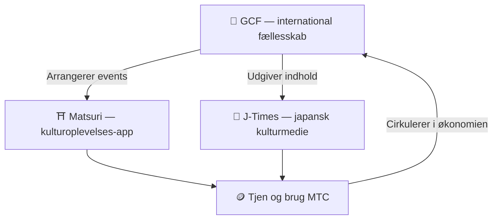

# 🏗️ MTC-økosystemet – en økonomi, hvor oplevelser, medier og fællesskab cirkulerer

> **Tre "steder", der realiserer missionen.**
> Et sted at opleve, et sted at lære, et sted at mødes — uafhængige af hinanden og samtidig ét cirkulerende kredsløb via MTC.

MTC er ikke bare en token. Tre produkter og et internationalt fællesskab arbejder sammen om at virkeliggøre en økonomi, der beskytter kulturen.

:::tip 🤝 GCF — det internationale fællesskab, der driver økosystemet
Et sted, hvor mennesker med kærlighed til japansk kultur mødes på tværs af grænser. GCF rekrutterer guider, og disse GCF-guider afvikler oplevelser på Matsuri. De sender også fængslende indhold ud på J-Times — fællesskabets aktivitet er motoren for hele økosystemet.
:::

:::tip ⛩️ Matsuri — kulturoplevelses-app
Starter med booking af kulturoplevelser og udvides trinvist til **gæstehuse**, **butikker** og **crowdfunding**. Økonomien vokser fra oplevelser til beklædning, mad, bolig og fælles investering.

**Pilgrimsminedrift (sankei-mining)** — tjen MTC ved fysisk at besøge helligdomme, templer og kultursteder. Strømmen af besøgende spredes naturligt fra de store seværdigheder til regionens skjulte perler, så overturisme løses samtidig med at provinserne revitaliseres.
:::

:::tip 📰 J-Times — japansk kulturmedie
Et medie, der bringer japansk kultur ud i verden. Tjen MTC ved at læse, dele og engagere dig i artiklerne.
:::

---

## 🤝 Social Mining (tjen ved at forbinde dig)

**Integreret med GCF-administrationspanel ── webversion kører nu (iOS-app planlagt april 2026)**

GCF-medlemmer får adgang til det dedikerede **GCF-admin-web**.

| Funktion | Hvad du kan gøre |
| :--- | :--- |
| **🎪 Events** | Design og udgiv dine egne events og ture |
| **📢 Indhold** | Udgiv og sprede J-Times-artikler og indhold |
| **📊 Henvisningssporing** | Følg henvisninger, brugeraktivitet og indtægter i realtid |

:::info Automatisk udbytte
Hver gang en af dine henvisninger gennemfører en betaling, indbetaler systemet **automatisk** en andel af omsætningen til din wallet.
:::

---

## 🎓 Creator-økonomi (tjen ved at skabe)

Du kan ikke kun forbruge indhold – på Matsuri-platformen kan **hvem som helst** producere og tjene på eget indhold.

| Platform | Hvad skaberen kan | Indtægtsmodel |
| :--- | :--- | :--- |
| **📚 Kursusmarkedsplads** | Udgiv video- eller tekstkurser om japansk kultur, sprog, håndværk | Gebyr pr. tilmelding (skaberandel) |
| **🎙️ Podcast-studie** | Producér audio-serier med distribution via Spotify, Apple Podcasts, RSS | Abonnement-eksklusive episoder |
| **🤝 Crowdfunding** | Start Solana-baserede kampagner til kulturprojekter | On-chain sporing af bidrag |
| **🛍️ Brugerbutikker** | Åbn personlige butikker på platformen (kunsthåndværk, merch) | Direkte salg med produkt/anmeldelsessystem |

:::tip AI-assisteret produktion
Event-værter kan bruge den **indbyggede AI-assistent (GPT-4 Turbo)** til at skrive eventbeskrivelser, oversætte automatisk til fem sprog og generere SEO-optimeret metadata – alt fra admin-panelet.
:::

---

  

*Fællesskabs-meetup i Golden Gai ── forbindelser som minedriftskraft.*

---

:::note Næste side
Vil du vide mere om, hvordan minedriften konkret fungerer og hvordan man tjener, så gå videre til **[Minedrift og indtjening →](/docs/mining)**.
:::
