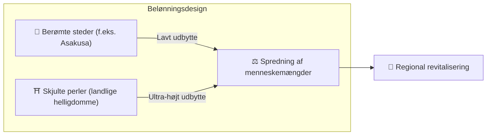

# ⛏️ De fem søjler af mining

> **Proof of Action (PoA)**
> Matsuri Coin mines ikke af GPU'er, men af **menneskelig handling.**

Webappen og admin-dashboardet er **allerede live** — begynd at tjene **lige nu** gennem aktiviteterne nedenfor.

---

## 1. 📖 Medie-mining (Læs, lyt og quiz for at tjene)

**Drevet af "J-Times" officielle medier**

Viden transformerer rejsekvaliteten.
Vi belønner læring — at læse, lytte **og** bevise forståelse gennem quizzer.

| Handling | Hvad du gør | Belønning |
| :--- | :--- | :--- |
| **📰 Læs for at tjene** | Læs J-Times-artikler om historie, Shinto, Zen | MTC tildelt |
| **🎧 Lyt for at tjene** | Stream eksklusive podcasts om dyb japansk kultur | MTC tildelt |
| **✅ Quiz for at tjene** | Bestå quizzer for at bevise vidensretention | MTC tildelt (øjeblikkeligt) |

:::tip Dødtid → Mining-tid
Din pendling, din frokostpause, din flyvetur — hvert ledigt øjeblik bliver en belønningsgenererende mulighed.
:::

---

## 2. 🤝 Social mining (Forbind for at tjene)

**Drevet af GCF Admin Dashboard — allerede live**

GCF-medlemmer får adgang til det dedikerede **"GCF Admin Web."**

| Funktion | Hvad du kan gøre |
| :--- | :--- |
| **🎪 Eventoprettelse** | Planlæg og offentliggør dine egne events og ture |
| **📢 Indholdsdistribution** | Forstærk J-Times-artikler og indhold på tværs af dit netværk |
| **📊 Henvisningssporing** | Spor henviste brugeres aktivitet og omsætning i realtid |

:::info Automatiske udbetalinger
Hver gang en henvist ven handler, **indsætter systemet automatisk** din andel af omsætningen direkte i din wallet.
:::

  

*Fællesskabsmøde i Golden Gai, Shinjuku — hvor forbindelser bliver til mining-kraft.*

---

## 3. 🗺️ Eventyr-mining (Bevæg dig for at tjene)

**Projekt "PILGRIMAGE" — Smart contracts færdige, mainnet-udrulning august 2026**

En næste generations funktion, der bruger GPS og tokenincitamenter til at omdirigere den fysiske strøm af turister. Det hellige stedkort er **allerede live** i Matsuri-appen — on-chain belønningsdistribution lanceres med smart contract-udrulningen.

> **"Folk tager til landområderne, fordi det er mere profitabelt."**
> Den økonomiske logik løser overturisme og accelererer regional genopblomstring.

### 🎲 "Omikuji"-protokollen

En lykke-seddel-lignende smart contract, der udløses **gratis (kun gas)** ved check-in.

| Resultat | Hvad du får |
| :--- | :--- |
| **🎊 Stor lykke** | Bonus MTC-airdrop |
| **📜 NFT-drop** | Stedseksklusiv **"Goshuin NFT"** |
| **🏆 Samling fuldført** | At fuldføre et sæt låser op for speciel eventadgang |

:::note Ikke gambling
Intet monetært indskud krævet. Bare en tilfældig bonus for **at dukke op.**
:::

  

*Zen-mindfulness i Shinjuku Gyoen — "Dybt Japan"-oplevelser, der genererer mining-belønninger.*

---

## 4. 🎓 Skaberøkonomi (Skab for at tjene)

Ud over at forbruge indhold gør Matsuri-platformen det muligt for **alle** at skabe og tjene penge.

| Platform | Hvad skabere gør | Indtægtsmodel |
| :--- | :--- | :--- |
| **📚 Kursusmarkedsplads** | Offentliggør video-/tekstkurser om japansk kultur, sprog, håndværk | Tilmeldingsgebyr pr. kursus (skaber-omsætningsandel) |
| **🎙️ Podcaststudie** | Vært for lydserie distribueret til Spotify, Apple Podcasts, RSS | Abonnementslåste episoder |
| **🤝 Crowdfunding** | Start Solana-baserede fundraisingkampagner til kulturprojekter | Bidragssporing on-chain |
| **🛍️ Brugerbutikker** | Åbn en personlig butik inden for platformen (håndværk, merchandise) | Direkte salg med produkt-/anmeldelsessystem |

:::tip AI-drevet oprettelse
Eventværter kan bruge den **indbyggede AI-assistent (GPT-4 Turbo)** til at udarbejde eventbeskrivelser, auto-oversætte til 5 sprog og generere SEO-optimerede metadata — alt sammen inden for admin-dashboardet.
:::

---

## 5. 🏦 Likviditets-mining (Tilvejebring for at tjene)

> **Vær banken.**

Vi kører et specielt belønningsprogram for brugere, der tilvejebringer MTC/SOL-likviditet på Raydium.

| Post | Detaljer |
| :--- | :--- |
| **Hvem** | Tidlige likviditetsudbydere ("grundlæggende partnere") |
| **Mål-APY** | **20%** (sat som risikopræmie) |
| **Hvorfor** | Bootstrappe initial likviditet for et stabilt handelsmiljø |

---

**[▶ Næste: Sådan tjener og bruger du MTC](/docs/how-to-earn)** ｜ **[◀ Forrige: Økonomien](/docs/economy)**
