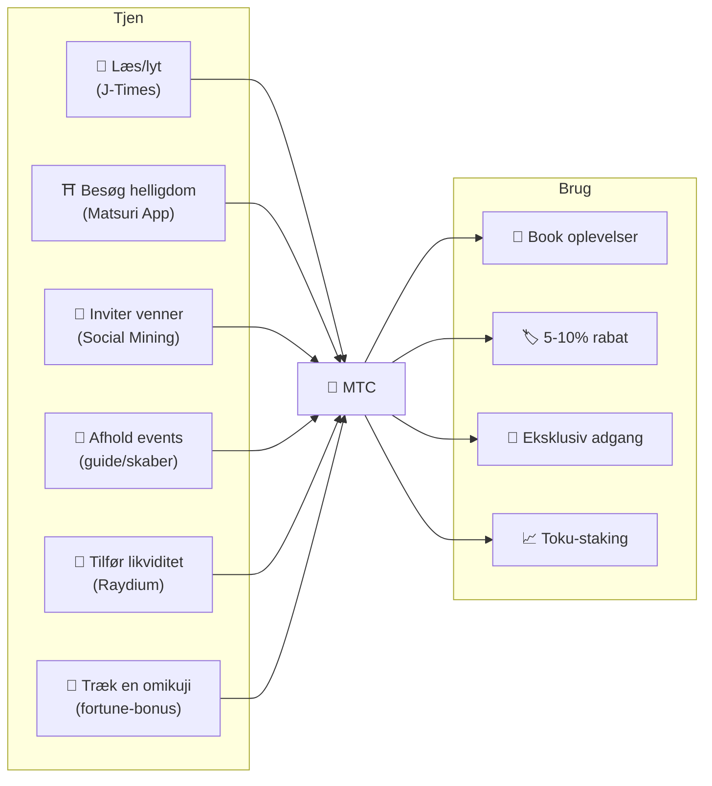
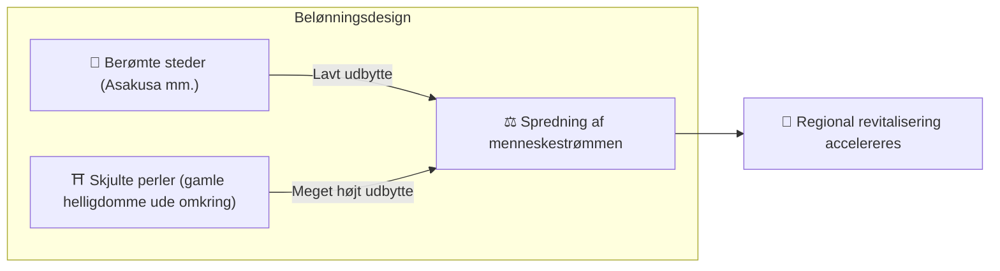
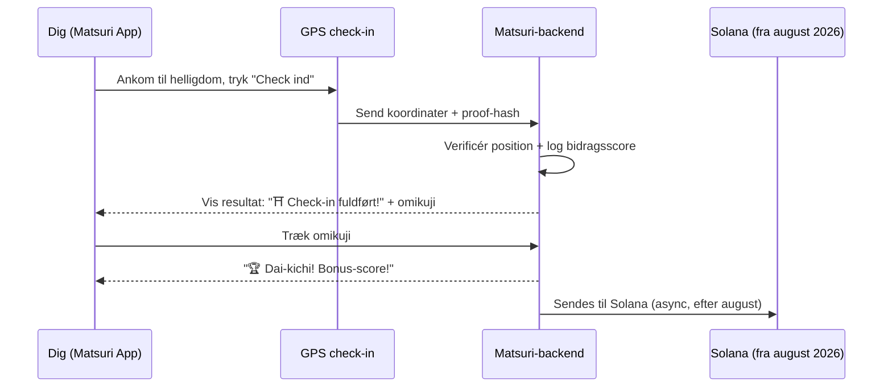
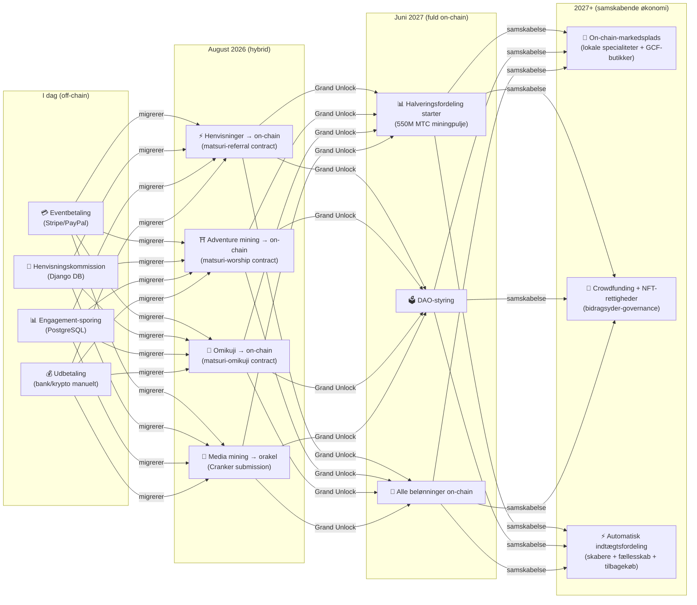

import useBaseUrl from '@docusaurus/useBaseUrl';

# ⛏️ De fem søjler af minedrift og hvordan man tjener

> **Dit engagement i kulturen bliver direkte til værdi.**
> Læs, gå, forbind, skab, støt — hver enkelt handling skaber MTC.

<small>*※ Hvad er "minedrift"? I Bitcoin mv. kaldes det minedrift, når en computer laver enorme beregninger og modtager nye mønter som belønning. I MTC er det ikke computerkraft, men **dine egne handlinger** — at læse en artikel, at besøge en helligdom, at afholde en event — der udgør "minedriften". I stedet for at grave i en guldåre, er det engagement i kulturen, der udvinder MTC. Det er vores "minedrift".*</small>

> Tjen ved at handle. Brug på oplevelser. Hold og vokse.

MTC er ikke en spekulationstoken. Alle handlinger skaber og henter værdi i en reel økonomi. Webappen og admin-panelet er **allerede i drift**. Bidragsscorerne registreres p.t. off-chain (Django), og fra august 2026 flyttes de trinvist on-chain.

:::tip Det store billede
MTC har **en fuldt ud cirkulær økonomi**: du tjener gennem reel aktivitet, bruger på reelle oplevelser, og værdien vokser med økosystemet. På denne side går vi i dybden med mekanismen.
:::

---

## MTC’s livscyklus

---

## De fem minedriftssøjler

### 1. 📖 Media Mining (tjen ved at læse, lytte og svare)

**Integreret med det officielle medie "J-Times"**

Viden løfter rejsens kvalitet dramatisk. Åbn **J-Times-appen** og nyd indholdet om japansk kultur. Ud over læsning og lytning belønnes også **forståelsestjek (quizzer)**. For hver gennemført handling tildeles der automatisk MTC.

| Handling | Betingelse for fuldført | Cirka-belønning |
| :--- | :--- | :---: |
| **📰 Læs en artikel** | Scroll til 75% | 2–30 MTC |
| **🎧 Lyt til en podcast** | Lyt til slut | 2–30 MTC |
| **🎬 Se en video** | Luk detaljevisningen efter visning | 2–30 MTC |
| **📤 Del indhold** | Åbn delearket | 2–30 MTC |
| **✅ Besvar en quiz** | Bestå forståelsestesten | 2–30 MTC |

<small>*※ Belønningen varierer med indholdstype, længde og udbudsbalancen i hele økosystemet*</small>

:::tip Små pauser bliver til minedrift
Transporttid og pauser forvandles til tid, der skaber belønning.
:::

:::info Offline-understøttelse
Ingen internet ved en helligdom på landet? Intet problem. J-Times logger aktiviteten lokalt og **synkroniserer automatisk, når du igen er online** (offline-kø bevares i 7 dage). Du mister ikke den MTC, du har tjent.
:::

**Under motorhjelmen:**
1. J-Times-appen registrerer din handling (fuldført læsning, visning, deling osv.)
2. Logger lokalt, selv offline (bevares 7 dage)
3. Sender til serveren og validerer, når netværket er tilbage
4. Opdateres som bidragsscore i din balance
5. Fra august 2026: den validerede score skrives on-chain via en orakel og kan efterprøves på blockchainen

---

### 2. ⛩️ Adventure Mining (tjen ved at gå)

**Projektet "Junrei (pilgrimsfærd)" ── smart contract færdig, mainnet-deploy august 2026**

En næste generations funktion, der bruger GPS og token-incitamenter til at styre den fysiske strøm af mennesker. Det hellige kort kører **allerede i Matsuri-webappen**. Bidragsscorer registreres off-chain i dag, og on-chain-udbetalinger starter efter smart contract-deployet i august 2026.

>**Man tjener mere, altså tager man ud på landet**
> Den økonomiske logik løser overturisme og accelererer regional genopblomstring.

**Sådan fungerer check-in:**

  
  

    
<strong>Worship Mining</strong> — check ind nær et tempel, opdag energi med AR-kamera, træk en omikuji for MTC-bonus. Multiplikatorer fra 1.0× til 10.0×.

  

**Grundprincip — sjældent besøgte steder giver mere:**

| Stedstype | Eksempel | Cirka-belønning (pr. check-in) |
| :--- | :--- | :---: |
| 🏙️ **Hoved** | Senso-ji, Kiyomizu-dera, Fushimi Inari | 30–50 MTC |
| 🌆 **Regionskerne** | Ichinomiya i hver præfektur, store regionale helligdomme | 50–100 MTC |
| 🏞️ **Lokalt** | Historiske helligdomme på landet | 100–150 MTC |
| ⛰️ **Frontier** | Bjergtempler, hellige steder på afsidesliggende øer | 150–200 MTC |

<small>*※ Ovenstående er vejledende grundbelønning. Omikuji-multiplikator kan hæve den flere gange*</small>

**Ekstra score-faktorer:**
- **Omikuji-multiplikator** — tilfældig bonus ved hvert check-in. Dai-kichi mangedobler belønningen
- **Besøgshyppighed** — tilbagevendende besøgende tjener mere over tid
- **Sponsorerede steder** — kommuner kan booste specifikke steder

:::info Bidragsscore → MTC
Din aktivitet akkumuleres som **bidragsscore**. Ved hver halverings-epoke (starter juni 2027) omregnes scoren til MTC fra 550M-miningpuljen. Jo mere du bidrager til fællesskabet, desto mere MTC får du. De præcise boost-koefficienter fastlægges trinvist og implementeres i smart contracts — en garanti for en retfærdig fordeling, der passer til den reelle puljestørrelse.
:::

---

### 3. 🤝 Social Mining (tjen ved at forbinde)

Du kan tjene MTC, bare ved at invitere venner.

#### Henvisningsbelønning for almindelige brugere

Enkelt: når en af dine venner registrerer sig via din henvisningslink, får du **300 MTC pr. direkte henvisning**.

| Betingelse | Belønning |
| :--- | :--- |
| En ven du har henvist registrerer sig | **300 MTC** |

Det er det hele. Ingen flerniveaubelønninger.

#### Henvisningsbelønning for GCF-agenter

[GCF-medlemmer](/docs/gcf) fungerer som **officielle agenter** for økosystemets ekspansion og har en dybere belønningsstruktur.

| Lag | Relation | Kommission |
| :---: | :--- | :---: |
| **L1** | Direkte henvisning | **20%** |
| **L2** | Henvisning af henvisning | **5%** |
| **L3** | 3. led | **5%** |
| **L4** | 4. led | **5%** |

:::note Om GCF-agentordningen
Flerniveaustrukturen gælder kun officielle agenter med GCF-medlemskab (efter invitation). Almindelige brugere får kun den direkte henvisning (300 MTC).
Kommissioner for GCF-agenter beregnes ud fra **reel økonomisk aktivitet** (oplevelseskøb, eventdeltagelse osv.) hos de henviste. At samle folk uden aktivitet giver ingen belønning.
:::

**Sådan fungerer En-Mining-scoren (for GCF-agenter):**

Bidragsscoren beregnes af to komponenter:
- **Netværkets bredde** (30%) — hvor mange du har bragt ind
- **Økonomisk aktivitet** (70%) — reelle køb fra dit henvisningsnetværk

Scoren akkumuleres over tid og omregnes til MTC ved hver halverings-epoke.

#### GCF-administrationspanel ── webversion kører

GCF-medlemmer får adgang til et dedikeret administrationspanel.

| Funktion | Hvad du kan gøre |
| :--- | :--- |
| **🎪 Events** | Design og udgiv dine egne events og ture |
| **📢 Indhold** | Udgiv og sprede J-Times-artikler og indhold |
| **📊 Henvisningssporing** | Følg henviste brugeres aktivitet og indtægter i realtid |

:::warning I dag off-chain → migrerer on-chain august 2026
Henvisningskommissioner spores i dag i Django (PostgreSQL) og udbetales via bankoverførsel eller krypto. Fra **august 2026** flyttes de til **Matsuri Referral smart contract** på Solana, så udbetalingerne bliver reviderbare on-chain.
:::

  

*Fællesskabs-meetup i Golden Gai ── forbindelser som minedriftskraft.*

---

### 4. 🎓 Creator & Guide Mining (tjen ved at skabe)

Du kan ikke kun forbruge indhold – på Matsuri-platformen kan **hvem som helst** producere og tjene på eget indhold. Er du GCF-medlem, guide eller indholdsskaber, er her måderne at tjene på.

| Aktivitet | Indtægtskilde |
| :--- | :--- |
| **🗺️ Afhold ture** | Guidekommission (sat pr. event) + tips |
| **🎫 Sælg eventbilletter** | Indtægtsandel via EventPurchase |
| **📚 Udgiv kurser** | Gebyr pr. tilmelding (skaberandel) |
| **🎙️ Producér podcast-episoder** | Abonnementsindtægt |
| **🤝 Start crowdfunding** | Solana-baseret on-chain sporing af bidrag |
| **🛍️ Åbn brugerbutik** | Direkte salg af kunsthåndværk/merch |

**Tip-system:** efter event kan gæster sende tips til guiden (Uber-stil). Tips afvikles via Stripe og spores i en offentlig leaderboard.

:::tip AI-assisteret produktion
Event-værter kan bruge den **indbyggede AI-assistent (GPT-4 Turbo)** til at skrive eventbeskrivelser, oversætte automatisk til fem sprog og generere SEO-optimeret metadata – alt fra admin-panelet.
:::

---

### 5. 🏦 Likviditetsminedrift (tjen ved at parkere)

>**Bliv din egen bank.**

Tilfør likviditet til MTC/SOL på Raydium DEX og støt handelsgrundlaget i økosystemets tidlige fase. De tidlige likviditets-udbydere får et særligt "grundlæggerpartner"-belønningsprogram.

| Punkt | Detaljer |
| :--- | :--- |
| **Hvem** | Alle der ejer MTC og SOL |
| **Mål-APY** | **20%** (initialt likviditets-incentiv som risikopræmie) |
| **DEX** | Raydium (Solana) |
| **Formål** | Sikre likviditet tidligt i økosystemet og etablere et stabilt handelsmiljø |

---

## 🎲 Omikuji-bonus

Hvert adventure-mining check-in indeholder en gratis omikuji. En omikuji-formet smart contract, der udføres **gratis (kun gas)** ved fuldført check-in.

| Lykke | Belønningsmultiplikator | Ekstra bonus |
| :--- | :---: | :--- |
| 🏆 **Dai-kichi** | Grundbelønning × max | Goshuin-NFT |
| ✨ **Kichi** | Grundbelønning × høj | — |
| 🌸 **Shō-kichi** | Grundbelønning × let | — |
| 🍃 **Sue-kichi** | Grundbelønning × 1,0 | — |
| 💀 **Kyō** | Grundbelønning × 1,0 | — |

Sandsynligheder og multiplikatorer kan justeres fra GCF-admin-panelet og styres efter MTC-udbudsbalancen i hele økosystemet. Resultatet bestemmes af en **tamper-resistent commit-reveal-protokol på Solana** — efter commit-fasen kan ingen ændre resultatet.

<small>*※ Får du kyō, modtager du stadig grundbelønningen. Selve handlingen at checke ind belønnes*</small>

:::note Det er ikke gambling
Der sættes ingen penge på spil. Det er blot en tilfældig bonus for **handlingen "jeg har besøgt stedet"**. Samler du bestemte NFT’er, kan du låse op for adgang til særlige events.
:::

---

## Sådan bruger du MTC

| Anvendelse | Fordel | Status |
| :--- | :--- | :---: |
| **🎫 Book oplevelser** | Betal ture, events og kulturaktiviteter med MTC | ✅ Tilgængelig |
| **🏷️ Rabat** | 5–10% rabat på yen-prisen ved MTC-betaling | ✅ Tilgængelig |
| **🔑 Eksklusiv adgang** | NFT-gatede events, VIP-ritualer, private ture | ✅ Tilgængelig |
| **📈 Toku-staking** | Lås MTC og boost din bidragsscore (op til ca. 50% boost) | 🔜 August 2026 |
| **🗳️ DAO-styring** | Stem om treasury, protokol-opgraderinger, site-certificering | 🔜 2027 |
| **🛍️ Partnerbutikker** | Betal hos partnerforretninger og restauranter | 🔜 Udvides |

:::info MTC som betalingsmiddel
I Matsuri-appen er MTC et førsteklasses betalingsmiddel på linje med kreditkort og Solana Pay. Ingen konvertering — vælg "Betal med MTC" ved checkout, og beløbet trækkes straks fra din saldo.
:::

### Om indløsning af MTC

:::warning Vigtigt: vi udbyder ikke indløsning eller veksling af MTC
Matsuri er ikke registreret som kryptoservice, så **vi veksler på ingen måde MTC direkte til fiat (¥, $, osv.)**.

Vil du veksle MTC til anden krypto eller fiat, gør du følgende selv:
1. Administrer MTC i en Solana-kompatibel wallet som **Phantom Wallet**
2. Veksl MTC → SOL på **Raydium (DEX)**
3. Veksl SOL til fiat hos en krypto-børs (CEX)

På sigt er notering på CEX’er (centraliserede børser) også under overvejelse, hvilket vil gøre indløsning nemmere.
:::

---

## Eksempel: en dag i MTC-økonomien

> **Morgen:** læs 3 J-Times-artikler i toget → tjen MTC.
> **Eftermiddag:** besøg en lokal helligdom i Matsuri-appen → check ind, træk "kichi" (×1,5) → tjen endnu mere MTC.
> **Aften:** book en kulturtur i Shinjuku Golden Gai til ¥9.000 med 10% MTC-rabat (betal ¥8.100).
> **Resultat:** din kulturelle nysgerrighed blev til en ægte oplevelse, og guiden, helligdommen og fællesskabet fik betaling direkte. Ingen OTA tog 20% i gebyr.

---

## Økonomisk bæredygtighed

:::warning Hvad sker der, når miningpuljen tømmes?
Halveringspuljen på 550M MTC er designet til at holde i **flere årtier**. Da udgivelsen halveres hvert andet år, når den matematisk aldrig 100%, og belønninger fortsætter i lang tid (se [Tokenomics](/docs/tokenomics)). Men også længe efter, udgivelsen er blevet meget lille:

- **Transaktionsgebyrer** fortsætter med at belønne netværksdeltagere fra on-chain-aktivitet
- **Tilbagekøbsprotokollen** (20-25% af forretningsomsætning) skaber konstant købspres
- **Toku-staking** låser cirkulerende udbud og reducerer salgspres
- **Reel forretningsomsætning** (events, medlemskab, kurser) bærer økosystemet uafhængigt af token-udgivelse

MTC er understøttet af en **reel økonomi** — ikke bare token-emission.
:::

---

## Roadmap for on-chain-migreringen

Matsuri-økonomien migrerer trinvist fra off-chain (Django/PostgreSQL) til on-chain (Solana smart contracts). Migreringen gør alle operationer **trustless, reviderbare, uden tilladelse**.

| Fase | Tidslinje | Hvad der bliver on-chain |
| :--- | :--- | :--- |
| **Fase 1 (nu)** | Live | MTC-token (SPL), Raydium LP, Solana Pay-verifikation |
| **Fase 2 (august 2026)** | Smart contracts deployes på mainnet | Henvisningskommissioner, adventure-mining-belønninger, omikuji-lotteri, media mining via orakel |
| **Fase 3 (juni 2027)** | Grand Unlock | 550M MTC halveringsfordeling, DAO-styring, fuld decentralisering |
| **Fase 4 (2027+)** | Samskabende økonomi | On-chain-markedsplads (regionale specialiteter + GCF-butikker), crowdfunding med NFT-rettigheder, automatisk indtægtsfordeling til skabere + fællesskab + tilbagekøb |

:::warning Hvorfor ikke alt on-chain med det samme?
**Indtil sikkerhedsrevisionen er gennemført, aktiverer vi ikke on-chain-funktioner, hvor brugernes midler bevæger sig.** Det er vores princip.

Status i dag:
- **Brugermidler i fare: nej** — alle belønninger og scorer holdes i dag off-chain (Django); ingen funktioner flytter brugermidler via smart contracts
- **Revisionsplan: Q2-Q3 2026** — når en professionel sikkerhedsrevision er bestået, deployes kontrakterne trinvist til mainnet
- **Afsluttet revision er en forudsætning for deploy** — vi aktiverer aldrig en uevalueret smart contract på mainnet

Off-chain-belønningerne kan også verificeres — alle transaktioner indeholder `solana_signature` som betalingsbevis.
:::

---

**[▶ Næste: Tokenomics](/docs/tokenomics)** ｜ **[◀ Forrige: Økosystemet](/docs/ecosystem)**
