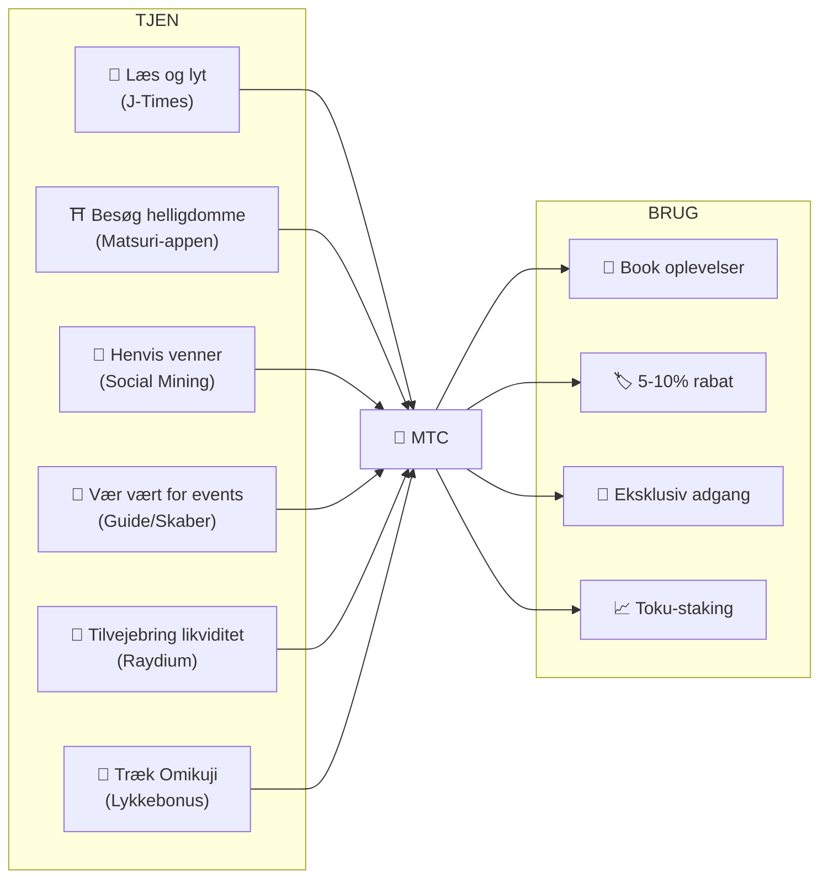
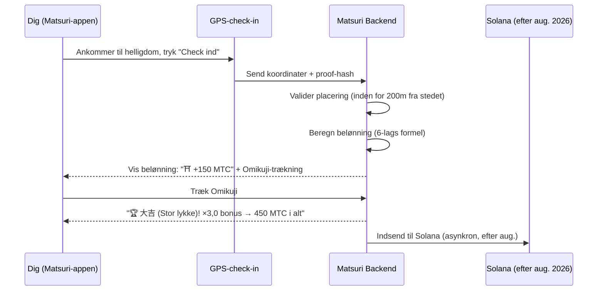
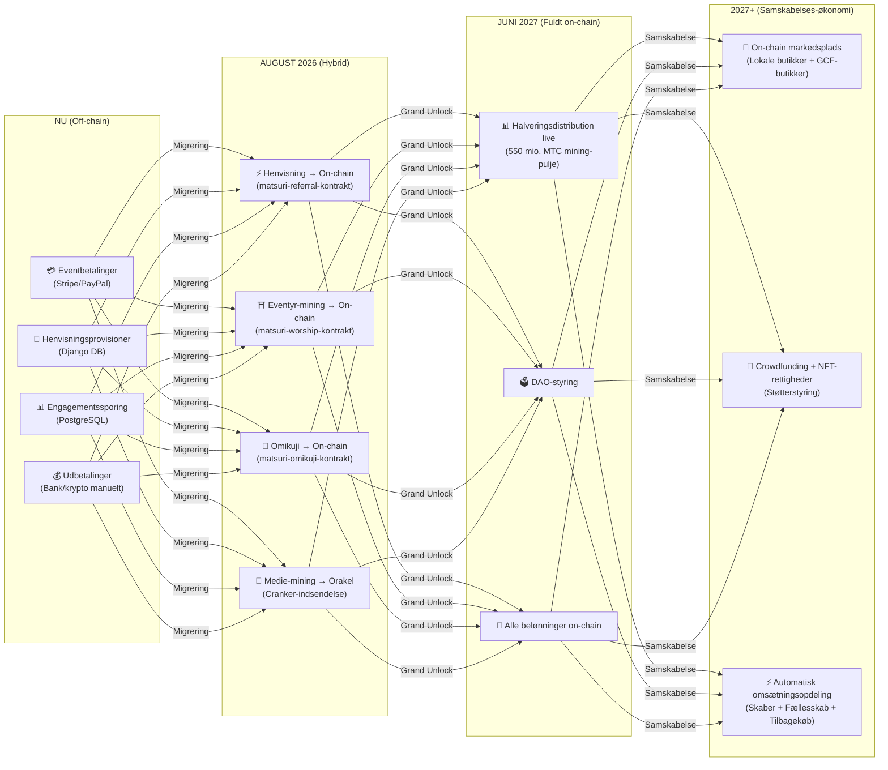

# 💎 Sådan tjener og bruger du MTC

> **Tjen ved handling. Brug på oplevelser. Hold for vækst.**
> MTC er ikke bare et spekulativt token — det flyder gennem en reel økonomi, hvor enhver handling skaber og fanger værdi.

:::tip Det store billede
MTC har en **komplet cirkulær økonomi**: du tjener den gennem reelle aktiviteter, bruger den på reelle oplevelser, og dens værdi vokser i takt med, at økosystemet udvides. Denne side viser dig præcis hvordan.
:::

---

## MTC-livscyklussen



---

## Sådan tjener du MTC

### 1. 📖 Medie-mining — Læs, lyt og se på J-Times

Åbn **J-Times-appen** og forbruge indhold om japansk kultur. Enhver fuldført handling tjener MTC automatisk.

| Handling | Fuldførelseskriterium | Belønning |
| :--- | :--- | :---: |
| **Læs en artikel** | Scroll til 75% dybde | MTC |
| **Lyt til en podcast** | Sporet afspilles til slut | MTC |
| **Se en video** | Forlad detaljeskærmen efter visning | MTC |
| **Del indhold** | Delingsdialog præsenteret | MTC |
| **Fuldfør en quiz** | Bestå forståelsestest | MTC (øjeblikkeligt) |

:::info Offline-understøttelse
Intet internet ved en landlig helligdom? Intet problem. J-Times registrerer din aktivitet lokalt og **synkroniserer automatisk, når du er online igen** (offlinekø med 7 dages retention). Du mister aldrig optjent MTC.
:::

**Hvordan det fungerer under motorhjelmen:**
1. `EngagementTracker` i appen registrerer fuldførelsesevents
2. Handlinger sættes i kø lokalt (selv offline)
3. Ved netværksgenoprettelse samles handlinger i batch og sendes til Django API
4. API'en validerer og krediterer MTC til din saldo
5. Efter august 2026: handlinger vil blive indsendt on-chain via Cranker-orakel

---

### 2. ⛩️ Eventyr-mining — Besøg hellige steder med Matsuri-appen

Åbn **Matsuri-appen**, find en helligdom eller et tempel på det hellige stedkort, tag derhen og check ind. Jo mindre besøgt stedet er, jo mere tjener du.

**Trin-for-trin-flow:**



**Beløningsmultiplikatorer — hvorfor landområder betaler mere:**

| Stedtype | Eksempler | Multiplikator |
| :--- | :--- | :---: |
| 🏙️ **Større** | Sensoji, Kiyomizu-dera, Fushimi Inari | ×1 |
| 🌆 **Regional** | Præfekturets ichinomiya, regionale storhelligdomme | ×2 |
| 🏞️ **Landlig** | Historiske landhelligdomme | ×5 |
| ⛰️ **Grænseområde** | Bjergtempeler, fjerne ø-helligdomme | ×10 |

**Plus yderligere bonusser:**
- **Pioner-bonus** — dagens første besøgende tjener mest (harmonisk henfald)
- **Seriebonus** — besøg på sammenhængende dage giver op til +50%
- **Omikuji** — tilfældig lykketrækning: 大吉 (Stor lykke) = ×3,0, 吉 (Lykke) = ×1,5, 小吉 (Lille lykke) = ×1,2
- **Sponsorerede beacons** — kommuner indsætter MTC for at booste specifikke steder

> **Eksempel:** Besøg en fjern bjerghelligdom (×10) som dagens 2. besøgende, med en 5-dages serie (+10%), og træk 吉 (Lykke) (×1,5) = grundbelønning forstærket **16,5×**.

---

### 3. 🤝 Social mining — Henvis venner og byg dit netværk

Del din henvisningskode. Når dit netværk handler, tjener du automatisk.

| Lag | Relation | Provision |
| :---: | :--- | :---: |
| **L1** | Dig → Ven (direkte) | **20%** |
| **L2** | Ven → Deres ven | **5%** |
| **L3** | 3. grad | **5%** |
| **L4** | 4. grad | **5%** |

**Hvordan En-Mining-scoren fungerer:**

```
Din score = (Direkte henvisninger × 30%) + (Netværkstransaktionsvolumen × 70%)
           × Toku-stakingmultiplikator (1,0× – 10,0×)
           × Titelboost (+5% pr. rangeret sæson, maks. +50%)
```

> **Vigtig indsigt:** 70% af din score kommer fra **reel økonomisk aktivitet** i dit netværk, ikke bare tilmeldinger. At invitere 1.000 mennesker, der aldrig bruger penge, tjener mindre end at invitere 10 aktive forbrugere.

:::warning I øjeblikket off-chain → Flytter on-chain august 2026
Henvisningsprovisioner spores i øjeblikket i Django (PostgreSQL) og betales via bankoverførsel eller krypto. Fra **august 2026** migrerer hele henvisningsprovisionssystemet til **Matsuri Referral smart contract** på Solana — hvilket gør udbetalinger tillidsløse, øjeblikkelige og reviderbare on-chain.
:::

---

### 4. 🎪 Skaber- og guide-mining — Vær vært for events, skab indhold

Hvis du er GCF-medlem, guide eller indholdsskaber:

| Aktivitet | Hvordan du tjener |
| :--- | :--- |
| **Vær vært for en tur** | Guideprovision (sat pr. event) + drikkepenge |
| **Sælg eventbilletter** | Omsætningsandel via EventPurchase |
| **Offentliggør et kursus** | Tilmeldingsgebyr pr. kursus |
| **Opret podcastepisoder** | Abonnementsindtægt |
| **Start en crowdfundingkampagne** | Solana-baserede bidrag |

**Drikkepengessystem:** Efter hvert event kan gæster give guides drikkepenge (Uber-stil). Drikkepenge behandles via Stripe og spores på et offentligt leaderboard.

---

### 5. 🏦 Likviditets-mining — Tilvejebring likviditet på Raydium

Tilvejebring MTC/SOL-likviditet på Raydium DEX og tjen belønninger.

| Post | Detaljer |
| :--- | :--- |
| **Mål-APY** | 50% (tidlig likviditetsincitament) |
| **DEX** | Raydium (Solana) |
| **Hvem** | Alle der holder MTC og SOL |

---

### 6. 🎲 Omikuji-bonus — Lykke-multiplikator

Hvert Eventyr-mining-check-in inkluderer en gratis Omikuji (lykke)-trækning. Denne multiplikator anvendes oven på alle andre bonusser.

| Lykke | Sandsynlighed | Multiplikator |
| :--- | :---: | :---: |
| 🏆 **大吉** (Stor lykke) | 5% | ×3,0 |
| ✨ **吉** (Lykke) | 15% | ×1,5 |
| 🌸 **小吉** (Lille lykke) | 30% | ×1,2 |
| 🍃 **末吉** (Fremtidig lykke) | 35% | ×1,0 |
| 💀 **凶** (Ulykke) | 15% | ×1,0 |

Resultatet bestemmes af en **manipulationssikker commit-reveal-protokol** på Solana. Ikke engang serveren kan ændre dit resultat efter commit-fasen.

---

## Hvor du bruger MTC

| Anvendelse | Fordel | Tilgængelig |
| :--- | :--- | :---: |
| **🎫 Book oplevelser** | Betal for ture, events og kulturaktiviteter med MTC | ✅ Nu |
| **🏷️ Rabat** | 5–10% rabat i forhold til yen-priser ved betaling med MTC | ✅ Nu |
| **🔑 Eksklusiv adgang** | NFT-låste events, VIP-ceremonier, private ture | ✅ Nu |
| **📈 Toku-staking** | Lås MTC for at booste din mining-multiplikator (1,0× → 10,0×) | 🔜 Aug. 2026 |
| **🗳️ DAO-styring** | Stem om kasse, protokolopgraderinger og stedcertificering | 🔜 2027 |
| **🛍️ Partnerbutikker** | Betal i deltagende butikker og restauranter | 🔜 Udvides |

:::info MTC som betaling
I Matsuri-appen er MTC en førsteklasses betalingsmetode på linje med kreditkort og Solana Pay. Ingen konvertering nødvendig — vælg "Betal med MTC" ved kassen, og saldoen trækkes øjeblikkeligt.
:::

### Eksempel: En dag i MTC-økonomien

> **Morgen:** Læs 3 J-Times-artikler i toget → tjen MTC.
> **Eftermiddag:** Besøg en landlig helligdom med Matsuri-appen → check ind, træk 吉 (Lykke) (×1,5) → tjen mere MTC.
> **Aften:** Brug optjent MTC til at booke en ¥9.000 Golden Gai-kulturtur med 10% rabat (betal ¥8.100 tilsvarende).
> **Resultat:** Din kulturelle nysgerrighed finansierede en reel oplevelse — og guiden, helligdommen og lokalsamfundet modtog alle direkte betaling. Ingen OTA tog en 20%-andel.

### Økonomisk bæredygtighed

:::warning Hvad sker der, når mining-puljen løber tør?
550 mio. MTC halveringspuljen er designet til at vare **årtier** (20 epoker × 2 år = 40 år teoretisk). Men selv efter puljen er opbrugt:

- **Transaktionsgebyrer** fra on-chain-aktivitet fortsætter med at belønne netværksdeltagere
- **Tilbagekøbsprotokollen** (20-25% af forretningsindtægten) skaber permanent købspres
- **Toku-staking** låser cirkulerende udbud og reducerer salgspres
- **Reel forretningsindtægt** (events, medlemskaber, kurser) opretholder økosystemet uafhængigt af tokendistribution

MTC er bakket af en **reel økonomi** — ikke bare tokenemissioner.
:::

---

## On-chain-migreringskøreplan

Matsuri-økonomien bevæger sig progressivt fra off-chain (Django/PostgreSQL) til on-chain (Solana smart contracts). Denne overgang gør alle operationer **tillidsløse, reviderbare og tilladelsesløse**.



| Fase | Tidslinje | Hvad der flyttes on-chain |
| :--- | :--- | :--- |
| **Fase 1 (Nu)** | Live | MTC-token (SPL), Raydium LP, Solana Pay-verificering |
| **Fase 2 (Aug. 2026)** | Smart contract mainnet-udrulning | Henvisningsprovisioner, eventyr-mining-belønninger, Omikuji-trækninger, medie-mining via orakel |
| **Fase 3 (Jun. 2027)** | Grand Unlock | 550 mio. MTC halveringsdistribution, DAO-styring, fuld decentralisering |
| **Fase 4 (2027+)** | Samskabelses-økonomi | On-chain markedsplads (lokale butikker + GCF-butikker), crowdfunding med NFT-rettigheder, automatisk omsætningsopdeling til skabere + fællesskab + tilbagekøb |

:::warning Hvorfor ikke alt on-chain i dag?
At flytte alt on-chain før en **professionel sikkerhedsrevision** (planlagt Q2 2026) ville være uansvarligt. Den nuværende hybridtilgang lader os iterere sikkert, mens vi forbereder tillidsløse on-chain-operationer. Off-chain-belønninger er stadig verificerbare — enhver transaktion har en `solana_signature` som afregningsbevis.
:::

---

**[▶ Næste: Mobilapps](/docs/mobile-apps)** ｜ **[◀ Forrige: Økosystem og mining](/docs/ecosystem)**
