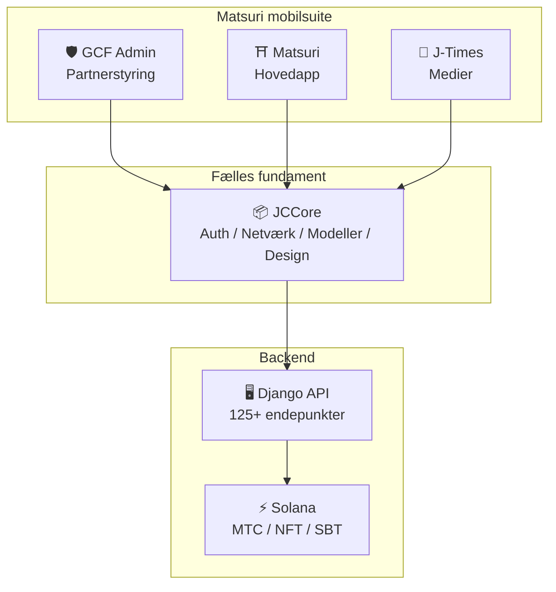
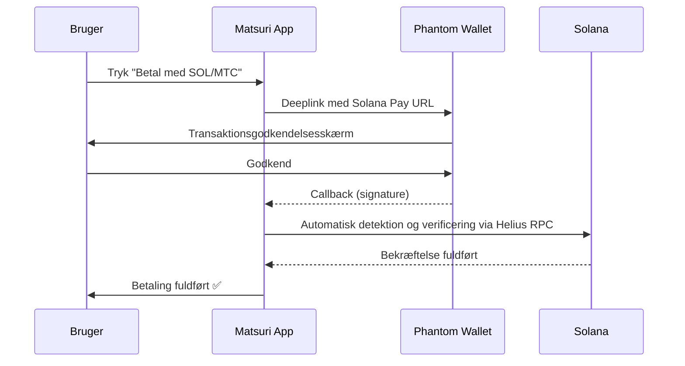
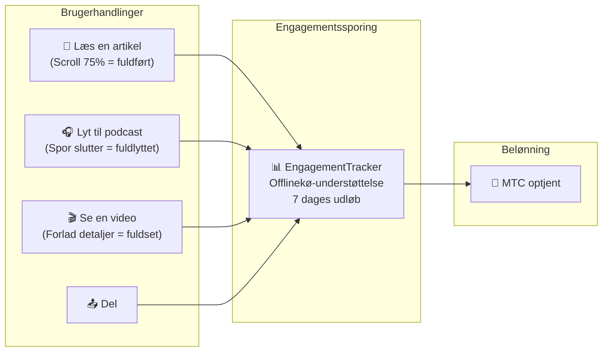
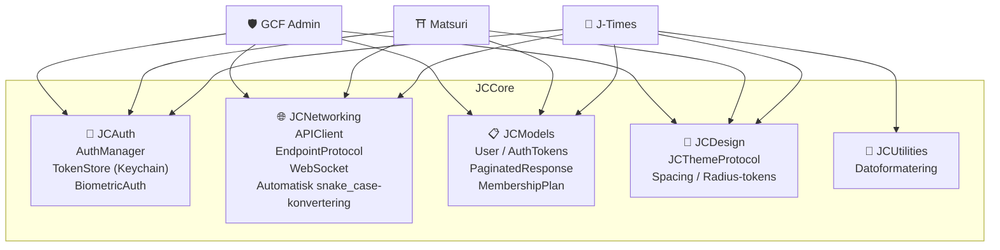

# 📱 Mobilapp-suite

> **Tre native iOS-apps, der dækker hvert lag af Matsuri-økosystemet.**
> Bygget udelukkende med Swift 6 / iOS 17+. Forenet autentificering, netværk og design via det delte **JCCore**-bibliotek.

:::tip Hvorfor dette er vigtigt for investorer
De fleste Web3-projekter har en hjemmeside og et whitepaper. Matsuri har **3 produktions-iOS-apps med 827+ automatiserede tests**, delt infrastruktur og native Solana-integration. Dette er sjælden eksekveringsdybde i token-området.
:::

---

## App-oversigt

| App | Formål | Status | Sprog |
| :--- | :--- | :---: | :--- |
| **GCF Admin** | Partnerstyring og drift | ✅ Udgivet | 🇯🇵🇬🇧🇨🇳🇹🇭🇳🇴 |
| **Matsuri** | Forbrugervendt hovedapp | 🔜 Slutningen af april 2026 | 🇯🇵🇬🇧🇨🇳🇹🇭🇳🇴 |
| **J-Times** | Kulturmedier og læring | 🔜 Slutningen af april 2026 | 🇯🇵🇬🇧 |

---

## 1. 🛡️ GCF Admin — Partnerstyringsapp

:::info Status: Udgivet i App Store (v1.0)
En driftsstyringsapp til GCF (Global Community Friends)-medlemmer. Alle funktioner fra webadministrationspanelet samlet i mobilformat.
:::

  
  
  

### Hvad du kan med denne app

| Kategori | Funktioner |
| :--- | :--- |
| **📊 Dashboard** | KPI-kort, salgsdiagrammer, hurtige handlinger |
| **👥 Medlemsstyring** | Oversigt, detaljer, redigering, niveaustyring |
| **💰 Indtægtsstyring** | Provisionssporing, MTC-udbetalingsstyring, udbetalingsadministration |
| **📝 Indholdsstyring** | Oprettelse, redigering og publicering af events, artikler, podcasts og videoer |
| **🎫 Guidepladser** | Styring af guidepladser, indtægtssporing |
| **🖼️ NFT-dashboard** | Founder's Collection, on-chain-bekræftelse, NFT-overførsel |
| **⛩️ Helligdomsstyring** | CRUD af steder, beacon-opsætning |
| **🎲 AR-mining-opsætning** | Omikuji-sandsynlighedstabel, belønningsparameterstyring |
| **📊 Analyser** | Fejlrapporter, brugsanalyse |
| **🔗 Henvisninger** | Tilpasset QR-kodegenerering, henvisningsprogramstyring |

### Tekniske specifikationer

| Post | Detaljer |
| :--- | :--- |
| **Arkitektur** | Clean Architecture + MVVM + `@Observable` (iOS 17) |
| **Sprog / SDK** | Swift 6.0 / Xcode 16+ / iOS 17.0+ |
| **API-integration** | 125+ endepunkter |
| **Tests** | 226 tests / 45 testklasser |
| **Lokalisering** | 5 sprog (japansk, engelsk, kinesisk, thai, norsk) / 957+ oversættelsesnøgler |
| **Swift Concurrency** | Strict Concurrency-overholdelse / nul byggeadvarsler |

### QR-kodeintegration

I GCF Admin kan du generere tilpassede QR-koder med Matsuri-logo. Understøtter flere formål som eventinvitationer, henvisningslinks og betalingsanmodninger.

---

## 2. ⛩️ Matsuri — Hovedappen

:::info Status: Planlagt udgivelse i slutningen af april 2026 (v3.0)
Hovedappen til almindelige brugere. Eventbooking, betaling, Web3-wallet, AR-mining — alt samlet i én app.
:::

  
  
  

### Hvad du kan med denne app

| Kategori | Funktioner |
| :--- | :--- |
| **🎪 Eventbooking** | Søg, book, Stripe-betaling, billet-QR-styring |
| **💳 4 betalingsmetoder** | Kreditkort / gemte kort / MTC Balance / kryptovaluta (SOL/MTC) |
| **👛 Web3-wallet** | MTC-saldovisning, send/modtag, transaktionshistorik |
| **🖼️ NFT-galleri** | Oversigt over ejede NFT'er/SBT'er, on-chain-bekræftelse |
| **🗺️ Helligt stedkort** | Kortvisning af helligdomme og templer, check-in |
| **🎲 AR-mining** | WebAR Omikuji-oplevelse, tjen MTC |
| **💬 Chat** | Beskeder med kontekstmenu |
| **⭐ Ønskeliste** | Gem favoritevents og -oplevelser |
| **🔍 Avanceret søgning** | Understøttelse af stemmesøgning |
| **🤝 Henvisninger** | Deltagelse i henvisningsprogram, belønningssporing |
| **📊 GCF-dashboard** | Forenklet administrationspanel for GCF-medlemmer |

### Phantom Wallet-integration — Kryptobetaling uden indtastning

> **Ingen kopiering af adresser.** Phantom Wallet åbner automatisk, brugeren godkender, og betalingen er fuldført. Transaktionssignaturer registreres automatisk via Helius RPC — den glatteste kryptobetalingsoplevelse på markedet.

:::tip Hvorfor dette er vigtigt
De fleste Web3-apps tvinger brugere til at kopiere walletadresser, manuelt indtaste beløb og vente på bekræftelser. Matsuris Solana Pay-integration reducerer dette til **et enkelt tryk** — matcher Apple Pay-oplevelsen, mens den afregner on-chain.
:::

### Tekniske specifikationer

| Post | Detaljer |
| :--- | :--- |
| **Arkitektur** | Clean Architecture + MVVM + Swift Concurrency |
| **Sprog / SDK** | Swift 6.0 / Xcode 16+ / iOS 17.0+ |
| **Betaling** | Stripe PaymentSheet + MTC Balance + Phantom (Solana Pay) |
| **API-integration** | 72 endepunkter / 16 kategorier |
| **Tests** | 230+ (Model, ViewModel, Network, Security, DeepLink, E2E) |
| **Lokalisering** | 5 sprog (japansk, engelsk, kinesisk, thai, norsk) / 406 oversættelsesnøgler |
| **Antal ViewModels** | 25 (fuldt MVVM — nul direkte API-kald fra Views) |
| **Autentificering** | Apple Sign In / Google Sign In (PKCE) |

---

## 3. 📰 J-Times — Kulturmedieapp

:::info Status: Planlagt udgivelse i slutningen af april 2026
En medieplatform, der formidler dybden af japansk kultur. Læs artikler, lyt til podcasts, se videoer — enhver handling giver MTC.
:::

  

### Hvad du kan med denne app

| Kategori | Funktioner |
| :--- | :--- |
| **📖 Artikler** | Parallax-hero, dropcap, læsefremdriftsbjælke, rigt indhold (Markdown, tabeller, citater) |
| **🎧 Podcasts** | Seriegennemgang, bølgeform-afspiller, sleeptimer, AirPlay, låseskærmskontrolelementer |
| **🎬 Videoer** | Adaptiv gitter-/listevisning, korte videoer (TikTok-stil, dobbelttryk) |
| **🔍 Søgning** | Multifilter, trendende tags, stemmesøgning |
| **🧭 Opdagelse** | Fremhævet karrusel, redaktionens udvalg, ugens populære |
| **📚 Bibliotek** | Favoritter, historik (efter dato), downloads, playlister |
| **🎵 Lydafspiller** | Miniafspiller (swipe-betjening), fuldskærmsafspiller (bølgeform, tekster, gentagelse) |
| **👤 Medlemskab** | Funktionssammenligning af 3 niveauer (Free / Premium / Pro), gendannelse af køb |

### Medie-mining — Læsning, lytning og visning bliver til mining

> **Registreres selv offline.** Selvom du læser en artikel ved en helligdom dybt inde i bjergene uden mobildækning, sendes engagementet automatisk, når du er online igen, og MTC tildeles.

### Designsystem — Japansk æstetik i "fire søjler"

J-Times anvender et unikt designsystem, der omsætter japansk traditionel æstetik til moderne UI.

| Søjle | Koncept | Anvendelse i UI |
| :--- | :--- | :--- |
| **墨 (Sumi)** | Varm neutral grå | Baggrundsfarver, teksthierarki |
| **朱 (Shu)** | Japansk rød (#C53030) | Accentfarve, vigtige handlinger |
| **間 (Ma)** | 4pt gitter-mellemrum | Mellemrum, luft |
| **紙 (Kami)** | Fin tekstur, glasmorfisme | Kortoverflader, dybdevirkning |

### Tekniske specifikationer

| Post | Detaljer |
| :--- | :--- |
| **Arkitektur** | Clean Architecture + MVVM + Swift Concurrency |
| **Sprog / SDK** | Swift 6.0 / Xcode 16+ / iOS 17.0+ |
| **Eksterne afhængigheder** | **Nul** — kun Apple-native frameworks |
| **API-integration** | 40+ endepunkter |
| **Tests** | 371 tests / 20 filer |
| **Lokalisering** | 2 sprog (japansk, engelsk) / 310+ oversættelsesnøgler |
| **Offlineunderstøttelse** | ContentCache (50 MB) + ImageDiskCache (200 MB) + downloadmanager |
| **Autentificering** | Apple Sign In / Google Sign In (PKCE) |

---

## Fælles fundament: JCCore-biblioteket

Et Swift Package-bibliotek, som alle tre apps deler.

| Modul | Rolle |
| :--- | :--- |
| **JCAuth** | Keychain-baseret tokenstyring, biometrisk autentificering (Face ID / Touch ID) |
| **JCNetworking** | Typesikker API-klient, WebSocket, automatisk JSON snake_case-konvertering |
| **JCModels** | Fælles datamodeller på tværs af apps (User, AuthTokens osv.) |
| **JCDesign** | Temaprotokol, designtokens (mellemrum, afrunding) |
| **JCUtilities** | Dato- og strengværktøjer |

---

## Sikkerhed og privatliv

| Post | Implementering |
| :--- | :--- |
| **Autentificeringstokens** | Krypteret lagret i iOS Keychain (TokenStore) |
| **Biometrisk autentificering** | Tofaktorautentificering via Face ID / Touch ID |
| **API-kommunikation** | HTTPS + Certificate Pinning |
| **Wallet-private nøgler** | Ingen private nøgler gemt i appen — delegeret til Phantom Wallet |
| **AR-mining** | Kamerabilleder sendes ikke til serveren (VisionProof) |
| **Offlinedata** | SwiftData-kryptering + automatisk udløb |
| **Swift Concurrency** | Aktorisolering til forebyggelse af kapløbstilstande |

---

## Udviklingskvalitet

I alt **827+ automatiserede tests** på tværs af alle 3 apps.

| App | Antal tests | Dækningsområder |
| :--- | :---: | :--- |
| **GCF Admin** | 226 | Model, ViewModel, Repository, API, Lokalisering, Navigation |
| **Matsuri** | 230+ | Model, ViewModel, Network, Security, DeepLink, Regression, Performance, E2E |
| **J-Times** | 371 | Model, ViewModel, API, Repository, Navigation, Lokalisering, Security, Performance |

---

**[▶ Næste: Køreplan og team](/docs/roadmap)** ｜ **[◀ Forrige: Økosystem og mining](/docs/ecosystem)**
