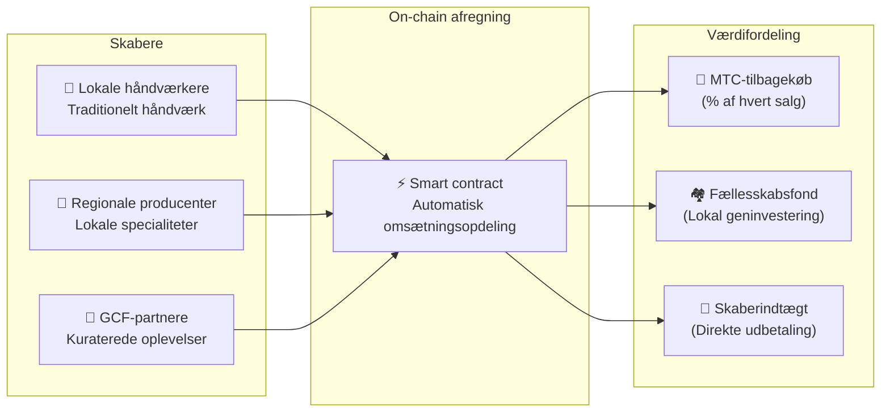

# 🗓️ Køreplan og styring

> **Vejen til vished.**
> Dette er ikke et kortsigtet spekulativt spil.
> **Kerneplatformsudviklingen er allerede færdig** — vi er i skaleringsfasen.

---

## Strategiske milepæle

### 🔥 Fase 1: Opvågning (2026 H1 — nu)

**Tema: Fundament og pengestrømsgenerering**

Produktet er bygget. Fokus er nu på monetarisering via det CEO-ledede finansielle system og sikring af initial likviditet.

| Status | Milepæl | Detaljer |
| :---: | :--- | :--- |
| ✅ | **Produktlancering** | Matsuri Webapp og GCF Admin Dashboard live |
| ✅ | **Betalinger og vækst** | 4 betalingsmetoder (Stripe, PayPal, Solana Pay, MTC) + henvisningsmotor |
| ✅ | **Medielancering** | J-Times (web og podcast) + kursusmarkedsplads live |
| ✅ | **Genesis** | MTC Token Generation Event på Solana (900 mio. udbud, autoriteter tilbagekaldt) |
| ✅ | **Likviditet** | Initial LP-pulje oprettet på Raydium |
| ✅ | **Mobilapps** | GCF Admin iOS-app udgivet i App Store |
| ✅ | **Backend-infrastruktur** | 80+ modeller, 100+ API'er, 15+ automatiserede opgaver, 841 tests |
| ✅ | **Analyser** | Fuld sessionssporing, konverteringstragte, A/B-test |
| 🔜 | **Mobillancering** | Matsuri og J-Times iOS-apps (april 2026) |
| ⬜ | **Incitamentsprogram** | 50% mål-APY likviditets-mining-lancering |
| ⬜ | **System-golive** | Solana MEV / arbitragebot i produktion |
| ⬜ | **VIP-rekruttering** | Første 20 GCF VIP-medlemmer udvalgt |

### 🚀 Fase 2: Ekspansion (2026 H2)

**Tema: Aktiver i den virkelige verden og eventyr-mining**

Udnyt den færdige webapp til at udvide fysiske baser og "Pilgrimage"-funktionen.

| Status | Milepæl | Detaljer |
| :---: | :--- | :--- |
| ⬜ | **Funktionsudgivelse** | Eventyr-mining (Pilgrimage) går live |
| ⬜ | **Global ekspansion** | Partnerbaser og VIP-events på tværs af Asien (Thailand, Taiwan osv.) |
| ⬜ | **Formueforvaltning** | Fast ejendom, aktie- og kryptoportefølje fra forretningsindtægt |
| ⬜ | **Mål** | Økosystemdækkende AUM på **¥1 milliard (~$6,5 mio.)** |

### 🌊 Fase 3: Cirkulation (2027+)

**Tema: Masseadoption, samskabelses-økonomi og decentralisering**

Offentlig lancering, on-chain markedsplads og fuld økosystemdrift.

| Status | Milepæl | Detaljer |
| :---: | :--- | :--- |
| ⬜ | **Grand Opening** | Matsuri App verdensomspændende udgivelse |
| ⬜ | **Grand Unlock (1. juni 2027)** | Grundlæggerlåsning frigives + mining-pulje (550 mio. MTC) live + halveringscyklus starter |
| ⬜ | **Samskabelses-markedsplads** | Lokale specialbutikker + GCF-partnerbutikker — on-chain afregning med automatisk MTC-tilbagekøb |
| ⬜ | **Crowdfunding med NFT-rettigheder** | Brugere finansierer kulturprojekter på Solana. Støtter modtager NFT'er, der repræsenterer ejerskab, omsætningsandel eller styringsrettigheder over det finansierede projekt |
| ⬜ | **On-chain butiksafregning** | Alle markedsplatstransaktioner afregnes via smart contracts — en procentdel af hvert salg flyder automatisk ind i MTC-tilbagekøbspuljen |
| ⬜ | **Mål** | Økosystemdækkende AUM på **¥10 milliarder (~$65 mio.)** |
| ⬜ | **DAO-overgang** | Delvis overførsel af beslutningskraft til GCF-fællesskabet |

#### 🏪 Vision for samskabelses-markedspladsen

Det ultimative udtryk for "Kultur-OS" — en decentraliseret markedsplads, hvor **kulturskabere og kulturentusiaster handler direkte**, uden udnyttende mellemled.

| Funktion | Beskrivelse | Status |
| :--- | :--- | :---: |
| **🏺 Lokale specialbutikker** | Håndværkere og regionale producenter sælger direkte til et globalt publikum. MTC-betaling = 5–10% rabat | ⬜ Vision |
| **🎫 Crowdfunding + NFT-rettigheder** | Finansier et kulturprojekt (helligdomsrestaurering, festivalgenoplivning, håndværkerværksted). Modtag en NFT, der repræsenterer dit bidrag — med potentiel omsætningsandel eller styringsrettigheder | ⬜ Vision |
| **⚡ On-chain afregning** | Hver markedsplatstransaktion afregnes via Solana smart contracts. Omsætningen opdeles automatisk: skaber-udbetaling + fællesskabsfond + MTC-tilbagekøb — ingen manuel bogføring | ⬜ Vision |
| **🗳️ Støtterstyring** | NFT-indehavere stemmer om, hvordan finansierede projekter allokerer ressourcer — ægte samskabelse, ikke bare donation | ⬜ Vision |

:::info Hvorfor det betyder noget
I dag køber turister souvenirs i butikker, der betaler leje til platformsudlejere. I morgen **sælger en håndværker i det landlige Kyoto direkte til en fan i København** — og en procentdel af det salg styrker automatisk MTC-økonomien. Det er "svinghjulet" i sit mest fuldstændige udtryk.
:::

---

## 👤 Team

### Ko Takahashi — Grundlægger / CEO og ledende arkitekt

  

| Post | Detaljer |
| :--- | :--- |
| **Rolle** | Overordnet projektleder. Designer og bygger den centrale finansielle algoritme (Solana MEV Bot) |
| **Vision** | Skaber af "Eksportér kultur, importér velstand"-Kultur-OS'et |
| **Etos** | Skriver kode om dagen, driver baren i Golden Gai om natten — definitionen af "skin in the game" |

### Jon Anders Jensen — Medstifter

| Post | Detaljer |
| :--- | :--- |
| **Rolle** | Medstifter og strategisk drift |
| **Base** | Norge / Japan |

### Ryunosuke Honda

| Post | Detaljer |
| :--- | :--- |
| **Rolle** | Kerneteammedlem |

### 🌏 GCF-fællesskabet — Globale udviklingsbidragydere

Matsuri Protocol er ikke bygget af grundlæggerteamet alene.
**GCF-medlemmer verden over** bidrager gennem test, feedback, oversættelse og regional ekspansion.

| Domæne | Team |
| :--- | :--- |
| **💼 Global finans** | Privatinvestornetværk på tværs af Asien |
| **⚙️ Engineering** | Distribueret ingeniørgilde til blockchain- og mobiludvikling |
| **🏮 Drift** | Dyb pipeline med lokalsamfund i Shinjuku Golden Gai og større turistknudepunkter |
| **🌐 Fællesskab** | Multinationale GCF-medlemmer på tværs af Japan, Norge, Thailand, Taiwan og videre |

:::tip Byg kulturens infrastruktur sammen
Bliv GCF-medlem og bliv medudvikler af Matsuri Protocol.
At bidrage handler ikke kun om at skrive kode — at introducere lokale hellige steder, oversætte dokumenter, organisere events — alt hjælper med at sprede denne protokol ud i verden.
:::

---

## 🏛️ Styring (DAO)

Matsuri Protocol vil progressivt overgå til en **Decentraliseret Autonom Organisation (DAO).**
GCF-medlemmer (Platinum / Gold) vil have **stemmeret** om centrale beslutninger:

| Afstemning | Omfang |
| :--- | :--- |
| **💰 Kasseallokering** | Hvilke nye ventures eller marketinginitiativer der skal finansieres |
| **⚙️ Protokolopgraderinger** | Finjustering af gebyrsatser og mining-belønningskurver |
| **⛩️ Kulturel certificering** | Hvilke festivaler og helligdomme der skal certificeres som "officielle pilgrimssteder" og finansieres |

:::info Bliv en del af revolutionen
Vi bygger ikke bare en app.
Vi bygger en **grænseløs kulturel økonomi.**
:::

---

**[◀ Tilbage til whitepaper-toppen](/docs/intro)** ｜ **[Følg på X](https://x.com/matsuri_dao_jp)**
