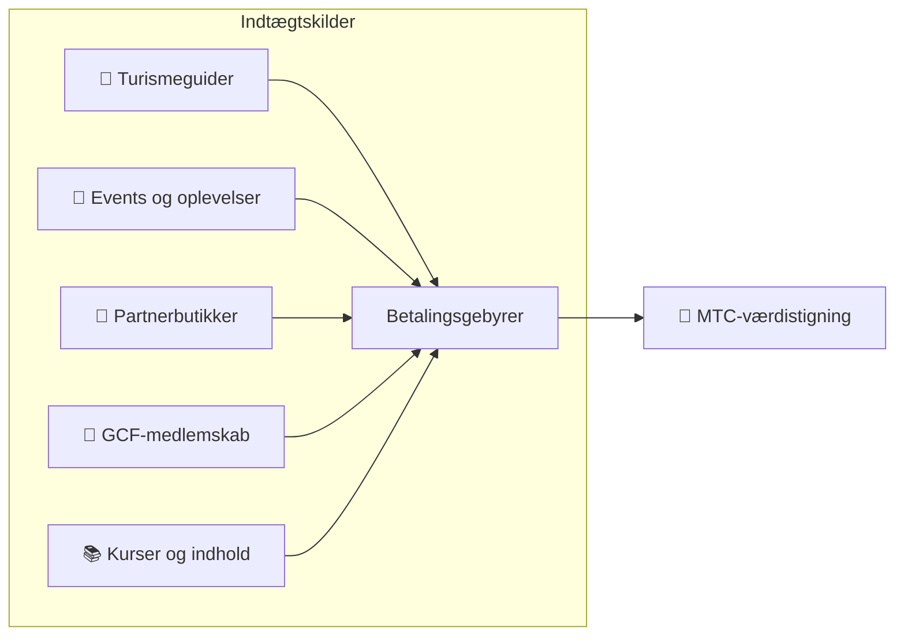

# 💰 Tokenomics — MTC’s økonomiske design

> **Tilliden er risset ind i koden.**
> MTC’s økonomiske design er ikke et løfte fra et menneske, men en garanti fra matematik og blockchain.


> **"En økonomi, hvor magten ikke kan ændre status quo" — det er MTC’s tokenomics.**

Matsuri Coin (MTC) hviler på én overbevisning:
**en regel, som ikke engang driftsteamet kan manipulere, er det største tryghedsnet for en investor.**

Udbud låst for evigt. Ny udstedelse og midler-frys umulige. Forretningens vækst afspejles i prisen på formel-niveau —
det er ikke et løfte, men et **faktum** risset ind på blockchainen.

På denne side offentliggør vi MTC’s økonomiske mekanisme fuldt ud.

---

## Token-specifikationer

For at sikre investorerne har vi permanent **frasagt** os "mint"-autoritet og "freeze"-autoritet på Solana.
Det er nu umuligt at udstede mere MTC og umuligt at fryse nogens midler. **Fuldstændig trustless.**

| Punkt | Detaljer |
| :--- | :--- |
| **Tokennavn** | Matsuri Coin |
| **Ticker** | MTC |
| **Kæde** | Solana |
| **Mint-adresse** | `DRENpzmRWM4TwECrCPCfS1k5VBPmanhQg9bcCWP8EZXF` [Solscan →](https://solscan.io/token/DRENpzmRWM4TwECrCPCfS1k5VBPmanhQg9bcCWP8EZXF) |
| **Samlet udbud** | **900 millioner** (900.000.000 MTC) fast |
| **Mint-autoritet** | 🚫 Frasagt ([verificerbar on-chain](https://solscan.io/token/DRENpzmRWM4TwECrCPCfS1k5VBPmanhQg9bcCWP8EZXF)) |
| **Freeze-autoritet** | 🚫 Frasagt ([verificerbar on-chain](https://solscan.io/token/DRENpzmRWM4TwECrCPCfS1k5VBPmanhQg9bcCWP8EZXF)) |
| **Lock-håndtering** | Streamflow Finance (verificeret) |

:::info Hvorfor det betyder noget
At frasige sig mint-autoriteten betyder, at "driftsteamet ikke kan udstede mere og udvande din andel". At frasige sig freeze-autoriteten betyder, at "ingen kan fryse din wallet". Det er kernen i "trustless".
:::

---

## Token-fordeling

900M MTC fordeles som følger.

<div className="mtc-alloc">
  <div className="mtc-alloc__donut" role="img" aria-label="MTC-fordeling: Miningpulje 61%, Økosystemsdrift 39%">
    <div className="mtc-alloc__hole">
      <span className="mtc-alloc__total">900M</span>
      <span className="mtc-alloc__unit">MTC</span>
    </div>
  </div>
  <div className="mtc-alloc__legend">
    <div className="mtc-alloc__row mtc-alloc__row--mining">
      <span className="mtc-alloc__dot"></span>
      <span className="mtc-alloc__pct">61%</span>
      <span className="mtc-alloc__amount">⛏️ 550M MTC</span>
    </div>
    <div className="mtc-alloc__row mtc-alloc__row--ecosystem">
      <span className="mtc-alloc__dot"></span>
      <span className="mtc-alloc__pct">39%</span>
      <span className="mtc-alloc__amount">🌐 350M MTC</span>
    </div>
  </div>
</div>

| Kategori | Andel | Stk. | Formål |
| :--- | :---: | :--- | :--- |
| **⛏️ Miningpulje** | **61%** | 550 millioner | Belønningspulje for bidragydere. Låses op juni 2027, halveres hvert andet år. Fordeles efter bidragsscore |
| **🌐 Økosystemsdrift** | **39%** | 350 millioner | Marketing, GCF-distribution, drift, likviditetspulje (LP), udvikling, annoncer, afholdelse af events osv. |

:::note Om miningpuljens udgivelse
550M MTC frigives ikke på én gang. Den udgives trinvist efter en **halveringsplan hvert andet år** og fordeles ud fra bidragsscore. Reglerne for udgivelse/fordeling implementeres trinvist som smart contracts i anden halvdel af 2026 og kan derefter verificeres on-chain.
:::

:::note Om økosystem-driftsandelen
De 39% er en flerformåls-kasse, der er nødvendig for økosystemets vækst. Konkret omfatter anvendelsen marketing, initial distribution til GCF-medlemmer, tilførsel til Raydiums likviditetspulje, belønning til udviklingsteamet, reklame, afholdelse af kulturoplevelses-events osv. Gennemsigtighed om anvendelse bliver genstand for fællesskabs-governance efter DAO-overgangen.
:::

---

## Indtægtsstruktur

Det, der bærer MTC’s værdi, er **indtægt fra reel forretning**. Ikke spekulation – den faktiske økonomiske aktivitet er fundamentet.



| Indtægtskilde | Indhold |
| :--- | :--- |
| **🏯 Oplevelser og guider** | Betalingsgebyrer fra turismeguider og kulturoplevelser |
| **🤝 GCF-medlemskab** | Medlemsgebyrer |
| **📚 Indhold** | Kursusgebyrer, medieabonnementer |
| **🏪 Markedsplads** | Transaktionsgebyrer fra partnerbutikker (udvides trinvist) |

:::tip Vækst understøttet af reel efterspørgsel
Jo flere indgående turister, desto mere udenlandsk valuta strømmer ind, og økosystemet vokser. MTC’s værdi afgøres ikke af spekulation, men af **antallet af mennesker, der oplever kultur**.
:::

---

## Aktuelle forretningsresultater

MTC-økonomien er stadig i en tidlig fase, men den reelle aktivitet er allerede i gang.

| Indikator | Resultat |
| :--- | :--- |
| **Afholdte events** | 50+ (testdrift) |
| **GCF Platinum-medlemmer** | 20 tilmeldt (af 50) |
| **GCF Gold-medlemmer** | Rekruttering starter nu |
| **Webplatform** | I drift. Samler testbrugere og kører |
| **iOS-app** | Udvikling afsluttet, release planlagt april 2026 |

:::note Ærligt talt
Vi har endnu ikke "et vindende track record". 50 events og testdrift — det er virkeligheden lige nu. Men produktet kører, fællesskabet findes, og vi står på tærsklen til seriøs ekspansion.
:::

---

## Tilbagekøbsprotokol

"Bliver der overskud, skal det i lommen på driften" — det gør vi ikke.
En fast andel af forretningsomsætningen er øremærket til tilbagekøb af MTC på markedet.

| Indtægtskilde | Andel | Handling |
| :--- | :---: | :--- |
| **Matsuri HQ omsætning** (guider, events) | **20%** | **Tilbagekøb** på markedet og tilførsel til likviditetspuljen |
| **GCF-medlemskab** (medlemsgebyrer) | **25%** | **Tilbagekøb** på markedet |

:::info Status for tilbagekøb lige nu
Tilbagekøbsprotokollen **sættes i drift**, efterhånden som forretningsomsætningen tager fart. I begyndelsen udføres den off-chain (manuelt), og fra anden halvdel af 2026 migreres den trinvist til automatisk smart contract-udførelse. Efter migreringen kan hele historikken verificeres på blockchainen.
:::

Tilbagekøb er ikke "noget, der sker en dag". Det er en regel, programmeret som protokol. Hver gang omsætningen stiger, trækkes MTC automatisk ud af markedet — et **strukturelt tryghedsnet** for investorer.

---

## Prislogik

MTC’s prismekanisme hviler ikke på ønsketænkning, men på **AMM-formlens (automated market maker) matematik**.

```
Pris = likviditet (SOL) ÷ udbud (MTC)
```

| Trin | Hvad sker | Resultat |
| :---: | :--- | :--- |
| **①** | Forretningsomsætning (SOL) sprøjtes ind i puljen | **Tælleren vokser** |
| **②** | Midlerne bruges til at købe MTC tilbage fra markedet og brænde det | **Nævneren falder** |
| **③** | Tæller↑ × nævner↓ | **Betingelserne for øget knaphed er til stede** |

:::info En beskrivelse af mekanismen, ikke en prisgaranti
Formlen viser det strukturelle design: "hvis forretningsomsætningen fortsætter og tilbagekøb udføres, bevæger udbuds-/efterspørgselsbalancen sig i retning af knaphed". Den reelle pris afhænger af mange faktorer: markedets udbud/efterspørgsel, eksterne forhold, likviditet osv.
:::

---

## Halveringsplan

De **550 millioner MTC (ca. 61% af samlet udbud)**, der frigives fra 1. juni 2027, sælges ikke på markedet, men holdes som **belønningspulje for bidragydere**.

Vi bruger en **halvering hvert andet år** — hurtigere end Bitcoins fire-års-cyklus.
Hvert andet år halveres udgivelsesmængden, og belønninger fortsætter teoretisk i årtier.

| Periode | Andel | Antal | Akkumuleret |
| :--- | :---: | :--- | :---: |
| **1. periode** 2027 – 2029 | **50%** | ca. 275M | 50% |
| **2. periode** 2029 – 2031 | **25%** | ca. 137M | 75% |
| **3. periode** 2031 – 2033 | **12,5%** | ca. 68M | 87,5% |
| **4. periode** 2033 – 2035 | **6,25%** | ca. 34M | 93,75% |
| **5. periode og frem** | Halvering fortsætter | Aftagende | → 100% asymptotisk |

<small>*※ Matematisk nås 100% aldrig, mængden nærmer sig nul. Samme princip som Bitcoin.*</small>

:::tip Jo tidligere du bidrager, jo mere MTC får du
Med halveringsmekanismen er 1. periode (2027–2029) den mest MTC-tunge, og pr. epoke falder udgivelsesmængden. Dvs. **dem, der opbygger bidragsscore fra begyndelsen, får mest MTC**.

Eksempler på aktivitet, der giver bidragsscore:
- Oprettelse af events og antal tilstrømmede brugere
- Drift af populære guideture
- Rekruttering og udvikling af fremragende guider
- Visninger og delinger af J-Times-indhold
- Check-in-antal ved hellige steder

Belønningen afgøres ikke af "rækkefølgen af tilmelding", men af **"hvor meget du har bidraget"**.
:::

---

:::note Næste side
Har du forstået MTC’s økonomiske design, så er næste skridt at se, **hvordan du kan deltage som partner**.
**[GCF-medlemskab →](/docs/gcf)**
:::
