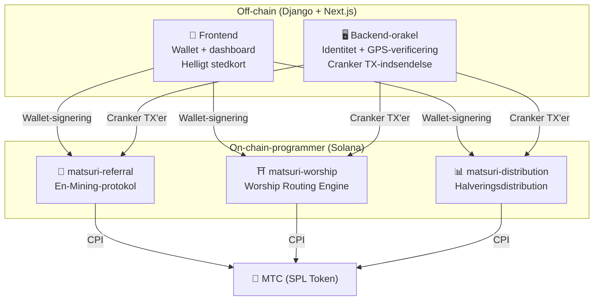
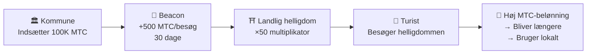
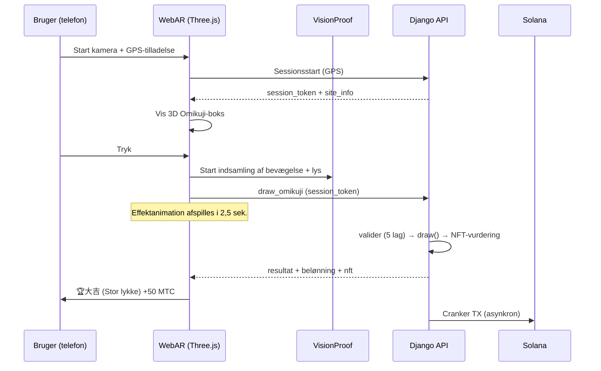
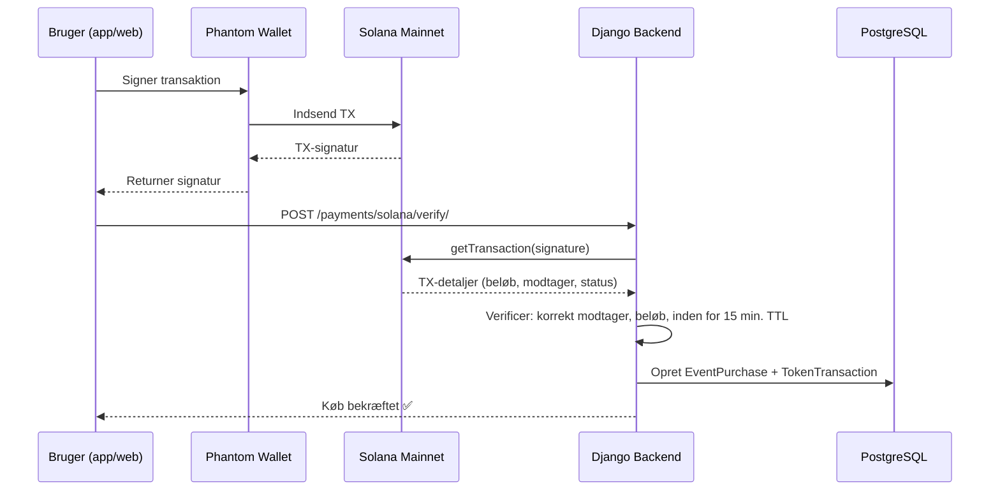

# ⚡ Smart Contracts — Open source-arkitektur

> **Tillidsløst by design.**
> Al belønningslogik, henvisningstræer og halveringsplaner håndhæves **on-chain** via reviderbare Rust-programmer.
> Kildekode: [GitHub](https://github.com/Cootakahashi/matsuri-contracts)

| Specifikation | Detaljer |
| :--- | :--- |
| **Framework** | Anchor 0.32.1 (Rust) |
| **Kæde** | Solana Mainnet-beta |
| **Programmer** | 4 (Distribution, Referral, Worship, Omikuji) |
| **Build** | Optimeret release med LTO, overflow-checks aktiveret |
| **Matematik** | Pure `math.rs`-moduler — nul sideeffekter, 128-bit mellemberegninger |

---

## Oversigt

Matsuri udrulller **tre Anchor (Rust)-programmer** på Solana, der hver håndterer en distinkt søjle af økosystemet:



---

## 1. 📣 En-Mining (縁マイニング)-protokol

**Formål:** En hybrid vækstmotor, der belønner både *bredde* (henvisningsrækkevidde) og *dybde* (økonomisk effekt). Ikke bare affiliates — en fuld mining-protokol, hvor reel økonomisk aktivitet genererer on-chain-værdi.

### Scoringsdesign

Bidrags-scoren er baseret på to vægtede komponenter:

| Komponent | Vægt | Formål |
| :--- | :---: | :--- |
| **Bredde** (henvisningsantal) | 30% | Netværksrækkevidde — hvor mange mennesker du bringer |
| **Dybde** (afregningsvolumen) | 70% | Økonomisk effekt — reelle køb, ikke bare tilmeldinger |

Scorer akkumuleres over tid og konverteres til MTC ved hver halveringsepoke. Yderligere boost-mekanismer er planlagt:

| Boost | Beskrivelse | Status |
| :--- | :--- | :---: |
| **Toku (徳) staking** | Lås MTC for at booste din bidragsscore (op til ~50% boost). Niveauer og præcise multiplikatorer vil blive kalibreret baseret på halveringspuljens frigivelsesplan | ⬜ Koefficienter TBD |
| **Sæsonranglister** | Toppræsterende i hver epoke optjener titlen **Evangelist** (permanent SBT) og en score-boost. Præcise procenter vil blive fastlagt via governance | ⬜ Koefficienter TBD |

:::info Progressivt parameterdesign
Boost-koefficienter (staking-niveauer, ranglistebonusser) er bevidst holdt justerbare. De vil blive endeligt fastlagt baseret på reelle økosystemdata — samlet antal aktive brugere, halveringspuljens frigivelsesrate og prisstabilitetsmål — og derefter låst i smart contracts. Denne tilgang sikrer **retfærdig distribution** uden at love faste afkast.
:::

### Anti-Sybil-forsvar (3 lag)

| Lag | Mekanisme | Placering |
| :--- | :--- | :--- |
| **Identitetsport** | X/Twitter OAuth + SMS | Off-chain (Django) |
| **On-chain-port** | Kun `is_verified = true`-profiler optjener | Smart Contract |
| **Dybdevægtning** | 70% af scoren = reelle betalinger → bots tjener intet | Scoringsmotor |

---

## 2. ⛩️ Worship Routing Engine (pilgrimsspredningsmotor)

**Formål:** Verdens første **ReFi-protokol, der løser overturisme ved hjælp af tokenøkonomi.** Besøg hellige steder → tjen MTC. Men her er det geniale: *mindre besøgte steder betaler eksponentielt mere.*

:::tip Indsigten
Dette er "omvendt Uber surge pricing" — overfyldte steder straffes, grænseområder boostes. Turister ruter sig selv til mindre besøgte steder, fordi **det er mere profitabelt.**
:::

### Principper for belønningsdesign

Bidrags-scoren for hvert besøg bestemmes af flere faktorer:

| Faktor | Princip | Effekt |
| :--- | :--- | :--- |
| **Steds popularitet** | Mindre besøgte steder giver højere scorer | Router turister væk fra overfyldte områder |
| **Besøgstidspunkt** | Tidligere besøgende på dagen scorer højere | Opmuntrer besøg uden for spidsbelastning |
| **Regionalt niveau** | Landlige og grænseområder rangerer højest | Driver regional revitalisering |
| **Besøgshyppighed** | Regelmæssige besøgende akkumulerer bonusscorer | Belønner konsistent engagement |
| **Omikuji-lykke** | Tilfældig bonustrækning ved hvert check-in | Sjovt gamification-lag |
| **Sponsorerede boosts** | Kommuner kan booste specifikke steder | B2B/B2G-indtægtsmodel |

:::info Koefficienter er justerbare
De præcise multiplikatorer for hver faktor (f.eks. hvor meget mere et landligt sted tjener sammenlignet med et større sted) vil blive **kalibreret baseret på halveringspuljens plan** og reelle brugsdata, og derefter progressivt låst i smart contracts. Designprincippet er fast — koefficienterne udvikler sig med økosystemet.
:::

### Sponsorerede beacons (B2B/B2G)

Kommuner, jernbaneselskaber og turismebestyrelser kan **indsætte MTC** for at skabe tidsbegrænsede højbelønningszoner ved specifikke steder.



> **B2B-indtægtsmodel:** Sponsorer betaler MTC for at route turister. MTC-købspres → tokenværdi. Win-win-win.

---

## 3. 📊 Halveringsdistribution

**Formål:** 550 mio. MTC mining-puljen distribueret over årtier via en **2-årig halveringscyklus** — hurtigere end Bitcoins 4-årige cyklus.

### Halveringsplan

```
Total Pool: 550,000,000 MTC

Epoch 0 (2027–2029):  275,000,000 MTC  (50%)
Epoch 1 (2029–2031):  137,500,000 MTC  (25%)
Epoch 2 (2031–2033):   68,750,000 MTC  (12.5%)
Epoch 3 (2033–2035):   34,375,000 MTC  (6.25%)
        ...              ...
∑ → 550,000,000 MTC (asymptotic total)
```

### Individuel belønningsformel

```
your_reward = epoch_budget × (your_score / total_score)
```

Al aritmetik bruger **128-bit mellemberegning** — matematisk umuligt at overflowe.

### Præstationsscore-kilder

| Aktivitet | Scorevægt |
| :--- | :--- |
| **Gennemførte guidesessioner** | Høj |
| **Eventbilletsalg** | Høj |
| **Henvisningsnetværksaktivitet** | Middel |
| **Worship-mining-besøg** | Middel |
| **Medieengagement** | Lav |

:::info Tilladelsesløs epokefremdrift
`advance_epoch`-instruktionen kan kaldes af **hvem som helst** — ingen admin nødvendig. Systemuret bestemmer, hvornår epoker skifter, hvilket sikrer tillidsløs drift, selv hvis teamet forsvinder.
:::

---

## Matematikmoduler (open source-kerne)

Alle programmer adskiller scorings-/belønningsmatematik i **rene, reviderbare `math.rs`-moduler** med:

- **Nul sideeffekter** — ingen I/O, ingen allokeringer, ingen eksterne kald
- **Dokumenterede formler** — LaTeX-stil notation i rustdoc
- **Overflow-analyse** — u128 mellemberegningsværdier med beviste grænser
- **Omfattende tests** — kanttilstande, grænseforhold, ratioverificering
- **Justerbare koefficienter** — belønningsparametre er designet til at kunne opdateres via governance, hvilket muliggør progressiv kalibrering i takt med at økosystemet vokser

---

## 4. 🎴 AR Mining — WebAR Omikuji-mining

**Formål:** En browserbaseret AR-oplevelse, der spawner en virtuel Omikuji-boks i det virkelige rum — min MTC uden at downloade en app. Verdens første WebAR × blockchain-infrastruktur, der fusionerer shinto-spiritualitet med banebrydende teknologi.

:::info Hvordan dette hænger sammen med mobilappsene
Matsuri iOS-appen bruger det hellige stedkort til GPS-check-in. Når du har checket ind, åbner **WebAR Omikuji** i en browseroverlejring (Three.js) — ingen separat app nødvendig. Resultatet fødes tilbage til Matsuri-appens belønningssystem. Både native og weboplevelser fungerer sømløst sammen.
:::

### Arkitektur



### Optimistic UI (nul ventetid)

| Trin | Tid | Behandling |
|---------|------|------|
| Tryk → Effektstart | 0ms | Animationen afspilles straks i frontend |
| API draw_omikuji | ~50ms | Lodtrækning + NFT-vurdering i Django |
| Effekt fuldført | 2500ms | Resultat allerede bestemt → vises |
| Solana TX | ~400ms | Sendes i baggrunden |

### Omikuji-sandsynlighedsindstillinger (GCF Admin)

Basis Points (10000 = 100%) med præcisionskontrol i trin af 0,01%. Justerbart via GCF Admin-panelet.

| Rang | Sjældenhed | Bonus | NFT |
|------|-----------|---------|-----|
| 🏆 大吉 | Sjælden | Højeste bonus | ✅ |
| ✨ 吉 | Ualmindelig | Høj bonus | Valgfrit |
| 🌸 小吉 | Almindelig | Lille bonus | — |
| 🍃 末吉 | Almindelig | Deltagelse registreret | — |
| 💀 凶 | Ualmindelig | Deltagelse registreret | — |

Sandsynligheder og belønningskoefficienter vil blive progressivt fastlagt baseret på økosystemets størrelse og halveringsepokens frigivelsesmængde og implementeret i smart contracts.

### ZK-Proof of Vision (5-lags verificering)

GPS-forfalskning og replay-angreb elimineres via flere lag. Billeddata sendes ikke af hensyn til privatlivets fred.

| Lag | Verificeringsindhold | Point |
|-------|---------|------|
| Temporal | Sessionstid 5-120 sekunder | /20 |
| Bevægelse | Gyroskopvarians 0,005-0,5 (naturlig håndbevægelse) | /20 |
| Lys | Omgivelseslys × tidspunktkonsistens | /20 |
| HMAC | proof_hash signaturverificering | /20 |
| Fingeraftryk | Enhedsunikalitet | /20 |
| **I alt** | **PASS-tærskel** | **60/100** |

### Belønningsdesign

Belønninger registreres som **bidrags-scorer** baseret på stedtype, omikuji-resultat, regionalt niveau og andre faktorer. Konkrete koefficienter vil blive progressivt fastlagt i overensstemmelse med halveringspuljens frigivelsesplan og økosystemets vækst og implementeret i smart contracts.

---

## NFT / SBT-kollektion

Matsuri Protocol udsteder ikke-overførbare **Soulbound Tokens (SBT'er)** og begrænsede udgaver af **NFT'er** via Metaplex Core på Solana.

<div style={{display: 'flex', gap: '1.5rem', justifyContent: 'center', alignItems: 'center', flexWrap: 'wrap', margin: '2rem 0'}}>
  
  
</div>

| Type | Overførbar | Formål |
| :--- | :---: | :--- |
| **Founder NFT** | Nej (SBT) | Bevis for grundlæggende medlemskab — permanent score-boost |
| **Evangelist NFT** | Nej (SBT) | Sæsonrangeringspræstation — score-boost |
| **Goshuin NFT** | Nej (SBT) | Pilgrimscheck-in-bevis — stedseksklusiv |
| **Omikuji NFT** | Nej (SBT) | 大吉 (Stor lykke)-bevis — sjælden samlergenstand |

---

## Betalingsverificering (on-chain ↔ off-chain)

Platformen verificerer Solana-transaktioner on-chain, før køb krediteres — ikke tillidsbaseret, men **kryptografisk verificeret.**



| Verificeringstjek | Detaljer |
| :--- | :--- |
| **Modtager** | Skal matche `SOLANA_ADMIN_WALLET` |
| **Beløb** | Skal matche forventet pris (SOL eller MTC) |
| **TTL** | Transaktionen skal være inden for 15 minutter |
| **Unikhed** | `solana_signature` er unikt indekseret — ingen dobbeltforbrug |
| **Status** | On-chain-bekræftelse påkrævet |

---

## Sikkerhedsmodel (open source)

Disse kontrakter er **fuldt open source.** Sikkerheden bygger på matematiske garantier, ikke hemmeligholdelse.

| Princip | Implementering |
| :--- | :--- |
| **PDA-only vaults** | Token-vaults styres af Program Derived Addresses — ingen menneskelig nøgle kan tømme dem |
| **Kontrolleret aritmetik** | Enhver beregning bruger `checked_*`-operationer — overflow er umuligt |
| **Autoritetsseparation** | Admin (multisig) ≠ Cranker (begrænsede operationer) ≠ Bruger (selvforvarende) |
| **Nødpause** | Admin kan pausere alle programmer øjeblikkeligt; kan ikke stjæle midler |
| **Uforanderlig tokenomics** | Halveringsfaktor, samlet pulje og epokevarighed sættes én gang og kan ikke ændres |
| **Rene matematikmoduler** | Scorings-/belønningslogik adskilt i reviderbare, testbare matematikbiblioteker |
| **Vision Proof** | 5-lags anti-spoofing uden at overføre kameradata (privatlivsbeskyttende) |

### Off-chain-sikkerhed (Django Backend)

| Lag | Implementering |
| :--- | :--- |
| **Autentificering** | Cookie-baseret JWT (HttpOnly + Secure + SameSite=Lax), 1t adgang / 30d fornyelse |
| **Kryptering** | Bankoplysninger krypteret med Fernet-cipher, mislykket dekryptering returnerer tom dict |
| **Hastighedsbegrænsning** | Anon: 30/min, Auth: 100/min, Login: 10/min, Registrering: 5/time |
| **Betalingssikkerhed** | PCI-kompatibel (ingen kortdata lagret), Stripe/PayPal webhook-signaturverificering |
| **Databeskyttelse** | GDPR-dataeksport, auto-sletning af uverificerede konti efter 7 dage |
| **CORS** | Eksplicit origin-hvidliste (ingen wildcards i produktion) |

---

## Revisions- og verifikationsstatus

Gennemsigtighed er ikke til forhandling. Her er den aktuelle status for tredjepartsverificering:

| Post | Status | Detaljer |
| :--- | :---: | :--- |
| **Kildekode** | ✅ Open source | [GitHub: matsuri-contracts](https://github.com/Cootakahashi/matsuri-contracts) |
| **MTC-token** | ✅ Verificeret | SPL Token på Solana Mainnet — Mint- og Freeze-autoriteter permanent tilbagekaldt |
| **Smart contract-revision** | 🔜 Planlagt Q2 2026 | Professionel sikkerhedsrevision af uafhængigt firma |
| **Backend-sikkerhed** | ✅ Produktion | Hastighedsbegrænsning, krypteret lagring, PCI-kompatible betalinger, 841+ tests |
| **Mobilapps** | ✅ Testet | 827+ automatiserede tests på tværs af 3 iOS-apps |

:::warning Gennemsigtighedsnote
Smart contracts har endnu ikke gennemgået en formel tredjepartsrevision. Koden er open source til fællesskabsgennemgang, og en professionel revision er planlagt til Q2 2026 før mainnet-udrulning af mining-programmer. Indtil da håndteres al belønningsdistribution off-chain med on-chain-afregningsverificering.
:::

---

**[◀ Tilbage til køreplanen](/docs/roadmap)** ｜ **[Se kildekode](https://github.com/Cootakahashi/matsuri-contracts)**
