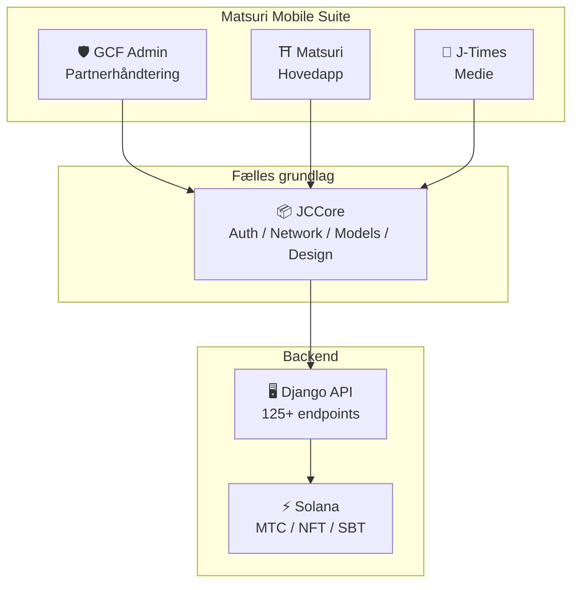
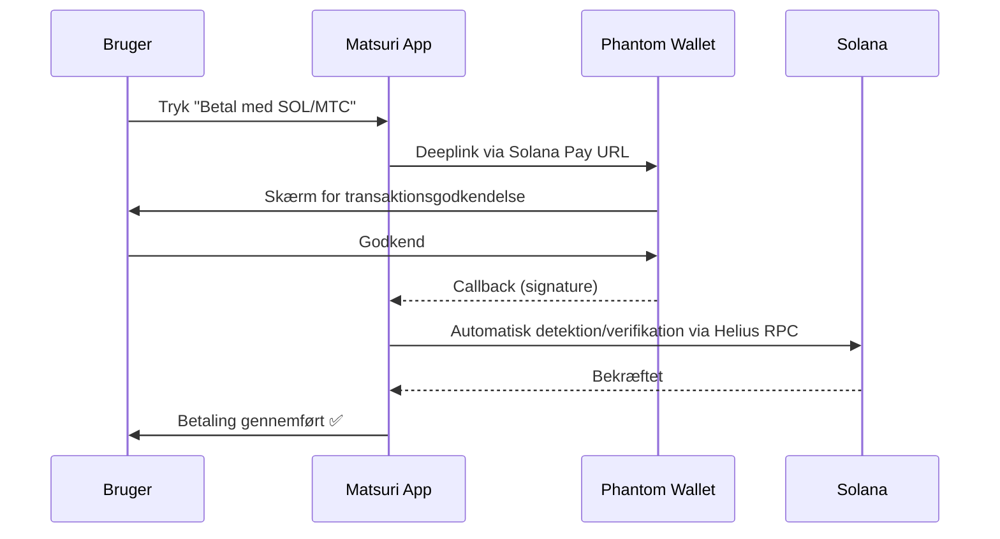
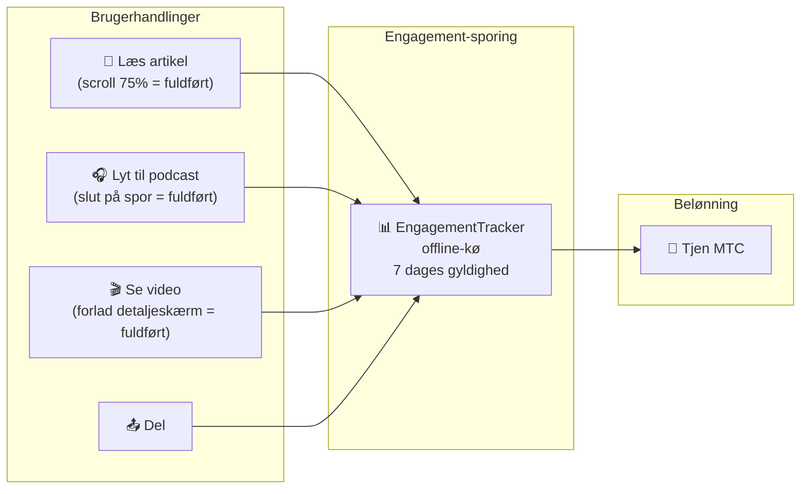
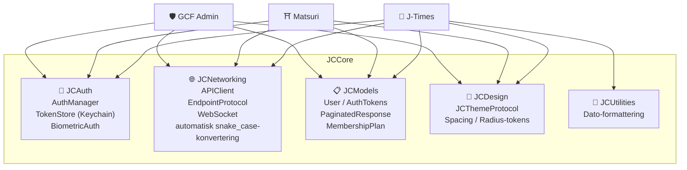
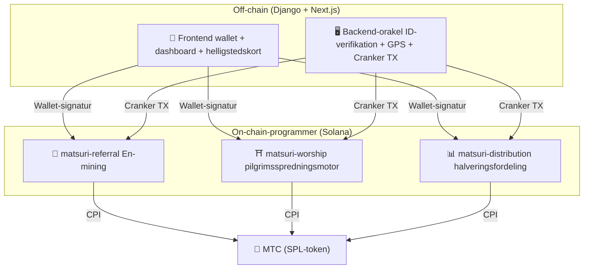
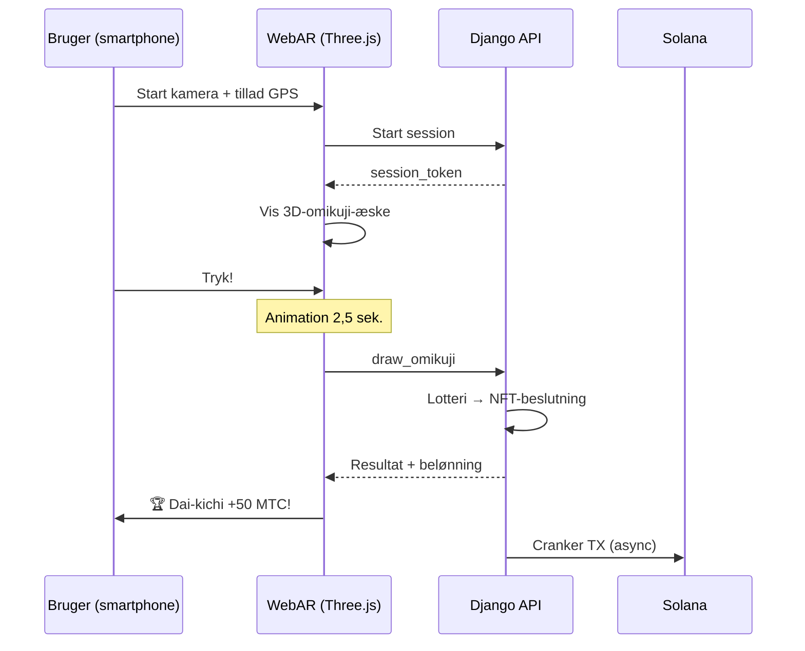

import useBaseUrl from '@docusaurus/useBaseUrl';

# 🔧 Produkt og teknologi — det der kører beviser alt

> **Det, der kører, beviser alting.**
> Vores mission er ikke bare ord. Webplatformen kører allerede, iOS-apperne er i slutfasen.

Webappen og admin-panelet er **i produktion**. Tre native iOS-apps er færdigudviklet og udgives april 2026. Smart contracts på Solana er åben kildekode og offentligt tilgængelige — vi taler ikke i koncepter, men med **kørende kode og produkter lige om hjørnet**.

---

## App-oversigt

| App | Anvendelse | Status | Sprog |
| :--- | :--- | :---: | :--- |
| **GCF Admin** | Partnerhåndtering / driftsværktøj | ✅ Udgivet | 🇯🇵🇬🇧🇨🇳🇹🇭🇳🇴 |
| **Matsuri** | Hovedapp for almindelige brugere | 🔜 Udgives april 2026 | 🇯🇵🇬🇧🇨🇳🇹🇭🇳🇴 |
| **J-Times** | Kulturmedie og læring | 🔜 Udgives april 2026 | 🇯🇵🇬🇧 |

---

## 1. 🛡️ GCF Admin — partner-håndteringsapp

:::info Status: udgivet i App Store (v1.0)
Forretnings-app for GCF (Global Community Friends)-medlemmer. Al funktionalitet fra web-admin samlet på mobil.
:::

  
  
  

  

### Hvad appen kan

| Kategori | Funktion |
| :--- | :--- |
| **📊 Dashboard** | KPI-kort, omsætningsdiagrammer, hurtige handlinger |
| **👥 Medlemshåndtering** | Liste, detaljer, redigering, tierstyring |
| **💰 Indtjening** | Kommissionssporing, MTC-udbetaling, udbetalingshåndtering |
| **📝 Indholdsstyring** | Oprettelse, redigering og udgivelse af events, artikler, podcasts, video |
| **🎫 Guidepladser** | Håndtering af guidepladser, indtægtssporing |
| **🖼️ NFT-dashboard** | Founder's Collection, on-chain-verifikation, NFT-overførsel |
| **⛩️ Hellig-steds-håndtering** | CRUD for sites, beacon-opsætning |
| **🎲 AR-mining-indstillinger** | Omikuji-sandsynlighedstabel, belønningsparametre |
| **📊 Analytics** | Fejlrapporter, brugsanalyser |
| **🔗 Referral** | Brugerdefineret QR-kode-generering, henvisningsprogram |

### Tekniske specifikationer

| Punkt | Detaljer |
| :--- | :--- |
| **Arkitektur** | Clean Architecture + MVVM + `@Observable` (iOS 17) |
| **Sprog / SDK** | Swift 6.0 / Xcode 16+ / iOS 17.0+ |
| **API-integration** | 125+ endpoints |
| **Tests** | 226 tests / 45 testklasser |
| **Lokalisering** | 5 sprog (JA/EN/ZH/TH/NO) / 957+ oversættelsesnøgler |
| **Swift Concurrency** | Strict Concurrency-compliant / nul byggewarnings |

### QR-kode-integration

I GCF Admin kan man generere brugerdefinerede QR-koder med Matsuri-logo. Bruges til event-invitationer, henvisningslinks, betalingsanmodninger mv.

---

## 2. ⛩️ Matsuri — hovedapp

:::info Status: udgives sent april 2026 (v3.0)
Hovedapp for almindelige brugere. Eventbooking, betaling, Web3-wallet, AR-mining — alt samlet i én app.
:::

  
  
  

### Hvad appen kan

| Kategori | Funktion |
| :--- | :--- |
| **🎪 Eventbooking** | Søg, book, Stripe-betaling, billet-QR |
| **💳 Fire betalingsformer** | Kreditkort / gemte kort / MTC-saldo / krypto (SOL/MTC) |
| **👛 Web3-wallet** | MTC-saldo, send/modtag, transaktionshistorik |
| **🖼️ NFT-galleri** | Beholdning af NFT/SBT, on-chain-verifikation |
| **🗺️ Helligstedskort** | Kortvisning af helligdomme og templer, check-in |
| **🎲 AR-mining** | WebAR-omikuji-oplevelse, optjen MTC |
| **💬 Chat** | Beskeder med kontekstmenu |
| **⭐ Ønskeliste** | Gem favoritevents og oplevelser |
| **🔍 Avanceret søgning** | Talesøgning understøttet |
| **🤝 Referral** | Deltag i henvisningsprogram, spore belønninger |
| **📊 GCF-dashboard** | Letvægts-admin for GCF-medlemmer |

### Phantom Wallet-integration — krypto-betaling uden indtastning

>**Brugeren kopierer aldrig adresser.** Phantom Wallet åbner automatisk, man godkender, og betalingen er gennemført. Signaturen detekteres automatisk af Helius RPC.

### Tekniske specifikationer

| Punkt | Detaljer |
| :--- | :--- |
| **Arkitektur** | Clean Architecture + MVVM + Swift Concurrency |
| **Sprog / SDK** | Swift 6.0 / Xcode 16+ / iOS 17.0+ |
| **Betaling** | Stripe PaymentSheet + MTC Balance + Phantom (Solana Pay) |
| **API-integration** | 72 endpoints / 16 kategorier |
| **Tests** | 230+ (Model, ViewModel, Network, Security, DeepLink, E2E) |
| **Lokalisering** | 5 sprog (JA/EN/ZH/TH/NO) / 406 oversættelsesnøgler |
| **ViewModels** | 25 (fuld MVVM — nul direkte API-kald fra View) |
| **Autentificering** | Apple Sign In / Google Sign In (PKCE) |

---

## 3. 📰 J-Times — kulturmedie-app

:::info Status: udgives sent april 2026
Medieplatform, der formidler japansk kulturs dybder. Læs artikler, lyt til podcasts, se video — hver handling giver MTC.
:::

  

  
  

### Hvad appen kan

| Kategori | Funktion |
| :--- | :--- |
| **📖 Artikler** | Parallax-hero, drop-caps, læseprogressionsbar, rigt indhold (Markdown, tabeller, citater) |
| **🎧 Podcasts** | Serier, waveform-afspiller, sleep timer, AirPlay, lockscreen-kontroller |
| **🎬 Video** | Adaptiv grid/liste, shorts (TikTok-stil, dobbelt-tap) |
| **🔍 Søgning** | Multi-filter, trending tags, talesøgning |
| **🧭 Discovery** | Featured carousels, staff picks, ugens hit |
| **📚 Bibliotek** | Favoritter, historik (efter dato), downloads, spillelister |
| **🎵 Audio-afspiller** | Mini-afspiller (swipe), fuld afspiller (waveform, tekst, loop) |
| **👤 Medlemskab** | 3 tiers (Free / Premium / Pro), sammenligning, køb-genopretning |

### Media Mining — at læse, lytte og se bliver til minedrift

>**Registreres også offline.** Selv hvis du læser en artikel ved en afsides helligdom uden signal, sendes engagementet automatisk, når netværket vender tilbage, og MTC udbetales.

### Designsystem — Japans æstetiske "fire søjler"

J-Times bruger et eget designsystem, der oversætter klassisk japansk æstetik til moderne UI.

| Søjle | Koncept | Anvendt i UI |
| :--- | :--- | :--- |
| **Sumi (墨)** | Varm neutralgrå | Baggrundsfarve, teksthierarki |
| **Shu (朱)** | Japansk rød (#C53030) | Accent, vigtige handlinger |
| **Ma (間)** | Luft i 4pt-gitter | Spacing, pusterum |
| **Kami (紙)** | Fin tekstur, glasmorfisme | Kortoverflade, dybde |

### Tekniske specifikationer

| Punkt | Detaljer |
| :--- | :--- |
| **Arkitektur** | Clean Architecture + MVVM + Swift Concurrency |
| **Sprog / SDK** | Swift 6.0 / Xcode 16+ / iOS 17.0+ |
| **Eksterne afhængigheder** | **Nul** — kun Apples egne frameworks |
| **API-integration** | 40+ endpoints |
| **Tests** | 371 tests / 20 filer |
| **Lokalisering** | 2 sprog (JA/EN) / 310+ oversættelsesnøgler |
| **Offline** | ContentCache (50MB) + ImageDiskCache (200MB) + download-manager |
| **Autentificering** | Apple Sign In / Google Sign In (PKCE) |

---

## Fælles grundlag: JCCore-bibliotek

Et Swift Package-bibliotek delt af alle tre apps.

| Modul | Rolle |
| :--- | :--- |
| **JCAuth** | Keychain-baseret tokenhåndtering, biometrisk autentificering (Face ID / Touch ID) |
| **JCNetworking** | Typesikker API-klient, WebSocket, automatisk JSON snake_case-konvertering |
| **JCModels** | Fælles datamodeller på tværs af apps (User, AuthTokens osv.) |
| **JCDesign** | Theme-protokol, designtokens (spacing, radius) |
| **JCUtilities** | Dato- og tekst-utilities |

---

## Sikkerhed og privatliv

| Punkt | Implementering |
| :--- | :--- |
| **Auth-token** | Krypteret gemt i iOS Keychain (TokenStore) |
| **Biometri** | 2-faktor via Face ID / Touch ID |
| **API-kommunikation** | HTTPS + Certificate Pinning |
| **Wallet-privatnøgle** | Appen gemmer ingen privatnøgle — uddelegeret til Phantom Wallet |
| **AR-mining** | Kamerabilleder sendes ikke til server (VisionProof) |
| **Offlinedata** | SwiftData-kryptering + automatisk udløb |
| **Swift Concurrency** | Actor-isolation forhindrer race conditions |

---

## Udviklingskvalitet

### Mobilapps: i alt **over 827 automatiske tests** på tværs af de tre apps.

| App | Tests | Dækning |
| :--- | :---: | :--- |
| **GCF Admin** | 226 | Model, ViewModel, Repository, API, Localization, Navigation |
| **Matsuri** | 230+ | Model, ViewModel, Network, Security, DeepLink, Regression, Performance, E2E |
| **J-Times** | 371 | Model, ViewModel, API, Repository, Navigation, Localization, Security, Performance |

### Smart contracts: tests udvides trinvist

For Rust-programmerne på Solana er vi startet med unit-tests på kernelogikken (matematikmoduler), og dækningen udvides trinvist frem mod sikkerhedsrevisionen (Q2–Q3 2026).

---

## Smart contracts — open source-design

>**Designet til trustless.**
> Belønningsberegning, henvisningstræ, halveringsplan — al logik udføres **on-chain** og kan revideres af alle.
> Kildekode: [GitHub](https://github.com/Cootakahashi/matsuri-contracts)

---

### Contributors

| Medlem | Rolle |
| :--- | :--- |
| **Ko Takahashi** | Founder / Lead Developer — arkitektur, smart contracts, full-stack-udvikling |

> 🌏**Fremadrettet vil GCF-medlemmer og udviklerfællesskaber fra hele verden også bidrage til den fælles udvikling.**
> Matsuri Protocol bygger på principperne om gennemsigtighed og fælles ejerskab, så den kan fungere som "kulturens infrastruktur" varigt.

---

### Overordnet opbygning

Matsuri deployer **tre Anchor-programmer (Rust)** på Solana, som hver bærer en søjle af økosystemet.

---

### 1. 📣 En-mining (縁マイニング — forbindelsesminedrift)

**Formål:** en hybrid vækstmotor, der belønner både "bredde" (henvisningsnetværk) og "dybde" (økonomisk effekt). Ikke bare affiliate, men en fuld miningsprotokol, hvor reel økonomisk aktivitet skaber on-chain-værdi.

#### Scoring-design

Bidragsscoren baseres på to vægtede komponenter:

| Komponent | Vægt | Formål |
| :--- | :---: | :--- |
| **Bredde** (antal henvisninger) | 30% | Netværkets rækkevidde — hvor mange er bragt ind |
| **Dybde** (transaktionsvolumen) | 70% | Økonomisk effekt — reelle køb, ikke bare sign-ups |

Scoren akkumuleres over tid og omregnes til MTC pr. halverings-epoke. Yderligere boost-mekanismer er planlagt:

| Boost | Beskrivelse | Status |
| :--- | :--- | :---: |
| **Toku (徳)-staking** | Lås MTC og boost din bidragsscore (op til ca. 50%). Tier og præcis multiplikator tilpasses halverings-planen | ⬜ Koefficient tbd |
| **Sæson-ranking** | Top performere i hver epoke får titlen **Evangelist** (permanent SBT) og score-boost. Præcis andel afgøres af governance | ⬜ Koefficient tbd |

:::info Progressivt parameter-design
Boost-koefficienter (staking-tier, ranking-bonus) er bevidst justerbare. De fastlåses i smart contracts baseret på reelle økosystem-data — aktive brugere, udgivelse fra halveringspuljen, prisstabilitetsmål — og sikrer **retfærdig fordeling** uden at love faste afkast.
:::

#### Anti-sybil-forsvar (3 lag)

| Lag | Mekanisme | Placering |
| :--- | :--- | :--- |
| **ID-gate** | X/Twitter OAuth + SMS | Off-chain (Django) |
| **On-chain-gate** | Kun profiler med `is_verified = true` får belønning | Smart contract |
| **Dybdevægtning** | 70% af scoren = reel betaling → bots tjener intet | Scoringsmotoren |

---

### 2. ⛩️ Pilgrimsspredningsmotor (Worship Routing Engine)

**Formål:** Verdens første **ReFi-protokol**, der bruger tokenøkonomi til at løse overturisme. Tjen MTC ved at besøge hellige steder. Det vigtige er: *jo færre besøgende, desto eksponentielt større belønning.*

:::tip Kerneindsigten
"Omvendt Uber-surge-prissætning" — overfyldte steder giver straf, frontier-steder får boost. Turister går frivilligt til de mindre besøgte steder, **fordi det betaler sig bedre**.
:::

#### Designprincip for belønning

Bidragsscoren for hvert besøg bestemmes af flere faktorer:

| Faktor | Princip | Effekt |
| :--- | :--- | :--- |
| **Stedets popularitet** | Færre besøgende = højere score | Spreder turister fra overfyldte områder |
| **Besøgstidspunkt** | Tidligere på dagen = højere score | Fremmer off-peak-besøg |
| **Regions-tier** | Lokal og frontier ligger højest | Driver regional revitalisering |
| **Besøgshyppighed** | Regelmæssige besøgende akkumulerer bonus-score | Belønner fortsat engagement |
| **Omikuji-lykke** | Tilfældig bonus-lodtrækning pr. check-in | Sjov gamification |
| **Sponsoreret boost** | Kommuner kan booste specifikke sites | B2B/B2G-indtægtsmodel |

:::info Koefficienter kan justeres
De præcise multiplikatorer (fx hvor meget mere lokale steder tjener vs. hovedsteder) tilpasses **halveringspuljens plan** og reelle brugsdata og fastlåses trinvist i smart contracts. Designprincippet er fast — koefficienterne udvikler sig med økosystemet.
:::

---

### 3. 📊 Halveringsfordeling (Halving Distribution)

**Formål:** inspireret af Bitcoin halveres MTC-fordelingen automatisk pr. epoke efter en fastlagt plan. Matematisk garanteret knaphed.

| Instruktion | Beskrivelse |
| :--- | :--- |
| `initialize` | Initialiser fordelingspuljen |
| `register_miner` | Registrer miner |
| `update_score` | Opdater score |
| `advance_epoch` | Ryk frem til ny epoke (udfør halvering) |
| `claim_distribution` | Modtag fordelingsbelønning |

---

### 4. 🎴 AR-mining — WebAR omikuji-oplevelse

**Formål:** En oplevelse, hvor AR-omikuji dukker op i det fysiske rum via smartphonens browser, og MTC mines. **Ingen app-download nødvendig.** En verdensførste infrastruktur, hvor shintoens spiritualitet møder banebrydende teknologi og blockchain.

#### Arkitektur

#### Omikuji-sandsynlighed (GCF-admin)

Basis Points (10000 = 100%) giver 0,01%-præcision. Justerbart fra GCF-admin.

| Klasse | Sjældenhed | Bonus | NFT |
|------|-----------|---------|-----|
| 🏆 Dai-kichi | Rare | Max bonus | ✅ |
| ✨ Kichi | Uncommon | Høj bonus | Valgfri |
| 🌸 Shō-kichi | Common | Lille bonus | — |
| 🍃 Sue-kichi | Common | Deltagelsespost | — |
| 💀 Kyō | Uncommon | Deltagelsespost | — |

Sandsynligheder og belønningskoefficienter fastlægges trinvist ud fra økosystemets størrelse og halveringens udgivelsesmængde og implementeres i smart contracts.

#### ZK-Proof of Vision (5 lags sikkerhed)

Flerlagsforsvar mod GPS-snyd og replay-angreb. **For at beskytte privatlivet sendes kamerabilleder aldrig til serveren.**

| Lag | Hvad der verificeres | Point |
| :--- | :--- | :--- |
| Temporal | Session 5-120 sek. | /20 |
| Motion | Gyroens naturlighed (håndrysten-detektion) | /20 |
| Light | Omgivelseslys × tid på dagen | /20 |
| HMAC | Proof_hash signatur-check | /20 |
| Fingerprint | Enhedens unikhed | /20 |
| **Total** | **PASS ved 60/100 eller over** | |

#### Belønningsdesign

Belønningen registreres som **bidragsscore** baseret på stedtype, omikuji-resultat, regions-tier mv. De præcise koefficienter fastlægges trinvist i takt med halveringsplanen og økosystemets vækst og implementeres i smart contracts.

---

### Pure Math Modules (reviderbar kernelogik)

Alle programmer adskiller scoring og belønningsberegning i **rene, reviderbare `math.rs`-moduler**:

- **Nul bivirkninger** — ingen I/O, ingen allokering, ingen eksterne kald
- **Dokumenterede formler** — LaTeX-lignende notation i rustdoc
- **Overflow-analyse** — u128 mellemværdier med bevist område
- **Omfattende tests** — edge cases, grænseværdier, ratio-verifikation
- **Justerbare koefficienter** — belønningsparametre kan opdateres via governance og tilpasses økosystemets vækst

---

### Sikkerhedsmodel

Kontrakterne er **fuldt open source**. Sikkerheden hviler ikke på uigennemsigtighed, men på matematisk garanti.

| Princip | Implementering |
| :--- | :--- |
| **PDA-baserede vaults** | Token-vaults styres af PDA (program-derived address) — kan ikke trækkes ud med en menneskelig nøgle |
| **Checked-aritmetik** | Alle beregninger bruger `checked_*` — overflow umuligt |
| **Rolleadskillelse** | Admin (multisig) ≠ Cranker (begrænsede operationer) ≠ bruger (selv-administreret) |
| **Nødstop** | Admin kan pause programmet, men **kun ved sikkerhedstrusler**. Ingen mulighed for at flytte eller konfiskere midler — pause er et "skjold", ikke et redskab til at ændre regler |
| **Uforanderlig tokenomics** | Halveringsrate, total pulje, epokelængde er låst efter opsætning |
| **Rene matematikmoduler** | Belønnings-/scoringslogik er isoleret, testbart matematikbibliotek |
| **Vision Proof** | 5 lag mod snyd – uden at sende kameradata (privatliv) |

---

**[▶ Næste: Roadmap og team](/docs/roadmap)**｜**[◀ Forrige: Tokenomics](/docs/tokenomics)**
